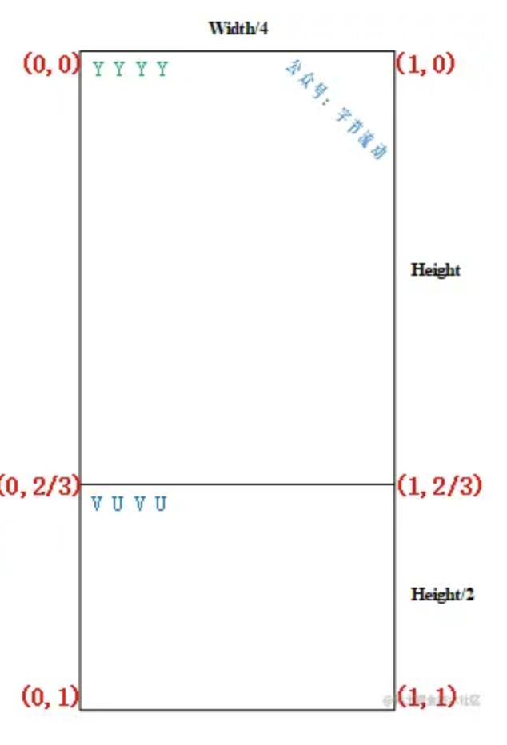
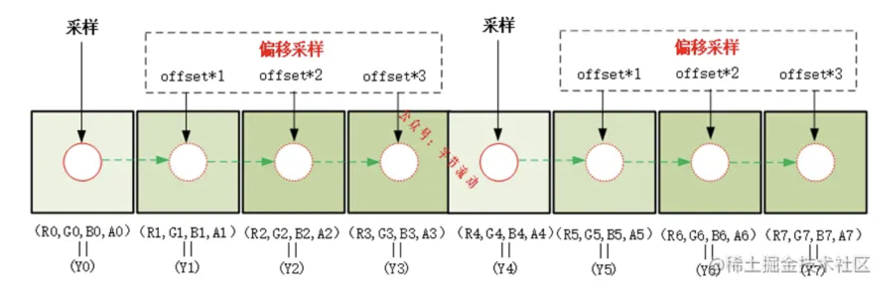
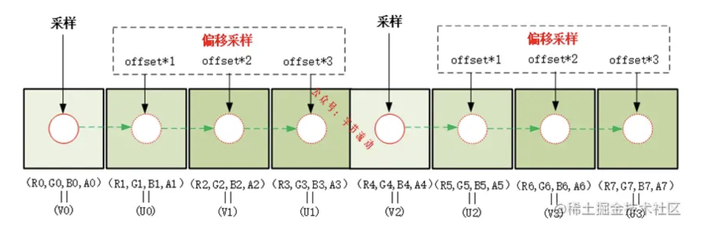
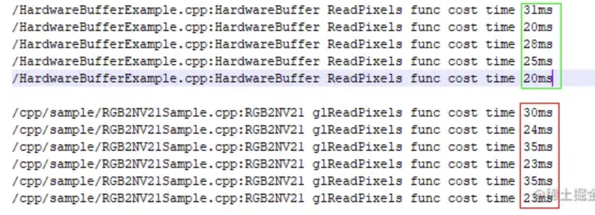

之前写过一篇 [OpenGL 使用 shader 实现 RGBA 转 YUYV](https://juejin.cn/post/6966608082042355725) 的文章，有几位读者大人在后台建议写一篇 shader 实现 RGBA 转 NV21 的文章，因为在实践中 NV21 格式用的比较多，于是我今天把这篇文章放出来。

关于 YUV 图像的知识和看图工具，可以参考下面的推送，本文不再赘述。

[一文掌握 YUV 图像的基本处理](https://link.juejin.cn?target=https%3A%2F%2Fwww.jianshu.com%2Fp%2Feb72a55b98aa)

[10bit YUV（P010）的存储结构和处理 ](https://juejin.cn/post/7020942894051622948)


# Shader 实现 RGBA 转 NV21 好处

OpenGL 完成图像的渲染后，很多情况下需要将渲染后的图像读取到内存进行下一步处理，这个时候使用 glReadPixels 直接读高分辨率的图像（RGBA）往往会带来性能问题，特别是在视频处理或相机预览场景中。

这个时候你可能会考虑使用 PBO、 HardwareBuffer、 ImageReader 等方式，参考[ OpenGL 图像读取哪家强？](https://juejin.cn/post/6888624817995612173) 一文。

**上面几种方式虽然能在一定程度上解决大图读取的性能问题，但又带来了实现复杂度高和兼容性等问题，比如 HardwareBuffer 需要 Android 26 以上版本等。**

**在不涉及超大图像读取时，我们一般会选择使用 Shader 将 RGBA 转 YUV，这样再使用 glReadPixels 读取图像时可以有效降低传输数据量，提升性能。** 例如 YUYV 格式相对 RGBA 数据量降为原来的 50% ，而采用 NV21 格式可以降低为原来的 37.5% 。


# Shader 实现 RGBA 转 NV21 原理

对 NV21 格式比较熟悉的同学应该非常了解，NV21 有两个平面（plane）, 一个 plane 存储 Y 分量，另一个 plane 存储依次交错排列的 VU 分量。


**其中 Y plane 的宽和高就是图像的宽高，VU plane 的高是原图像高的一半，所以 NV21 图像占用的内存大小是 width \* height \* 1.5 。 注意这个尺寸，后续申请用于颜色缓冲区的纹理也是这个尺寸，用于保存生成 NV21 图像（简单这样理解）。**

用于保存生成 NV21 图像的纹理可以简单抽象成如下结构（实际上纹理中的数据不是这样排列的）：



**为什么宽度是 width/4 ? 因为我们用的是 RGBA 格式的纹理，一个像素占用 4 个字节，而我们每个 Y 只需要一个字节来存储。**

从图上纹理坐标可以看出，在纹理坐标 y < (2/3) 范围，需要完成一次对整个纹理的采样，用于生成 Y plane 的图像；当纹理坐标 y > (2/3) 范围，同样需要再进行一次对整个纹理的采样，用于生成 VU plane 的图像。

**最重要的一点是视口要设置正确：`glViewport(0, 0, width / 4, height \* 1.5); ` 。** 由于视口宽度设置为原来的 1/4 ，可以简单的认为（实际上比较复杂）相对于原来的图像每隔 4 个像素做一次采样，由于我们生成 Y plane 的图像需要对每一个像素都进行采样，所以还需要进行 3 次偏移采样。



同样，生成 VU plane 的图像也需要进行 3 次额外的偏移采样。



**offset 需要设置为一个像素归一化之后的值：1.0/width, 按照原理图，为了便于理解，这里将采样过程简化**为以 4 个像素为单位进行，在纹理坐标 y < (2/3) 范围，一次采样（加三次偏移采样）4 个 RGBA 像素（R,G,B,A）生成 1 个（Y0,Y1,Y2,Y3），整个范围采样结束时填充好 width*height 大小的缓冲区；

当纹理坐标 y > (2/3) 范围，一次采样（加三次偏移采样）4 个 RGBA 像素（R,G,B,A）生成 1 个（V0,U0,V0,U1），又因为 VU plane 缓冲区的高度为 height/2 ，VU plane 在垂直方向的采样是隔行进行，整个范围采样结束时填充好 width*height/2 大小的缓冲区。

**最后我们使用 glReadPixels 读取生成的 NV21 图像（注意宽和高）**：

```c++
glReadPixels(0, 0, width / 4, height * 1.5, GL_RGBA, GL_UNSIGNED_BYTE, pBuffer);
```

# 代码实现

上节我们详细讨论了 Shader 实现 RGBA 转 NV21 原理，下面将直接贴出几处关键的实现代码。

创建 FBO 时，需要注意作为颜色缓冲区纹理的尺寸（width / 4, height * 1.5），上文已经详细解释过。

```c++
bool RGB2NV21Sample::CreateFrameBufferObj()
{
	// 创建并初始化 FBO 纹理
	glGenTextures(1, &m_FboTextureId);
	glBindTexture(GL_TEXTURE_2D, m_FboTextureId);
	glTexParameterf(GL_TEXTURE_2D, GL_TEXTURE_WRAP_S, GL_CLAMP_TO_EDGE);
	glTexParameterf(GL_TEXTURE_2D, GL_TEXTURE_WRAP_T, GL_CLAMP_TO_EDGE);
	glTexParameteri(GL_TEXTURE_2D, GL_TEXTURE_MIN_FILTER, GL_LINEAR);
	glTexParameteri(GL_TEXTURE_2D, GL_TEXTURE_MAG_FILTER, GL_LINEAR);
	glBindTexture(GL_TEXTURE_2D, GL_NONE);

	// 创建并初始化 FBO
	glGenFramebuffers(1, &m_FboId);
	glBindFramebuffer(GL_FRAMEBUFFER, m_FboId);
	glBindTexture(GL_TEXTURE_2D, m_FboTextureId);
	glFramebufferTexture2D(GL_FRAMEBUFFER, GL_COLOR_ATTACHMENT0, GL_TEXTURE_2D, m_FboTextureId, 0);
	glTexImage2D(GL_TEXTURE_2D, 0, GL_RGBA, m_RenderImage.width / 4, m_RenderImage.height * 1.5, 0, GL_RGBA, GL_UNSIGNED_BYTE, nullptr);
	if (glCheckFramebufferStatus(GL_FRAMEBUFFER)!= GL_FRAMEBUFFER_COMPLETE) {
		LOGCATE("RGB2NV21Sample::CreateFrameBufferObj glCheckFramebufferStatus status != GL_FRAMEBUFFER_COMPLETE");
		return false;
	}
	glBindTexture(GL_TEXTURE_2D, GL_NONE);
	glBindFramebuffer(GL_FRAMEBUFFER, GL_NONE);
	return true;
}
```

实现 RGBA 转 NV21 完整的 shader 脚本：

```glsl
#version 300 es
precision mediump float;
in vec2 v_texCoord;
layout(location = 0) out vec4 outColor;
uniform sampler2D s_TextureMap;
uniform float u_Offset;  //偏移量 1.0/width
//Y =  0.299R + 0.587G + 0.114B
//U = -0.147R - 0.289G + 0.436B
//V =  0.615R - 0.515G - 0.100B
const vec3 COEF_Y = vec3( 0.299,  0.587,  0.114);
const vec3 COEF_U = vec3(-0.147, -0.289,  0.436);
const vec3 COEF_V = vec3( 0.615, -0.515, -0.100);
const float UV_DIVIDE_LINE = 2.0 / 3.0;
void main()
{
    vec2 texelOffset = vec2(u_Offset, 0.0);
    if(v_texCoord.y <= UV_DIVIDE_LINE) {
        //在纹理坐标 y < (2/3) 范围，需要完成一次对整个纹理的采样，
        //一次采样（加三次偏移采样）4 个 RGBA 像素（R,G,B,A）生成 1 个（Y0,Y1,Y2,Y3），整个范围采样结束时填充好 width*height 大小的缓冲区；

        vec2 texCoord = vec2(v_texCoord.x, v_texCoord.y * 3.0 / 2.0);
        vec4 color0 = texture(s_TextureMap, texCoord);
        vec4 color1 = texture(s_TextureMap, texCoord + texelOffset);
        vec4 color2 = texture(s_TextureMap, texCoord + texelOffset * 2.0);
        vec4 color3 = texture(s_TextureMap, texCoord + texelOffset * 3.0);

        float y0 = dot(color0.rgb, COEF_Y);
        float y1 = dot(color1.rgb, COEF_Y);
        float y2 = dot(color2.rgb, COEF_Y);
        float y3 = dot(color3.rgb, COEF_Y);
        outColor = vec4(y0, y1, y2, y3);
    }
    else {
        //当纹理坐标 y > (2/3) 范围，一次采样（加三次偏移采样）4 个 RGBA 像素（R,G,B,A）生成 1 个（V0,U0,V0,U1），
        //又因为 VU plane 缓冲区的高度为 height/2 ，VU plane 在垂直方向的采样是隔行进行，整个范围采样结束时填充好 width*height/2 大小的缓冲区。
        vec2 texCoord = vec2(v_texCoord.x, (v_texCoord.y - UV_DIVIDE_LINE) * 3.0);
        vec4 color0 = texture(s_TextureMap, texCoord);
        vec4 color1 = texture(s_TextureMap, texCoord + texelOffset);
        vec4 color2 = texture(s_TextureMap, texCoord + texelOffset * 2.0);
        vec4 color3 = texture(s_TextureMap, texCoord + texelOffset * 3.0);

        float v0 = dot(color0.rgb, COEF_V) + 0.5;
        float u0 = dot(color1.rgb, COEF_U) + 0.5;
        float v1 = dot(color2.rgb, COEF_V) + 0.5;
        float u1 = dot(color3.rgb, COEF_U) + 0.5;
        outColor = vec4(v0, u0, v1, u1);
    }
}
```

离屏渲染及 NV21 图像的读取：

```c++
void RGB2NV21Sample::Draw(int screenW, int screenH)
{
	// 离屏渲染
	glBindFramebuffer(GL_FRAMEBUFFER, m_FboId);
	// 渲染成 NV21 宽度像素变为 1/4 宽度，高度为 height * 1.5
    glViewport(0, 0, m_RenderImage.width / 4, m_RenderImage.height * 1.5);
	glUseProgram(m_FboProgramObj);
	glBindVertexArray(m_VaoIds[1]);
	glActiveTexture(GL_TEXTURE0);
	glBindTexture(GL_TEXTURE_2D, m_ImageTextureId);
	glUniform1i(m_FboSamplerLoc, 0);
	float texelOffset = (float) (1.f / (float) m_RenderImage.width);
	GLUtils::setFloat(m_FboProgramObj, "u_Offset", texelOffset);//偏移量 1.0/width
	glDrawElements(GL_TRIANGLES, 6, GL_UNSIGNED_SHORT, (const void *)0);
	glBindVertexArray(0);
	glBindTexture(GL_TEXTURE_2D, 0);

	//NV21 buffer = width * height * 1.5;
	uint8_t *pBuffer = new uint8_t[m_RenderImage.width * m_RenderImage.height * 3 / 2];

	NativeImage nativeImage = m_RenderImage;
	nativeImage.format = IMAGE_FORMAT_NV21;
	nativeImage.ppPlane[0] = pBuffer;
	nativeImage.ppPlane[1] = pBuffer + m_RenderImage.width * m_RenderImage.height;

    //使用 glReadPixels 读取生成的 NV21 图像（注意宽和高）
    glReadPixels(0, 0, nativeImage.width / 4, nativeImage.height * 1.5, GL_RGBA, GL_UNSIGNED_BYTE, pBuffer);

	std::string path(DEFAULT_OGL_ASSETS_DIR);
	NativeImageUtil::DumpNativeImage(&nativeImage, path.c_str(), "RGB2NV21");
	delete [] pBuffer;

	glBindFramebuffer(GL_FRAMEBUFFER, 0);
}
```

利用 Shader 将 RGBA 转成 NV21 进行 glReadPixels 读取和直接使用 HardwareBuffer 进行读取， 通过测试 5k 分辨率的图像，发现两种方式性能差异并不大。



码字不易，帮忙点个赞呗！完整实现代码见项目：[github.com/githubhaoha…](https://link.juejin.cn/?target=https%3A%2F%2Fgithub.com%2Fgithubhaohao%2FNDK_OpenGLES_3_0)，右上角选择 RGB to NV21 demo 。