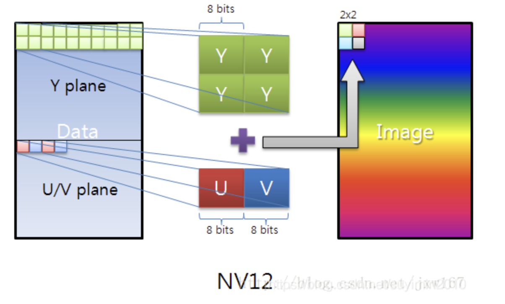

## 简介

视频数据是由一张张图片组成的，每张图片的大小是由图片的（width ＊ height）＊3/2字节组成。图片分两部分：Y通道的长度是width ＊ height。UV平面字节长度是：(width / 2) x (height / 2) x 2 = width x height / 2 。每两个连续的字节是2 x 2 = 4个原始像素的V，U（按照NV21规范的顺序）色度字节。换句话说，UV平面尺寸为（宽/ 2）×（高/ 2）像素，并且在每个维度中被下采样因子2， 此外，U，V色度字节是交错的。

下面给读者展示一副关于YUV-NV12, NV21存储的图片：



NV21和NV12的区别是U和V的顺序相反。

 

## 转化步骤：

### 1、将图像中的通道复制到可传递给纹理的缓冲区中：

```c++
byte[] image;
ByteBuffer yBuffer, uvBuffer;

...

yBuffer.put(image, 0, width*height);
yBuffer.position(0);

uvBuffer.put(image, width*height, width*height/2);
uvBuffer.position(0);
```


### 2、将这些缓冲区传递给实际的GL纹理：

```c++
/*
 * Prepare the Y channel texture
 */
//Set texture slot 0 as active and bind our texture object to it
Gdx.gl.glActiveTexture(GL20.GL_TEXTURE0);
yTexture.bind();

//Y texture is (width*height) in size and each pixel is one byte; 
//by setting GL_LUMINANCE, OpenGL puts this byte into R,G and B 
//components of the texture
Gdx.gl.glTexImage2D(GL20.GL_TEXTURE_2D, 0, GL20.GL_LUMINANCE, 
    width, height, 0, GL20.GL_LUMINANCE, GL20.GL_UNSIGNED_BYTE, yBuffer);

//Use linear interpolation when magnifying/minifying the texture to 
//areas larger/smaller than the texture size
Gdx.gl.glTexParameterf(GL20.GL_TEXTURE_2D, 
    GL20.GL_TEXTURE_MIN_FILTER, GL20.GL_LINEAR);
Gdx.gl.glTexParameterf(GL20.GL_TEXTURE_2D, 
    GL20.GL_TEXTURE_MAG_FILTER, GL20.GL_LINEAR);
Gdx.gl.glTexParameterf(GL20.GL_TEXTURE_2D, 
    GL20.GL_TEXTURE_WRAP_S, GL20.GL_CLAMP_TO_EDGE);
Gdx.gl.glTexParameterf(GL20.GL_TEXTURE_2D, 
    GL20.GL_TEXTURE_WRAP_T, GL20.GL_CLAMP_TO_EDGE);

/*
 * Prepare the UV channel texture
 */
//Set texture slot 1 as active and bind our texture object to it
Gdx.gl.glActiveTexture(GL20.GL_TEXTURE1);
uvTexture.bind();

//UV texture is (width/2*height/2) in size (downsampled by 2 in 
//both dimensions, each pixel corresponds to 4 pixels of the Y channel) 
//and each pixel is two bytes. By setting GL_LUMINANCE_ALPHA, OpenGL 
//puts first byte (V) into R,G and B components and of the texture
//and the second byte (U) into the A component of the texture. That's 
//why we find U and V at A and R respectively in the fragment shader code.
//Note that we could have also found V at G or B as well. 
Gdx.gl.glTexImage2D(GL20.GL_TEXTURE_2D, 0, GL20.GL_LUMINANCE_ALPHA, 
    width/2, height/2, 0, GL20.GL_LUMINANCE_ALPHA, GL20.GL_UNSIGNED_BYTE, 
    uvBuffer);

//Use linear interpolation when magnifying/minifying the texture to 
//areas larger/smaller than the texture size
Gdx.gl.glTexParameterf(GL20.GL_TEXTURE_2D, 
    GL20.GL_TEXTURE_MIN_FILTER, GL20.GL_LINEAR);
Gdx.gl.glTexParameterf(GL20.GL_TEXTURE_2D, 
    GL20.GL_TEXTURE_MAG_FILTER, GL20.GL_LINEAR);
Gdx.gl.glTexParameterf(GL20.GL_TEXTURE_2D, 
    GL20.GL_TEXTURE_WRAP_S, GL20.GL_CLAMP_TO_EDGE);
Gdx.gl.glTexParameterf(GL20.GL_TEXTURE_2D, 
    GL20.GL_TEXTURE_WRAP_T, GL20.GL_CLAMP_TO_EDGE);
```


### 3、我们渲染之前准备的网格（覆盖整个屏幕）， 着色器将负责渲染网格上的绑定纹理：

```c++
shader.begin();

//Set the uniform y_texture object to the texture at slot 0
shader.setUniformi("y_texture", 0);

//Set the uniform uv_texture object to the texture at slot 1
shader.setUniformi("uv_texture", 1);

mesh.render(shader, GL20.GL_TRIANGLES);
shader.end();
```


### 4、着色器接管将纹理渲染到网格的任务， 实现实际转换的片段着色器如下所示：

```glsl
String fragmentShader = 
    "#ifdef GL_ES\n" +
    "precision highp float;\n" +
    "#endif\n" +
    "varying vec2 v_texCoord;\n" +
    "uniform sampler2D y_texture;\n" +
    "uniform sampler2D uv_texture;\n" +

    "void main (void){\n" +
    "   float r, g, b, y, u, v;\n" +

    //We had put the Y values of each pixel to the R,G,B components by 
    //GL_LUMINANCE, that's why we're pulling it from the R component,
    //we could also use G or B
    "   y = texture2D(y_texture, v_texCoord).r;\n" + 

    //We had put the U and V values of each pixel to the A and R,G,B 
    //components of the texture respectively using GL_LUMINANCE_ALPHA. 
    //Since U,V bytes are interspread in the texture, this is probably 
    //the fastest way to use them in the shader
    "   u = texture2D(uv_texture, v_texCoord).a - 0.5;\n" +
    "   v = texture2D(uv_texture, v_texCoord).r - 0.5;\n" +

    //The numbers are just YUV to RGB conversion constants
    "   r = y + 1.13983*v;\n" +
    "   g = y - 0.39465*u - 0.58060*v;\n" +
    "   b = y + 2.03211*u;\n" +

    //We finally set the RGB color of our pixel
    "   gl_FragColor = vec4(r, g, b, 1.0);\n" +
    "}\n"; 
```

————————————————
版权声明：本文为CSDN博主「Luckie stone」的原创文章，遵循CC 4.0 BY-SA版权协议，转载请附上原文出处链接及本声明。
原文链接：https://blog.csdn.net/suyimin2010/article/details/105526291