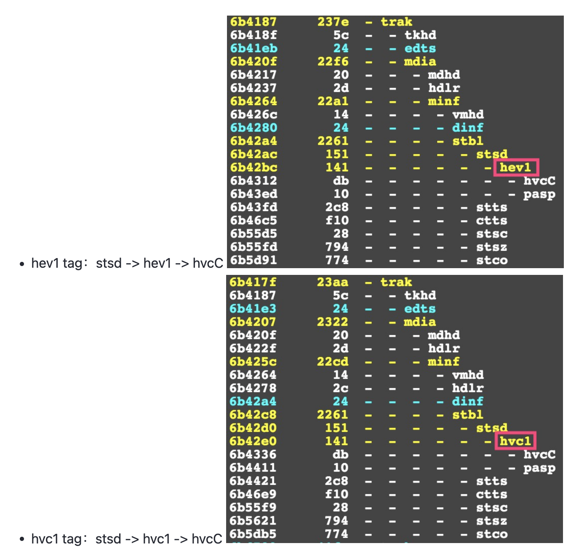

# FFmpeg hevc codec_tag兼容问题

## 问题描述

最近同组同事遇到一个问题：FFmpeg拼接ts文件生成mp4时（demux -> mux，不编解码），在Android平台上可以播放，但是在mac（QuickTime Player）和iOS上无法播放。其中，FFmpeg版本为3.3，ts流包含的音频轨是lc aac，视频轨是hevc，如下所示：

```shell
shell
复制代码// 视频流
Stream #0:0[0x101]: Video: hevc (Main) ([36][0][0][0] / 0x0024), yuv420p(tv), 720x1280, 250 tbr, 90k tbn, 90k tbc
// 音频流
Stream #0:1[0x102]: Audio: aac (LC) ([15][0][0][0] / 0x000F), 44100 Hz, stereo, fltp, 100 kb/s
```

拼接的mp4基本信息如下所示，在mac上用QuickTime Player播放，会提示格式不兼容，但是用QQ影音和VLC是可以播放的。此外，在Android上通过MediaPlayer和自研播放器也都可以播放。

```shell
shell
复制代码Input #0, mov,mp4,m4a,3gp,3g2,mj2, from 'leon.mp4':
  Metadata:
    major_brand     : isom
    minor_version   : 512
    compatible_brands: isomiso2mp41
    encoder         : Lavf57.71.100
  Duration: 00:02:04.42, start: 99.935011, bitrate: 173 kb/s
    Stream #0:0(und): Video: hevc (Main) (hev1 / 0x31766568), yuv420p(tv), 720x1280, 159 kb/s, SAR 1:1 DAR 9:16, 1.93 fps, 250 tbr, 90k tbn, 90k tbc (default)
    Metadata:
      handler_name    : VideoHandler
    Stream #0:1(und): Audio: aac (LC) (mp4a / 0x6134706D), 44100 Hz, stereo, fltp, 12 kb/s (default)
    Metadata:
      handler_name    : SoundHandler
```

## 问题初步解决

问题出在哪里那？在全球最大同性交友网站上找到了端倪[Encode H265 to hvc1 codec](https://link.juejin.cn?target=https%3A%2F%2Fstackoverflow.com%2Fquestions%2F32152090%2Fencode-h265-to-hvc1-codec)。 大意是：hev1 or hvc1是两种codec tag，表示mp4容器中hevc流的不同打包方式。Quicktime Player和iOS不再支持hev1 tag的mp4。 hev1 or hvc1只是hevc在mp4中的两种不同打包方式，编码格式本身都是hevc，所以可以在这两种tag之间进行切换，而不用重新编码。

于是尝试通过以下命令转换mp4的codec tag：

```shell
shell
复制代码ffmpeg -i leon.mp4 -c:v copy -tag:v hvc1 -c:a copy leon-hvc1.mp4
```

发现FFmpeg3.3及以前的版本，直接出错了：

```shell
shell
复制代码<mux.c init_muxer 376> Tag hvc1 incompatible with output codec id '174' ([35][0][0][0])
```

而在3.4及以后的版本，则可以正常运行。

> leon.mp4是hev1 tag模式，通过`-tag:v hvc1`可以转换为hvc1 tag模式，再使用Quicktime Player就可以播放了。

同样的在FFmpeg3.4及以后的版本，可以通过以下命令把ts转封装为mp4时，并且通过`-tag:v`控制mp4的codec tag模式。

```shell
shell
复制代码// 把ts（aac和hevc）转格式为MP4，默认情况下leon.mp4的codec tag是hev1，Quicktime Player无法播放
ffmpeg -i leon.ts -c:v copy -c:a copy leon.mp4

// 把ts（aac和hevc）转格式为MP4，强制指定hvc1，所以leon-hvc1.mp4的codec tag是hvc1，Quicktime Player可以播放
ffmpeg -i leon.ts -c:v copy -tag:v hvc1 -c:a copy leon-hvc1.mp4
```

那为啥FFmpeg3.3及以前版本不能使用`-tag:v hvc1`，经过测试发现`-tag:v hev1`也不行，也是直接出错：

```shell
shell
复制代码<mux.c init_muxer 376> Tag hev1 incompatible with output codec id '174' ([35][0][0][0])
```

也就是说FFmpeg3.3及以前版不支持`-tag:v hvc1`和`-tag:v hev1`，但是FFmpeg3.4及以后的版本是可以的。

## 问题根源

FFmpeg版本之间的差异，只能到源码中寻求解决了。好在错误信息中已经指明了文件名、函数名和行号：`libavformat/mux.c`文件，init_muxer函数，376行。

调用栈是：avformat_write_header -> avformat_init_output -> init_muxer，在写入封装容器的头部信息时触发。

核心代码段如下所示：

```C++
C++
复制代码// par是hevc流的编码参数：AVStream->codecpar
// st是hevc流：AVStream
// s是AVFormatContext
// of表示封装格式，这里是mp4：AVFormatContext->oformat;
if (par->codec_tag) { // 如果AVStream->codecpar->codec_tag不为0
    // 检查AVStream->codecpar->codec_tag是否在封装容器支持的codec_tag列表中，即：AVOutputFormat->codec_tag列表
    if (!validate_codec_tag(s, st)) {
        // 从AVOutputFormat->codec_tag列表中找出编码ID对应的codec_tag
        const uint32_t otag = av_codec_get_tag(s->oformat->codec_tag, par->codec_id);
        // 现在设置的codec_tag校验失败，与codec_id对应的codec_tag是otag
        av_log(s, AV_LOG_ERROR, "Tag %s incompatible with output codec id '%d' (%s)\n", av_fourcc2str(par->codec_tag), par->codec_id, av_fourcc2str(otag));
        ret = AVERROR_INVALIDDATA;
        goto fail;
    }
} else {
    // 若AVStream->codecpar->codec_tag为0（默认情况下为0），则FFmpeg会根据编码ID（AVCodecID）从封装格式的codec_tag列表中，找到一个codec_tag。
    par->codec_tag = av_codec_get_tag(of->codec_tag, par->codec_id);
}
    
```

`avformat_write_header`写入封装容器的头信息时，会检查codec_tag：若AVStream->codecpar->codec_tag有值，则会校验AVStream->codecpar->codec_tag是否在封装格式支持的codec_tag列表中，若不在，就会打印错误信息；若AVStream->codecpar->codec_tag为0，则会根据AVCodecID从封装格式的codec_tag列表中，找一个匹配的codec_tag。

到这里为止，FFmpeg3.3和之后的版本逻辑都是一致的，那导致出现上述hvc1 tag差异点的原因可能就是不同FFmpeg版本中mp4支持的codec_tag列表不同了。

我们再看下FFmpeg3.3的错误信息：

```shell
shell
复制代码// 表示当前为hevc流设置的hvc1 codec_tag不受支持，174是hevc的AVCodecID，表示与hevc对应的codec_tag应该是10进制35（16进制0x23）
<mux.c init_muxer 376> Tag hvc1 incompatible with output codec id '174' ([35][0][0][0])
```

OK，出错原因已经很清楚了：在FFmpeg3.3版本，我们为hevc设置的hvc1 tag不受mp4封装格式支持，我们看下mp4支持的codec_tag列表。

`libavformat/movenc.c`是mp4和mov的Muxer类，其中AVOutputFormat->codec_tag指定了某个封装格式支持的codec_tag列表，mp4支持的codec_tag列表在`libavformat/isom.c`中的ff_mp4_obj_type结构体中，代码太长，贴几个我们常用的：

```C++
C++
复制代码{ AV_CODEC_ID_H264        , 0x21 },
{ AV_CODEC_ID_HEVC        , 0x23 },
{ AV_CODEC_ID_AAC         , 0x40 },
```

与hevc对应的codec_tag是0x23，即10进制35，与上面的错误信息完全一致。也就是说，hevc编码格式在mp4中唯一受支持的codec_tag是0x23，也就是hev1，所以我们明确指定hvc1才会失败。

我们再看下FFmpeg最新的主干版本，mp4支持的codec_tag列表，同样只贴几个常用的：

```C++
C++
复制代码{ AV_CODEC_ID_H264        , MKTAG('a', 'v', 'c', '1') },
{ AV_CODEC_ID_H264        , MKTAG('a', 'v', 'c', '3') },
{ AV_CODEC_ID_HEVC        , MKTAG('h', 'e', 'v', '1') },
{ AV_CODEC_ID_HEVC        , MKTAG('h', 'v', 'c', '1') },
{ AV_CODEC_ID_AAC         , MKTAG('m', 'p', '4', 'a') },
```

与hevc对应的codec_tag是hev1和hvc1，并且因为hev1在列表前面，所以默认使用的是hev1，也就是说：若我们不主动指定-tag:v，那么hevc对应的codec_tag就是hev1，使用Quicktime Player无法播放，所以要通过`tag:v hvc1`强制指定codec_tag，才可以兼容所有平台。

> 可能有人会有疑问，既然FFmpeg3.3支持hev1 tag，那为什么指定`tag:v hev1`也会出错那？那是因为FFmpeg3.3与最新版本表示codec_tag的方式改变了（同样是hev1 tag，FFmpeg3.3是ox23，最新版本是MKTAG('h', 'e', 'v', '1')），虽然都是hev1，但是取值发生了改变，两个版本之间不兼容，如果指定`-tag:v 35`，在FFmpeg3.3就不会出错了。

到这里为止，所有疑问都已经解决了，总结下：

- FFmpeg3.3及以前版本，mp4容器只支持hevc的hev1 tag，并且取值为0x23。
- FFmpeg3.4及以后版本，mp4容器同时支持hevc的hev1和hvc1 tag，并且默认使用hev1 tag。

那如果想在FFmpeg3.3及以前版本，使用hevc的hvc1 tag，应当怎么办那？可以使用mov容器代替，分析代码发现：mov封装格式在FFmpeg的不同版本，都t同时支持hevc的hev1和hvc1 tag，并且默认使用hev1 tag。

上面的分析都是基于FFmpeg命令行，那么代码中如何设置codec_tag那，也比较简单，在`avformat_write_header`之前，为hevc stream设置codec_tag就可以了：

```C++
C++
复制代码AVStream->codecpar->codec_tag = MKTAG('h', 'v', 'c', '1');
```

两种不同的tag在Mp4中有什么差异那？不同的tag对应不同的Box类型。




参考： https://blog.csdn.net/solan8/article/details/116300899

https://juejin.cn/post/6854573210579501070

编码出来的H265视频，会发现有些在mac上图标可以预览，用quicktime player可以播放，但有些不行。


用ffprobe或者mediainfo分析相关视频文件，会发现是hev1。

hev1、hvc1是两种codec tag。Quicktime Player和iOS不再支持hev1 tag的mp4/mov。

二者大致有如下不同：

'hvc1' stores all parameter sets inside the MP4 container below the sample description boxes.
'hev1' stores all parameter sets in band (inside the HEVC stream).
参考下例，用FFmpeg生成QuickTime兼容HEVC码流

ffmpeg -i src/8k_265.mov -c:v copy -vtag hvc1 8k_265.mp4


https://blog.csdn.net/iBobbyTS/article/details/109402983

https://stackoverflow.com/questions/63468587/what-hevc-codec-tag-to-use-with-fmp4-hvc1-or-hev1

https://juejin.cn/post/6854573210579501070


