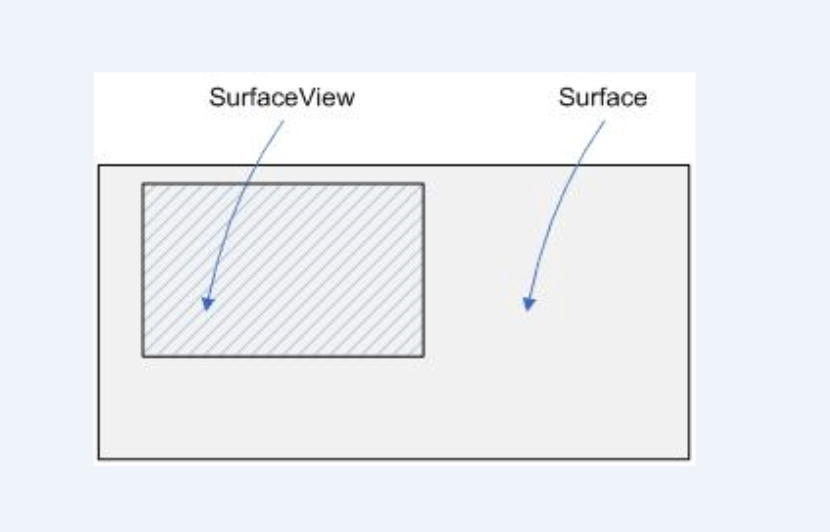

### **Surface 简介**

Surface 就是“表面”的意思，可以**简单理解为内存中的一段绘图缓冲区**。在SDK的文档中，对Surface的描述是这样的：“Handle onto a raw buffer that is being managed by the screen compositor”，翻译成中文就是“由屏幕显示内容合成器(screen compositor)所管理的原生缓冲器的句柄”，  这句话包括下面两个意思:

- 通过Surface（因为Surface是句柄）就可以获得原生缓冲器以及其中的内容。就像在C语言中，可以通过一个文件的句柄，就可以获得文件的内容一样；
- 原生缓冲器（rawbuffer）是用于保存当前窗口的像素数据的。

简单的说 **Surface 对应了一块屏幕缓冲区，每个Window对应一个Surface，任何View都是画在Surface上的**，传统的view共享一块屏幕缓冲区，所有的绘制必须在UI线程中进行我们不能直接操作Surface实例，要通过SurfaceHolder，在SurfaceView中可以通过getHolder()方法获取到SurfaceHolder实例。

**Surface 是一个用来画图形的地方，但是我们知道画图都是在一个Canvas对象上面进行的**，Surface 中的 Canvas 成员，是专门用于提供画图的地方，就像黑板一样，其中的原始缓冲区是用来保存数据的地方。

Surface本身的作用类似一个句柄，得到了这个句柄就可以得到其中的Canvas、原始缓冲区以及其他方面的内容，所以简单的说Surface是用来管理数据的(句柄)。

### **SurfaceView 简介**

简单的说SurfaceView就是一个**有Surface的View里面内嵌了一个专门用于绘制的Surface**,SurfaceView 控制这个 Surface 的格式和尺寸以及绘制位置。

**SurfaceView 就是在 Window 上挖一个洞，它就是显示在这个洞里，其他的View是显示在Window上，所以View可以显式在 SurfaceView之上，你也可以添加一些层在SurfaceView之上。**

```java
if (mWindow == null) {  
    mWindow = new MyWindow(this);  
    mLayout.type = mWindowType;  
    mLayout.gravity = Gravity.LEFT|Gravity.TOP;  
    mSession.addWithoutInputChannel(mWindow, mWindow.mSeq, mLayout,  
    mVisible ? VISIBLE : GONE, mContentInsets);  
}
```

很明显，**每个SurfaceView创建的时候都会创建一个MyWindow，new MyWindow(this)中的this正是SurfaceView自身**，因此将SurfaceView和window绑定在一起，而前面提到过每个window对应一个Surface。

**所以SurfaceView也就内嵌了一个自己的Surface，可以认为SurfaceView是来控制Surface的位置和尺寸**。传统View及其派生类的更新只能在UI线程，然而UI线程还同时处理其他交互逻辑，这就无法保证view更新的速度和帧率了，而SurfaceView可以用独立的线程来进行绘制。

因此可以提供更高的帧率，例如游戏，摄像头取景等场景就比较适合用SurfaceView来实现。

Surface是纵深排序(Z-ordered)的，这表明它总在自己所在窗口的后面。

Surfaceview提供了一个可见区域，只有在这个可见区域内的Surface部分内容才可见，可见区域外的部分不可见，所以可以认为SurfaceView就是展示Surface中数据的地方,Surface就是管理数据的地方，SurfaceView就是展示数据的地方，只有通过SurfaceView才能展现Surface中的数据。     



**Surface的排版显示受到视图层级关系的影响，它的兄弟视图结点会在顶端显示**。这意味者Surface的内容会被它的兄弟视图遮挡，这一特性可以用来放置遮盖物(overlays)(例如，文本和按钮等控件)。

注意，如果Surface上面有透明控件，那么它的每次变化都会引起框架重新计算它和顶层控件的透明效果，这会影响性能。surfaceview变得可见时，surface被创建；surfaceview隐藏前，surface被销毁。

这样能节省资源。如果你要查看surface被创建和销毁的时机，可以重载surfaceCreated(SurfaceHolder)和surfaceDestroyed(SurfaceHolder)。

SurfaceView的核心在于提供了两个线程：UI线程和渲染线程,两个线程通过“双缓冲”机制来达到高效的界面适时更新。**而这个双缓冲可以理解为，SurfaceView在更新视图时用到了两张Canvas，一张frontCanvas和一张backCanvas。

每次实际显示的是frontCanvas，backCanvas存储的是上一次更改前的视图，当使用lockCanvas（）获取画布时，得到的实际上是backCanvas而不是正在显示的frontCanvas，之后你在获取到的backCanvas上绘制新视图，再unlockCanvasAndPost（canvas）此视图，那么上传的这张canvas将替换原来的frontCanvas作为新的frontCanvas，原来的frontCanvas将切换到后台作为backCanvas。

例如，如果你已经先后两次绘制了视图A和B，那么你再调用lockCanvas（）获取视图，获得的将是A而不是正在显示的B，之后你将重绘的C视图上传，那么C将取代B作为新的frontCanvas显示在SurfaceView上，原来的B则转换为backCanvas。

不用画布，直接在窗口上进行绘图叫做无缓冲绘图。用了一个画布，将所有内容都先画到画布上，在整体绘制到窗口上，就该叫做单缓冲绘图，那个画布就是一个缓冲区。用了两个画布，一个进行临时的绘图，一个进行最终的绘图，这样就叫做双缓冲。

**SurfaceView 的优缺点**

一般的Activity包含的多个View会组成View hierachy的树形结构，只有最顶层的DectorView才是对WMS可见的，这个DecorView在WMS中有一个对应的WindowState，再SurfaceFlinger中有对应的Layer，而SurfaceView正因为它有自己的Surface，有自己的Window，它在WMS中有对应的WindowState，在SurfaceFlinger中有Layer。

虽然在App端它仍在View hierachy中，但在Server端(WMS和SurfaceFlinger)中，它与宿主窗口是分离的。**这样的好处是对这个Surface的渲染可以放到单独的线程中去做**，渲染时可以有自己的GL context。

**因为它不会影响主线程对时间的响应。所以它的优点就是可以在独立的线程中绘制，不影响主线程，而且使用双缓冲机制，播放视频时画面更顺畅。**

但是这也有缺点，因为这个Surface不在View hierachy中，它的显示也不受View的属性控制，所以不能进行平移、缩放等动画，它也不能放在其它ViewGroup中，SurfaceView不能嵌套使用，而且不能使用某些View的特性，例如View.setAlpha()。

<b>从 Android7.0 开始，SurfaceView 的窗口位置与其他 View 渲染同步更新</b>。这意味着在屏幕上平移和缩放 SurfaceView 不会导致渲染失真。

### **SurfaceHolder 简介**

**显示一个 Surface 的抽象接口，使你可以控制 Surface 的大小和格式以及在Surface上编辑像素，和监视 Surace 的改变**。这个接口通常通过SurfaceView类实现。
简单的说就是**我们无法直接操作Surface只能通过SurfaceHolder这个接口来获取和操作Surface**。SurfaceHolder中提供了一些lockCanvas():获取一个Canvas对象，并锁定之。

所得到的Canvas对象，其实就是 Surface 中一个成员。加锁的目的其实就是为了在绘制的过程中，Surface 中的数据不会被改变。lockCanvas 是为了防止同一时刻多个线程对同一 canvas写入。

从设计模式的角度来看**,Surface、SurfaceView、SurfaceHolder实质上就是MVC(Model-View-Controller)**，Model就是模型或者说是数据模型，更简单的可以理解成数据，在这里也就是Surface，View就是视图，代表用户交互界面，这里就是 SurfaceView, SurfaceHolder 就是 Controller.

### TextureView

因为上面所说的SurfaceView不在主窗口中，它没法做动画没法使用一些View的特性方法，所以**在Android 4.0中引入了TextureView，它是一个结合了View和SurfaceTexture的View对象**。

它不会在WMS中单独创建窗口，而是作为View hierachy中的一个普通view，**因此它可以和其他普通View一样进行平移、旋转等动画**。但是TextureView必须在硬件加速的窗口中，它显示的内容流数据可以来自App进程或者远程进程。

TextureView 重载了 draw() 方法，其中**主要 SurfaceTexture 中收到的图像数据作为纹理更新到对应的 HardwareLayer** 中。

SurfaceTexture.OnFrameAvailableListener用于通知TextureView内容流有新图像到来。SurfaceTextureListener接口用于让TextureView的使用者知道SurfaceTexture已准备好，这样就可以把SurfaceTexture交给相应的内容源。 

Surface为BufferQueue的Producer接口实现类，使生产者可以通过它的软件或硬件渲染接口为SurfaceTexture内部的BufferQueue提供graphic buffer。

SurfaceTexture 可以用作非直接输出的内容流，这样就提供二次处理的机会。与SurfaceView直接输出相比，这样会有若干帧的延迟。同时，由于它本身管理BufferQueue，因此内存消耗也会稍微大一些。
TextureView **是一个可以把内容流作为外部纹理输出在上面的 View**, 它本身需要是一个硬件加速层。

### **SurfaceTexture**

**SurfaceTexture 是 Surface 和 OpenGL ES(GLES) 纹理的组合。SurfaceTexture 用于提供输出到 GLES 纹理的 Surface 。**

SurfaceTexture 是从Android 3.0开始加入，与SurfaceView不同的是，**它对图像流的处理并不直接显示，而是转为GL外部纹理，因此用于图像流数据的二次处理**。

比如 Camera 的预览数据，变成纹理后可以交给 GLSurfaceView 直接显示，也可以通过SurfaceTexture 交给TextureView 作为 View heirachy 中的一个硬件加速层来显示。 

首先，SurfaceTexture从图像流 (来自Camera预览、视频解码、GL绘制场景等) 中获得帧数据，当调用updateTexImage()时，根据内容流中最近的图像更新 SurfaceTexture 对应的GL纹理对象。 

SurfaceTexture 包含一个应用是其使用方的BufferQueue。当生产方将新的缓冲区排入队列时，onFrameAvailable() 回调会通知应用。然后，应用调用updateTexImage()，这会释放先前占有的缓冲区，从队列中获取新缓冲区并执行EGL调用，从而使GLES可将此缓冲区作为外部纹理使用。

### **SurfaceView vs TextureView**

简单地说，**SurfaceView 是一个有自己Surface的View**。它的渲染可以放在单独线程而不是主线程中。其**缺点是不能做变形和动画**。SurfaceTexture可以用作非直接输出的内容流，这样就提供二次处理的机会。

与SurfaceView直接输出相比，这样会有若干帧的延迟。同时，由于它本身管理BufferQueue，因此内存消耗也会稍微大一些。

**TextureView是一个可以把内容流作为外部纹理输出在上面的View。它本身需要是一个硬件加速层。事实上TextureView本身也包含了SurfaceTexture。**

它与SurfaceView+SurfaceTexture组合相比可以完成类似的功能（即把内容流上的图像转成纹理，然后输出）。**区别在于TextureView是在View hierachy中做绘制，因此一般它是在主线程上做的（在Android 5.0引入渲染线程后，它是在渲染线程中做的）**。

而SurfaceView+SurfaceTexture在单独的Surface上做绘制，可以是用户提供的线程，而不是系统的主线程或是渲染线程。

与 SurfaceView 相比，**TextureView 具有更出色的 Alpha 版和旋转处理能力**，但在视频上以分层方式合成界面元素时，SurfaceView 具有性能方面的优势。

当客户端使用 SurfaceView 呈现内容时，SurfaceView 会为客户端提供单独的合成层。如果设备支持，SurfaceFlinger 会将单独的层合成为硬件叠加层。
当客户端使用 TextureView 呈现内容时，界面工具包会使用 GPU 将 TextureView 的内容合成到 View 层次结构中。

对内容进行的更新可能会导致其他 View 元素重绘，例如，如果其他 View 位于 TextureView 上方。View 呈现完成后，SurfaceFlinger 会合成应用界面层和所有其他层，以便每个可见像素合成两次。

另外，SurfaceView的隐藏，后台都会触发onSurfaceDestroyed，这点要注意。

**注意：受 DRM 保护的视频只能在叠加平面上呈现。支持受保护内容的视频播放器必须使用 SurfaceView 进行实现**。

| 项目    | SurfaceView | TextureView |
|:----- | -----------:|:-----------:|
| 内存    | 低           | 高           |
| 耗电    | 低           | 高           |
| 绘制    | 及时          | 1-3帧延迟      |
| 动画和截图 | 不支持         | 支持          |

- **在Android 7.0上系统 Surfaceview 的性能比 TextureView 更有优势**，支持对象的内容位置和包含的应用内容同步更新，平移、缩放不会产生黑边。 **在7.0以下系统如果使用场景有动画效果，可以选择性使用TextureView**。
- 由于失效(invalidation)和缓冲的特性，**TextureView增加了额外1~3帧的延迟显示画面更新**。
- TextureView总是使用GL合成，而SurfaceView可以使用硬件overlay后端，可以占用更少的内存。
- T**extureView的内部缓冲队列导致比SurfaceView使用更多的内存**。
- SurfaceView：内部自己持有surface，surface 创建、销毁、大小改变时系统来处理的，通过surfaceHolder 的callback回调通知。
- 当画布创建好时，可以将surface绑定到MediaPlayer中。SurfaceView如果为用户可见的时候，创建SurfaceView的SurfaceHolder用于显示视频流解析的帧图片，如果发现SurfaceView变为用户不可见的时候，则立即销毁SurfaceView的SurfaceHolder，以达到节约系统资源的目的。

### Canvas 的底层实现

- **Canvas** 是一个用于绘制图形和文本的类，提供了许多绘制 API。底层实现依赖于 `Skia` 图形库，这是 Android 的核心图形引擎。`Skia` 是一个开源的 2D 图形库，用于执行高效的图形绘制操作。
- **操作流程**：
  1. 当你使用<b> `lockCanvas()` 方法时，`SurfaceView` 将锁定一个与其 `Surface` 关联的 `Canvas`，这个 `Canvas` 为后缓冲区</b>。
  2. 接下来，你可以在这个 `Canvas` 上调用绘制方法（如 `drawRect()`, `drawBitmap()`等）进行各种绘制。
  3. 完成绘制后，调用 `unlockCanvasAndPost(Canvas)` 方法将绘制的内容提交到 `Surface`。这时，`Surface` 将所绘制的内容显示到屏幕上。

### Surface 和 SurfaceFlinger 的关系

- **Surface**：
  - `Surface` 是一个提供绘图缓冲区的对象。它可以被视为一个表面，上面可以绘制图像，并且可以显示到屏幕上。它代表了一个外部图形输入输出的接口，与硬件图形系统直接交互。
  - `Surface` 允许应用程序进行低级别的绘制操作，并与 `Canvas` 结合使用以实现这些低级绘制操作。
- **SurfaceFlinger**：
  - `SurfaceFlinger` 是 Android 中的一个服务，负责处理最终的图像合成和显示。它的作用是将来自不同应用的表面合成成最終输出图像并将其发送到屏幕。
  - 它处理多个 `Surface` 的显示，把每个 `Surface` 的内容合成到一个输出缓冲区，确保显示的流畅性和顺序。它还负责管理窗口的 z-order（即窗口的堆叠顺序），透明度等。

### 综述实现过程

1. 当应用程序需要绘图时，它通过 `Surface` 访问系统的绘图机制，锁定一个 `Canvas`进行绘制。
2. 应用程序将绘制操作提交给该 `Canvas`。
3. 一旦绘制完成，通过滑动的 `Surface`，内容由 `SurfaceFlinger` 提交给屏幕，以完成最终的显示。
4. `SurfaceFlinger` 将所有来自不同应用（或组件）的 `Surface` 内容进行合成，然后直接发送给硬件（如 GPU），以在屏幕上显示最终图像。

### 总结

- `Canvas` 是在 `Surface` 上进行绘图的一种机制，底层依赖于 `Skia` 图形库。
- `Surface` 提供了一个缓冲区，允许绘制和展示图形。
- `SurfaceFlinger` 是负责最终图形合成和屏幕显示的服务，它将多个 `Surface` 合成到一个输出，以确保图形显示的顺畅和高效。