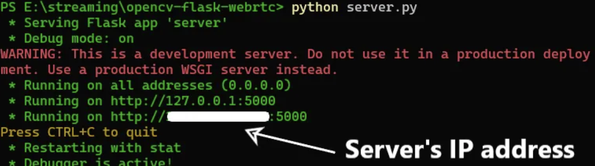

https://medium.com/@supersjgk/building-a-live-streaming-app-using-flask-opencv-and-webrtc-8cc8b521fa44

In this tutorial, we’ll explore the simple yet powerful combination of Flask, OpenCV, and WebRTC to create a live streaming application. Whether you’re a beginner or an experienced developer, this step-by-step guide will walk you through the process of building your very own live streaming platform. By the end, you’ll have a functional app that allows users to broadcast and view live streams seamlessly.


## Contents

- [Code on GitHub](https://medium.com/@supersjgk/building-a-live-streaming-app-using-flask-opencv-and-webrtc-8cc8b521fa44#acd1)
- [Requirements](https://medium.com/@supersjgk/building-a-live-streaming-app-using-flask-opencv-and-webrtc-8cc8b521fa44#7363)
- [Let’s Code](https://medium.com/@supersjgk/building-a-live-streaming-app-using-flask-opencv-and-webrtc-8cc8b521fa44#5ec6)
- [Web Page](https://medium.com/@supersjgk/building-a-live-streaming-app-using-flask-opencv-and-webrtc-8cc8b521fa44#88c0)
- [Client Side](https://medium.com/@supersjgk/building-a-live-streaming-app-using-flask-opencv-and-webrtc-8cc8b521fa44#6ed9)
- [Server Side](https://medium.com/@supersjgk/building-a-live-streaming-app-using-flask-opencv-and-webrtc-8cc8b521fa44#5cf8)
- [Start Live Streaming](https://medium.com/@supersjgk/building-a-live-streaming-app-using-flask-opencv-and-webrtc-8cc8b521fa44#1dea)
- [NOTE](https://medium.com/@supersjgk/building-a-live-streaming-app-using-flask-opencv-and-webrtc-8cc8b521fa44#9cbd)
- [Future Updates](https://medium.com/@supersjgk/building-a-live-streaming-app-using-flask-opencv-and-webrtc-8cc8b521fa44#0abb)


## Code on GitHub

It’s recommended to follow along but if you directly wanna jump to the code, you can [**CLICK HERE**](https://github.com/supersjgk/LiveStream-WebRTC-Flask-OpenCV)


## Requirements

Machine: Any laptop/pc can be used to run the server. Note that we will not be using any external server but creating our own using Flask. We’ll also need a machine to live stream to which can be viewed using a web browser. This machine can be a smartphone, a different laptop/pc, a remote machine (connected to the same network).

Camera: Webcam/IP camera.

Python packages: The following packages need to be installed. We’ll be using pip.

- [**Flask**](https://flask.palletsprojects.com/en/3.0.x/): To build a simple web app.

```shell
pip install Flask
```

- [**OpenCV**](https://opencv.org/): Contains tools to deal with the video frames.

```
pip install opencv-python-headless
```

- [**WebRTC**](https://webrtc.org/): To add real-time streaming capability to our web app. We’ll directly be using [aiortc](https://github.com/aiortc/aiortc) python package which combines WebRTC and asyncio.

```
pip install aiortc
```


## Let’s Code

Create a directory with a name of your choice. We’ll break down this project in three parts: web page (templates/index.html), client side (static/main.js), server side (server.py). Below is how the directory hierarchy should look like at the end:

```
your_app
├── static
│   └── main.js
├── templates
│   └── index.html
└── server.py
```


## Web Page

Here we’ll be creating a simple HTML template for our web page. You’re free to add any fancy styling on your own but we won’t be doing that. Create **index.html** in **your_app/templates** and add the following code.

```html
<!DOCTYPE html>
<html lang="en">
<head>
    <meta charset="UTF-8">
    <meta name="viewport" content="width=device-width, initial-scale=1.0">
    <title>Your APP</title>
</head>
<body>
    <video id="remoteVideo" autoplay></video>
    <a href="{{ url_for('video_feed') }}" target="_self">Link to Video Feed</a>
    <script src="{{ url_for('static', filename='main.js') }}"></script>
</body>
</html>
```

**NOTE:** I have created the web page such that instead of directly opening the live stream on the web browser, I provide a simple link `Link to Video Feed` which must be **clicked**, then you’re taken to the live stream because generally you want to offer multiple services on the index page. However, if you want to directly view the live stream, go to the [Server Side](https://medium.com/@supersjgk/building-a-live-streaming-app-using-flask-opencv-and-webrtc-8cc8b521fa44#d598) part.


## Client Side

Client side logic will be handled using JavaScript. We’ll be using a web browser to view our live stream, and the WebRTC API is available natively through a browser. Create a **main.js** file in **your_app/static.**

If this bores you, complete main.js can be found [**HERE**](https://github.com/supersjgk/LiveStream-WebRTC-Flask-OpenCV/blob/main/src/static/main.js)

- **RTCPeerConnection**

```
let pc = new RTCPeerConnection();
```

This line creates a new instance of the `RTCPeerConnection` class, which is a fundamental component of WebRTC for establishing a peer-to-peer connection.

- **createOffer Function**

```js
async function createOffer() {
    console.log("Sending offer request");

    const offerResponse = await fetch("/offer", {
        method: "POST",
        headers: {
            "Content-Type": "application/json",
        },
        body: JSON.stringify({
            sdp: "",
            type: "offer",
        }),
    });

    const offer = await offerResponse.json();
    console.log("Received offer response:", offer);

    await pc.setRemoteDescription(new RTCSessionDescription(offer));

    const answer = await pc.createAnswer();
    await pc.setLocalDescription(answer);
}
```

This asynchronous function initiates the offer exchange process with the server. It sends a POST request to the server’s “/offer” endpoint with an empty SDP (Session Description Protocol) and the offer type. Upon receiving the offer response from the server, it sets the remote description based on the received offer and creates an answer. The answer is set as the local description.

- **Initiate the Process**

```
createOffer();
```

Initiates the process by creating and sending an offer to the server.


## Server Side

This server sets up a Flask web application with routes for rendering an HTML template, handling WebRTC offer exchanges, and streaming video frames from the camera. It uses aiortc for WebRTC functionalities and integrates OpenCV for video frame generation. Create a **server.py** in **your_app** and add the following code.

Complete server.py can be found [**HERE**](https://github.com/supersjgk/LiveStream-WebRTC-Flask-OpenCV/blob/main/src/server.py)**.**

- **Import Modules**

```
from flask import Flask, render_template, Response, request, jsonify
from aiortc import RTCPeerConnection, RTCSessionDescription
import cv2
import json
import uuid
import asyncio
import logging
import time
```

- **Flask setup**

```
app = Flask(__name__, static_url_path='/static')
```

Creates a Flask application instance with a static URL path for serving static files.

- **Video Frame Generation**

```
def generate_frames():
 camera = cv2.VideoCapture(0) # ==============IMPORTANT============
 while True:
  start_time = time.time()
  success, frame = camera.read()
  if not success:
   break
  else:
   ret, buffer = cv2.imencode('.jpg', frame)
   frame = buffer.tobytes()
   # concat frame one by one and show result
   yield (b'--frame\r\n'
    b'Content-Type: image/jpeg\r\n\r\n' + frame + b'\r\n') 
   elapsed_time = time.time() - start_time
          logging.debug(f"Frame generation time: {elapsed_time} seconds")
```

`VideoCapture()` triggers the camera and reads the frames.

**NOTE**: If you want to use the webcam, pass **0 (zero)** as the argument. If you want to use an IP camera, you’ll need to pass the RTSP link as the argument. Read [**THIS**](https://help.angelcam.com/en/articles/372649-finding-rtsp-addresses-for-ip-cameras-nvrs-dvrs) to learn how to find the RTSP link but it should look something like below (include the quotation marks in argument):

```
'rtsp://[USER]:[PASS]@[IP_ADDRESS]:[RTSP PORT]/media/video[STREAM TYPE]'
```

- **Route to render HTML template**

```
@app.route('/')
def index():
    return render_template('index.html')
```

**NOTE:** This logic will take you to the index.html where you’ll find the link `Link to Video Feed` which must be clicked to view the live stream. However, if you want to directly go the video feed, you can modify the above logic as shown below:

```
from flask import redirect, url_for

# Route to video_feed directly
@app.route('/')
def index():
    return redirect(url_for('video_feed'))
```

- **Asynchronous Offer Handling**

```
async def offer_async():
    params = await request.json
    offer = RTCSessionDescription(sdp=params["sdp"], type=params["type"])

    # Create an RTCPeerConnection instance
    pc = RTCPeerConnection()

    # Generate a unique ID for the RTCPeerConnection
    pc_id = "PeerConnection(%s)" % uuid.uuid4()
    pc_id = pc_id[:8]

    # Create and set the local description
    await pc.createOffer(offer)
    await pc.setLocalDescription(offer)

    # Prepare the response data with local SDP and type
    response_data = {"sdp": pc.localDescription.sdp, "type": pc.localDescription.type}

    return jsonify(response_data)
```

`async_offer()`extracts parameters from the JSON request, creates an RTCPeerConnection, generates a unique ID, and sets up a data channel named *chat.* The local offer is created, set, and the response data is prepared.

- **Wrapper function for running the asynchronous offer function**

```
def offer():
    loop = asyncio.new_event_loop()
    asyncio.set_event_loop(loop)
    
    future = asyncio.run_coroutine_threadsafe(offer_async(), loop)
    return future.result()
```

`offer()` is a wrapper function for running the asynchronous `offer_async()` function using asyncio.

- **Offer Route**

```
# Route to handle the offer request
@app.route('/offer', methods=['POST'])
def offer_route():
    return offer()
```

- **Video Feed Route**

```
@app.route('/video_feed')
def video_feed():
    return Response(generate_frames(), mimetype='multipart/x-mixed-replace; boundary=frame')
```

- **Run Flask App**

```
if __name__ == "__main__":
    app.run(debug=True, host='0.0.0.0')
```

**NOTE:** Setting `host='0.0.0.0'` will allow you to view your stream in a different machine’s web browser. But the machine (client) should be **connected to** **the** **same network**. By default, Flask will bind to the localhost (127.0.0.1) i.e. if you don’t set it as shown above, you can view your stream only in the web browser of the machine where the server is running.


## Start Live Streaming

To start the server, follow the below steps:

- **Navigate** to the directory where your app is located. Open command prompt/ terminal in that directory and type `cd your_app` and press enter.
- **Enable webcam:** If you’ll use your webcam, make sure to enable camera access. Go to Settings > Privacy & Security > Camera settings > Enable Camera access. If you’re on a different OS, follow similar settings.
- Install any **web browser** in case you don’t have one.
- In the **terminal/ command prompt**, type: `python server.py` OR `python3 server.py` if your alias is not set.



To view your stream in the same machine’s browser, press Ctrl and click on `http://127.0.0.1:5000` This will open up your webcam stream in your default web browser.


- **Setting up the port**

Note that `5000` is the default port that Flask server will listen to. You can change it by setting the port parameter by modifying the line:

```
if __name__ == "__main__":
    app.run(debug=True, host='0.0.0.0', port=8000) # put any port number
```

Make sure no other service is running on the new port to avoid conflicts. To check this, do the following:

**On Windows:** Open command prompt and type:

```
netstat -ano | findstr :<port_number>
```

If there’s no output then nothing is running on that port. However, if you see an output, find the process ID in the last column of the output. Type the following to kill the process or use a different port:

```
taskkill /F /PID <process_id>
```

**On Linux:** Open a terminal and type:

```
sudo netstat -tuln | grep :<port_number>
```

Again, if there’s a process running, you’ll need to kill it.

```
sudo kill <process_id>
```

- **View the Stream on a different client machine**

As you’ll see in the above output (Running the server) image, you’ll get two links to view the stream. One is the localhost `http://127.0.0.1:5000`, and one with your server’s IP (I have hidden it for privacy). It looks like this: `http://<flask_server_ip>:5000`

Go to a different client machine’s web browser, which can be your smartphone or a different pc, and type the second link (with server’s IP). And voila, you should be able to **see the live stream in the browser**.

To **close the stream** simply close the client browser. To stop the server, simply press **Ctrl + C.**


## NOTE

- As mentioned above, the client machine should be **connected to the same network** as the server machine (same wifi router or ethernet, etc).
- Make sure that the **firewall settings** on the server machine allow incoming connections on the port that you’ll be using in your Flask app.


## Future Updates (For you)

- To view the live stream on a client connected to a different network, look into Port forwarding [**here**](https://stackoverflow.com/questions/30241279/flask-how-to-make-an-app-externally-visible-through-a-router). You can also set up VPN connection.
- If you plan to make anything production grade, using server’s IP to view live stream on different machine is not very secure, you should look into getting a Domain Name. You’ll also need to set up a stronger server like Apache, etc.
- Beautify the page using CSS.