## 一、简介

#### 定义

YUV，是一种颜色编码方法，常使用在各个视频处理组件中。Y表示明亮度（Luminance或Luma），也就是灰阶值，U和V表示的则是色度（Chrominance或Chroma），作用是描述影像色彩及饱和度，用于指定像素的颜色。

YCbCr，这里的Y和YUV的Y相同，而Cb和Cr则为蓝色和红色的浓度偏移量成份，也是用来表示色彩的。

#### 区别和联系

本质上来说两者没有什么区别，YCbCr 是在世界数字组织视频标准研制过程中作为ITU - R BT.601 建议的一部分，其实是YUV经过缩放和偏移的翻版。

YUV 主要是用在彩色电视中，用于模拟信号表示。YCbCr 是用在数字视频、图像的压缩和传输，例如H264、HEVC、JPEG、MPEG均采用此格式。一般人们所讲的YUV大多是指YCbCr。

正如几何上用坐标空间来描述坐标集合，色彩空间用数学方式来描述颜色集合。常见的3 个基本色彩模型是[RGB](https://baike.baidu.com/item/RGB),[CMYK](https://baike.baidu.com/item/CMYK)和[YUV](https://baike.baidu.com/item/YUV)。

YUV，分为三个分量，“Y”表示明亮度（Luminance或Luma），也就是灰度值；而“U”(即Cb)和“V”(即Cr) 表示的则是色度（Chrominance或Chroma），作用是描述影像色彩及饱和度，用于指定像素的颜色。

与我们熟知的RGB类似，YUV也是一种颜色编码方法，主要用于电视系统以及模拟视频领域，它将亮度信息（Y）与色彩信息（UV）分离，没有UV信息一样可以显示完整的图像，只不过是黑白的，这样的设计很好地解决了彩色电视机与黑白电视的兼容问题。并且，YUV不像RGB那样要求三个独立的视频信号同时传输，所以用YUV方式传送占用极少的频宽。

YUV码流的存储格式其实与其采样的方式密切相关，主流的采样方式有三种，YUV4:4:4，YUV4:2:2，YUV4:2:0。

## 二、不同的采样格式

一张图片是由一个个像素点组成，1920x1080即可理解为水平方向有1920个像素点，竖直方向有1080个像素点，每个像素都应当包含Y、U、V三个分量，但是在对色度二次采样的时候，会让Y分量共用UV分量，才出现了YUV422、YUV420等名称。

长图不好截图，裁成了很多段，下图说明了两种采样表示模式。 
左边使用一个方框来表示一个像素点，每个小方块不管有没有涂黑都包含一个Y分量，被涂黑的方框内共用一组色度分量（即U+V分量），而那个小黑点就代表色度中心（没啥用，方便看而已）。

右边是**二次采样模式标记法**，即**J：a：b**表示法。图中的矩形框就是一个**参考块**，框里的圆点代表一个像素点，涂黑了就代表Y、U、V都有，没涂黑就只含有Y分量，至于左上角那个直角符号就是说明这个参考块取在最左上角。这个参考块的大小呢，一般取高度为2个像素点，宽度也就是J一般取4像素点，仔细看会发现参考块的左边有两个数字，这两个数字就代表每行黑点的个数。

其实，YUV420这些后面的数字就是通过4x2的参考块来确定的。可以观察一下下面参考块左边的小数字。 

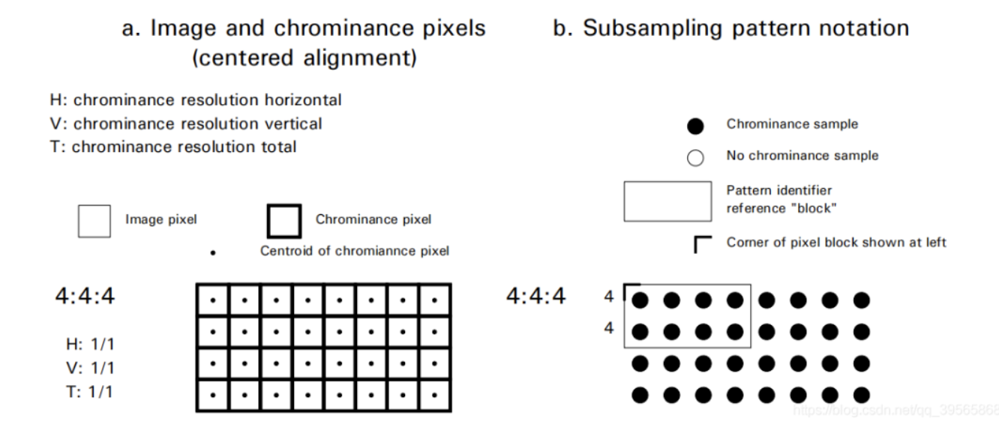

#### 1、YUV444

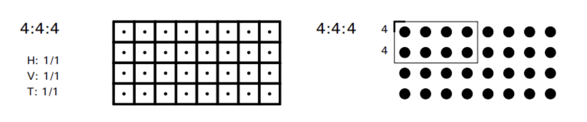

上图是YUV444的采样模型，左图和右图都可以看出来每个像素点都有一对UV分量，这就相当于压根没有做色度二次采样。即每一个Y对应一组UV分量。

#### 2、YUV440

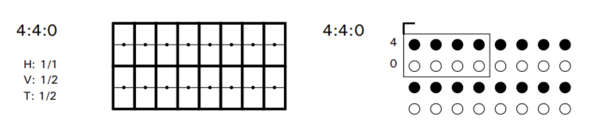

上图是YUV440的采样模型，左图可以看出来在水平方向上每一个像素都有UV分量，而在竖直方向上每两个像素共用一对UV分量；在右图的表现就是第一行4个全黑，第二行四个全白。即每两个Y对应一组UV分量。

#### 3、YUV422

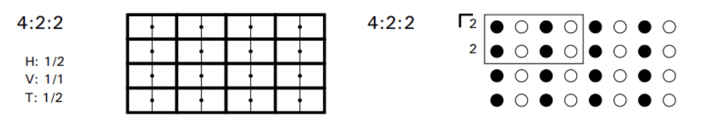

上图是YUV422的采样模型，左图可以看出来在竖直方向上每一个像素都有UV分量，而在水平方向上每两个像素共用一对UV分量；在右图的表现就是每行两个黑两个白。即每两个Y对应一组UV分量。

#### 4、YUV420

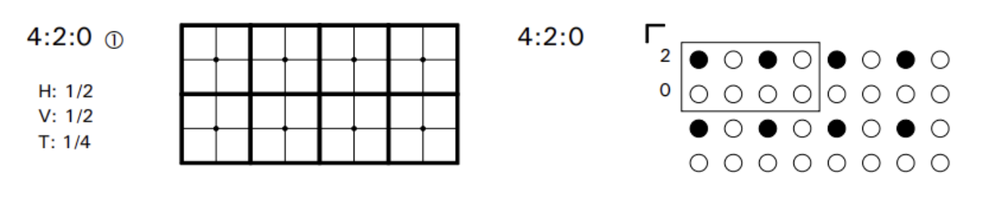

上图是YUV420的采样模型，左图可以看出来四个像素点共用一对UV分量，在水平方向上每两个像素共用一对UV分量，在竖直方向上也是每两个像素包含一对UV分量；在右图的表现就是第一行两个黑两个白，第二行全白。即每四个Y对应一组UV分量。

#### 5、YUV411

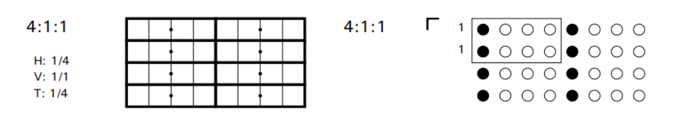

上图是YUV411的采样模型，左图可以看出来在水平方向上每四个像素点共用一对UV分量，而在竖直方向上每个像素都包含一对UV分量；在右图的表现就是两行都是一个黑三个白。即每四个Y对应一组UV分量。

#### 6、YUV410

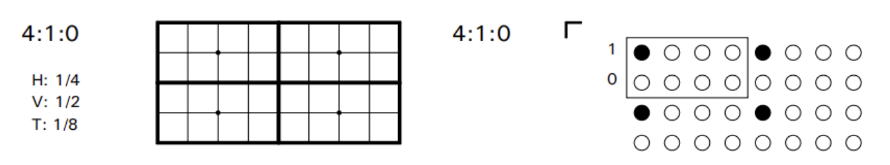

上图是YUV410的采样模型，左图可以看出来8个像素点共用一对UV分量，在水平方向上每四个像素点共用一对UV分量，在竖直方向上每两个像素点共用一对UV分量；在右图的表现就是只有第一行有一个黑其他全白。即每八个Y对应一组UV分量。

## 三、YUV数据排列格式

#### 1、四种数据排列方式

##### ①Planar Format

Planar的YUV格式，即平面存储格式先连续存储所有像素点的Y，紧接着存储所有像素点的U或V，最后存储剩下的U或者V。例如YU12（也叫I420），属于YUV420p，四个像素共用一组UV分量；它的数据排列方式为： 
Y1Y2Y3Y4Y5Y6Y7Y8 U1U2 V1V2（如下图）

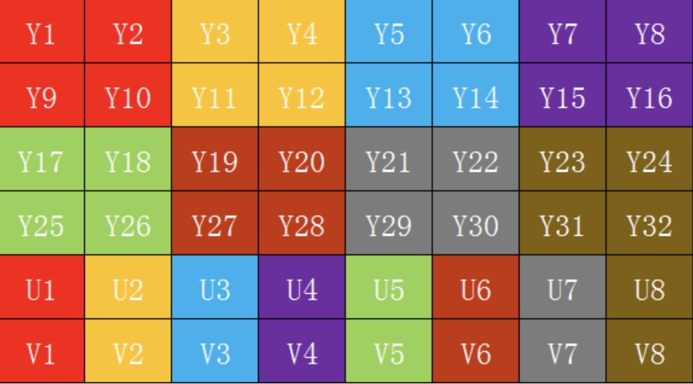

##### ②Semi-Planar Format

Semi-Planar的YUV格式，顾名思义，半平面存储格式，也就是先连续存储所有的Y分量，再交错存储U和V分量。例如NV12，属于YUV420sp，四个像素共用一组UV分量；它的数据排列方式为： 
Y1Y2Y3Y4Y5Y6Y7Y8 U1V1 U2V2（如下图）  
他还有个兄弟NV21，它的数据排列方式为： 
Y1Y2Y3Y4Y5Y6Y7Y8 V1U1 V2U2

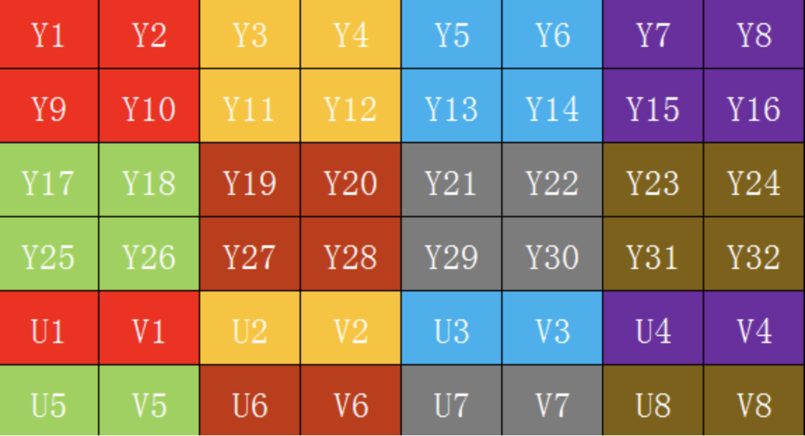

##### ③Tiled Semi-Planar Format

Tiled Semi-Planar的YUV格式，Tiled SP格式不再以光栅扫描的顺序来排列数据，而是将图像以宏块划分（例如16x16像素为一个宏块），宏块划分是以从左到右、从上到下的顺序，如下图。宏块是一个正方形的像素区域，如果采样格式为YUV420sp，那么就会把这块像素区域以NV12/NV21的格式存储（这一点存疑，暂时没看到有文章具体说明），每一个宏块皆是如此，并且宏块之间的内存是连续的。

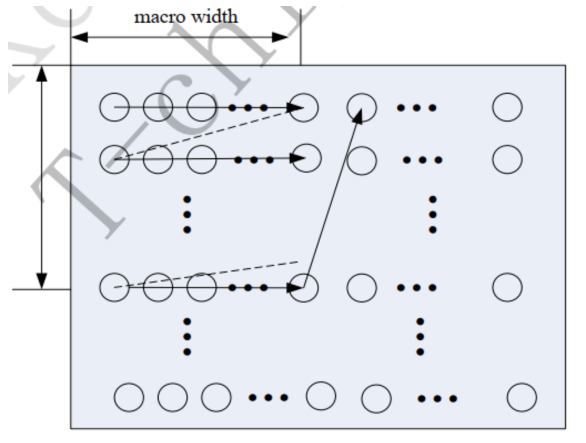

##### ④Interleaved Format

Interleaved的YUV格式，又叫Packed Format，这种格式下YUV数据是交错存储的。举个栗子，UYVY，属于YUV422采样，水平方向每两个像素共用一组UV分量；它的数据排列方式为： 
U1Y1V1Y2 U2Y3V2Y4

#### 2、常用YUV格式介绍

本文都是小端模式下的，左端为低字节。

##### ①YV12、YU12格式（属于YUV420 Planar）

YU12数据排列格式：Y1Y2Y3Y4Y5Y6Y7Y8 U1U2 V1V2  
YV12数据排列格式：Y1Y2Y3Y4Y5Y6Y7Y8 V1V2 U1U2

##### ②NV12、NV21格式（属于YUV420 Semi-Planar）

上面3.1.2讲过。

##### ③UYVY、VYUY、YUYV、YVYU（属于YUV422 Packed）

UYVY数据排列格式：U1Y1V1Y2 U2Y3V2Y4  
其他三种把顺序换换就行了。

##### ④AYUV（属于YUV444 Packed）

A为透明度分量，数据排列格式为A、Y、U、V顺序存储，每个分量8bit。

##### ⑤P010、P016（属于YUV420 Semi-Planar）

以上所介绍的四种YUV格式，均是每个分量占8bit，而P010格式每个分量占10bit，P016每个分量占16bit，仅此而已。它们的数据存储格式与NV12一致，只是Y、U、V所占bit数不同。

##### ⑥P210、P216（属于YUV422 Semi-Planar）

同⑤，P210是10bit的，P216是16bit的，这两种也是Semi-Planar的，数据存储格式与NV12一致。

##### ⑦Y210、Y216（属于YUV422 Packed）

Y210是10bit的，Y216是16bit的，这两种是Packed的。它们的数据存储格式为： 
Y1U1Y2V1 Y3U2Y4V2

##### ⑧Y410、Y416（属于YUV444 Packed）

同理，Y410是10bit的，Y416是16bit的。它们的数据排列如下图。上面的图为10bit的存储格式，下面的图为16bit的存储格式，A代表透明度（Alpha）。 

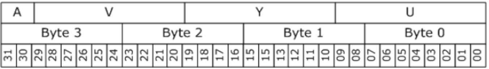

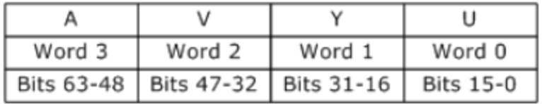

最后，关于10bit YUV有一点需要注意一下，如下图，这其实是10bit数据存储时的真实面貌，用16bit来代替10bit，所以要把低六位bit全部置为0，高10bit为有效位。 

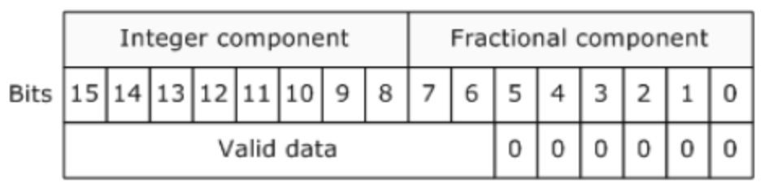

*原文链接: https://blog.csdn.net/qq_39565868/article/details/114877172*

## 四、换一种描述采样方式

YUV 图像的主流采样方式有如下三种：

- YUV 4:4:4 采样
- YUV 4:2:2 采样
- YUV 4:2:0 采样

用三个图来直观地表示采集的方式吧，以黑点表示采样该像素点的Y分量，以空心圆圈表示采用该像素点的UV分量。

先记住下面这段话，以后提取每个像素的YUV分量会用到。

1. YUV 4:4:4采样，每一个Y对应一组UV分量。表示全像素[点阵](https://baike.baidu.com/item/点阵)(YYYYCbCrCbCrCbCrCbCr），用于高质量视频应用、演播室以及专业视频产品。

2. YUV 4:2:2采样，每两个Y共用一组UV分量。 4：2：2表示每4个像素有4个亮度分量，4个色度分量（YYYYCbCrCbCr），是DVD、数字电视、HDTV 以及其它消费类视频设备的最常用格式。

3. YUV 4:2:0采样，每四个Y共用一组UV分量。 每4个像素有4个亮度分量，2个色度分量 (YYYYCbCr），仅采样奇数扫描线，是便携式视频设备（MPEG-4）以及电视会议（H.263）最常用格式。

   

## YUV分类

YUV格式有两大类：planar（平面）和packed（紧凑）。

对于planar的YUV格式，先连续存储所有像素点的Y，紧接着存储所有像素点的U，随后是所有像素点的V。

对于packed的YUV格式，每个像素点的Y,U,V是连续交叉存储的。

以分辨率8*4为例，数据存储方式如下：

##### 1、yuv420p（yuv420）（planar）【I420】：

YYYYYYYY

YYYYYYYY

YYYYYYYY

YYYYYYYY

UUUUUUUU

VVVVVVVV

##### 2、YV12（yuv420）：

YYYYYYYY

YYYYYYYY

YYYYYYYY

YYYYYYYY

VVVVVVVV

UUUUUUUU

##### 3、yuv420sp（yuv420）：

YYYYYYYY

YYYYYYYY

YYYYYYYY

YYYYYYYY

UVUVUVUV

UVUVUVUV

##### 4、NV12、NV21（属于YUV420）

NV12和NV21属于YUV420格式，是一种two-plane模式，即Y和UV分为两个Plane，但是UV（CbCr）为交错存储，而不是分为三个plane。其提取方式与上一种类似，即Y’00、Y’01、Y’10、Y’11共用Cr00、Cb00。

## 五、存储方式

**YV12，YU12格式（属于YUV420）**

YU12和YV12属于YUV420格式，也是一种Plane模式，将Y、U、V分量分别打包，依次存储。其每一个像素点的YUV数据提取遵循YUV420格式的提取方式，即4个Y分量共用一组UV。注意，上图中，Y'00、Y'01、Y'10、Y'11共用Cr00、Cb00，其他依次类推。

**NV12、NV21（属于YUV420）**

NV12和NV21属于YUV420格式，是一种two-plane模式，即Y和UV分为两个Plane，但是UV（CbCr）为交错存储，而不是分为三个plane。其提取方式与上一种类似，即Y'00、Y'01、Y'10、Y'11共用Cr00、Cb00。

**YUVY 格式 （属于YUV422）**

YUVY为YUV422采样的存储格式中的一种，相邻的两个Y共用其相邻的两个Cb、Cr，分析，对于像素点Y'00、Y'01 而言，其Cb、Cr的值均为 Cb00、Cr00，其他的像素点的YUV取值依次类推。

**UYVY 格式 （属于YUV422）**

UYVY格式也是YUV422采样的存储格式中的一种，只不过与YUYV不同的是UV的排列顺序不一样而已，还原其每个像素点的YUV值的方法与上面一样。

**YUV422P（属于YUV422）**

YUV422P也属于YUV422的一种，它是一种Plane模式，即平面模式，并不是将YUV数据交错存储，而是先存放所有的Y分量，然后存储所有的U（Cb）分量，最后存储所有的V（Cr）分量，如上图所示。其每一个像素点的YUV值提取方法也是遵循YUV422格式的最基本提取方法，即两个Y共用一个UV。比如，对于像素点Y'00、Y'01 而言，其Cb、Cr的值均为 Cb00、Cr00。

YUV420 planar数据， 以720×488大小图象YUV420 planar为例，

其存储格式是： 共大小为(720×480×3>>1)字节，

分为三个部分:Y,U和V

Y分量：  (720×480)个字节 

U(Cb)分量：(720×480>>2)个字节

V(Cr)分量：(720×480>>2)个字节

三个部分内部均是行优先存储，三个部分之间是Y,U,V 顺序存储。

即YUV数据的0－－720×480字节是Y分量值，     

720×480－－720×480×5/4字节是U分量   

720×480×5/4 －－720×480×3/2字节是V分量。

## 六、NV21与I420

Android Camera对象通过setPreviewCallback 函数，在onPreviewFrame(byte[] data,Camera camera)中回调采集的数据就是NV21格式。而x264编码的输入数据却为I420格式。

因此，当我们采集到摄像头数据之后需要将NV21转为I420。

NV21和I420都是属于YUV420格式。而NV21是一种two-plane模式，即Y和UV分为两个Plane(平面)，但是UV（CbCr）交错存储，2个平面，而不是分为三个。这种排列方式被称之为YUV420SP，***而I420则称之为YUV420P***。(Y:明亮度、灰度，UV:色度、饱和度)

下图是大小为4x4的NV21数据:Y1、Y2、Y5、Y6共用V1与U1,

而I420则是

可以看出无论是哪种排列方式，YUV420的数据量都为: w**h+w/2**h/2+w/2**h/2 即为w**h*3/2。

## 七、开发

手机摄像头的图像数据来源于摄像头硬件的图像传感器，这个图像传感器被固定到手机上后会有一个默认的取景方向，这个取景方向坐标原点于手机横放时的左上角。当应用是横屏时候：图像传感器方向与屏幕自然方向原点一致。而当手机为竖屏时:

传感器与屏幕自然方向不一致，将图像传感器的坐标系逆时针旋转90度，才能显示到屏幕的坐标系上。所以看到的画面是逆时针旋转了90度的，因此我们需要将图像顺时针旋转90度才能看到正常的画面。而Camera对象提供一个setDisplayOrientation接口能够设置预览显示的角度：

根据文档，配置完Camera之后预览确实正常了，但是在onPreviewFrame中回调获得的数据依然是逆时针旋转了90度的。所以如果需要使用预览回调的数据，还需要对onPreviewFrame回调的byte[] 进行旋转。

旋转前：

后置摄像头需要顺时针旋转90度，旋转后：

前置摄像头需要逆时针旋转90度，旋转后：

***前置摄像头可能还需要进一步镜像处理***，镜像后：

## 八、互转

##### NV21转I420

Y数据按顺序完整复制,U数据则是从整个Y数据之后加一个字节再每隔一个字节取一次。

##### 4：2：2 **和4：2：0** 转换

最简单的方式：YUV4:2:2 —> YUV4:2:0 Y不变，将U和V信号值在行(垂直方向)在进行一次隔行抽样。

YUV4:2:0 —> YUV4:2:2 Y不变，将U和V信号值的每一行分别拷贝一份形成连续两行数据。

在YUV420中，一个像素点对应一个Y，一个2X2的小方块对应一个U和V。对于所有YUV420图像，它们的Y值排列是完全相同的，因为只有Y的图像就是灰度图像。YUV420sp与YUV420p的数据格式它们的UV排列在原理上是完全不同的。420p它是先把U存放完后，再存放V，也就是说UV它们是连续的。而420sp它是UV、UV这样交替存放的。假设一个分辨率为8X4的YUV图像，它们的格式如图：

YUV420sp格式如下图：

YUV420p数据格式如下图：

##### RGB 到 YUV 的转换

对于图像显示器来说，它是通过 RGB 模型来显示图像的，而在传输图像数据时又是使用 YUV 模型，这是因为 YUV 模型可以节省带宽。因此就需要采集图像时将 RGB 模型转换到 YUV 模型，显示时再将 YUV 模型转换为 RGB 模型。

RGB 到 YUV 的转换，就是将图像所有像素点的 R、G、B 分量转换到 Y、U、V 分量。

有如下公式进行转换：

此时的转换结束后，每个像素点都有完整的 Y、U、V 分量。而之前提到 Y 和 UV 分量是可以分离的，可以通过不同的采样方式，可以将图像的 Y、U、V 分量重新组合。

