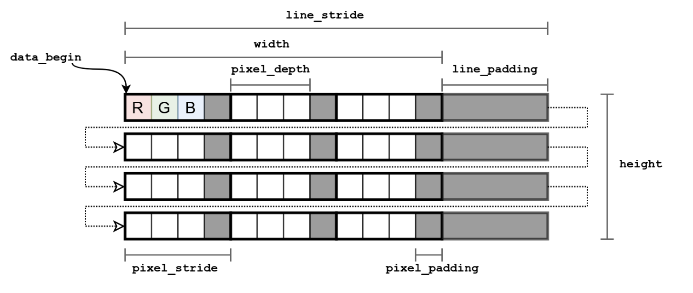

## 一、H264

在H264编码中我们经常会遇到linesize（行宽）、stride（步长）、pitch（间距）三个关键词

其实这三个关键词所代表的含义都是一样的，只不过在不同的场景下有着不同的叫法

在d3d显示的时候，叫pitch
在用ffmpeg解码的时候，它叫linesize
在使用ffmpeg转换格式的时候，它叫stride


## 二、为什么会出现这几个概念？

我们知道在H264编码中是以宏块为单位的，宏块的大小为16*16，有的时候图像的宽度和高度不是16的整数倍，那么最右边会有一部分的长度在1-15之间，但是我们编码不能把这些数据丢掉，所以就需要对这些元素进行补齐，补齐之后的长度就叫做间距，所以正常情况下 间距 >= 宽

 


## 三、图像出现绿边

一般补齐是对yuv数据进行补齐的，会补0，yuv全0显示出来就是绿色，所以一般出现绿边大概率是因为没有处理好间距和图像真正的宽度


## 四、图像中stride的含义

image stride（图像行跨度） 即内存中每行像素所占的控件，为了实现内存对齐或者其他的原因，每行像素在内存中所占据的空间并不是图像的宽度。

 

如图所示，对于图像数据而言，其像素存储是一行接一行的，但是对于不同的图像格式可能采用不同的压缩方式，而这些压缩方式的数据也需要存储到图像中，方便读取以及写入。在上图中，图像中的height就是图像的高，而图像的宽不是一行数据的大小，而只是其中的一部分数据。stride是width以及 padding的和。width即使图像的框，而padding则用来存贮与图像格式相关的信息 （例如同样大小的图像，8bit与32bit的保存方式其内存对齐不同，stride也就不相同）。pitch和stride类似，只不过pitch是对像素而言，stride则是对字节而言。下图表达了图像的存储方式

 


## 五、ffmpeg是如何计算linesize的

ffmpeg的AVFrame结构体，有个linesize的成员，记录了某个分量行与行之间相隔了多少个字节。今天测试了三个不同尺寸的jpg，结果为

分辨率 1920 * 1080，linesize[0]=1920
 分辨率 4299 * 2418，linesize[0]=4320
 分辨率 2479 * 1394，linesize[0]=2496

到底ffmpeg是如何计算这个linesize的呢？需要好好研究一下代码了。

所有的视频解码器，分配解码缓冲都是调用ff_get_buffer完成的。

libavcodec/decode.c
 ff_get_buffer
 `int ret = get_buffer_internal(avctx, frame, flags);`

libavcodec/decode.c
 get_buffer_internal
 `ret = avctx->get_buffer2(avctx, frame, flags);`

libavcodec/decode.c
 avcodec_default_get_buffer2
 `if ((ret = update_frame_pool(avctx, frame)) < 0)`

libavcodec/decode.c
 update_frame_pool
 `avcodec_align_dimensions2(avctx, &w, &h, pool->stride_align);`

libavcodec/utils.c
 avcodec_align_dimensions2

根据调用栈，找到avcodec_align_dimensions2，里面的核心代码

```c
    switch (s->pix_fmt) {
    case AV_PIX_FMT_YUV420P:

        w_align = 16; //FIXME assume 16 pixel per macroblock
        h_align = 16 * 2; // interlaced needs 2 macroblocks height

    *width  = FFALIGN(*width, w_align);
    *height = FFALIGN(*height, h_align);

    for (i = 0; i < 4; i++)
        linesize_align[i] = STRIDE_ALIGN;
```

用到的宏FFALIGN定义在 libavutil/macros.h
 `#define FFALIGN(x, a) (((x)+(a)-1)&~((a)-1)`

而STRIDE_ALIGN定义在 libavcodec/internal.h

```cpp
#if HAVE_SIMD_ALIGN_64
#   define STRIDE_ALIGN 64 /* AVX-512 */
#elif HAVE_SIMD_ALIGN_32
#   define STRIDE_ALIGN 32
#elif HAVE_SIMD_ALIGN_16
#   define STRIDE_ALIGN 16
#else
#   define STRIDE_ALIGN 8
#endif
```

HAVE_SIMD_ALIGN是configure自动检测出来的

```bash
simd_align_16_if_any="altivec neon sse"
simd_align_32_if_any="avx"
simd_align_64_if_any="avx512"
```

对于arm neon， STRIDE_ALIGN的值是16。不难理解，经过avcodec_align_dimensions2之后，宽被对齐到16字节，而pool->stride_align都被置为16。

回到 update_frame_pool 的代码。执行完 avcodec_align_dimensions2 之后是一段循环

```php
        do {
            // NOTE: do not align linesizes individually, this breaks e.g. assumptions
            // that linesize[0] == 2*linesize[1] in the MPEG-encoder for 4:2:2
            ret = av_image_fill_linesizes(linesize, avctx->pix_fmt, w);
            if (ret < 0)
                return ret;
            // increase alignment of w for next try (rhs gives the lowest bit set in w)
            w += w & ~(w - 1);

            unaligned = 0;
            for (i = 0; i < 4; i++)
                unaligned |= linesize[i] % pool->stride_align[i];
        } while (unaligned);
```

这其中的av_image_fill_linesizes用于计算每个分量的linesize

libavutil/imgutils.c
 av_image_fill_linesizes,  image_get_linesize

```php
    s = (max_step_comp == 1 || max_step_comp == 2) ? desc->log2_chroma_w : 0;
    shifted_w = ((width + (1 << s) - 1)) >> s;
    linesize = max_step * shifted_w;
```

这段代码有点绕。不过实际的执行结果是，对于y分量，s=0，shifted_w就是width，max_step=1，因此linesize=width；对于u、v分量，desc->log2_chroma_w为1，shifted_w=(width+1)/2，linesize就是width的一半。

套用上述的输入样例，模拟执行。对于4299*2418， avcodec_align_dimensions2对齐到16字节后，width=4304。第一次调用av_image_fill_linesizes，算出linesize[0]=4304，linesize[1]=linesize[2]=2152。由于pool->stride_align都是16，而2152不是16的倍数，因此循环不通过，需要继续对齐到32字节。对齐到32字节后，linesize[0]=4320，linesize[1]=linesize[2]=2160，可以满足pool->stride_align的要求了。