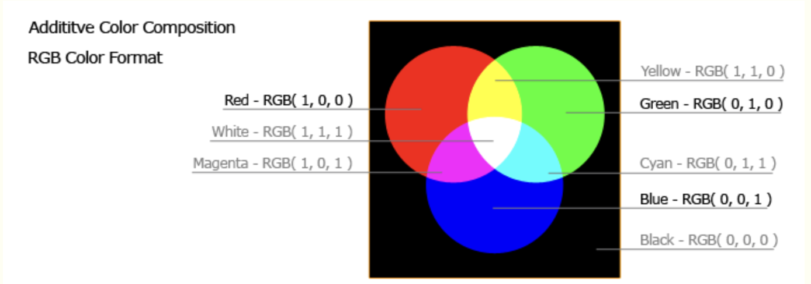
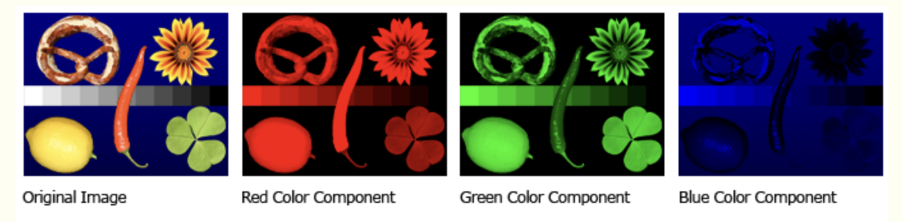
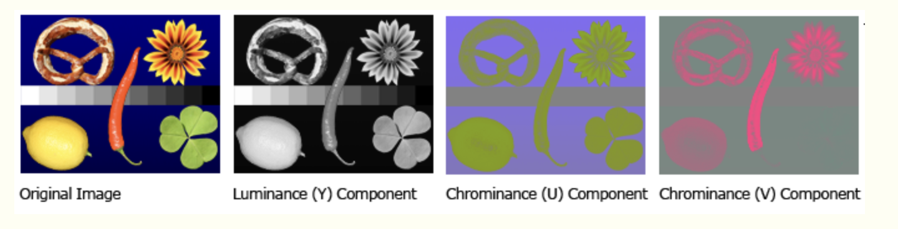
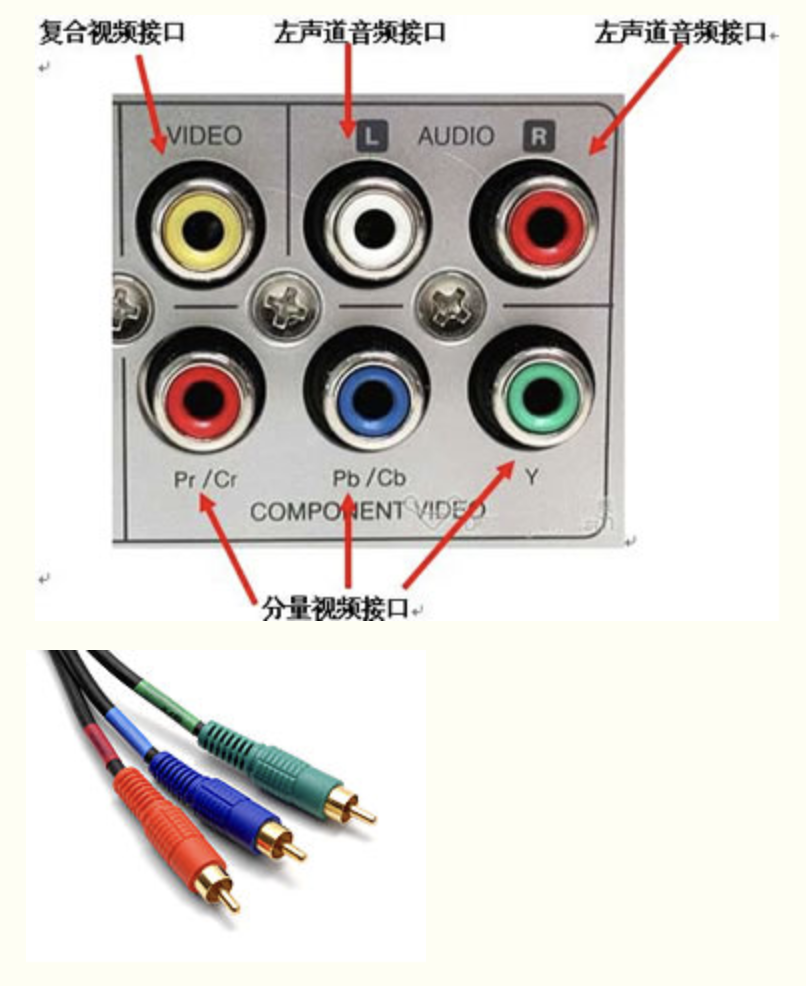
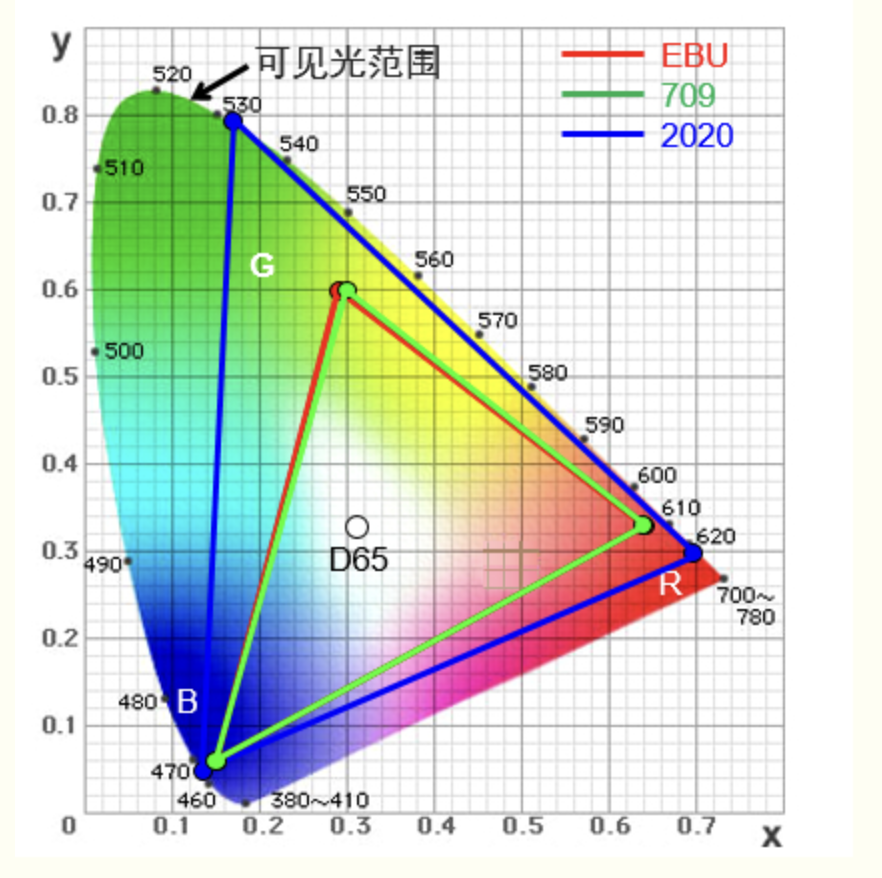
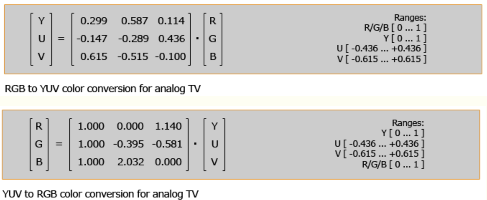
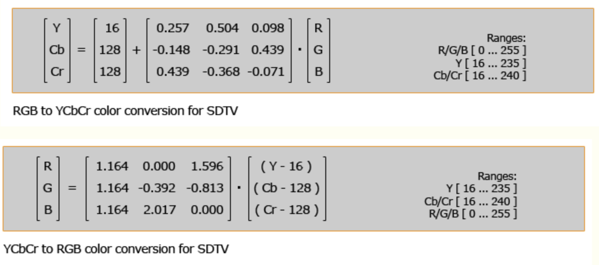
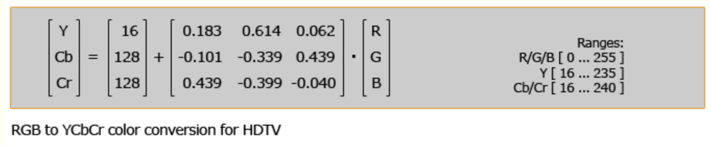
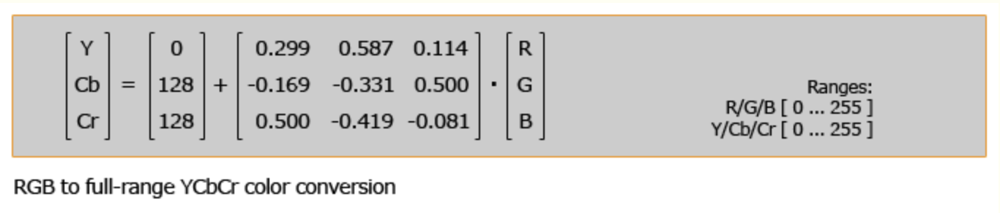
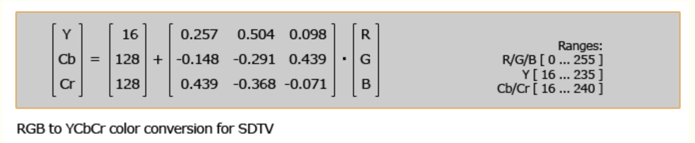

https://www.cnblogs.com/huxiaopeng/p/5653257.html

## 1. **色彩空间**

色彩空间一词源于英文的“Color Space”，色彩学中，人们建立了多种色彩模型，以一维、二维、三维甚至四维空间坐标来表示某一色彩，这种用坐标系统来定义的色彩范围即色彩空间。

例如计算机监视器上显示颜色的时候，通常使用 RGB（红色、绿色、蓝色）色彩空间定义，红色、绿色、蓝色被当作 X、Y 和 Z坐标轴。另外一个生成同样颜色的方法是使用色相（X 轴）、饱和度（Y 轴）和明度（Z 轴）表示，这种方法称为 HSB 色彩空间。另外还有许多其它的色彩空间，它们可以按照这种方法用三维空间来表示（X、Y、Z）。

我们经常用到的色彩空间主要有RGB、YUV, CMYK, HSB, HSL等等，其中YUV和RGB是视讯通信领域用的较多的二种色彩空间。

### 1.1.1 **RGB**

目前的显示设备大都是采用了RGB色彩空间，RGB是从颜色的原理来设计定的，它的颜色混合方式就如有红、绿、蓝三盏灯，当它们的光相互叠合的时候，色彩相混，亮度等于两者亮度之总和，即加法混合。

屏幕上的不同颜色，都由这红色，绿色，蓝色三种基本色光按照不同的比例（权重）混合而成的。一组红色绿色蓝色就是一个最小的显示单位。屏幕上的任何一个颜色都可以由一组RGB值来记录和表达。因此这红色绿色蓝色又称为三原色光，用英文表示就是R(red)、G(green)、B(blue)。RGB的所谓“多少”就是指亮度，并使用整数来表示。在用8位表示时，RGB各有256级亮度，用数字量化表示为从0、1、2...直到255。注意虽然数字最高是255，但0也是数值之一，因此共256级。

如下图表示RGB色彩空间从R,G,B三个维度看到的图像。

### 1.1.2 **YUV**

YUV色彩空间的重要性是它的亮度信号Y和色度信号U、V是分离的。如果只有Y信号分量而没有U、V分量，那么这样表示的图像就是黑白灰度图像。彩色电视采用YUV空间正是为了用亮度信号Y解决彩色电视机与黑白电视机的兼容问题，**使黑白电视机也能接收彩色电视信号**。

YUV色彩空间的Y亮度和色度信号U、V是分离还有一个优点是，人眼对亮度敏感，对色度不敏感。减少部分UV的数据量，但人眼感知不到。

如下图表示YUV色彩空间从Y,U,V三个维度看到的图像。

### 1.1.3 **YCbCr**

YCbCr是被ITU定义在标准ITU-R BT.601（标清），ITU-R BT.709（高清），ITU-R BT.2020（超高清）中的一种色彩空间，用于**数字电视系统**。YCbCr不是一种绝对色彩空间，是一种针对RGB所做的编码,是YUV压缩和偏移的版本,其中Y与YUV 中的Y含义一致,Cb,Cr 同样都指色彩，只是在表示方法上不同而已，**Cb，Cr是差值**。

在视频通信系统中（特别是视频编解码）的“YUV”图像就是YCbCr。在平常的工作交流中，所称的YUV也是YCbCr。

*Y = K**ry**· R + K**gy**· G + K**by**· B*(R,G,B代表RGB色彩空间的红色，绿色，蓝色)

*C**b**= B – Y* （Cb是差值）

*C**r**= R – Y*（Cr是差值）

*K**ry**+ K**gy**+ K**by**= 1*（K 是比值或称权重， BT.601, BT.709,BT.2020中的权重是不同的。）

上面的公式中

*K**ru**= - K**ry**；* *K**gu**= - K**gy**；* *K**bu**= 1 - K**by**；* *K**rv**= 1 – K**ry**；* *K**gv**= -K**gy**；* *K**bv**= -K**by*

### 1.1.4 **YPbPr**

YPbPr和YCbCr类似，Y表示亮度,Cb,Cr 都指色彩，区别在于YPbPr仅仅用于模拟信号。YPbPr接口，YPbPr也叫色差分量接口，采用的是美国电子工业协会EIA-770.2a标准。YPbPr的接口可以使用同轴电缆，可以用BNC头，也可以使用普通莲花头作为接口标准。

分量接口尤其是模拟分量接口并没有国际统一的标准，目前最为常见的是日本的D端子、欧洲的SCART端子和美国的三线端子。我国目前采用的是美国的三线端子，这个端子是由美国EIA(电子工业协会)标准EIA-770.2a规定的。按照这个标准，下到480i上到720p的信号都是采用这个端子传输，而且并没有隔行、逐行的分别。日本的D端子和欧洲的SCART端子也是不分隔行逐行的D端子的D1到D5的标识不同只是告诉使用者这个机器只能输出(输入)某一个格式以下的信号(譬如D4就表示支持720p及以下格式)。所以YPbPr表示的仅仅是模拟视频分量接口，而且仅仅是美国的标准(包括采用美国标准的其他国家)。

如上图所示，几乎所有具备分量输出的DVD机（或终端）上的分量端子都是标识为YCbCr/YPbPr， 根据前面的学习我们知道标成YCbCr是错误的或者称之为标识混乱。

目前市场上还有三种说方法：

1、隔行分量端子和逐行分量端子分开设置。在这种情况下，根据说明书，用YCbCr表示隔行分量端子，用YPbPr表示逐行分量端子。

2、隔行分量端子和逐行分量端子共用，端子标识为YPbPr/YCbCr，根据说明书，无论隔行分量信号还是逐行分量信号都是从这个端口输处（输入）。

3、隔行分量端子和逐行分量端子共用，端子标识为YPbPr。根据说明书，无论隔行分量还是逐行分量都是从此端口输出（输入）。

以上的3种说法中只有第3种情况是正确的，1和2都是错误的。但是为什么厂商会犯这样的错误，而且还在继续呢？个人认为是为了以前错误的习惯和理解的方便。

 

## 2. **ITU标准**

ITU-R BT。ITU = International Telecommunication Union(联合国)国际电信联盟，R = Radiocommunication Sector无线电部，BT = Broadcasting service (television)广播服务(电视)。

### 2.1.5 **ITU-R Recommendation BT.601**

1982年CCIR(International Radio Consultative Committee国际无线电咨询委员会)制定了彩色视频数字化标准，称为CCIR 601标准，现改为ITU-R BT.601标准（601-4:1994.7. / 601-5:1995.10）。该标准规定了彩色视频转换成数字图像时使用的采样频率，RGB和YCbCr两个彩色空间之间的转换关系等。

为了便于国际间的节目交换，为消除数字设备之间的制式差别,和为 625行电视系统与 525行电视系统之间兼容，向着数字电视广播系统参数统一化、标准化迈出，在 1982年 2月国际无线电咨询委员会(CCIR)第 15次全会上，通过了 601号建议，确定以分量编码为基础, 即以亮度分量Y、和两个色差分量R-Y、 B-Y为基础进行编码,作为电视演播室数字编码的国际标准,601号建议单独规定了电视演播室的编码标准。

### 2.1.6 **ITU-R Recommendation BT.709

BT.709为高清数字电视的ITU标准。1990年，ITU 11A工作组重开有关HDTV的会议，1080p/50与1080p/60两种逐行扫描系统成为讨论的基础。然而，在HDTV是否应包含隔行扫描这一问题上，欧洲代表再次遇到了疑惑。按照ITU之前的定义，HDTV必须提供比SDTV更高的运动效果，而SDTV的场频已经是50 Hz与60 Hz，因此采用这种场频的HDTV不能提供比SDTV更好的质量，也就不属于真正的HDTV。不过，考虑到隔行系统较为现实，ITU会议最终达成了一致，即接受50 Hz/60 Hz两种场频和帧频、一种图像格式（1920×1080）及一种数据率，NHK也随着提交了一份ITU-R BT.709建议的新草案。2年后，随着24/25 Hz格式的加入，HDTV开始在电影行业崭露头角。作为一个全球合作项目，709建议书的诞生过程，是智慧的结晶，也是妥协的产物。

### 2.1.7 **ITU-R Recommendation BT.**2020

2012年下半年，国际电信联盟无线电通信部门(ITU-R)颁布了面向新一代超高清UHD(Ultra-high definition)视频制作与显示系统的BT.2020标准，重新定义了电视广播与消费电子领域关于超高清视频显示的各项参数指标，促进4K超高清家用显示设备进一步走向规范化。其中最为关键的是，BT.2020标准指出UHD超高清视频显示系统包括4K与8K两个阶段，其中4K的物理分辨率为3840×2160，而8K则为7680×4320。之所以超高清视频显示系统会有两个阶段，实际上是因为全球各个地区超高清视频显示系统发展差异性所造成的，例如在电视广播领域技术领先的日本就直接发展8K电视广播技术，避免由4K过渡到8K可能出现的技术性障碍。而在世界的其他地区，多数还是以4K技术作为下一代的电视广播发展标准。

BT.2020标准的重要性是毋庸置疑的，正如BT.709对于高清视频传输与高清显示设备制造方面起到了引导性作用，BT.2020标准同样也深刻地影响着消费领域超高清显示设备的设计与制造，尤其在4K平板电视方面更为突出。例如目前绝大部分的4K平板电视的物理分辨率都是采用BT.2020标准的3840×2160，而不是DCI数字电影标准的4096×2160。但，BT.2020标准绝不仅仅在分辨率方面有所提升，在色彩和刷新频率和信号格式与分析等方面也进行了相关的规定。

4K电视显示标准BT.2020在色彩方面的提升：BT.2020标准相对于BT.709标准，大幅度提升了视频信号的性能规范。例如色彩深度方面，就由BT.709标准的8bit提升至10bit或12bit，其中10bit针对的是4K系统，12bit则针对8K系统。这一提升对于整个影像在色彩层次与过渡方面的增强起到了关键的作用。而色域范围的面积也远远大于BT.709标准，能够显示更加丰富的色彩，只是相对应来说，越广的色域对于显示设备的性能要求就越高，根据目前4K超高清投影机的情况，往往需要采用新一代的激光或LED固态光源的机型才能达到。

BT.2020标准规定Ultra-high definition超高清图像的显示分辨率为3840×2160与7680×4320，画面显示比例为16:9，支持的刷新率包括120p、60p、59.94p、50p、30p、29.97p、25p、24p、23.976p。 重要的是，在**BT.2020标准中取消了隔行扫描**，**所有超高清标准下的影像都是基于逐行扫描的**，无疑是历史性的突破，进一步提升了超高清影像的细腻度与流畅感。

虽然目前，BT2020电视机还没有完全开始执行，但是标准就是标准，很快会开始推广。对于平时要面临后期调色的公司来说，做好准备，如果接了一个将在4k电视上放的片子，你就要关心一下那个电视机是709的，还是2020的。

 

## 3. **色彩空间转换**

因为视讯系统中，视频采集和播放多用RGB的色彩空间，而视频编解码中多用YCrCb的色彩空间，所以RGB与YCrCb格式相互转换是必须的工作。

### 3.1.8 **YUV** **–** **RGB 互转**

YUV是模拟信号，Y的取值范围是0到1伏。

### 3.1.9 **YCbCr-RGB互转**

**按ITU-R BT.601标准。**(**这个公式是应用最广泛**)，由下面的公式可知，用YCbCr表示一幅全黑色的图，**Y取值16，CbCr取值128**。因为RGB色彩空间中,R,G,B的值全0为黑色，全255为白色。

**按ITU-R BT.709标准，高清**

**按JPEG的全范围取值格式**

注意这里的YCbCr是取值是从0到255。但目前单独用这个公式的很少，基本被601的公式替代，因为ITU标准应用更广。作者也是在视讯工作十年后才注意到有这样的小差别。

 

1) 公式定点化

上面的公式都是浮点的，为方便计算机运算和优化，实际工作中图像处理都是用定点化后的。以下面公式为例，按2的8次方做定点（当然也可以按2的6次方做定点）。

下面是定点化后的公式，我们的代码中都是这样实现的。

Y = ( ( 66 * R + 129 * G + 25 * B + 128) >> 8) + 16

Cb = ( ( -38 * R - 74 * G + 112 * B + 128) >> 8) + 128

Cr = ( ( 112 * R - 94 * G - 18 * B + 128) >> 8) + 128

## 4. **参考**

[http://en.wikipedia.org/wiki/YUV](http://en.wikipedia.org/wiki/YUV#HDTV_with_BT.709)

http://en.wikipedia.org/wiki/YCbCr

http://en.wikipedia.org/wiki/YPbPr

http://www.itu.int/rec/R-REC-BT.709/en

https://msdn.microsoft.com/en-us/library/ms893078.aspx

