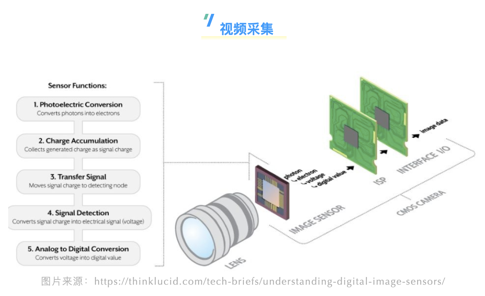

在视频处理中，我们经常会用到不同的色彩空间：`非线性 RGB`、`线性 RGB`、`YUV`、`XYZ`……为什么需要这么多的色彩空间呢？为什么在FFmpeg中会有 `color_space`，`color_transfer`，`color_primaries` 等一系列的颜色属性呢？这些术语之间究竟隐藏着什么秘密？



如上图所示，在相机系统中，外部世界的光信息（光子，photon）通过透镜或其他光学器件聚焦之后达到相机的图像传感器（CCD 或者 CMOS）。[1]

- 图像传感器可以将一个入射光子转换为对应的一个电子（electron）。
- 在曝光时间内，图像传感器对转换的电子进行电荷积累。
- 然后，图像传感器会将积累的电荷信号转换成对应的电压信号。
- 最后，利用 ADC（模数变换器，analog-to-digital converter）[2]把电信号转换成数字信号，而转换后的数字信号则为某个范围内的整数值。


**ADC 数字信号的取值范围**

ADC 转换之后的数字信号的取值范围受限于 ADC 设备。对于 8-bit 的 ADC 而言，数字信号的取值范围为 [0, 2^8-1]，因此，对于每一个像素而言，会用 [0, 255] 之间的整数来进行编码。


ADC 转换的数字信号的数值是一个线性编码的过程，这意味着如果将图像传感器上的光量增加1倍，则 ADC 转换之后对应的数值也会增加1倍。这是一个非常有用的特性：无论是增加物理世界的光量，还是增加 ADC 转换之后的数值，对图片而言，都会带来相同的效果。线性编码意味着我们所处理的数据和光发射的强度成正比关系。[3]

由数码相机中的 CMOS 传感器产生并写入原始文件（Raw File）的数据是线性的。与普通照片相比，线性数据通常看起来非常暗且对比度较低。[4]


在iPhone手机中，可以通过设置相机来拍摄 Apple ProRAW [5]格式的照片。


# **视频伽马校正**

实际上，研究表明，人类视觉系统是以对数函数的方式来感知光亮度。这意味着，人眼会提高暗部的敏感度，降低高光部分的敏感度。[6]


从数学角度看，感知光强度和测量光强度之间存在一个近似的平方关系，具体如下式所示。


由于人类视觉感知系统不是以线性方式工作的，因此必须使用非线性曲线来对 ADC 生成的线性数据进行变换，从而使得拍摄的图像色调与我们的视觉系统的工作方式相匹配。这个过程也就是我们所说的伽马校正[7]。


因此，在<font color="red">从线性 RGB 空间转换到非线性 RGB 空间时，需要γ作为转换参数</font>。相机中的 ISP 模块负责对图像传感器的线性 RGB 进行伽马校正进而产生对应的符合人眼感知的非线性 RGB 数据。


**RGB的设备依赖性**

不同显示设备支持的色域空间不同，因此对于不同的显示设备而言，伽马校正之后的 RGB 数值也不同。从这个角度讲，RGB是设备依赖型的色彩空间。


# **视频压缩**

根据如上的信息，我们知道：相机系统经过 ISP 处理(伽马校正)之后，最终会得到非线性的 RGB 信息。对于视频而言，如果以 RGB 存储每帧的信息，则需要消耗大量的存储空间。

人类视觉系统对颜色信息的敏感度要弱于亮度信息，利用这一特点，通常相机会将捕获的 RGB 信息转换为 YUV [8]格式，然后对 YUV 格式进行色度信息采样（例如，YUV420）以便压缩图像空间。

RGB->YUV，不同标准有不同要求，一般常用的标准有：

- BT. 601 (SD: Standard-Definition) [9]
- BT. 709 (HD: High-Definition) [10]
- BT. 2020 (UHD: Ultra-High-Definition) [11]

**注意**

标准中，不但会规定 RGB->YUV 的转换系数，同时还会规定从线性 RGB 到非线性 RGB 转换的 gamma 系数。


将 RGB 颜色模型转换成 YUV 模型后，接下来会采用某种视频编解码算法（例如，H265、VP9）对获取的数据进行视频编码，最终得到视频文件（此处忽略了音频的采集编码以及合流的操作）。


#  **视频转码**

出于各种原因，例如：

- 终端用户的带宽受限
- 终端用户支持的视频编解码算法和相机压缩视频的编解码算法不一致
- ……

一般不会直接把相机产出的视频文件分发给用户去消费。媒体服务商会对相机生成的视频文件进行转码，然后选择合适的转码后的视频分发给终端消费用户。[12]

在视频转码阶段，如果我们希望对原视频进行色域的变换，例如从 BT. 601 转码为 BT. 709，则需要在不同色域的 RGB 数值之间进行转换。[13]

在不同的色域空间进行 RGB 数据的转换，这也就是我们所说的色彩管理[14]。色彩管理会对图像进行颜色转换以适配当前环境下的颜色效果，从而保证同一张图片在不同输入、输出上都呈现出最好的颜色。[15]

色彩转换需要在某个线性空间下进行操作，并且操作过程需要保持设备的独立性。因此，不同的 RGB 色域空间是不能直接进行转换的，需要一个设备无关、线性的颜色模型作为中转才能实现其转换。

而 XYZ（CIE 1931 XYZ color space）[16] 具备设备无关、线性操作的特性。

在 FFmpeg 中，主要使用 colorspace 滤镜 来完成不同色域空间的转换。[17]根据colorspace的实现可知，在 FFmpeg 中，BT.601->BT.709的转换过程如下所示：


在如上的变换中，涉及到3个颜色空间的转换，分别是：

1. YUV 和 RGB 之间的转换
2. 线性 RGB 和非线性 RGB 之间的转换
3. 线性 RGB 和 XYZ 之间的转换


在FFmpeg中，所有的这些转换参数都保存在 AVFrame [18]结构中：

- AVFrame->`colorspace` [19]中保存了 YUV/RGB 的转换矩阵
- AVFrame->`color_trc`[20] 中保存了线性 RGB 和非线性 RGB 之间的转换函数（也被称为transformation characteristics）
- AVFrame->`color_primaries`[21]中保存了RGB/XYZ的转换矩阵


如果用 `ffprobe` 命令解析视频文件，则：

- `color_space`字段对应 YUV/RGB 的转换矩阵
- `color_transfer`字段对应线性 RGB 和非线性 RGB 之间的转换函数
- `color_primaries`字段对应 RGB/XYZ 的转换矩阵

```
$ ffprobe -select_streams v:0 -show_entries stream=color_space,color_transfer,color_primaries test.mp4

[STREAM]
color_space=bt2020nc
color_transfer=arib-std-b67
color_primaries=bt2020
[/STREAM]
```


在如上的例子中，`arib-std-b67` [22]也就是我们所熟悉的 HLG。

在 `MediaInfo` 中，

- `Matrix coefficients` 字段对应 YUV/RGB 的转换矩阵
- `Transfer characteristics` 字段对应线性 RGB 和非线性 RGB 之间的转换函数
- `Color primaries` 字段对应RGB/XYZ的转换矩阵


除了如上的参数外，AVFrame->`range`[23] 还用来存储视频中对应像素的每个分量的取值范围。在 `vf_setparams.c`[24]中也作了相关的定义说明：

```
{"limited", NULL, 0, AV_OPT_TYPE_CONST, {.i64=AVCOL_RANGE_MPEG},  0, 0, FLAGS, "range"},
{"tv",      NULL, 0, AV_OPT_TYPE_CONST, {.i64=AVCOL_RANGE_MPEG},  0, 0, FLAGS, "range"},
{"mpeg",    NULL, 0, AV_OPT_TYPE_CONST, {.i64=AVCOL_RANGE_MPEG},  0, 0, FLAGS, "range"},
{"full",    NULL, 0, AV_OPT_TYPE_CONST, {.i64=AVCOL_RANGE_JPEG},  0, 0, FLAGS, "range"},
{"pc",      NULL, 0, AV_OPT_TYPE_CONST, {.i64=AVCOL_RANGE_JPEG},  0, 0, FLAGS, "range"},
{"jpeg",    NULL, 0, AV_OPT_TYPE_CONST, {.i64=AVCOL_RANGE_JPEG},  0, 0, FLAGS, "range"},
```


# **视频解码&播放**

转码之后的视频，可以通过各种渠道分发到终端用户进行消费。对于大部分显示设备，例如 CRT 显示器、LCD、OLED，屏幕上的每个像素都是通过驱动三个非常靠近但仍然分开的小型 RGB 光源而构建的。[25] 因此，显示屏（监视器、电视机、屏幕等等）仅使用 RGB 模型，并以不同的方式来组织，并显示最终的图像。[26]


图片来源：https://github.com/leandromoreira/digital_video_introduction

如前所述，不同的显示设备采用的 RGB 的色域并不一定相同，因此 RGB 是一种设备依赖型的颜色模型。[27]在 Mac 电脑上，可以通过显示器配置来选择显示器支持不同的 RGB 色域。


**| 显示设备和相机的色域一致**

如果编码视频和播放视频的显示器采用的 RGB 色域是一致的，比如都是 sRGB，此时的播放过程相对比较简单。视频解码之后，得到 YUV 数据，然后根据标准将 YUV 数据转换成非线性的 sRGB 数据，然后显示器根据 sRGB 数据显示图像即可。


**| 显示设备和相机的色域不一致**

当显示设备支持的色域从 sRGB 变为 Rec. 2020 时，如果直接显示 sRGB 色域下的数据，则会导致比较严重的颜色失真。


和转码阶段的色域转换类似，此时也需要在不同的色域空间进行 RGB 数据的转换（色彩管理）以保证相同的视频在不同输入、输出、显示设备上都呈现出最好的颜色。

对于显示设备而言，sRGB->RGB(Rec.2020)的转换过程如下所示：


因此，对于拍摄设备和显示设备的色域不同时，视频的播放增加了色彩管理的过程。


#  **视频观看**

虽然视频信息的采集和最终终端播放采用的都是 RGB 的颜色模型，但是对人眼而言，RGB 其实并不直观，比如我们很难马上反应出`天青色`的 RGB 色值？

为了能够更直观的表示颜色，又引入了 HSL[28] 色彩模型。HSL 比 RGB 更加直观，比如：想从黄色过渡到红色，只需要调整色相即可，饱和度和亮度保持不变。因此，HSL 一般更适合人的色彩感知，而 RGB 更适合显示领域。

为了让作品可以呈现出期望的效果，提升用户的视觉体验，在摄影后期，使用 HSL 对作品进行调整是最方便的一种方式。利用 HSL 对作品进行调整，简单几步就可以让灰暗的「马路随拍」秒变「街头大片」。[29]


FFmpeg的`signalstats`滤镜可以分析获取视频的色调、饱和度、亮度信息。但是该滤镜获取的色调、饱和度和 HSL 中的计算 [30]是不一致的。

`signalstats`计算色调、饱和度的算法如下所示：


如果需要得到视频的标准 HSL信息，可以使用作者开发的 vf_hsl 滤镜[31]。


# **总结**

虽然颜色还是那个颜色，但是不同的颜色空间的适用范围并不相同：

- RGB：面向采集和显示设备
- YUV：面向存储
- HSL：面向人类视觉感知
- XYZ：RGB之间的转换桥梁

从视频采集到视频消费的整个过程，涉及到不同的设备和标准，而不同的设备和标准所支持的色域空间又不相同。正是通过不同的颜色模型转换和不同的色域转换，才得以在不同输入、输出、显示设备上都呈现出最好的颜色，才得以让我们实现以近似相同的观看体验来消费视频。


**注释：**

[1] https://zhuanlan.zhihu.com/p/158502818

[2] https://en.wikipedia.org/wiki/Analog-to-digital_converter

[3] https://discuss.pixls.us/t/what-does-linear-rgb-mean/16584

[4] https://www.astropix.com/html/astrophotography/how.html

[5] https://support.apple.com/zh-cn/HT211965

[6] https://www.pathwaylighting.com/products/downloads/brochure/technical_materials_1466797044_Linear+vs+Logarithmic+Dimming+White+Paper.pdf

[7] https://en.wikipedia.org/wiki/Gamma_correction

[8] https://en.wikipedia.org/wiki/YUV

[9] https://en.wikipedia.org/wiki/Rec._601

[10] https://en.wikipedia.org/wiki/Rec._709

[11] https://en.wikipedia.org/wiki/Rec._2020

[12] https://medium.com/videocoin/what-is-video-transcoding-and-why-do-you-do-it-348a2610cefc

[13] https://medium.com/invideo-io/talking-about-colorspaces-and-ffmpeg-f6d0b037cc2f

[14] https://en.wikipedia.org/wiki/Color_management

[16] https://en.wikipedia.org/wiki/CIE_1931_color_space

[17] https://blog.csdn.net/weixin_43194305/article/details/107944264

[18] https://ffmpeg.org/doxygen/trunk/structAVFrame.html

[19] https://ffmpeg.org/doxygen/trunk/structAVFrame.html#a9262c231f1f64869439b4fe587fe1710

[20] https://ffmpeg.org/doxygen/trunk/structAVFrame.html#ab09abb126e3922bc1d010cf044087939

[21] https://ffmpeg.org/doxygen/trunk/pixfmt_8h.html#ad384ee5a840bafd73daef08e6d9cafe7

[22] https://ffmpeg.org/doxygen/trunk/pixfmt_8h.html#ad4791ea14975f098b649db7fcd731ce6

[23] https://ffmpeg.org/doxygen/trunk/pixfmt_8h.html#a3da0bf691418bc22c4bcbe6583ad589a

[24] https://github.com/FFmpeg/FFmpeg/blob/a78f136f3fa039fd7ad664fd6e6e976f1448c68b/libavfilter/vf_setparams.c

[25] https://en.wikipedia.org/wiki/RGB_color_model

[26] https://wangwei1237.github.io/2020/02/28/Introduction-to-digital-video-technology/

[27] https://www.spiedigitallibrary.org/ebooks/PM/Computational-Color-Technology/eISBN-9780819481085/10.1117/3.660835

[28] https://en.wikipedia.org/wiki/HSL_and_HSV

[29] https://zhuanlan.zhihu.com/p/142767122

[30] https://www.rapidtables.com/convert/color/rgb-to-hsl.html

[31] https://github.com/wangwei1237/wangwei1237.github.io/blob/master/2022/08/14/Why-so-much-color-space-in-video/vf_hsl.c


