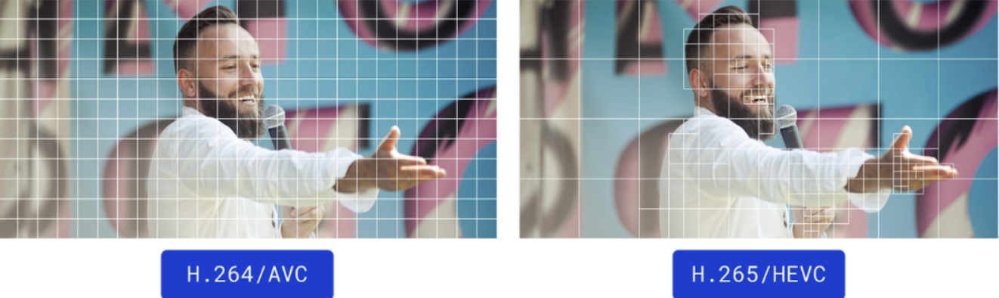
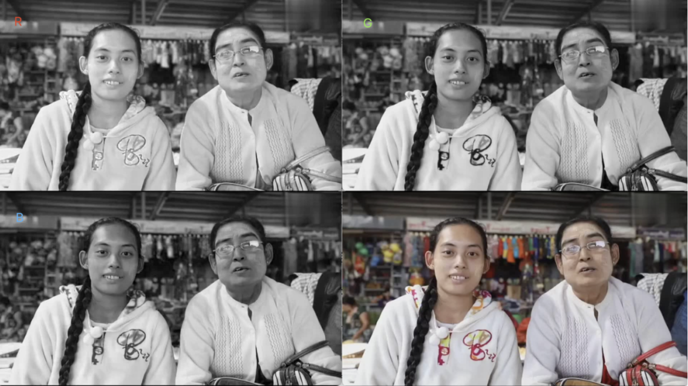
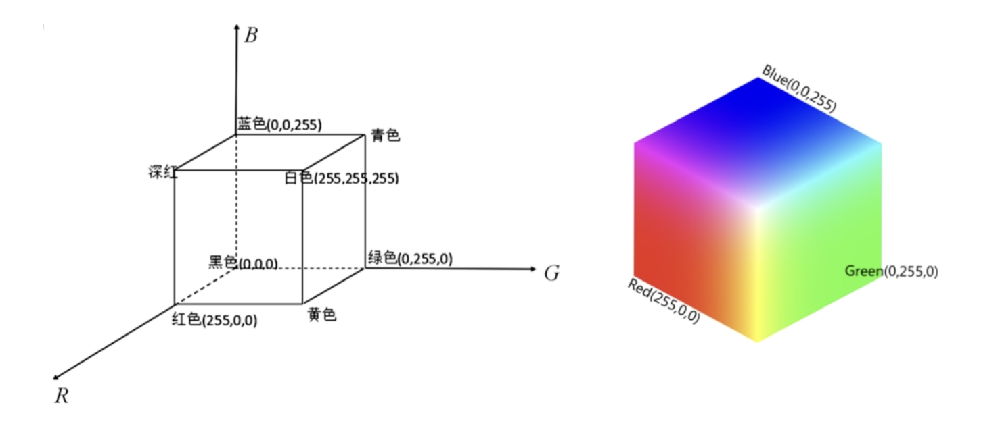
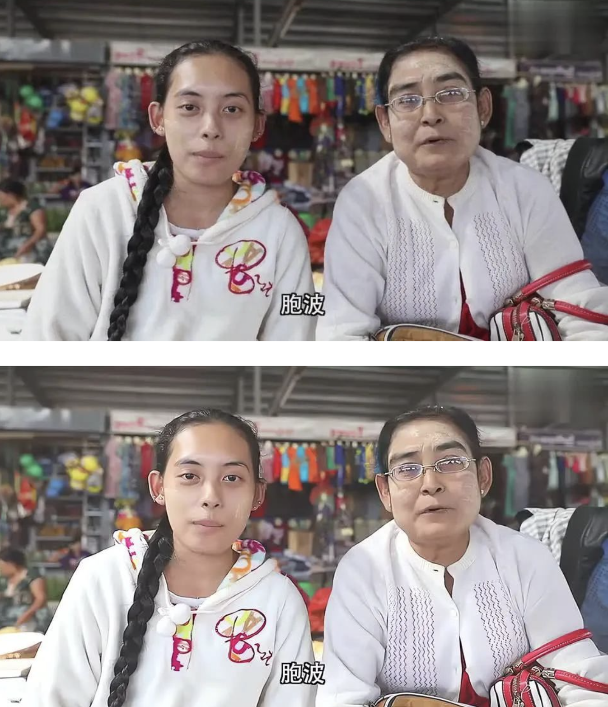
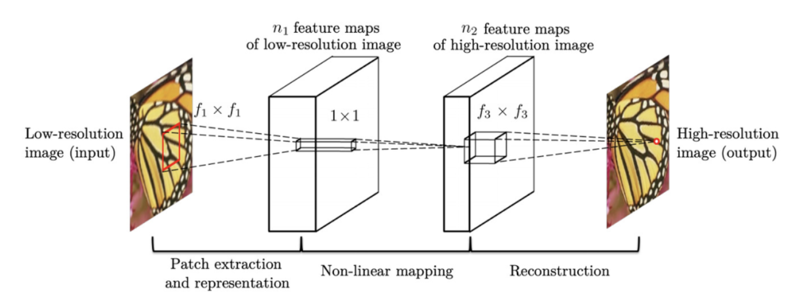
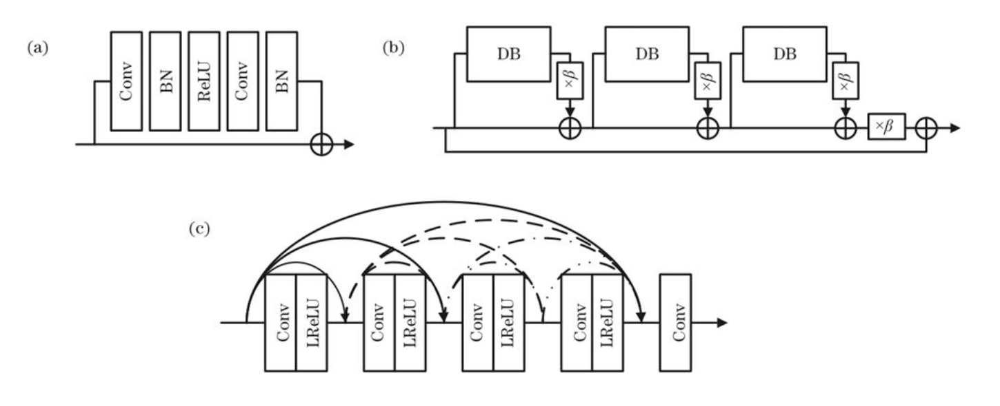
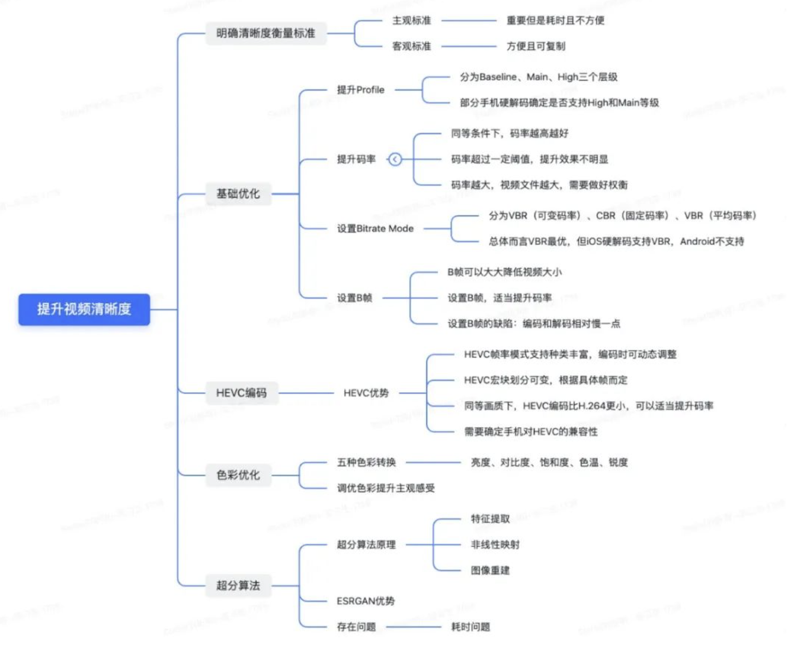

# **一、背景介绍**


随着移动互联网的深入发展，视频消费场景逐渐变成主流，早期由于手机硬件的限制问题，导致生产出来的视频画质、清晰度存在较大的问题，用户体验不太好，当时的网络也处于4G的发展阶段，网络的限制也无法持续支持高清视频的消费，但是现在5G发展地如火如荼，网络的高速发展，手机硬件性能的提升，用户越来越不满足于低画质和低清晰度的视频。提升视频的画质和清晰度势在必行，需要一套行之有效提升视频清晰度的优化方案。


# **二、评价标准**

做一件事情之前，首先需要确定一下评价这件事情的标准。所以在提出视频清晰度优化方案之前，必须先确定一下衡量视频清晰度的评价准则。评价视频清晰度有两种准则：


## **2.1 客观标准**

客观标准就是利用算法计算视频画面质量分，同等条件下，如果A视频的质量分得到高于B视频，说明A视频的保真质量做得比B视频更好。评估视频质量的算法有两大类：

- **完全参考：**两个视频逐帧对比分析，计算对比的质量，这种使用的比较多，常见的VMAF、PSNR、SSIM都是完全参考。

- **部分参考：**截图视频中的部分帧来对比分析。有些场景例如直播没法完全对比，截取部分帧来对比是比较科学的。

目前Netflix推出的VMAF算法是评价视频质量的主流算法，下面我们简单介绍一下：

- VMAF 全称 Video Multi-method Assessment Fusion ，它借助人类视觉模型以及机器学习来评估一个视频的质量。

- VMAF的评价指标主要包含：其中VIF和DLM是空间域的，表示一帧画面之内的特征；TI是时间域的，表示多帧画面之间的相关性特征。

- - 视频信息保真度（VIF：Visual Quality Fidelity）
  - 细节损失指标（DLM：Detail Loss Measure）
  - 时域运动指标/平均相关位置像素差(TI：Temporal Information)

- VMAF基于SVM的nuSvr算法，在运行的过程中，根据事先训练好的model，赋予每种视频特征以不同的权重，对每一种画面都生成一个评分，最终以均值算法进行归总，算出该视频的最终评分。

- VMAF计算出的分数范围是0 ~ 100，其中0表示最低质量，100表示最高质量，后续对比的时候只给出分数。

##  

## **2.2 主观标准**

客观标准固然重要，但是视频是给人看的，最终视频的质量好不好，还需要用户主观感受。换言之，两个视频的VMAF可能相近，但是用户观感可能会不一样，有些用户喜欢柔色，有些用户喜欢暖色。

主观标准操作起来比较简单，找几个视频，让用户观看之后主观给出评价，视频A和视频B的质量对比如何，这种输出的结果比较准确，但是工作量比较大，不好大范围推广。所以根据项目要求，在特定的时候采用客观评价标准，在某些场景采用主观评价标准。

例如下面两张图片，它们的VMAF值是相近的，但是第二张看上去明显比第一张画质好多了，而且更加明亮，这并没有改变图片的编码结构，只是对画面本身进行一些调色处理（这个我们下面会单独拎出来讲），就能明显提升主观感受。所以评价视频质量需要综合主观标准和客观标准综合来判断。而且我们建议在有条件的情况下，主观标准更加重要，因为客观标准只是模拟人眼的视觉系统，和真实的场景还是有所差距。


# **三、基础优化**

通过上面的描述我们基本了解了视频质量的评价标准，但如果要提升视频质量，这些还不够，我们还需要介绍一下视频的基本属性，以及这些属性可以在多大程度上影响视频的质量。

我们首先使用MediaInfo来查看一下视频的属性，由于重点关注画质，所以就自动忽略封装格式和音频流信息，只关注视频轨道信息：

```

Video
ID                                       : 1
Format                                   : AVC
Format/Info                              : Advanced Video Codec
Format profile                           : High@L3.1
Format settings                          : CABAC / 4 Ref Frames
Format settings, CABAC                   : Yes
Format settings, Reference frames        : 4 frames
Codec ID                                 : avc1
Codec ID/Info                            : Advanced Video Coding
Duration                                 : 2 min 41 s
Bit rate                                 : 634 kb/s
Bit rate mode                            : CBR
Width                                    : 960 pixels
Height                                   : 540 pixels
Display aspect ratio                     : 16:9
Frame rate mode                          : Constant
Frame rate                               : 25.000 FPS
Color space                              : YUV
Chroma subsampling                       : 4:2:0
Bit depth                                : 8 bits
Scan type                                : Progressive
Bits/(Pixel*Frame)                       : 0.049
Stream size                              : 12.2 MiB (94%)
Writing library                          : x264 core 148
Encoding settings                        : cabac=1 / ref=3 / deblock=1:0:0 / analyse=0x3:0x113 / me=hex / subme=7 / psy=1 / psy_rd=1.00:0.00 / mixed_ref=1 / me_range=16 / chroma_me=1 / trellis=1 / 8x8dct=1 / cqm=0 / deadzone=21,11 / fast_pskip=1 / chroma_qp_offset=-2 / threads=17 / lookahead_threads=2 / sliced_threads=0 / nr=0 / decimate=1 / interlaced=0 / bluray_compat=0 / constrained_intra=0 / bframes=3 / b_pyramid=2 / b_adapt=1 / b_bias=0 / direct=1 / weightb=1 / open_gop=0 / weightp=2 / keyint=75 / keyint_min=7 / scenecut=40 / intra_refresh=0 / rc_lookahead=40 / rc=crf / mbtree=1 / crf=26.0 / qcomp=0.60 / qpmin=0 / qpmax=69 / qpstep=4 / vbv_maxrate=800 / vbv_bufsize=1600 / crf_max=0.0 / nal_hrd=none / filler=0 / ip_ratio=1.40 / aq=1:1.00

Codec configuration box                  : av
```

其中有几个非常重要的属性需要特别关注一下：下面我们列出的各个属性都是基于其他条件不变的情况下，只改变当前属性。例如谈Profile，就要保证其他的属性是相同的，只有Profile不同，这样比较视频的画质才有意义。


## **3.1 Profile**

Profile对应上面的是Encoder Profile Level，正常情况下，Profile Level有三种类型：

- Baseline Profile
- Main Profile
- High Profile

其中Baseline Profile对应清晰度最低，Android 3.0之后的版本都支持的，Main Profile清晰度比Baseline Profile清晰度要好，但是从Android 7.0之后才支持，High Profile清晰度最高，也是从Android 7.0之后才支持。我们在设置Encoder Profile Level之前，需要判断一下当前是否支持。


## **3.2 Bitrate码率**

视频码率是视频数据传输时单位时间内传送的数据位数。单位是kbps，望文生义，码率越大，单位时间填充的数据就越多，视频质量就越高。

码率并不是越大越好，码率设置超过一定的大小，对视频画质的提升已不太明显，肉眼已经看不出区别，但是视频大小会增加很多。所以设置合适的码率就行。通常建议的码率计算方式是：

```
Bitrate = width * height * frameRate * factorfactor = 0.15
```

按照上面的公式设置的码率是比较合适的，当然如果想要更加高清的，可以适当增加factor大小。


## **3.3 Bitrate Mode**

码率虽然设置了，但是码率是描述一段时间的平均传输的数据位数，无法保证每一个时间段内传送的数据大小是固定的或者在一个固定的范围内。还有一个Bitrate Mode参数来表示码率模式。它也有三种类型：

- **VBR：**可变码率（Variable Bitrate）, 此编码方式会根据帧间数据的变化量大小来动态调整码率，如果帧间的运动变化比较大，调高码率，如果帧间的运动变化比较小，调小码率。从编码方式就可以看出来，这样的编码方式有两个缺点：（1）运动预测计算算法有一定的耗时，编码时间较长；（2）码率多变，最终生成的文件大小不可预测。可能很大也可能很小。

- **CBR：**固定码率或者常数码率（Constant Bitrate）, 这是默认的编码方式，使用此编码方式，文件从始至终的编码码率会固定不变或者基本不变。这种方式的好处是文件大小是确定的，不会出现文件大小不可预测的情况。但是缺点也很明显，有时候帧间变化比较大，有时候帧间变化比较小，如果都使用同样的码率，帧间变化比较大的时间画质会比较一般，帧间变化比较小的时间显得浪费。无法做到较好的平衡。

- **ABR：**平均码率（Average Bitrate）, 平均码率较好地兼顾了VBR和CBR的，在帧间变化比较大的时间使用较大的码率，在帧间变化比较小的时间采用较小的码率，最终保证整体采用的码率固定就可以了。较好的处理了画质和文件大小之间的矛盾。

但是很可惜的是MediaCodec并不支持ABR，我们如果想采用ABR模式的话还需要使用软编码。MediaCodec也提供了三种模式：

- **BITRATE_MODE_CQ：**这种模式是全面考虑视频质量，尽可能保证视频质量，所以编码出来的视频都很大，并不可取。
- **BITRATE_MODE_VBR：**同上面的VBR
- **BITRATE_MODE_CBR：**同上面的CBR

众所周知，硬编码速度要远远快于软编码，所以编码都是优先采用硬编码，硬编码失败再采用软编码兼容。所以硬编码MediaCodec建议采用BITRATE_MODE_CBR模式，切换到软编码采用VBR模式。


## **3.4 B帧设置**

视频由I帧、P帧、B帧 三种类型的视频帧组成的。

I帧是帧内图像帧，就是关键帧，意思是此帧不需要依赖其他的帧就可以进行编码或者解码。

P帧是前向预测图像帧，此帧需要参考在它之前的I帧或者P帧，采用运动预测的方式进行帧间编码或者解码。P帧大小相当于I帧大小的1/10 ~ 1/20。

B帧是双向预测图像帧，此帧需要参考在它之前的I帧或者P帧，也需要参考在它之后的I帧或者P帧，采用运动预测的方式进行帧间预测编码或者解码。

GOP表示两个I帧之间的图像帧序列，GOP=2s，表示两个I帧之间的间隔是2s。

Android平台只有高通部分芯片支持B帧编码，并且Android系统也没有开发设置B帧的接口，所以对使用Android MediaCodec编码的开发者而言，无法开启B帧编码（iOS是可以的，暗自垂泪）。当然软编码是可以设置B帧的。

设置B帧有什么好处？

B帧大小约是I帧大小的1/50，如果设置了B帧了，并不会降低清晰度，但是可以大大降低视频的大小，这样我们就可以相应地调大码率，最终实现了提升清晰度的目标。

当然设置了B帧之后，增加了编码和解码的复杂度，这点开发者在设置的时候必须要有充分的认识。


# **四、HEVC编码**


目前H.264编码还是使用最广泛的编码方式，主要还是H.264编码的兼容性比较好，而且免费开源。HEVC自从2013年第一版发布开源出来，还没有完全替代H.264（主要原因是收费，而且部分机型可能不支持），不过HEVC凭借其独特的优势也得到了较多地应用。

HEVC相对H.264的优势：

- HEVC标准视频的帧内预测模式支持33种方向，并且提供了更好的运动补偿处理和矢量预测方法。而H.264只支持8种。

- HEVC采用了块的四叉树划分结构，采用了8x8 ~ 64 x 64 像素的自适应块划分，而H.264每个宏块的大小都是固定的16 x 16像素，HEVC的这样设计可以保证在不同的帧间和帧内复杂程度中可以动态调整宏块的大小，经过测试发现，在相同的图像质量下，HEVC编码的视频比H.264编码的视频约减少40%，换言之，如果HEVC和H.264码率相同，那么HEVC编码的视频比H.264编码的视频要清晰地多。



上图可以看出同样的视频帧，HEVC使用的宏块比H.264要少很多，体现了HEVC的优势。

| 分辨率 | H.264/AVC | H.265/HEVC |
| ------ | --------- | ---------- |
| 480p   | 1.5 Mbps  | 0.75 Mbps  |
| 720p   | 3 Mbps    | 1.5 Mbps   |
| 1080p  | 6 Mbps    | 3 Mbps     |
| 4k     | 32 Mbps   | 15 Mbps    |

我们在使用MediaCodec HEVC硬编码时，需要判断一下当前是否支持HEVC编码，Android 5.0已经支持了HEVC，不过一些低端芯片可能还是没有支持HEVC，我们在编码之前需要判断一下是否支持。

使用HEVC编码，可以保证在不增加文件大小的情况下，大大提升视频的清晰度。


# **五、色彩调优**


上面的几种优化方式都是在编码层面调整参数或者直接改变编码方式来提升视频的画质，但有一种方式通过调整视频画面的色值——综合调整亮度、对比度、色温、饱和度、锐度等颜色参数，进而优化整体的视频画面，让视频画面看上去“更清晰”。



我们经常用到的颜色空间有RGB颜色空间、HSV颜色空间、YUV颜色空间还有CIELab颜色空间，其中RGB颜色空间使用的比较广泛。如上图，图像分为三个通道量：R分量、G分量、B分量，每个分量的值是0 ~ 255，三个分量共同组成一个颜色的RGB值。RGB分量的值分布构成了颜色色值的直方图，我们通过调节RGB值来调节图像的颜色。



有几种对颜色色值的调节方式，对我们理解颜色调节有很大的帮助：

- **亮度：**亮度表示人眼对发光体或被照射物体表面的发光或反射光强度实际感受的物理量，简而言之，RGB分量越大，图像就越亮；反之，图像越暗。
- **对比度：**图像对比度是指图像中从黑色到白色渐变的层次反差或比值。反差越大，比值越大，从视觉上感知，图像就越清晰醒目，对比度越大；反差越小，比值越小，从视觉上感知，图像越不清晰醒目，蒙尘感越强，对比度越小。

- **色温：**色温和温度还真有一定的关系，表示绝对黑体从绝对零度开始加热之后呈现的颜色。从我们生活中来看，暖色调看上去比较温馨，冷色调感受上有点清凉。

- **饱和度：**饱和度是指色彩的鲜艳程度或者纯度。饱和度越高，图像色彩越鲜艳，色彩纯度越高；反之则越低，直至灰度图。
- **锐度：**锐度主要用来表示图像边缘的对比度，由于人类感官，高锐度的图像看起来更加清晰，图像上的细节对比非常明显。

我们可以将上面五种调节方式综合起来调节图片色彩。

- 亮度增加10个点（-100 ~ 100）

- 色温增加5个点（-100 ~ 100）

- 饱和度增加20个点（0 ~ 100）

- 锐度增加15个点（0 ~ 100）

第一张是原图，第二张是经过颜色调节之后输出的图片。

 

# **六、超分算法**


上面提到的优化方式无论从编码层面，还是从颜色调节层面，都算是基本的优化方式，近年来，随着机器学习的火热，超分算法越来越广泛地应用到图像和视频处理上来。超分辨率就是指通过机器学习地方式重建图像，达成提升图像分辨率的效果。

目前比较成熟的超分技术是Real-ESRGAN，基于BasicSR，采用ESRGAN算法，利用机器学习的优势对图片和视频进行去模糊、Resize、降噪、锐化等处理，重建图片，实现对图片的超分辨率处理。

E-SR-GAN算法的三个步骤：

- 特征提取：计算噪点
- 非线性映射：放大，模糊化噪点
- 图像重建：差分，平滑过度，去噪

 

相对之前的SRCNN等超分算法，改进了如下几点：

- 改进感知损失，提高输出图像的边缘清晰度和纹理真实性。
- 利用对抗网络的优势不断反馈改进GAN判别器，预测高分辨率图像和原始图像之前的相对真实性而不是绝对真实性。可以恢复原始图像的真实的纹理细节。
- 优化了模型的稳定性，每次生成的图片都和原图片残差对比，进行矫正训练，最终得到的结果非常稳定。



# **七、总结**


本文结合当下视频的痛点（清晰度问题），提出衡量视频清晰度的标准——主观标准和客观标准，指明了视频清晰度的优化目标和方向，根据视频的基本特征（码率、GOP、编码模式等）提出基础优化的方法，在基础优化的基础上提出高级编码方式（相对H.264编码方式），再结合目前主流的视频色彩滤镜提出视频色彩调优方案，让视频看上去更清晰。最终的大杀器——超分算法采用E-SR-GAN方式进行放大、降噪、重建帧来提升视频清晰度。希望上面这些方法可以给大家带来一些帮助，对提升视频清晰度有更进一步的思考。

 

# **参考文章：**

- VMAF开源项目

   https://github.com/Netflix/vmaf

- 揭秘 VMAF 视频质量评测标准

  https://xie.infoq.cn/article/26aaf2ab83f56192a65ba22ea

- Netflix VMAF 视频质量评估工具概述

  https://zhuanlan.zhihu.com/p/94223056

- B帧对视频清晰度/码率的影响

  https://blog.csdn.net/matrix_laboratory/article/details/82726897

- H264 vs H265

  https://www.cnblogs.com/wujianming-110117/p/12640533.html

- 超分开源项目

  https://github.com/xinntao/Real-ESRGAN