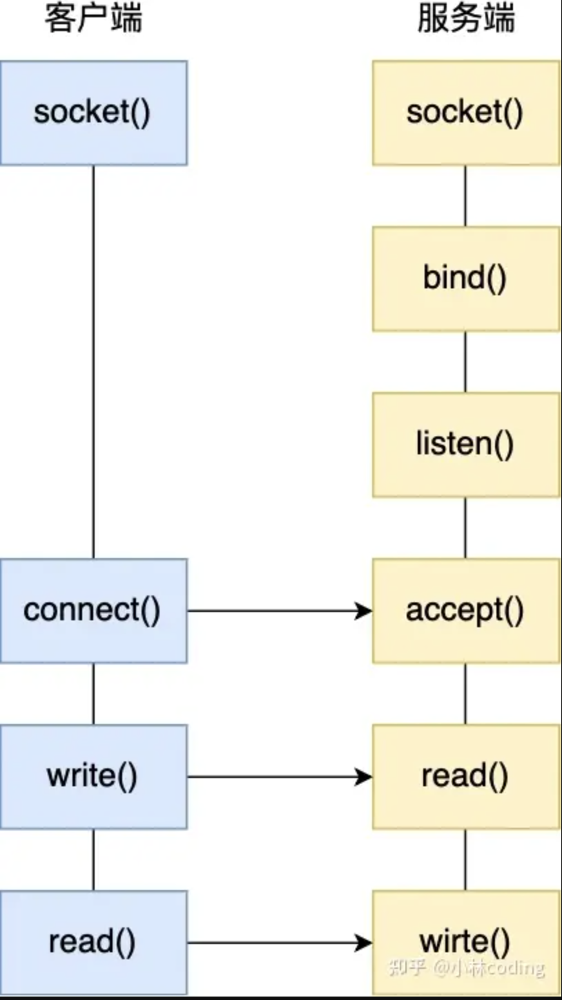
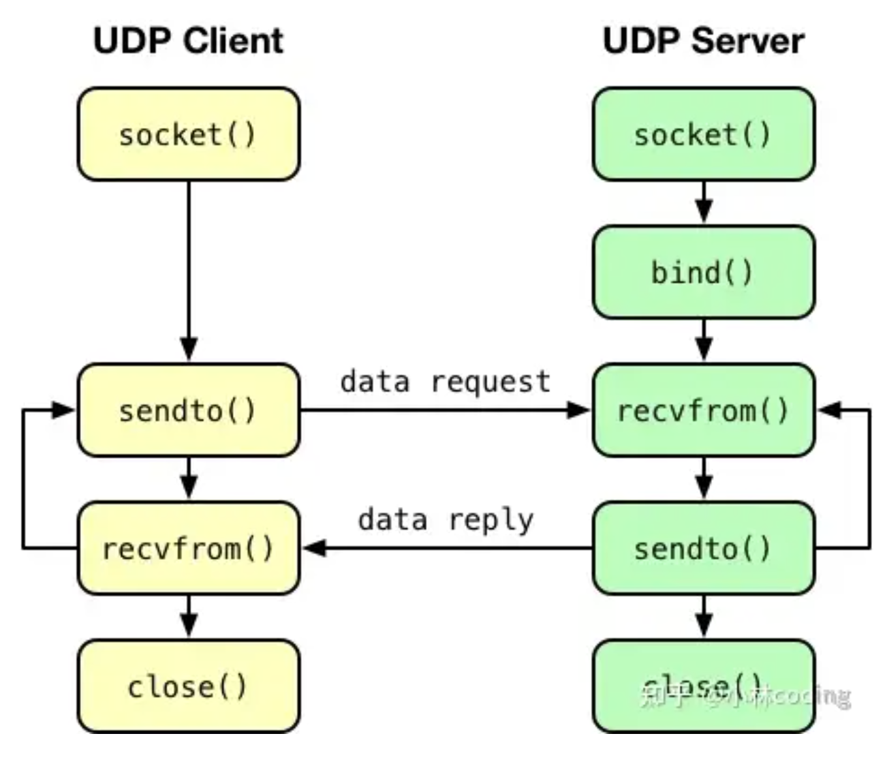
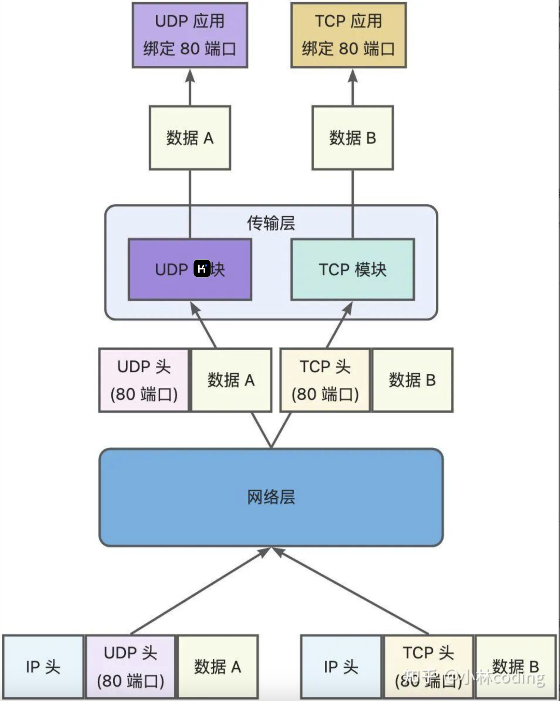
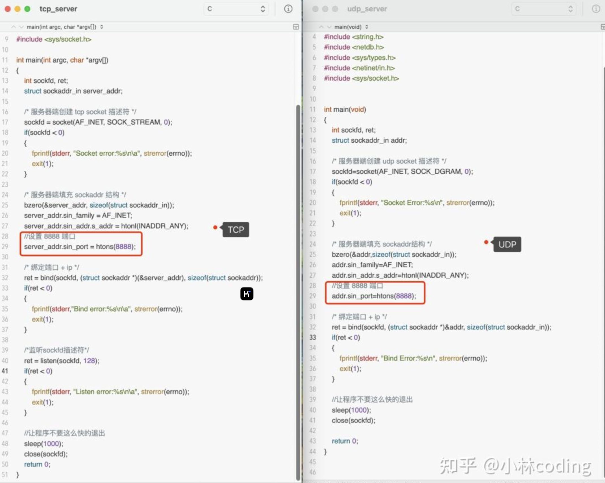
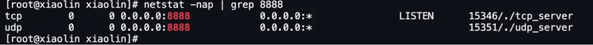

参考https://www.zhihu.com/question/645463314/answer/3571960871

关于端口的知识点，还是挺多可以讲的，比如还可以牵扯到这几个问题：

- 多个 [TCP 服务进程](https://zhida.zhihu.com/search?content_id=679518020&content_type=Answer&match_order=1&q=TCP+服务进程&zhida_source=entity)可以同时绑定同一个端口吗？
- 重启 TCP 服务进程时，为什么会出现“Address in use”的报错信息？又该怎么避免？
- 客户端的端口可以重复使用吗？
- 客户端 TCP 连接 TIME_WAIT 状态过多，会导致端口资源耗尽而无法建立新的连接吗？

所以，这次就跟大家盘一盘这些问题。

## TCP 和 UDP 可以同时绑定相同的端口吗？

其实我感觉这个问题「TCP 和 UDP 可以同时监听相同的端口吗？」表述有问题，这个问题应该表述成「**TCP 和 UDP 可以同时绑定相同的端口吗？**」

因为「监听」这个动作是在 TCP 服务端网络编程中才具有的，而 [UDP 服务端](https://zhida.zhihu.com/search?content_id=679518020&content_type=Answer&match_order=1&q=UDP+服务端&zhida_source=entity)网络编程中是没有「监听」这个动作的。

TCP 和 UDP 服务端网络相似的一个地方，就是会调用 bind 绑定端口。

给大家贴一下 TCP 和 [UDP 网络编程](https://zhida.zhihu.com/search?content_id=679518020&content_type=Answer&match_order=1&q=UDP+网络编程&zhida_source=entity)的区别就知道了。

TCP 网络编程如下，服务端执行 listen() 系统调用就是监听端口的动作。

UDP 网络编程如下，服务端是没有监听这个动作的，只有执行 bind() 系统调用来绑定端口的动作。

> TCP 和 UDP 可以同时绑定相同的端口吗？

答案：**可以的**。

在数据链路层中，通过 MAC 地址来寻找局域网中的主机。在网际层中，通过 IP 地址来寻找网络中互连的主机或路由器。在传输层中，需要通过端口进行寻址，来识别同一计算机中同时通信的不同应用程序。

所以，传输层的「端口号」的作用，是为了区分同一个主机上不同应用程序的数据包。

传输层有两个传输协议分别是 TCP 和 UDP，在内核中是两个完全独立的软件模块。

当主机收到数据包后，可以在 IP 包头的「协议号」字段知道该数据包是 TCP/UDP，所以可以根据这个信息确定送给哪个模块（TCP/UDP）处理，送给 TCP/UDP 模块的报文根据「端口号」确定送给哪个应用程序处理。

因此， TCP/UDP 各自的端口号也相互独立，如 TCP 有一个 80 号端口，UDP 也可以有一个 80 号端口，二者并不冲突。

> 验证结果

简单写 TCP 和 UDP 服务端的程序，它们都绑定同一个端口号 8888。

运行这两个程序后，通过 [netstat](https://zhida.zhihu.com/search?content_id=679518020&content_type=Answer&match_order=1&q=netstat&zhida_source=entity) 命令可以看到，TCP 和 UDP 是可以同时绑定同一个端口号的。

## 多个 TCP 服务进程可以绑定同一个端口吗？

还是以前面的 TCP 服务端程序作为例子，启动两个同时绑定同一个端口的 TCP 服务进程。

运行第一个 TCP 服务进程之后，netstat 命令可以查看，8888 端口已经被一个 TCP 服务进程绑定并监听了，如下图：

