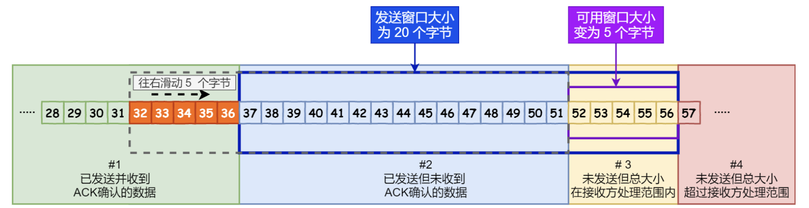

## **三次握手**

 1. 第一次握手：建立连接时，客户端发送syn包（syn=x）到服务器，并进入SYN_SENT状态，等待服

务器确认；SYN：同步序列编号（Synchronize Sequence Numbers）。

 2. 第二次握手：服务器收到syn包，必须确认客户的SYN（ack=x+1），同时自己也发送一个SYN包 

（syn=y），即SYN+ACK包，此时服务器进入SYN_RECV状态；

 3. 第三次握手：客户端收到服务器的SYN+ACK包，向服务器发送确认包ACK(ack=y+1），此包发送完

毕，客户端和服务器进入ESTABLISHED（TCP连接成功）状态，完成三次握手。

**为什么要三次握手？**

**全双工通信**

三次握手是确定通信双方通讯线路是全双工的最小次数，全双工通信是指：通信的双方可以同时发送和

接收信息 。

正如双方电话通话：

A：喂，能听到吗？

B：可以

此时如果A没有反馈，B无法确定A是否能够接收数据

**保证可靠性**

另外TCP是可靠传输协议，保证通信的可靠性的手段中包含序列号与确认应答机制。

序列号：TCP传输时将每个字节的数据都进行了编号，保证数据的有序性与可靠性（当接收到的数据总少了某个序号的数据时，能马上知道 ）；

确认应答：TCP传输的过程中，每次接收方收到数据后，都会对传输方进行确认应答。也就是发送ACK报文。这个ACK报文当中带有对应的确认序列号，告诉发送方，接收到了哪些数据，下一次的数据从哪里发。

而三次握手的同时也能确定通信双方的初始序列号。

1. C --> S SYN my sequence number is X

2. S <-- C ACK your sequence number is X my sequence number is Y

3. C --> S ACK your sequence number is Y

如果C 未确认收到 B 的。也就是说，只有 C 发送给 S 的包都是可靠的， 

而 S 发送给 C 的则不是，所以

这不是可靠的连接。

**避免资源浪费**

除此之外，第一次握手：客户端发送连接请求消息到服务端，服务端收到信息后需要进行第二次握手：

应答告知客户端已经接收连接请求。而服务端发送出去的应答消息，需要等客户端第三次握手响应后，

才能确定此次连接为有效连接。

若客户端发出去的第一个连接请求由于某些原因在网络节点中滞留了导致延迟，直到客户端放弃连接后

的某个时间点才到达服务端，这是一个早已失效的报文，但是此时服务端仍然认为这是客户端的建立连

接请求第一次握手，于是服务端第二次握手回应了客户端。如果没有第三次握手，那么到这里，连接就

建立了，但是此时客户端并没有任何数据要发送，会让服务端空等，造成资源浪费。

## **四次挥手**

在完成数据交互之后，如果选择关闭连接，以回收资源，则完成四次挥手来进行“和平分手”。过程如下

1. 第一次挥手：主动关闭方发送第一个包，其中FIN标志位为1，发送顺序号seq为X。 

2. 第二次挥手：被动关闭方收到FIN包后发送第二个包，其中发送顺序号seq为Z，接收顺序号ack为X+1。 

3. 第三次挥手：被动关闭方再发送第三个包，其中FIN标志位为1，发送顺序号seq为Y，接收顺序号ack为X。 

4. 第四次挥手：主动关闭方发送第四个包，其中发送顺序号为X，接收顺序号为Y。至此，完成四次挥手。

**为什么断开连接需要四次挥手？**

三次握手是因为建立连接时，ACK和SYN可以放在一个报文里来发送。而关闭连接时，被动关闭方可能

还需要发送一些数据后，再发送FIN报文表示同意现在可以关闭连接了，所以它这里的ACK报文和FIN报

文多数情况下都是分开发送的。因此断开连接需要4次。

## **UDP**

UDP协议全称是用户数据报协议（**User Data Protocol**），在网络中它与TCP协议一样用于处理数据包，是一种无连接的协议。在OSI模型中，在第四层—传输层，处于IP协议的上一层。UDP有不提供数据包分组、组装和不能对数据包进行排序的缺点，也就是说，当报文发送之后，是无法得知其是否安全完整到达的。

它有以下几个特点：

* 面向无连接

​	首先 UDP 是不需要和 TCP一样在发送数据前进行三次握手建立连接的，想发数据就可以开始发送了。并且也只是数据报文的搬运工，不会对数据报文进行任何拆分和拼接操作。

​	具体来说就是：

在发送端，应用层将数据传递给传输层的 UDP 协议，UDP 只会给数据增加一个 UDP 头标识下是 UDP 协议，然后就传递给网络层了。

在接收端，网络层将数据传递给传输层，UDP 只去除 IP 报文头就传递给应用层，不会任何拼接操作。

* 有单播，多播，广播的功能

UDP 不止支持一对一的传输方式，同样支持一对多，多对多，多对一的方式，也就是说 UDP 提供了单播，多播，广播的功能。

* UDP是面向报文的

发送方的UDP对应用程序交下来的报文，在添加首部后就向下交付IP层。UDP对应用层交下来的报文，既不合并，也不拆分，而是保留这些报文的边界。因此，应用程序必须选择合适大小的报文

* 不可靠性

首先不可靠性体现在无连接上，UDP只会把想发的数据报文一股脑的丢给对方，并不在意数据有无安全完整到达。 通信都不需要建立连接，想发就发，这样的情况肯定不可靠。

并且收到什么数据就传递什么数据，并且也不会备份数据，发送数据也不会关心对方是否已经正确接收到数据了。

再者网络环境时好时坏，但是 UDP 因为没有拥塞控制，一直会以恒定的速度发送数据。即使网络条件不好，也不会对发送速率进行调整。这样实现的弊端就是在网络条件不好的情况下可能会导致丢包，但是优点也很明显，在某些实时性要求高的场景（比如电话会议）就需要使用 UDP 而不是TCP。

* 头部开销小，传输数据报文时是很高效的。

UDP 头部包含了以下几个数据：

1. 两个十六位的端口号，分别为源端口（可选字段）和目标端口

2. 整个数据报文的长度

3. 整个数据报文的检验和（IPv4 可选 字段），该字段用于发现头部信息和数据中的错误

因此 UDP 的头部开销小，只有八字节，相比 TCP 的至少二十字节要少得多，在传输数据报文时是很高效的。

## **TCP**

TCP协议全称是传输控制协议（**Transmission Control Protocol** ），是一种面向连接的、可靠的、基于字节流的传输层通信协议，由 IETF 的RFC 793定义。TCP 是面向连接的、可靠的流（不间断的数据结构）协议。

TCP连接过程见：描述TCP三次握手与四次挥手的过程与意义

它有以下几个特点：

* 面向连接，是指发送数据之前必须在两端建立连接。建立连接的方法是“三次握手”，这样能建立可靠的连接。建立连接，是为数据的可靠传输打下了基础。

* 仅支持单播传输

  每条TCP传输连接只能有两个端点，只能进行点对点的数据传输，不支持多播和广播传输方式。

* 面向字节流

  TCP不像UDP一样那样一个个报文独立地传输，而是在不保留报文边界的情况下以字节流方式进行传输。

* 可靠传输

​		对于可靠传输，判断丢包，误码靠的是TCP的段编号以及确认号。TCP为了保证报文传输的可靠，就给每个包一个序号，同时序号也保证了传送到接收端实体的包的按序接收。然后接收端实体对已成功收到的字节发回一个相应的确认(ACK)；如果发送端实体在合理的往返时延(RTT)内未收到确认，那么对应的数据（假设丢失了）将会被重传。

* 提供拥塞控制

​		当网络出现拥塞的时候，TCP能够减小向网络注入数据的速率和数量，缓解拥塞

* TCP提供全双工通信

  TCP允许通信双方的应用程序在任何时候都能发送数据，因为TCP连接的两端都设有缓存，用来临时存放双向通信的数据。当然，TCP可以立即发送一个数据段，也可以缓存一段时间以便一次发送更多的数据段（最大的数据段大小取决于MSS）

## TCP和UDP比较

| 特性                 | TCP（传输控制协议）                                    | UDP（用户数据报协议）                      |
| -------------------- | ------------------------------------------------------ | ------------------------------------------ |
| **连接方式**         | 面向连接（建立连接前需进行三次握手）                   | 无连接（无需建立连接）                     |
| **可靠性**           | 提供可靠的传输，确保数据包的顺序和完整性               | 不提供可靠性，数据包可能丢失、重复或乱序   |
| **传输顺序**         | 保证数据包按发送顺序到达                               | 不保证数据包顺序                           |
| **流量控制**         | 提供流量控制，能够根据网络状况调整发送速率             | 不提供流量控制                             |
| **拥塞控制**         | 有拥塞控制机制，根据网络情况调节发送速率               | 无拥塞控制机制                             |
| **开销**             | 有较高的开销，由于需维护连接状态和序列号，ACK确认等    | 较低的开销，头部信息简单                   |
| **数据包大小**       | 最大传输单元（MTU）限制（通常为1500字节）              | 最大传输单元（MTU）限制（通常为1500字节）  |
| **适用场景**         | 适合需要高可靠性和顺序性的应用，如文件传输、网页访问等 | 适合实时应用，如视频会议、在线游戏、直播等 |
| **头部开销（字节）** | 20字节（无选项时）                                     | 8字节                                      |
| **流式传输**         | 支持流式传输（面向字节流）                             | 不支持流式处理（面向报文）                 |

## **流量控制**

双方在通信的时候，发送方的速率与接收方的速率是不一定相等，如果发送方的发送速率太快，会导致接收方处理不过来，这时候接收方只能把处理不过来的数据存在缓存区里。

如果缓存区满了发送方还在疯狂着发送数据，接收方只能把收到的数据包丢掉，而流量控制就是控制发送者的发送速度从而使接收者来得及接收，防止丢失数据包的。

假设没有流量控制，发送端根据自己的实际情况发送数据，如果发送的速度太快，导致接收端的接收缓冲区很快填满了，此时发送端如果继续发送数据，接收端处理不过来，这时接收端就会把本来应该接收的数据丢弃，这会触发发送端的重发机制，从而导致网络流量的无端浪费。

**滑动窗口**

参考https://www.cnblogs.com/xiaolincoding/p/12732052.html

在TCP头中有一个Window字段，这个字段代表了接收端告诉发送端自己缓冲区还有多少剩余空间可以接收数据。TCP 利用**滑动窗口**实现流量控制的机制， 而滑动窗口大小就是通过TCP头部的Window字段来通知发送方。

接收端会在确认应答发送ACK报文时，将自己的即时窗口大小填入，并跟随ACK报文一起发送过去。而发送方根据ACK报文里的窗口大小的值进而改变自己的发送速度。

- \#1 是已发送并收到 ACK确认的数据：1~31 字节
- \#2 是已发送但未收到 ACK确认的数据：32~45 字节
- \#3 是未发送但总大小在接收方处理范围内（接收方还有空间）：46~51字节
- \#4 是未发送但总大小超过接收方处理范围（接收方没有空间）：52字节以后

在下图，当发送方把数据「全部」都一下发送出去后，可用窗口的大小就为 0 了，表明可用窗口耗尽，在没收到 ACK 确认之前是无法继续发送数据了。

可用窗口耗尽

在下图，当收到之前发送的数据 `32~36` 字节的 ACK 确认应答后，如果发送窗口的大小没有变化，则**滑动窗口往右边移动 5 个字节，因为有 5 个字节的数据被应答确认**，接下来 `52~56` 字节又变成了可用窗口，那么后续也就可以发送 `52~56` 这 5 个字节的数据了。

32 ~ 36 字节已确认

> 程序是如何表示发送方的四个部分的呢？

TCP 滑动窗口方案使用三个指针来跟踪在四个传输类别中的每一个类别中的字节。其中两个指针是绝对指针（指特定的序列号），一个是相对指针（需要做偏移）。

SND.WND、SND.UN、SND.NXT

- `SND.WND`：表示发送窗口的大小（大小是由接收方指定的）；
- `SND.UNA`：是一个绝对指针，它指向的是已发送但未收到确认的第一个字节的序列号，也就是 #2 的第一个字节。
- `SND.NXT`：也是一个绝对指针，它指向未发送但可发送范围的第一个字节的序列号，也就是 #3 的第一个字节。
- 指向 #4 的第一个字节是个相对指针，它需要 `SND.UNA` 指针加上 `SND.WND` 大小的偏移量，就可以指向 #4 的第一个字节了。

那么可用窗口大小的计算就可以是：

**可用窗口大 = SND.WND -（SND.NXT - SND.UNA）**

> 接收方的滑动窗口

接下来我们看看接收方的窗口，接收窗口相对简单一些，根据处理的情况划分成三个部分：

- \#1 + #2 是已成功接收并确认的数据（等待应用进程读取）；
- \#3 是未收到数据但可以接收的数据；
- \#4 未收到数据并不可以接收的数据；

其中三个接收部分，使用两个指针进行划分:

- `RCV.WND`：表示接收窗口的大小，它会通告给发送方。
- `RCV.NXT`：是一个指针，它指向期望从发送方发送来的下一个数据字节的序列号，也就是 #3 的第一个字节。
- 指向 #4 的第一个字节是个相对指针，它需要 `RCV.NXT` 指针加上 `RCV.WND` 大小的偏移量，就可以指向 #4 的第一个字节了。

> 接收窗口和发送窗口的大小是相等的吗？

并不是完全相等，接收窗口的大小是**约等于**发送窗口的大小的。

因为滑动窗口并不是一成不变的。比如，当接收方的应用进程读取数据的速度非常快的话，这样的话接收窗口可以很快的就空缺出来。那么新的接收窗口大小，是通过 TCP 报文中的 Windows 字段来告诉发送方。那么这个传输过程是存在时延的，所以接收窗口和发送窗口是约等于的关系。

**零窗口**

当发送方停止发送数据后，该怎样才能知道自己可以继续发送数据？

我们可以采用这样的策略：当接收方处理好数据，接受窗口 win > 0 时，接收方发个通知报文去通知发送方，告诉他可以继续发送数据了。当发送方收到窗口大于0的报文时，就继续发送数据。

不过这时候可能会遇到一个问题，如果发送端在重发超时的时间内都没有收到窗口更新的通知或者窗口更新的包丢失了，这时候就会引发一个问题：接收方发了通知报文后，继续等待发送方发送数据，而发送方则在等待接收方的通知报文，此时双方会陷入一种僵局。

为了解决这种问题，TCP为每一个连接设有一个**持续计时器** ：当发送方收到接受窗口 win = 0 时，这时发送方停止发送报文，并且同时开启一个定时器，每隔一段时间就发个测试报文去询问接收方，打听是否可以继续发送数据了，如果可以，接收方就告诉他此时接受窗口的大小；如果接受窗口大小还是为0，则发送方再次刷新启动定时器。

## **拥塞控制**

流量控制是接收方怕发送方发的太快，使得自己来不及处理。而拥塞控制的对象是网络，怕发送方发的太快，造成网络拥塞，使得网络来不及处理，是一个全局性的过程。

拥塞控制就是防止过多的数据注入网络中，这样可以使网络中的路由器或链路不致过载。 拥塞是一个动态问题，我们没有办法用一个静态方案去解决，从这个意义上来说，拥塞是不可避免的。就好像上下班高峰期经常堵车，为了不让交通瘫痪，交警会去现场指挥，采用动态的方式对车辆进行限制，根据实际情况，慢慢放行。

比如主机A给主机B传输数据。

两台主机在传输数据包的时候，如果发送方迟迟没有收到接收方反馈的ACK，那么发送方就会认为它发送的数据包丢失了，进而会重新传输这个丢失的数据包。

然而实际情况有可能此时有太多主机正在使用信道资源，导致网络拥塞了，而A发送的数据包被堵在了半路，迟迟没有到达B。这个时候A误认为是发生了丢包情况，会重新传输这个数据包。

结果就是不仅浪费了信道资源，还会使网络更加拥塞。因此，我们需要进行拥塞控制。TCP的拥塞控制通过：慢启动、拥塞避免、快重传与快恢复完成。

**慢启动**

慢启动算法为TCP发送方新增的一个拥塞窗口 （cwnd ）。对应到流量控制，发送方会根据拥塞窗口和滑动窗口的最小值作为发送上限。

当新建连接时，发送方不了解网络的情况，cwnd（拥塞窗口）初始化比较小的值，RFC建议2-4个MSS，具体视MSS的大小而定。

MSS：Maximum Segment Size，TCP一次传输发送的最大数据段长度。

假设初cwnd为1个MSS。发送端开始按照拥塞窗口大小发送数据，如果被ACK，下次就发送2个。如果还是收到了ACK，则发送4个，接着8个......。这样cwnd的值就随着网络往返时间(Round Trip Time,RTT)呈指数级增长，事实上，慢启动的速度一点也不慢，只是它的起点比较低一点而已。

**拥塞避免**

从慢启动可以看到，cwnd可以很快的增长上来，从而最大程度利用网络带宽资源，但是cwnd不能一直这样无限增长下去，一定需要某个限制。TCP使用了一个叫慢启动门限(ssthresh)的变量，当cwnd超过该值后，慢启动过程结束，进入拥塞避免阶段。拥塞避免的主要思想是加法增大，也就是cwnd的值不再指数级往上升，开始加法增加。此时当窗口中所有的报文段都被确认时，cwnd的大小加1(此处加1指的是加1个MSS，下文同样如此)，cwnd的值就随着RTT开始线性增加，这样就可以避免增长过快导致网络拥塞，慢慢的增加调整到网络的最佳值。

**快重传与快恢复**

进入拥塞避免之后，最终还是会碰到拥塞点，发送方此时一直得不到接收端的确认。因此TCP在发送一个数据以后就开启一个计时器， 

在一定时间内如果没有得到发送数据报的ACK报文，那么就重新发送数据，直到发送成功为止，这就是超时重传。

而快重传算法首先要求接收方每收到一个失序的报文段就立即发出重复确认。比如A给B发送M1, M2,M3, M4, M5，如果B收到了M1, M2, M4，M5；M3并没有接收到，那么在B接到M4时就会发送一次M2的ACK，接到M5，又会发送一次M2的ACK，这样重复确认M2意在告诉A，M3还没收到，可能是丢失了。

当A连续收到了三个确认M2的ACK，若M3超时事件还没发生，此时A也会假定M3丢失了，这个时候A就不必等待M3设置的计时器到期了，而是进行**快速重传**。 

而**快速恢复**是在上述的**快速重传**后添加的，快速重传和快速恢复算法会同时使用，快恢复会：

1.当收到3个重复M2的ACK时，为了预防网络发生拥塞，把ssthresh设置为cwnd的一半，把cwnd设置为ssthresh的值加3，重传M3

快速恢复的思想是“数据包守恒”原则，即同一个时刻在网络中的数据包数量是恒定的，只有当“老”
数据包离开了网络后，才能向网络中发送一个“新”的数据包，如果发送方收到一个重复的ACK，那
么根据TCP的ACK机制就表明有一个数据包离开了网络，收到3个重复的ACK，表明有3个“老”的数
据包离开了网络，因此此处加3。

2.再收到重复的ACK时，cwnd增加1。

3.当收到M4（新数据包）的ACK时，把cwnd设置为第一步中的ssthresh的值通过新数据包的ACK(M4)确认了新的数据，说明从重复ACK时的数据(M3)已收到，该恢复过程结束，可以回到恢复之前的拥塞避免状态。

