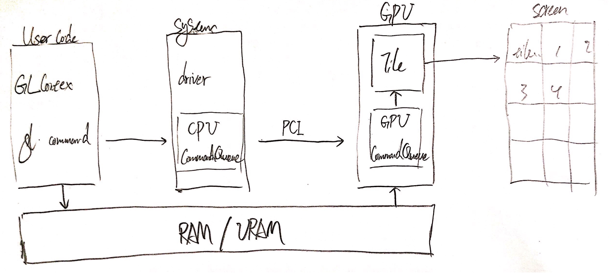

[OpenGL](https://so.csdn.net/so/search?q=OpenGL&spm=1001.2101.3001.7020)由于状态机这个桎梏，天然是适合单线程渲染的。由于状态机中的状态、资源、内存无法解决多线程中的竞争问题，在OpenGL中实现多线程一直是荆棘中跳舞，就算再小心翼翼也不能避免刺痛。

以下内容为了方便，`多线程渲染`和`OpenGL多线程`是等价的，只不过这里做的不是[多线程](https://so.csdn.net/so/search?q=多线程&spm=1001.2101.3001.7020)上屏渲染。


## 是否需要多线程

由上所述，要做OpenGL多线程是痛苦和收益并存的，引入多线程能有多少收益是你要第一个要问的问题。

按照我的经验，多线程渲染越往上层开始异步越好，这样不仅入口简单，查Bug也会更简单。这主要是因为OpenGL操蛋的Client/Server模式，在最底层查渲染异常的问题是极其痛苦的，而在上层的封装信息多，提供的信息也多。

如果要对具体的OpenGL命令做异步，一般是这两种情况：

1. 有较多且集中的OpenGL的耗时操作。
2. 有较多的离屏的FBO，且在逻辑上彼此独立。

在渲染层做优化是精细活，我建议是渲染层稳定后才开始专攻优化，它属于90分到99分的临门一脚。如果你的项目现在渲染模块还不稳定或上层代码还有许多优化空间，也许你要重新想下优化方向。


## OpenGL 多线程同步

OpenGL要想多线程渲染，要不就要完美同步各线程的的执行，也就是GPU上的命令执行顺序要正确。要不就要使用double-buffering的方案来避免竞争，本文主要介绍如何同步。


### 基本概念

`Client/Server`: 在OpenGL的设计模式是Client/Server，这里Client指CPU，Server指GPU。我们90%的时间是在CPU上写逻辑，而CPU操作的OpenGL对象都是Server返回的句柄，换句话说你在CPU只能拿到一个号码，没办法知道在床上的是凤姐还是志玲。
`CommandQueue`: 在CPU和GPU分别有各自的CommandQueue，当一个OpenGL命令在CPU执行时，会先添加到CPU的CommandQueue，在CPU切换到burst mode后，CPU CommandQueue中的命令被依次发送到GPU CommandQueue，GPU会在合适的时机执行CommandQueue里的命令。
`GLContext`: OpenGL的[状态机](https://so.csdn.net/so/search?q=状态机&spm=1001.2101.3001.7020)，保存有渲染管线用到的状态和资源，OpenGL命令的宿主环境。`GLContext`是和线程强相关的，这是因为在绝大部分驱动的设计中，都是一个线程一个CommandQueue，而这个线程中的当前`GLContext`中发生的命令才会被添加到CommandQueue。
`GL fenceSync object`: OpenGL的一个信号量，当GPU执行到它是会自动解锁, sync对象不属于状态机，所以可以跨context获取。
`Client Wait`: 卡主CPU等待信号量解锁。
`Server Wait` : 卡主GPU等待信号量解锁，CPU继续执行。


## OpenGL命令的执行方式

绝大多数OpenGL命令在CPU上是异步执行的，在GPU上是同步执行的。这一切都得益于CommandQueue的存在，让CPU可以更高效地完成命令发送，毕竟总线的资源是珍贵的，尤其在移动端的总线带宽是非常小的（内存64/128bit，显存128/256bit）。

但这样的代价是在渲染有问题时，在CPU无法定位到真正的现场，尤其是iOS GPU架构基于TBR/TBDR的情况下，你无法知道GPU上到底是什么时候发生问题的。

### OpenGL命令的状态

一条GPU命令在CPU执行后，会有三个状态：

1. 未发送
   GPU命令在CPU执行，会发送到当前CPU的CommanQueue，底层驱动会在合适的时机发送CPU CommandQueue中的命令到GPU CommandQueue。
2. 发送未完成
   命令在GPU的ComamndQueue中，但还没有被GPU执行。
3. 完成
   命令在GPU上执行了，并且不再当前渲染管线中。

### 硬件层面的指令执行



指令执行


## OpenGL的三种同步方案

OpenGL中有三种可以实现同步的方案，`glFinish`, `glFlush`, `glFenceSync`。

1. `glFinish`足够粗暴，它让当前线程的所有命令都在GPU执行完成后才返回。
2. `glFlush`轻量些，它会让当前线程的所有命令都发送后才返回，此时命令在GPU的CommandQueue上，一般切换上下文要flush一下确保执行的命令顺序万无一失，但是在TBR/TBDR架构的上屏上下文中flush，会强行同步一次tile和FBO，所以也要尽量少用。
3. `glFenceSync`最灵活且轻量，他会生成一个信号量，当GPU执行到它是，信号量会解锁，这样就可以监控GPU的运行状态了。可以选择`glClientWaitSync/glWaitSync`来实现同步。

### 如何选择

如果要同步多线程中的GPU资源，比如纹理时，只用glFlush是不够的，因为不能保证渲染命令在GPU被执行，只用`glFlush`会有黑屏或闪屏、Crash的问题，只能用`glFinish/glFenceSync`。

`glFinish`只适合不关心当前CPU和GPU执行状态的情况，比如一次提交了很多命令需要清空CommandQueue时。这在调试某一条指令时非常有用，可以在这个指令前后各加一个`glFinish`，来确保GPU当前只在执行这条指令，避免其他指令的干扰。

`glFenceSync`可以监控GPU的执行状态，可以用它实现关于GPU状态的回调。实现同步的方式比较灵活，可以选择是卡CPU还是GPU。比如如果需要在CPU上使用渲染结果的话，需要`glClientWaitSync`，如果只是为了同步执行顺序的话，`glWaitSync`就可以了。

不过要注意的是wait命令后面要加一个`glFlush`, 以免产生死锁（sync信号量还没有发送，当前线程就锁住了GPU，导致GPU没有机会解锁）。

### 例子

```c++
// Main Queue
dispatch_async(backQueue, ^{
  //back Queue draw something
  //...
  syncPtr = glFenceSync(GL_SYNC_GPU_COMMANDS_COMPLETE, 0);
  glFlush();
});
glClientWaitSync(syncPtr, 0, 2 * NSEC_PER_SEC);// need result on client-side memory
// use the result of back Queue rendered
//...
```


## 写在最后

同步的方案其实不难，难的是怎么查关于多线程的渲染Bug。所以一定要从头理清项目里的渲染逻辑，从单线程小范围开始慢慢多线程改造是一条比较平坦的路。