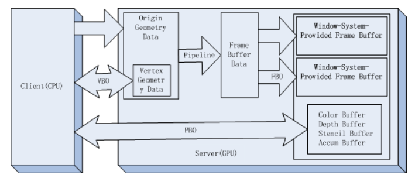

OpenGL中主要包括了两种数据—— Buffer 和 Texture。

**Buffer 用于储存线性数无类型据块，可以看成普通的内存块**，而 **Texture 则用于储存多维数据**，一般储存图像或者其他数据。


## **Buffer**

OpenGL中有很多绑定点，Buffer绑定在绑定点使用。

使用 glGenBuffers 来生成一个 Buffer 的id。 
使用 glBindBuffer 来绑定一个 Buffer 。 

使用 glBufferData 来为Buffer分配内存。<font color="red">如果想要改变Buffer中已经初始化的数据，那么可以使用glBufferSubData</font>。 

**如果想要从Buffer中拷贝或者写入数据，glMapBuffer会返回一个这些数据的指针，可以使用memcpy进行数据拷贝写入等等操作，使用完成后使用glUnmapBuffer来解除。**

值得注意的是：所有的Buffer Object都只是一个中间的管理平台，与实际的空间相分离。其中，**除了FBO所关联的数据空间在显存之外**，PBO和VBO所关联的数据空间位置均不一定 （system memory, shared memory, AGP, Video Memory均有可能）。



如果只是希望将缓存对象的数据清除为一个已知的值，那么也可以使用glClearBufferData()或者glClearBufferSubData()函数。清除缓存对象中所有或者部分数据。

绑定到target的缓存存储空间将使用data中存储的数据进行填充。format和type分别指定了data对应数据的格式和类型。

glClearBufferData()和glClearBufferSubData()函数允许我们初始化缓存对象中存储的数据，并且不需要保留或者清除任何一处系统内存。

缓存对象中的数据也可以使用glCopyBufferSubData()函数互相进行拷贝。

glCopyBufferSubData()可以在两个目标对应的缓存之间拷贝数据，而GL_COPY_READ_BUFFER和 GL_COPY_WRITE_BUFFER这两个目标正是为了这个目的而生。

它们不能用于其他OpenGL的操作当中，并且如果将缓存与它们进行绑定，并 且只用于数据的拷贝和存储目的，不影响OpenGL的状态也不需要记录拷贝之前的目标区域信息的话，那么整个操作过程都是可以保证安全的。

**使用glGetBufferSubData()函数可以从绑定到某个目标的缓存中回读数据**，然后将它放置到应用程序保有的一处内存当中。我们也可以使用glGetBufferSubData()简单地将之前存入到缓存对象中的数据读回到内存中。

**使用Buffer填充顶点shader**

创建绑定vao，然后使用glVertexAttribPointer来指定了渲染时索引值为 **index** 的顶点属性数组的数据格式和位置。

当数组中的值被访问并被转换至浮点值时，如果*normalized*被设置为GL_TRUE，意味着整数型的值会被映射至区间[-1,1](有符号整数)，或者区间[0,1]（无符号整数），反之，这些值会被直接转换为浮点值而不进行归一化处理。

glVertexAttribPointer的stride参数指定了每个数据之间的间距，**如果是0，并不意味着间距是0，而是提示OpenGL 数据是紧密排列的**，openGL将根据输出的size等参数自行计算间距。间距的计算即是：每个数据开头的地址到下一个数据开头地址的字节数。

要启用或者禁用顶点属性数组，调用glEnableVertexAttribArray和glDisableVertexAttribArray传入参数*index*。如果启用，那么当glDrawArrays或者glDrawElements被调用时，顶点属性数组会被使用。

**关于使用vbo和ibo绑定vao 索引绘制的实例：**

```
//读取数据
GLushort index[65535];
int index_size = 0;
GLfloat vert[65535];
int vert_size = 0;
GLuint gebo;
GLuint gvao;
GLuint gvbo;
std::fstream f1, f2;
std::string s;
int k = 0;
f2.open("media/models/1.tri ", std::ios::in);
f1.open("media/models/1.vert", std::ios::in);
while (getline(f1, s))
{
    sscanf(s.data(), "%f %f %f", &vert[k], &vert[k + 1], &vert[k + 2]);
    k += 3;
    vert_size += 3;
}
f1.clear();
k = 0;
while (getline(f2, s))  
{
    sscanf(s.data(), "%d %d %d", &index[k], &index[k + 1], &index[k + 2]);
    --index[k + 1];
    --index[k + 2];
    --index[k];
    k += 3;
    index_size += 3;
}
//生成vbo，ibo，vao，并且绑定vao
glGenBuffers(1, &gvbo);
glBindBuffer(GL_ARRAY_BUFFER, gvbo);
glBufferData(GL_ARRAY_BUFFER, vert_size*sizeof(float), vert, GL_STATIC_DRAW);
glBindBuffer(GL_ARRAY_BUFFER, 0);

glGenBuffers(1, &gebo);
glBindBuffer(GL_ELEMENT_ARRAY_BUFFER, gebo);
glBufferData(GL_ELEMENT_ARRAY_BUFFER, index_size*sizeof(GLushort), index, GL_STATIC_DRAW);
glBindBuffer(GL_ELEMENT_ARRAY_BUFFER, 0);

glGenVertexArrays(1, &gvao);
glBindVertexArray(gvao);
glBindBuffer(GL_ARRAY_BUFFER, gvbo);
//设置vbo数据格式
glVertexAttribPointer(7, 3, GL_FLOAT, GL_FALSE, 0, 0);
//启用此属性数组
glEnableVertexAttribArray(7);

//绑定ibo到vao
glBindBuffer(GL_ELEMENT_ARRAY_BUFFER, gebo);
//索引不传入shader所以不用glVertexAttribPointer等函数
//不要此处不能解绑vbo和ibo
glBindVertexArray(0);

//draw
glUseProgram(program);

glUniformMatrix4fv(proj_location2, 1, GL_FALSE, proj_matrix);
glUniformMatrix4fv(mv_location2, 1, GL_FALSE, mv_matrix);

glBindVertexArray(gvao);
//此处直接使用drawcall，不用再做任何设置
glDrawElements(GL_LINES, index_size, GL_UNSIGNED_SHORT, 0);
```

Shader:

```
//vertex
#version 410 core 
layout (location = 7) in vec4 position;   
uniform mat4 mv_matrix;                                 
uniform mat4 proj_matrix;                        
void main(void)      
{                                                            
   gl_Position = proj_matrix * mv_matrix * position;  
}

//fragement
#version 410 core
out vec4 color;
void main()
{
    color = vec4(1,0,0,1);
}
```


来源：https://www.cnblogs.com/wubugui/p/4367592.html