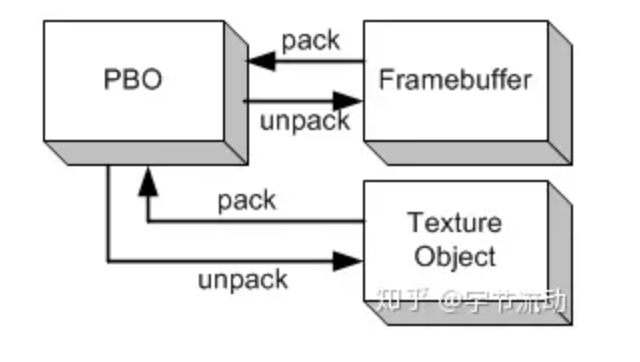
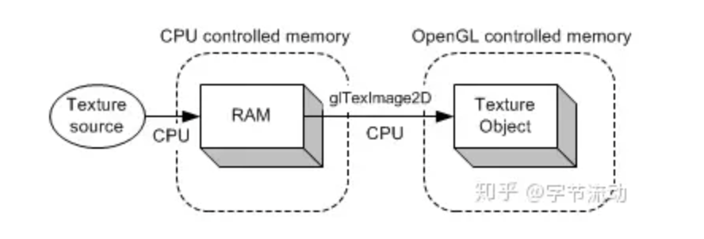
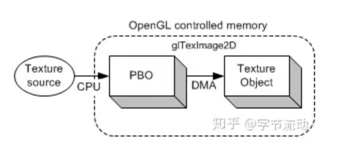
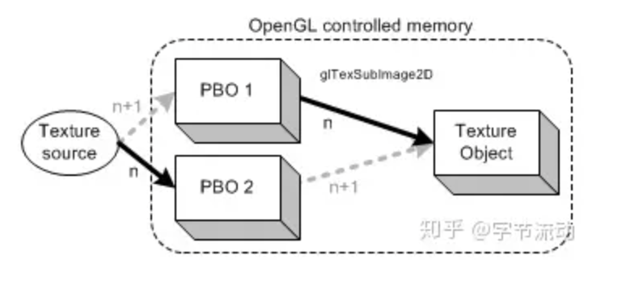

## PBO 是什么

**OpenGL PBO（Pixel Buffer Object），被称为像素缓冲区对象，主要被用于异步像素传输操作。PBO 仅用于执行像素传输，不连接到纹理，且与 FBO （帧缓冲区对象）无关。**

**OpenGL PBO（像素缓冲区对象） 类似于 VBO（顶点缓冲区对象），PBO 开辟的也是 GPU 缓存，而存储的是图像数据。**



与 PBO 绑定相关的 Target 标签有 2 个：`GL_PIXEL_UNPACK_BUFFER` 和 `GL_PIXEL_PACK_BUFFER` 。

其中将 PBO 绑定为 `GL_PIXEL_UNPACK_BUFFER` 时，`glTexImage2D()` 和 `glTexSubImage2D()` 表示从 PBO 中解包（unpack）像素数据并复制到帧缓冲区 。

将 PBO 绑定为 `GL_PIXEL_PACK_BUFFER` 时，`glReadPixels()` 表示从帧缓冲区中读取像素数据并打包进（pack） PBO 。


## 为什么要用 PBO

在 OpenGL 开发中，特别是在低端平台上处理高分辨率的图像时，图像数据在内存和显存之前拷贝往往会造成性能瓶颈，而利用 PBO 可以在一定程度上解决这个问题。

**使用 PBO 可以在 GPU 的缓存间快速传递像素数据，不影响 CPU 时钟周期，除此之外，PBO 还支持异步传输。**



上图从文件中加载纹理，图像数据首先被加载到 CPU 内存中，然后通过 `glTexImage2D` 函数将图像数据从 CPU 内存复制到 OpenGL 纹理对象中 （GPU 内存），两次数据传输(加载和复制)完全由 CPU 执行和控制。



如上图所示，文件中的图像数据可以直接加载到 PBO 中，这个操作是由 CPU 控制。**我们可以通过 `glMapBufferRange` 获取 PBO 对应 GPU 缓冲区的内存地址。**

**将图像数据加载到 PBO 后，再将图像数据从 PBO 传输到纹理对象中完全是由 GPU 控制，不会占用 CPU 时钟周期。所以，绑定 PBO 后，执行 `glTexImage2D` (将图像数据从 PBO 传输到纹理对象) 操作，CPU 无需等待，可以立即返回。**

通过对比这两种（将图像数据传送到纹理对象中）方式，可以看出，利用 PBO 传输图像数据，省掉了一步 CPU 耗时操作（将图像数据从 CPU 内存复制到 纹理对象中）。

## 怎么用 PBO

```c
int imgByteSize = m_Image.width * m_Image.height * 4;//RGBA

glGenBuffers(1, &uploadPboId);
glBindBuffer(GL_PIXEL_UNPACK_BUFFER, pboId);
glBufferData(GL_PIXEL_UNPACK_BUFFER, imgByteSize, 0, GL_STREAM_DRAW);

glGenBuffers(1, &downloadPboId);
glBindBuffer(GL_PIXEL_PACK_BUFFER, downloadPboId);
glBufferData(GL_PIXEL_PACK_BUFFER, imgByteSize, 0, GL_STREAM_DRAW);
```

PBO 的创建和初始化类似于 VBO ，以上示例表示创建 PBO ，并申请大小为 imgByteSize 的缓冲区。绑定为 `GL_PIXEL_UNPACK_BUFFER` 表示该 PBO 用于将像素数据从程序传送到 OpenGL 中；绑定为 `GL_PIXEL_PACK_BUFFER` 表示该 PBO 用于从 OpenGL 中读回像素数据。

**从上面内容我们知道，加载图像数据到纹理对象时，CPU 负责将图像数据拷贝到 PBO ，而 GPU 负责将图像数据从 PBO 传送到纹理对象。所以，当我们使用多个 PBO 时，通过交换 PBO 的方式进行拷贝和传送，可以实现这两步操作同时进行。**


## 使用两个 PBO 加载图像数据到纹理对象



如图示，利用 2 个 PBO 加载图像数据到纹理对象，使用 `glTexSubImage2D` 通知 GPU 将图像数据从 PBO1 传送到纹理对象，同时 CPU 将新的图像数据复制到 PBO2 中。

```c
int dataSize = m_RenderImage.width * m_RenderImage.height * 4;

//使用 `glTexSubImage2D` 将图像数据从 PBO1 传送到纹理对象
int index = m_FrameIndex % 2;
int nextIndex = (index + 1) % 2;

BEGIN_TIME("PBOSample::UploadPixels Copy Pixels from PBO to Textrure Obj")
glBindTexture(GL_TEXTURE_2D, m_ImageTextureId);
glBindBuffer(GL_PIXEL_UNPACK_BUFFER, m_UploadPboIds[index]);
//调用 glTexSubImage2D 后立即返回，不影响 CPU 时钟周期
glTexSubImage2D(GL_TEXTURE_2D, 0, 0, 0, m_RenderImage.width, m_RenderImage.height, GL_RGBA, GL_UNSIGNED_BYTE, 0);
END_TIME("PBOSample::UploadPixels Copy Pixels from PBO to Textrure Obj")

//更新图像数据，复制到 PBO 中
BEGIN_TIME("PBOSample::UploadPixels Update Image data")
glBindBuffer(GL_PIXEL_UNPACK_BUFFER, m_UploadPboIds[nextIndex]);
glBufferData(GL_PIXEL_UNPACK_BUFFER, dataSize, nullptr, GL_STREAM_DRAW);
GLubyte *bufPtr = (GLubyte *) glMapBufferRange(GL_PIXEL_UNPACK_BUFFER, 0,
                                               dataSize,
                                               GL_MAP_WRITE_BIT |
                                               GL_MAP_INVALIDATE_BUFFER_BIT);

LOGCATE("PBOSample::UploadPixels bufPtr=%p",bufPtr);
if(bufPtr)
{
    memcpy(bufPtr, m_RenderImage.ppPlane[0], static_cast<size_t>(dataSize));

    //update image data
    int randomRow = rand() % (m_RenderImage.height - 5);
    memset(bufPtr + randomRow * m_RenderImage.width * 4, 188,
    static_cast<size_t>(m_RenderImage.width * 4 * 5));
    glUnmapBuffer(GL_PIXEL_UNPACK_BUFFER);
}
glBindBuffer(GL_PIXEL_UNPACK_BUFFER, 0);
END_TIME("PBOSample::UploadPixels Update Image data")
```

我们对比下使用 2 个 PBO 和不使用 PBO 加载图像数据到纹理对象的耗时差别：