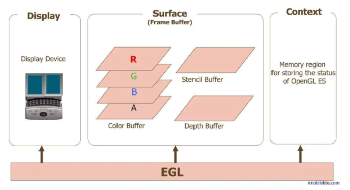
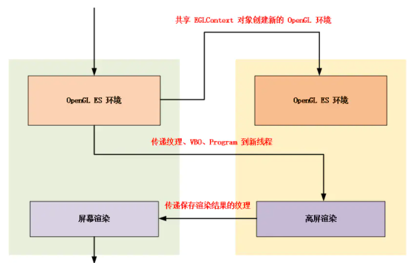

OpenGL ES 共享上下文实现多线程渲染


OpenGL ES 共享上下文实现多线程渲染


# EGL 概念回顾

**EGL 是 OpenGL ES 和本地窗口系统（Native Window System）之间的通信接口**，它的主要作用：

- 与设备的原生窗口系统通信；
- 查询绘图表面的可用类型和配置；
- 创建绘图表面；
- 在OpenGL ES 和其他图形渲染API之间同步渲染；
- 管理纹理贴图等渲染资源。

**OpenGL ES 的平台无关性正是借助 EGL 实现的，EGL 屏蔽了不同平台的差异（Apple 提供了自己的 EGL API 的 iOS 实现，自称 EAGL）。**

**本地窗口相关的 API 提供了访问本地窗口系统的接口，而 EGL 可以创建渲染表面 EGLSurface ，同时提供了图形渲染上下文 EGLContext，用来进行状态管理，接下来 OpenGL ES 就可以在这个渲染表面上绘制。



​																					egl、opengles 和设备之间的关系

图片中：

- Display(EGLDisplay) 是对实际显示设备的抽象；
- Surface（EGLSurface）是对用来存储图像的内存区域 FrameBuffer 的抽象，包括 Color Buffer（颜色缓冲区）， Stencil Buffer（模板缓冲区） ，Depth Buffer（深度缓冲区）；
- Context (EGLContext) 存储 OpenGL ES 绘图的一些状态信息；

**在 Android 平台上开发 OpenGL ES 应用时，类 GLSurfaceView 已经为我们提供了对 Display , Surface , Context 的管理，即 GLSurfaceView 内部实现了对 EGL 的封装，可以很方便地利用接口 GLSurfaceView.Renderer 的实现，使用 OpenGL ES API 进行渲染绘制，很大程度上提升了 OpenGLES 开发的便利性。**

当然我们也可以自己实现对 EGL 的封装，本文就是在 Native 层对 EGL 进行封装，不借助于 GLSurfaceView ，实现图片后台渲染，利用 GPU 完成对图像的高效处理。

关于 EGL 更详细的使用结束，可以参考系列文章中的 OpenGL ES 3.0 开发（六）：EGL


# 共享上下文时可以共享哪些资源

共享上下文时，可以跨线程共享哪些资源？这个是本文要讲的重点。

为了照顾一些读者大人的耐心，这里直接说结论。

**可以共享的资源：**

- 纹理；
- shader；
- program 着色器程序；
- buffer 类对象，如 VBO、 EBO、 RBO 等 。

**不可以共享的资源：**

- FBO 帧缓冲区对象（不属于 buffer 类）；
- VAO 顶点数组对象（不属于 buffer 类）。

**这里解释下，在不可以共享的资源中，FBO 和 VAO 属于资源管理型对象，FBO 负责管理几种缓冲区，本身不占用资源，VAO 负责管理 VBO 或 EBO ，本身也不占用资源。**

结论说完了，将在下一节进行结论验证，我们将在主渲染线程之外开辟一个新的渲染线程，然后将主渲染线程生成的纹理、 program 等资源分享给新的渲染线程使用。


# 共享上下文多线程渲染




本小节**将在主渲染线程之外通过共享 EGLContext 的方式开辟一个新的离屏渲染线程，之后将主渲染线程生成的纹理、 program 、VBO 资源分享给新的渲染线程使用**，最后将保存（新渲染线程）渲染结果的纹理返回给主线程进行上屏渲染。


## 共享上下文

在 EGL_VERSION_1_4 （Android 5.0）版本，在当前渲染线程直接调用 eglGetCurrentContext 就可以直接获取到上下文对象 EGLContext 。

C++ ，Java 层均有对应获取上下文对象的 API 实现：


```cpp
//Java
EGL14.eglGetCurrentContext();

//C++
#include "egl.h"
eglGetCurrentContext();
```

我们在新线程中使用 EGL 创建渲染环境时，通过主渲染线程获取的 `sharedContext` 来创建新线程的上下文对象。


```c
EGLContext context = eglCreateContext(mEGLDisplay, config,
                                              sharedContext, attrib2_list);
```

由于我们在新线程要渲染到屏幕外的区域，需要创建 PbufferSurface 。


```c
EGLSurface eglSurface = eglCreatePbufferSurface(mEGLDisplay, mEGLConfig, surfaceAttribs);
```

国际惯例，我们将 EGL 的操作都封装到一个类 EglCore 中方便使用，具体代码可以参考文末的项目。


## 多线程渲染

类比 Android Java 层的 Looper 类，我们在 C++ 实现 Looper 用于创建新线程并管理线程中的消息。

```c
class Looper {

public:
    Looper();
    Looper&operator=(const Looper& ) = delete;
    Looper(Looper&) = delete;
    virtual ~Looper();

    void postMessage(int what, bool flush = false);
    void postMessage(int what, void *obj, bool flush = false);
    void postMessage(int what, int arg1, int arg2, bool flush = false);
    void postMessage(int what, int arg1, int arg2, void *obj, bool flush = false);

    void quit();

    virtual void handleMessage(LooperMessage *msg);

private:
    void addMessage(LooperMessage *msg, bool flush);

    static void *trampoline(void *p);

    void loop(void);

    LooperMessage *head;
    pthread_t worker;
    sem_t headWriteProtect;
    sem_t headDataAvailable;
    bool running;

};
```

在 GLRenderLooper 类中分别定义 OnSurfaceCreated、 OnSurfaceChanged、 OnDrawFrame 用于处理对应的事件。

```c
enum {
    MSG_SurfaceCreated,
    MSG_SurfaceChanged,
    MSG_DrawFrame,
    MSG_SurfaceDestroyed,
};

class GLRenderLooper : public Looper {
public:
    GLRenderLooper();
    virtual ~GLRenderLooper();

    static GLRenderLooper* GetInstance();
    static void ReleaseInstance();

private:
    virtual void handleMessage(LooperMessage *msg);

    void OnSurfaceCreated();
    void OnSurfaceChanged(int w, int h);
    void OnDrawFrame();
    void OnSurfaceDestroyed();

    bool CreateFrameBufferObj();

private:
    static mutex m_Mutex;
    static GLRenderLooper* m_Instance;

    GLEnv *m_GLEnv;
    EglCore *m_EglCore = nullptr;
    OffscreenSurface *m_OffscreenSurface = nullptr;
    GLuint m_VaoId;
    GLuint m_FboTextureId;
    GLuint m_FboId;
};
```

在函数 GLRenderLooper::OnSurfaceCreated 中，利用 sharedContext 创建 OpenGL 渲染环境。

```c
void GLRenderLooper::OnSurfaceCreated() {
    //利用 sharedContext 创建 OpenGL 离屏渲染环境
    m_EglCore = new EglCore(m_GLEnv->sharedCtx, FLAG_RECORDABLE);
    SizeF imgSizeF = m_GLEnv->imgSize;
    m_OffscreenSurface = new OffscreenSurface(m_EglCore, imgSizeF.width, imgSizeF.height);
    m_OffscreenSurface->makeCurrent();

    glGenVertexArrays(1, &m_VaoId);
    glBindVertexArray(m_VaoId);

    glBindBuffer(GL_ARRAY_BUFFER, m_GLEnv->vboIds[0]);
    glEnableVertexAttribArray(0);
    glVertexAttribPointer(0, 3, GL_FLOAT, GL_FALSE, 3 * sizeof(GLfloat), (const void *)0);
    glBindBuffer(GL_ARRAY_BUFFER, GL_NONE);

    glBindBuffer(GL_ARRAY_BUFFER, m_GLEnv->vboIds[1]);
    glEnableVertexAttribArray(1);
    glVertexAttribPointer(1, 2, GL_FLOAT, GL_FALSE, 2 * sizeof(GLfloat), (const void *)0);
    glBindBuffer(GL_ARRAY_BUFFER, GL_NONE);

    glBindBuffer(GL_ELEMENT_ARRAY_BUFFER, m_GLEnv->vboIds[2]);
    GO_CHECK_GL_ERROR();
    glBindVertexArray(GL_NONE);

    if (!CreateFrameBufferObj())
    {
        LOGCATE("GLRenderLooper::OnSurfaceCreated CreateFrameBufferObj fail");
    }
}
```

GLRenderLooper::OnDrawFrame 函数中，绘制完成注意交换缓冲区，然后将保存绘制结果的纹理，通过回调函数传递给主线程进行上屏渲染。

```c
void GLRenderLooper::OnDrawFrame() {
    LOGCATE("GLRenderLooper::OnDrawFrame");
    SizeF imgSizeF = m_GLEnv->imgSize;

    glBindFramebuffer(GL_FRAMEBUFFER, m_FboId);
    glViewport(0, 0, imgSizeF.width, imgSizeF.height);
    glUseProgram(m_GLEnv->program);
    glBindVertexArray(m_VaoId);
    glActiveTexture(GL_TEXTURE0);
    glBindTexture(GL_TEXTURE_2D, m_GLEnv->inputTexId);
    GLUtils::setInt(m_GLEnv->program, "s_TextureMap", 0);
    float offset = (sin(m_FrameIndex * MATH_PI / 80) + 1.0f) / 2.0f;
    GLUtils::setFloat(m_GLEnv->program, "u_Offset", offset);
    glDrawElements(GL_TRIANGLES, 6, GL_UNSIGNED_SHORT, (const void *)0);
    glBindVertexArray(0);
    glBindTexture(GL_TEXTURE_2D, 0);
    
    //注意交换缓冲区
    m_OffscreenSurface->swapBuffers();
    glBindFramebuffer(GL_FRAMEBUFFER, 0);

    //将保存绘制结果的纹理 m_FboTextureId 传递给主线程进行上屏渲染    
    m_GLEnv->renderDone(m_GLEnv->callbackCtx, m_FboTextureId);
    m_FrameIndex++;
}
```

回到渲染主线程，Init 时将主渲染生成的纹理、 program 、VBO 资源以及 EGLContext 传递给新线程。

```c
m_GLEnv.sharedCtx     = eglGetCurrentContext();
m_GLEnv.program       = m_FboProgramObj;
m_GLEnv.inputTexId    = m_ImageTextureId;
m_GLEnv.vboIds[0]     = m_VboIds[0];
m_GLEnv.vboIds[1]     = m_VboIds[2];
m_GLEnv.vboIds[2]     = m_VboIds[3];
m_GLEnv.imgSize       = imgSize;
m_GLEnv.renderDone    = OnAsyncRenderDone;//主线程回调函数
m_GLEnv.callbackCtx   = this;

//将共享的资源发送给新线程
GLRenderLooper::GetInstance()->postMessage(MSG_SurfaceCreated, &m_GLEnv);

GLRenderLooper::GetInstance()->postMessage(MSG_SurfaceChanged, m_RenderImage.width, m_RenderImage.height);
```

主线程渲染时，首先向新线程发送渲染指令，然后等待其渲染结束，新线程渲染结束后会调用 OnAsyncRenderDone 函数通知主线程进行上屏渲染。

```c
void SharedEGLContextSample::Draw(int screenW, int screenH)
{
    {
        //向新线程发送渲染指令，然后等待其渲染结束
        unique_lock<mutex> lock(m_Mutex);
        GLRenderLooper::GetInstance()->postMessage(MSG_DrawFrame);
        m_Cond.wait(lock);
    }

    //主线程进行上屏渲染
    glViewport(0, 0, screenW, screenH);
    glUseProgram(m_ProgramObj);
    GO_CHECK_GL_ERROR();
    glBindVertexArray(m_VaoId);
    glActiveTexture(GL_TEXTURE0);
    glBindTexture(GL_TEXTURE_2D, m_FboTextureId);
    GLUtils::setInt(m_ProgramObj, "s_TextureMap", 0);
    GO_CHECK_GL_ERROR();
    glDrawElements(GL_TRIANGLES, 6, GL_UNSIGNED_SHORT, (const void *)0);
    GO_CHECK_GL_ERROR();
    glBindTexture(GL_TEXTURE_2D, GL_NONE);
    glBindVertexArray(GL_NONE);

}

void SharedEGLContextSample::OnAsyncRenderDone(void *callback, int fboTexId) {
    //新线程渲染结束后会调用 OnAsyncRenderDone 函数通知主线程进行上屏渲染
    SharedEGLContextSample *ctx = static_cast<SharedEGLContextSample *>(callback);
    unique_lock<mutex> lock(ctx->m_Mutex);
    ctx->m_FboTextureId = fboTexId;
    ctx->m_Cond.notify_all();
}
```

最后需要注意的是：**多线程渲染要确保纹理等共享资源不会被同时访问，否则会导致渲染出错。**

完整代码参考下面项目，选择 Multi-Thread Render：

```cpp
https://github.com/githubhaohao/NDK_OpenGLES_3_0
```


作者：字节流动
链接：https://www.jianshu.com/p/fb346e3eadf7
来源：简书
著作权归作者所有。商业转载请联系作者获得授权，非商业转载请注明出处。