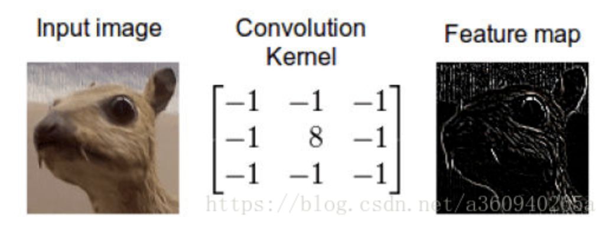
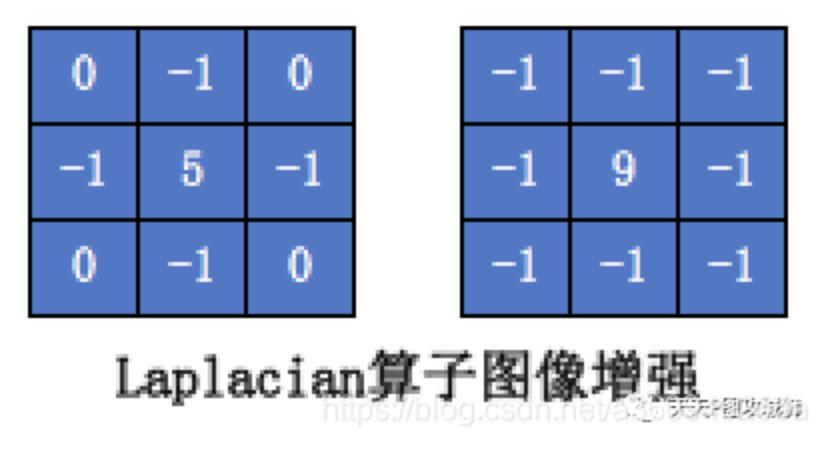
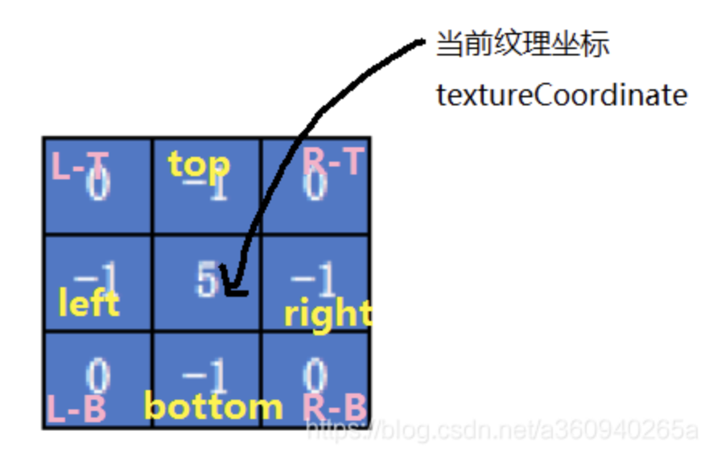

原文： https://blog.csdn.net/a360940265a/article/details/106615865

## 1、什么是卷积

这一章记录学习图像处理的初级知识——卷积。这里简单介绍什么是卷积：如何理解卷积呢？你可以把卷积想象成一种混合信息的手段。想象一下装满信息的两个桶，我们把它们倒入一个桶中并且通过某种规则搅拌搅拌。也就是说卷积是一种混合两种信息的流程。事实上卷积就是一种数学运算，跟减加乘除没有本质的区别。

当我们在图像上应用卷积时，我们在两个维度上执行卷积——水平和竖直方向。我们混合两桶信息：第一桶是输入的图像，由三个矩阵构成——RGB三通道，其中每个元素都是0到255之间的一个整数。第二个桶是卷积核（kernel），单个浮点数矩阵。可以将卷积核的大小和模式想象成一个搅拌图像的方法。卷积核的输出是一幅修改后的图像，在深度学习中经常被称作feature map。对每个颜色通道都有一个feature map。



这是怎么做到的呢，我们现在演示一下如何通过卷积来混合这两种信息。一种方法是从输入图片中取出一个与卷积核大小相同的区块——这里假设图片为100×100，卷积核大小为3×3，那么我们取出的区块大小就是3×3——然后对每对相同位置的元素执行乘法后求和（不同于矩阵乘法，却类似向量内积，这里是两个相同大小的矩阵的“点乘”）。乘积的和就生成了feature map中的一个像素。当一个像素计算完毕后，移动一个像素取下一个区块执行相同的运算。当无法再移动取得新区块的时候对feature map的计算就结束了。

以上就是卷积初级理解。当然卷积不仅仅只有以上这些知识，还有内卷外卷诸如此类的，以后有机会再深入学习。这里有一篇转载的外国译文，零基础介绍卷积延申到深度学习，有兴趣的同学可以慢慢看。

说了一通理论，内容总结为：卷积是一种数学运算，和加减乘除一个道理。卷积在图像领域当中，input输入就是图像的每个像素值；卷积运算需要一个叫卷积核的算子，也称作为滤波因子，使用的算法不一样，算子也不一样，效果更是千差万别；ouput输入也是对应的一个像素值。

 

## 2、卷积的应用——锐化

先放出参考代码地址：https://github.com/MrZhaozhirong/NativeCppApp/blob/master/app/src/main/cpp/gpufilter/filter/GpuSharpenFilter.hpp

那么卷积是如何应用到图像处理当中的呢？最经典的就是图像锐化和模糊的处理。在移动设备上使用GPU做图像锐化，一般就是利用空域滤波器对图像做模板卷积处理。其中，拉普拉斯算法比较适合用于改善图像模糊，是比较常用的边缘增强处理算子。



其中GPUImage的锐化滤镜就是用到是基于拉普拉斯算子的一种拉氏锐化，废话不说，来一起看看拉式卷积如何在GL上使用。

首先是顶点着色器SHARPEN_VERTEX_SHADER

```glsl
attribute vec4 position;
attribute vec4 inputTextureCoordinate;

uniform float imageWidthFactor;  //  屏幕宽度步长因子
uniform float imageHeightFactor;  //  屏幕高度步长因子
uniform float sharpness;  // 锐化核心值，由外层用户输入

varying vec2 textureCoordinate; // 当前纹理坐标
varying vec2 leftTextureCoordinate;
varying vec2 rightTextureCoordinate;
varying vec2 topTextureCoordinate;
varying vec2 bottomTextureCoordinate;
varying float centerMultiplier; // Laplacian算子中心值
varying float edgeMultiplier; // Laplacian算子边缘值
void main()
{
    gl_Position = position;
    vec2 widthStep = vec2(imageWidthFactor, 0.0);
    vec2 heightStep = vec2(0.0, imageHeightFactor);
    textureCoordinate = inputTextureCoordinate.xy;
    leftTextureCoordinate = inputTextureCoordinate.xy - widthStep;
    rightTextureCoordinate = inputTextureCoordinate.xy + widthStep;
    topTextureCoordinate = inputTextureCoordinate.xy + heightStep;
    bottomTextureCoordinate = inputTextureCoordinate.xy - heightStep;
    centerMultiplier = 1.0 + 4.0 * sharpness;
    edgeMultiplier = sharpness;
}
```

初看顶点着色器， 还真是一头雾水，怎么理解那四个 left/top/right/bottom的纹理坐标？还有那两个屏幕步长因子，我们再来看看上层代码的输入情况：

```c++
void init() {
    GpuBaseFilter::init(SHARPEN_VERTEX_SHADER.c_str(), SHARPEN_FRAGMENT_SHADER.c_str());
    mSharpnessLocation = glGetUniformLocation(mGLProgId, "sharpness");
    mImageWidthFactorLocation = glGetUniformLocation(mGLProgId, "imageWidthFactor");
    mImageHeightFactorLocation = glGetUniformLocation(mGLProgId, "imageHeightFactor");
    mSharpness = 0.0f;
}

void onOutputSizeChanged(int width, int height) {
    GpuBaseFilter::onOutputSizeChanged(width, height);
    glUniform1f(mImageWidthFactorLocation, 1.0f / width);
    glUniform1f(mImageHeightFactorLocation, 1.0f / height);
}

void setAdjustEffect(float percent) {
    mSharpness = range(percent * 100.0f, -2.0f, 5.0f);
    // from -4.0 to 4.0, with 0.0 as the normal level
}
```

屏幕步长是 当前屏幕宽高的倒数，也就是按照当前屏幕的像素个数分割开来。以当前纹理坐标对应laplacian算子的中心核，左右偏移1/width=1个像素的位置，就得出laplacian算子核心的其余外围8格的像素点。如下图所示理解



因为我选用了快速拉式变换，所以L-T，R-T，L-B，R-B的位置就没算出来，因为其laplacian的因子为0相乘结果也为0，没必要浪费顶点着色器的的输出变量。

 

接下来再看片元着色器SHARPEN_FRAGMENT_SHADER

```glsl
varying highp vec2 textureCoordinate;
varying highp vec2 leftTextureCoordinate;
varying highp vec2 rightTextureCoordinate;
varying highp vec2 topTextureCoordinate;
varying highp vec2 bottomTextureCoordinate;
varying float centerMultiplier;
varying float edgeMultiplier;

uniform sampler2D SamplerY;
uniform sampler2D SamplerU;
uniform sampler2D SamplerV;
mat3 colorConversionMatrix = mat3(
                   1.0, 1.0, 1.0,
                   0.0, -0.39465, 2.03211,
                   1.13983, -0.58060, 0.0);
vec3 yuv2rgb(vec2 pos)
{
   vec3 yuv;
   yuv.x = texture2D(SamplerY, pos).r;
   yuv.y = texture2D(SamplerU, pos).r - 0.5;
   yuv.z = texture2D(SamplerV, pos).r - 0.5;
   return colorConversionMatrix * yuv;
}
void main()
{
    mediump vec3 textureColor = yuv2rgb(textureCoordinate);
    mediump vec3 leftTextureColor = yuv2rgb(leftTextureCoordinate);
    mediump vec3 rightTextureColor = yuv2rgb(rightTextureCoordinate);
    mediump vec3 topTextureColor = yuv2rgb(topTextureCoordinate);
    mediump vec3 bottomTextureColor = yuv2rgb(bottomTextureCoordinate);
    gl_FragColor = vec4((textureColor*centerMultiplier - \
    (leftTextureColor*edgeMultiplier + rightTextureColor*edgeMultiplier + topTextureColor*edgeMultiplier + bottomTextureColor*edgeMultiplier)), 1.0);
}
```

片元着色器就比较简单了，根据输入的yuv提取当前位置的色值为输入，以laplacian算子为卷积核，根据卷积运算的概念进行卷积运算，最终以vec4的格式，补全rgba四通道的a值=1.0，输出到gl_FragColor进行光栅。


## 总结：

其他锐化的算法大同小异，主要是卷积核的不同。利用OpenGL的shader做卷积有点类似CUDA的并行运算概念呢。并不像传统OpenCV的for循环提取一行像素值运算操作。而且GL不用担心边缘越界/空值的问题，因为GL的纹理加载是有延伸模式or重复模式的。

下一章介绍什么是图像质量和噪音等概念，学习图像模糊算法（高斯模糊 / 方形模糊 / 双边模糊）

项目地址：https://github.com/MrZhaozhirong/NativeCppApp   laplacian锐化滤镜 cpp/gpufilter/filter/GpuSharpenFilter.hpp
————————————————
版权声明：本文为CSDN博主「Mr_Zzr」的原创文章，遵循CC 4.0 BY-SA版权协议，转载请附上原文出处链接及本声明。
原文链接：https://blog.csdn.net/a360940265a/article/details/106615865