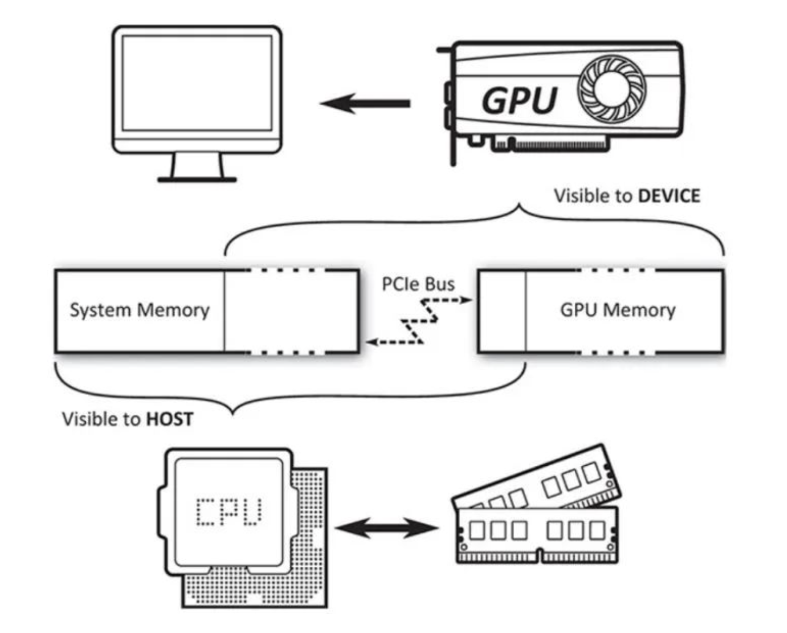
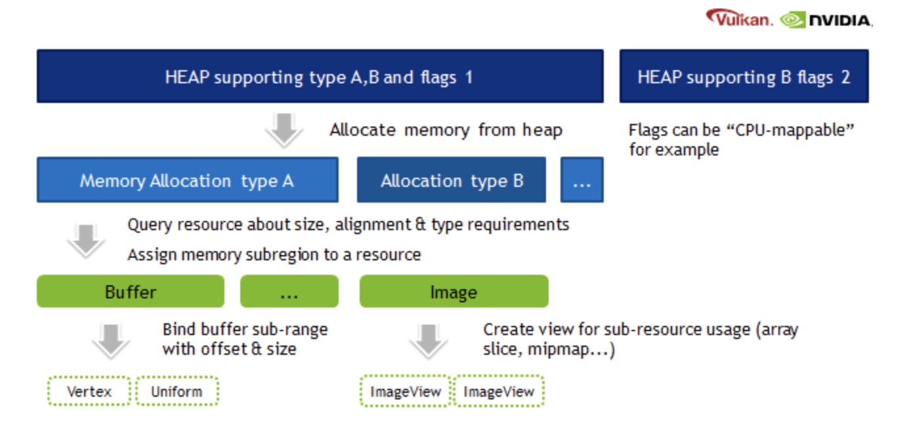
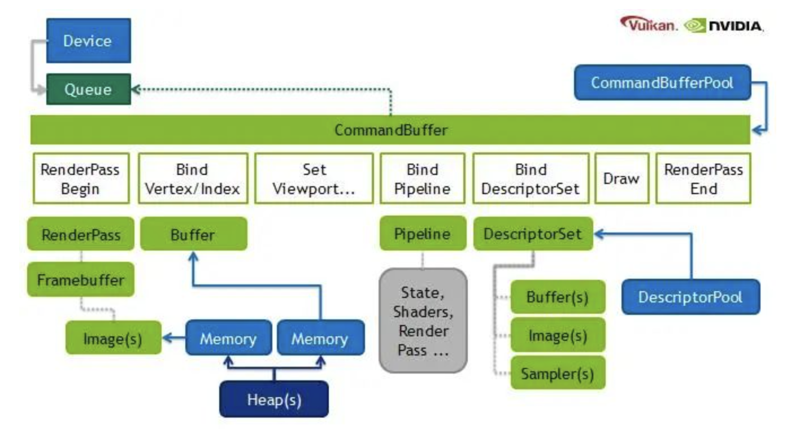
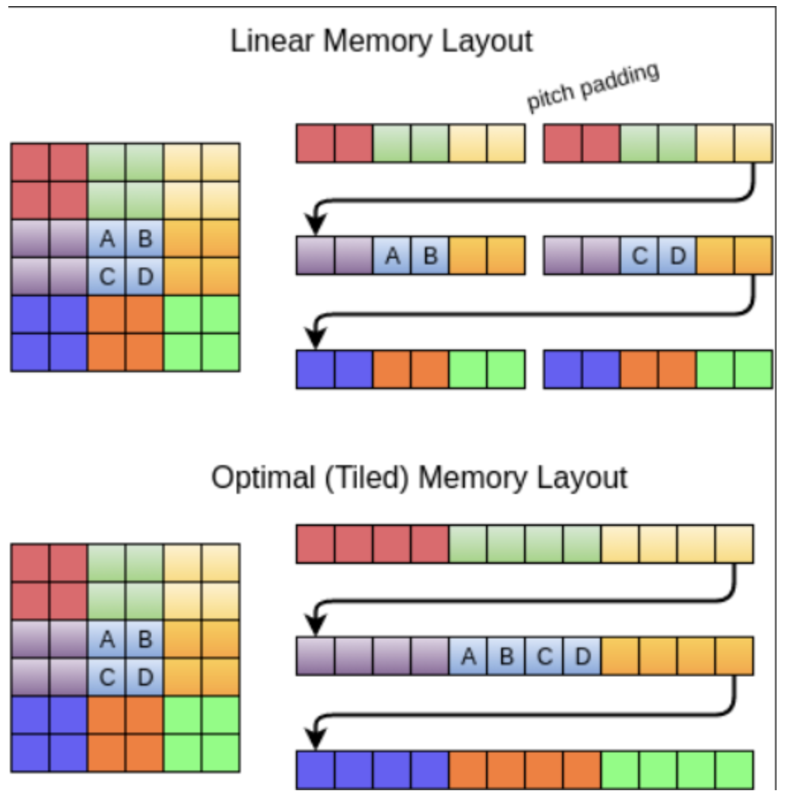

## 一、简介

内存管理对开发者来说永远是一个沉重的话题。

现有的高级语言都在通过各种努力，试图让开发者摆脱内存管理的复杂工作，专注于业务逻辑的开发。这样的做法对开发者是友好的，较低的语言门槛也能适应当前越来越快的敏捷开发的节奏。

但是，世上没有免费的午餐，任何事情都有代价。除了应用，没人更清楚应用的行为，有些应用需要大量的小内存，有些应用只需要少量的大内存，有些应用会频繁释放和分频内存资源，有些应用的内存生命周期则很长。面对复杂的应用场景，我们很难有一个统一的策略可以解决所有问题。不管是通过虚拟机还是驱动程序，帮助应用进行内存管理永远是低效的。

Vulkan将内存管理的工作交给了开发者自己负责，如何分配释放内存，怎样制定内存策略都由开发者自己决定，因为没人比开发者更清楚自己想做什么。

## 二、内存管理

Vulkan将内存划分为两大类：**Host Memory** 和 **Device Memory**。

Host是运行应用程序的处理器，在PC机上就是指CPU。

Device是执行Vulkan命令的处理器，在PC机上就是指GPU。

所以，Host memory指的是对Host可见的内存，Device memory指的是对Device可见的内存。

更详细的，Vulkan系统中的内存有四种类型：

- Host Local Memory，只对Host可见的内存，通常称之为普通内存
- Device Local Memory，只对Device可见的内存，通常称之为显存
- Host Local Device Memory，由Host管理的，对Device看见的内存
- Device Local Host Memory，由Device管理的，对Host可见的内存

并不是所有设备都支持这四种类型。一些嵌入式系统、移动设备甚至是笔记本电脑的GPU，可能与CPU共享内存控制器和内存子系统。这种情况它的内存只有一种类型，我们通常称之为`unified memory architecture`（统一内存架构）。

### 2.1 Host Memory

Host Memory是CPU可以访问的常规内存，一般是通过调用malloc或new分配。

Vulkan API创建的对象通常需要一定数量的Host Memory，用来储存对象和数据结构。

Vulkan对Host Memory的要求就是内存地址是对齐的！

这是因为某些高性能CPU指令在对齐的内存地址上效果最佳。通过假定存储CPU端数据结构的分配是对齐的，Vulkan可以无条件使用这些高性能指令，从而提供显著的性能优势。

如果内存没有对齐，你可能会发现程序运行一段时间后神秘崩溃！

### 2.2 Device Memory

任何可以由Device访问的内存，都被称为**Device Memory（设备内存）**。Device Memory距离Device更近，比Host Memory更有性能优势。Image object、Buffer object、UBO（uniform buffer objec）都由Device Memory分配。Vulkan中的所有资源都由Device Memory支持。

### 2.3 Pool

内存是一种昂贵的资源，分配操作通常会有间接的系统代价。

Vulkan中通过资源池来平摊成本，一些创建比较频繁的资源都由资源池统一管理：

- Command Buffer Pool
- Descriptor Pool
- Query Pool

## 三、Memory and Resources

内存的作用是给资源做底层支持，不同的资源对内存的要求并不一样。

### 3.1 Buffer and Image

Vulkan有两种基本资源类型：Buffer和Image。

**Buffer** 是最简单的资源类型，可以用来储存线性的结构化的数据，也可以储存内存中原始字节。

**Image** 则相对比较复杂，具有特殊的布局（layout）和格式（format），可用来做flitering，blending，depth 和 stencil testing等。

### 3.2 Image Layout

Image的布局（layout）对内存有特殊需求，主要有两种主要的平铺模式（tiling modes）：

- linear - 其中的图像（Image）数据线性的排列在内存中。
- optimal - 其中的图像（Image）数据以高度优化的模式进行布局，可以有效利用设备的内存子系统。

线性布局（linear layout）适合连续的单行的读写，但是大多数图形操作都涉及到跨行读写纹理元素（比如在计算A时，需要参考ABCD四个纹理像素），如果图像的宽度非常宽，相邻行的访问在线性布局中会有非常大的跳转。这可能会导致性能问题。

优化布局（optimal layout）的好处是内存数据根据不同内存子系统进行优化，比如将所有的纹理像素都优化到一块连续的内存区域中，加快内存处理速度。

GPU硬件通常倾向于使用优化布局以实现更有效的渲染。但是优化布局（optimal layout）通常是“不透明的”，这意味着优化布局格式的详细信息不会被其他需要读取或写入图像数据的组件得知。

如果CPU如果想读取生层的图像信息，图像在被读取之前要进行布局转换，将optimal layout转换为普通布局后，CPU才能正确识别图像信息。

## 四、注意事项

### 4.1 选择最佳的内存使用方式

Vulkan不同的内存类型有不同的使用场景：

- **Device Local Memory适合优先级最高的资源，通常是纹理等频繁被使用的渲染数据。当内存空间不够时我们才会考虑是否将这些内存数据放到CPU端。**
- **Device Local Host Memory 适合CPU 到 GPU的数据传递，一些顶点数据等，可以通过这种方式传递。**
- **Host Local Device Memory 适合GPU 到 CPU的数据传递，截图、回写等操作可以使用这种内存。**

### 4.2 内存使用的原则

在Vulkan中，我们在进行内存管理时要考虑到以下问题：

- 内存分配通常涉及相当昂贵的系统操作
- 内存重用要比释放重新分配更快
- 驻留在连续内存中的对象可以享受更好的缓存利用率。
- 内存对齐的数据能获得更快的处理

### 4.3 内存对齐

在使用Host Memory时，**一定要注意内存对齐**。不允许简单的直接把malloc hook到Vulkan的内存分配函数上！

**参考文档：**

1. *Vulkan Programming Guide*
2. *Vulkan Cookbook*
3. *Learning Vulkan*
4. *Vulkan® 1.1.148 - A Specification*
5. *Image Layout Transition*
6. *Vulkan Memory Management*
7. *USING VULKAN DEVICE MEMORY*
8. *What’s your Vulkan Memory Type?*

> *原文链接:* *https://zhuanlan.zhihu.com/p/166387973*