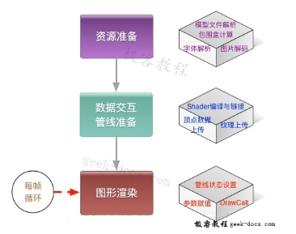
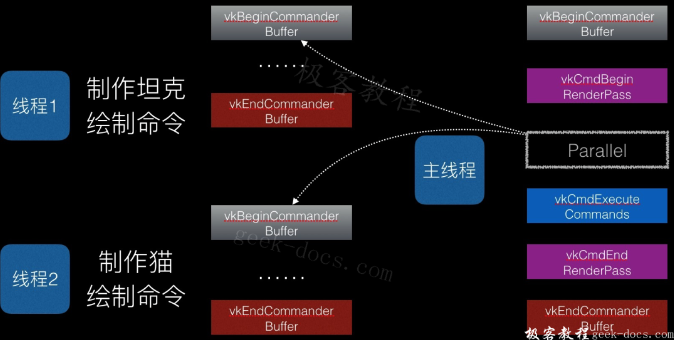

**Vulkan 和 OpenGL 区别**，Vulkan 与 OpenGL 相比，可以更详细的向显卡描述你的应用程序打算做什么，从而可以获得更好的性能和更小的驱动开销。

Vulkan 的设计理念与 Direct3D 12 和 Metal 基本类似，但 Vulkan 作为 OpenGL 的替代者，它设计之初就是为了跨平台实现的，可以同时在 Windows、Linux 和 Android 开发。甚至在 Mac OS 系统上，Khronos 也提供了 Vulkan 的 SDK，虽然这个 SDK 底层其实是使用 MoltenVK 实现的。

Vulkan的最大任务不是竞争DirectX，而是取代 OpenGL，所以重点要看和后者的对比。在高分辨率、高画质、需要GPU发挥的时候，Vulkan、OpenGL的速度基本差不多。

但是随着分辨率的降低，CPU越来越重要，Vulkan逐渐体现了出来，尤其是看看GTX 980 Ti，最多可以领先OpenGL 33％之多！

## 基于 OpenGL 的图形引擎性能瓶颈 

基于OpenGL的图形引擎，其渲染过程粗略可分为主机端资源加载，设备端数据交互与管线准备 及 每帧循环的渲染三个部分。

### 资源加载

这一过程跟GPU没有太大关系，主要是为了进行显示之前的图片解码、字体解析、3D模型解析等等。一般可以放到其他线程中执行，避免影响显示。

### **数据交互与管线准备**

这一过程主要是将必要的数据传到GPU可以读到内存中去，以及准备GPU的指令。主要包含如下三个步骤:

- 纹理上传
- Shader的编译与Program的链接
- VBO的数据上传

### 每帧的图形渲染

1､数据交互耗时。
这里主要需要设常量区的数据，我们绝大部分情况都是在绘制变化的物体，而变化相关的属性主要体现在常量区，因此每帧渲染都需要重新设一遍常量数据。

2､调用Drawcall耗时。
DrawCall指真正执行绘制任务的图形API，如glDrawArrays, glDrawElements。调用这些API时，GPU驱动需要产生GPU硬件所能识别的任务，并发送到内核，等待调度执行。

## Vulkan 编程

详细的Vulkan编程流程可以参考Vulkan教程:https://geek-docs.com/vulkan/vulkan-tutorial

### 编程流程

基本的Vulkan编程流程：

这个流程和OpenGL的使用流程很像，就是找到设备——创建上下文——创建命令队列——准备任务——发送执行。

Vulkan的窗口系统(WSI)（与EGL标准类似）：

注意到，在移动设备上使用OpenGL时，我们必须通过egl的API先准备好Surface和Context，而在Vulkan标准里面，WSI只是为Command Buffer 提供了 VkFrameBuffer，这个是图形渲染的输出。

### Pipeline

创建Command Buffer 的三个重要元素分别为 **VkDescriptorSet（纹理和常量）、VkPipeline（着色器和状态）和VkBuffer（顶点数组）**。官网上对Pipeline由下图描述：

以前的GLProgram现在对应于一个VkPipeline，但VkPipeline除了Program之外，还覆盖了 blend，cull face 等状态：

**Vulkan中的 Shader 只支持 spv 的标准二进制格式，我们所写的glsl都必须通过官方的一个转换器转换为二进制格式**。这样做就不需要GPU驱动去做语法解析等编译前端工作了。

以前在OpenGL中用的Texture 现在由VkImage描述：

### Command Buffer

一个用于图形渲染的 VkCommandBuffer 制作过程如下图：

如图所示，Command Buffer 里面设定了图形渲染所需要的**视口、裁剪、管线（各种状态配置和着色器）、顶点数组、描述（纹理、程序常量等）这些属性**，之后再发送到命令队列(VkQueue)中就可以执行。

## Vulkan 的优势

### 效率上的提升

**Vulkan在效率上的提升主要是它天然支持多线程**

### 异步数据交互

使用OpenGL时，如果把数据交互放到另一个独立线程中完成，将会引起冲突，这个原因是上传资源和进行绘制时都需要改变上下文：

用Vulkan则没有这个问题：

### 并行绘制

由于绘制时要改变上下文，OpenGL的并行绘制无疑也不可能了：

**Vulkan可以并行创建 Command Buffer**，Command Buffer 提交后就都是GPU驱动怎么执行的事了，执行的过程没必要也没可能用多线程加速。

### 复用Command Buffer

OpenGL 每帧绘制时，都需要在驱动层重新建一个Command Buffer 传递下去，**而 Vulkan 是在应用层建好 Command Buffer，每帧绘制时Sub上去**。

### 便于模块化

虽然初看上去 Vulkan 比 OpenGL 复杂了许多，需要多写不少代码，但真正到软件开发时，由于Vulkan、OpenGL大部分情况都是用来写引擎，中间件的，维护代码的时间会远大于开发代码的时间，多写那几行代码根本不算啥。

Vulkan更容易封装，各子模块之间互不影响，软件架构设计会轻松不少，开发维护起来更为方便。

而基于OpenGL开发的各子模块之间总有各种各样因为状态机的缘故引发的Bug，比如：

- A模块用了VBO，B模块没有用，集成在一起时由于B模块没有把GL_ARRAY_BUFFER 重新绑定为0,出现段错误。

- A模块内部使用了FBO，使用FBO时重新设置了裁剪区域和视口大小，使用完成后没有恢复，导致集成之后，后续的模块绘制出现问题。如果基于Vulkan开发，上述的状态不一致的问题将会少很多。

当然，基于Vulkan开发的引擎一般会用多线程加速，这个也会有不少坑，但为了更好的性能，也是值得的。

## Vulkan对开发者的影响

OpenGL还算是对初学者比较友好的API，但到了Vulkan，由于严格把pipeline、descriptor、buffer分开，初学者上手难度变大了，App开发者直接调用图形API的情况将会减少，更多地会依赖于图形引擎。因此，Vulkan标准的渐渐普及会加速开发者的层级分划，使用Vulkan的人将是专业研究图形引擎或作GPGPU算法引擎的人。

对于有志于研究图形的初学者，可以直接学习Vulkan，不用去学习OpenGL了，Vulkan标准与GPU工作原理更为贴近，学习 Vulkan更有利于掌握图形显示的知识。

来源：https://geek-docs.com/vulkan/vulkan-tutorial/vulkan-and-opengl.html