## 1. Overview of Vulkan

### 1.1 计算机图形软件

图形软件有两个大类：专用软件包（special-purpose packages）和通用编程软件包（general programming packages）。

专用软件包通常提供一种UI设计语言，让用户直接生成想要的图形，不用关心内部实现。这类软件例子是PS、CAD等等。

相反，通用编程软件包提供一个可使用C、C++或Java等高级语言编程的图形函数库。图形函数库中提供几何图元、矩阵变换等操作，提供了间接操作硬件的软件接口，所以这组图形函数又被称为**计算机图形应用编程接口**（computer-graphics application programming interface，CG API）。OpenGL、Vulkan、DirectX、Metal皆在此列。

### 1.2 Vulkan多线程的设计理念

Vulkan不仅仅是图形（graphics）API，而是一个面向图形和计算的编程接口（graphics and compute）。支持Vulkan的设备可以是GPU，也可以是DSP或者固定功能的硬件。

Vulkan中的计算模型主要基于并行计算，因此支持多线程是Vulkan设计的核心理念之一。

为了较少Vulkan内部因为互斥同步等操作造成的卡顿问题，Vulkan内部默认认为对任何资源的访问不存在多线程竞争，所有的资源同步操作由应用开发者去负责，因为对资源的访问和使用没有人比应用开发者自己更加清楚。Vulkan称之为外部同步（external synchronization）。

因为这个原因，资源管理和线程同步工作成为编写Vulkan程序的最大难点之一。想要让Vulkan多线程正常运行，你需要做大量的工作。当然，换来的是Vulkan有了更加干净的线程模型以及比其它CG API高得多的性能。

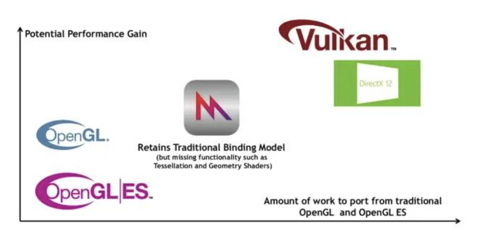

### 1.3. Instances, Devices, and Queues

在正式研究Vulkan多线程之前，有三个重要的基础概念需要了解—Instances, Devices, and Queues。

**Instances**可以看做是应用的子系统，从逻辑上把Vulkan与应用程序上下文中的其他逻辑隔开。Instances可以看做是Vulkan的上下文，它会跟踪所有状态，从逻辑上把所有支持Vulkan的设备整合在一起。

**Devices**有两个概念：Physical devices和Logical device。

**Physical devices**通常代表一个或者多个支持Vulkan的硬件设备，这些设备具有特定功能，可以提供一系列Queues。图形显卡、加速器、DSP等都可以是Vulkan的Physical devices。

**Logical device**是Physical devices的软件抽象，用于预订一些硬件资源。

**Queues**可以理解为一个“GPU线程”，它是实现Vulkan多线程的关键元素之一，用于响应应用的请求，大部分时间，应用都在与其交互。

Vulkan功能的层次结构图如下：

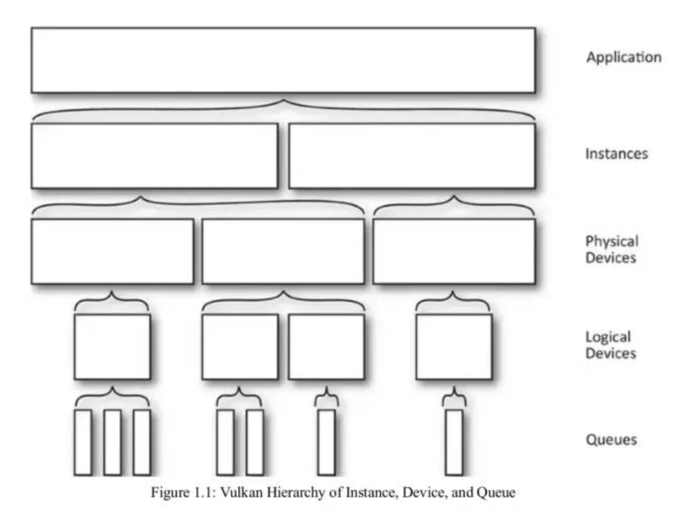

## 2. Queues and Command Buffer

### 2.1 Queues

**Queue**代表一个GPU线程，Vulkan设备执行的就是提交到Queues中的工作。物理设备中Queue可能不止一个，每一个Queue都被包含在Queue Families中。

**Queue Families**是一个有相同功能的Queues的集合，它们的性能水平和对系统资源的访问是相同的，并且在它们之间数据传输工作没有任何成本（同步之外）。

一个物理设备中可以存在多个Queue Families，不同的Queue Families有不同的特性。相同Queue Families中的Queues的功能相同，并且可以并行运行。

按照Queue的能力，可以将其划分为：

- Graphics（图形）
- 该系列中的Queues支持图形操作，例如绘制点，线和三角形。
- Compute（计算）
- 该系列中的Queues支持诸如computer shader之类的计算操作。
- Transfer（传输，拷贝）
- 该系列中的Queues支持传输操作，例如复制缓冲区和图像内容。
- Sparse binding（稀疏绑定）
- 该系列中的队列支持用于更新稀疏资源（sparse resource）的内存绑定操作。

### 2.2 Command Buffer

### 2.2.1 单线程的性能瓶颈

传统CG API是单线程的，性能的提升只能依赖于CPU主频的提高。能有的优化方案也不外乎主线程和渲染线程分开，或者某些资源的异步加载、离线处理。

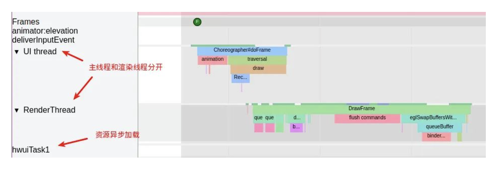

但是在实际应用中我们还是经常遇到传统CG API导致的性能瓶颈。

以手机终端为例，CPU主频提升有限，各大芯片厂商开始向多核多线程发展，考虑到功耗温控问题，又不能把CPU频率升的太高，越来越高的刷新率对实时渲染的速度要求越来越苛刻。

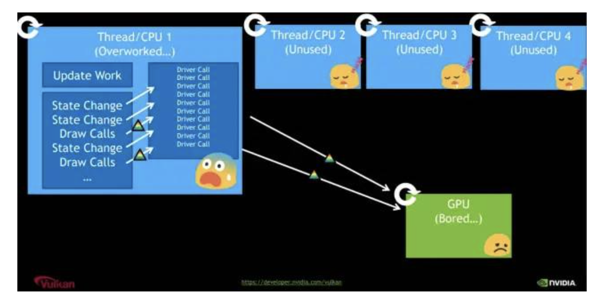

Vulkan为了充分发挥CPU多核多线程的作用，引入了command buffer的概念。多个线程可以同时协作，每个CPU线程都可以往自己的command buffer中提交渲染命令，然后统一提交到对应的Queue中，大大提高了CPU的利用率。

### 2.2.2 Command Buffer的作用

**应用在绘制时会提交一系列绘制命令给GPU驱动，但是这些绘制命令不会立刻被执行，而是被简单的添加到Command Buffer的末尾。**

在其他CG APIs中，驱动程序在应用不感知的情况下，把API调用翻译成GPU command并储存在command buffer中，最终提交给GPU处理。command buffer的创建和销毁都由驱动负责。

在Vulkan中，你需要自己从**Command Buffer Pool**中申请command buffer，将想要记录的命令放入command buffer中。

**Command Buffer Pool：**

### 2.2.3 Recording command

Command Buffer可以记录（Record）很多命令，比如：设置状态、绘制操作、数据拷贝…

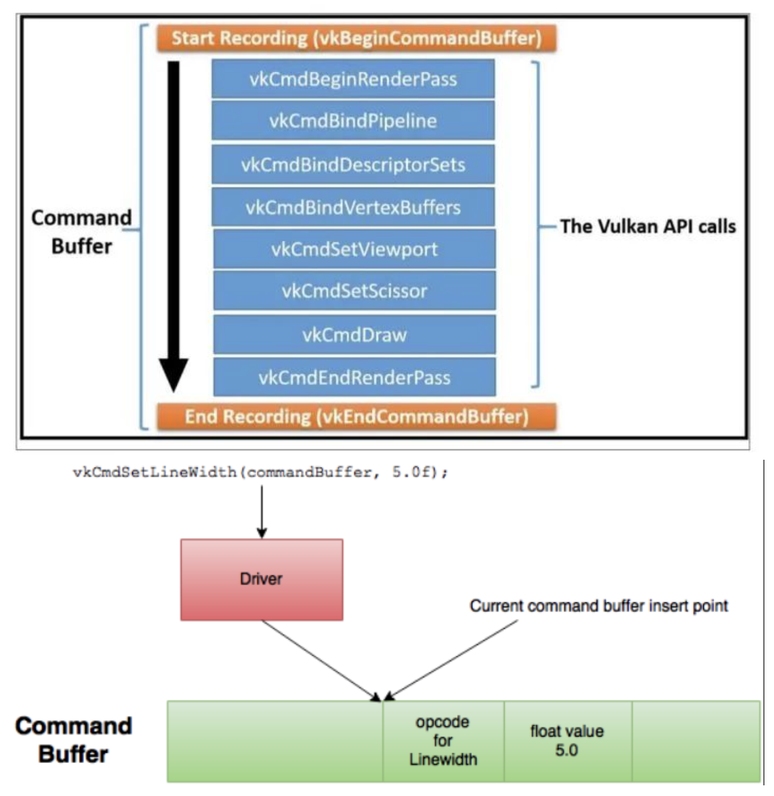

理论上，一个线程可以把Command记录到多个Command Buffer中，多个线程也可以共享同一个Command Buffer，但是一般不鼓励多个线程共享一个Command Buffer。

Vulkan的关键设计原则之一就是做到高效的多线程。

想实现这一点，应用程序要注意因为资源竞争导致的多线程彼此阻塞。因此，每个线程最好有一个或者对个Command Buffer，不要尝试共享一个。

另外，Command Buffer由Command Buffer Pool分配，应用可以为每一个线程创建一个Command Buffer Pool，让各个工作线程从Command Buffer Pool中分配Command Buffer，无需参与竞争。

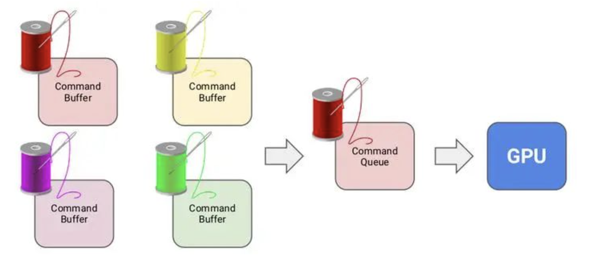

### 2.2.4 Submitting Command Buffers

提交过程使用示意图更加好理解一点。

**单线程Command Buffer提交过程：**

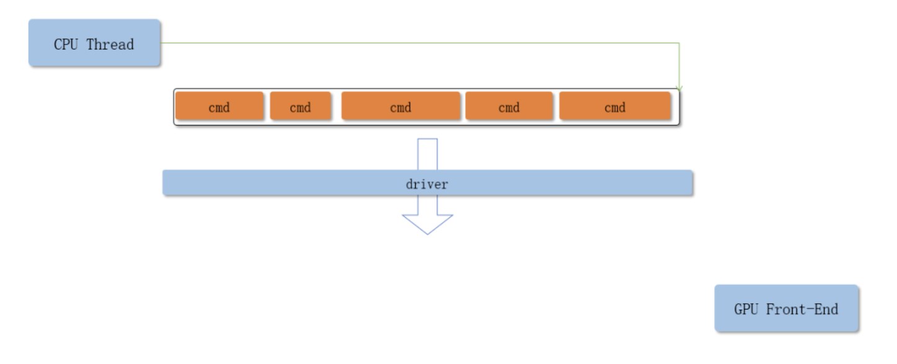

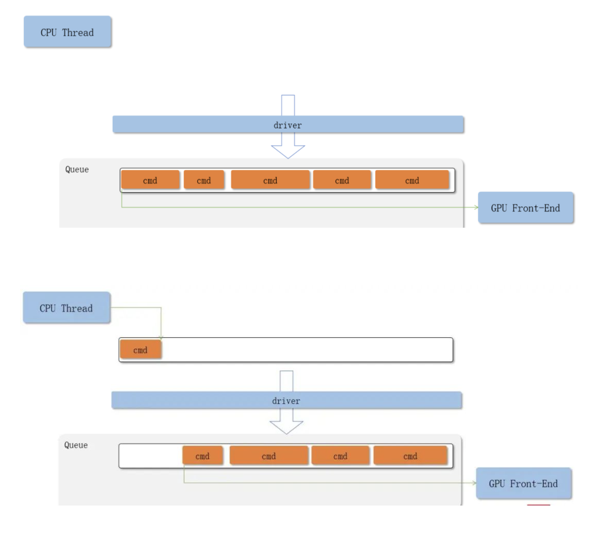

**多线程Command Buffer提交过程：**

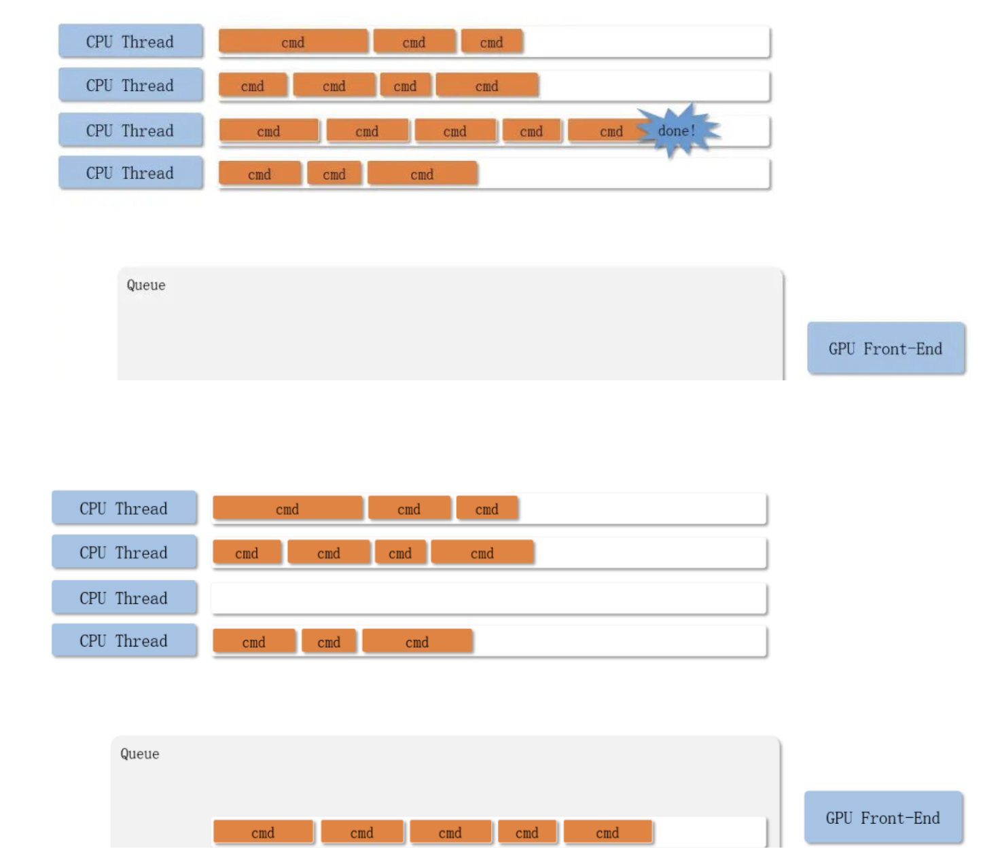

**整体流程如下：**

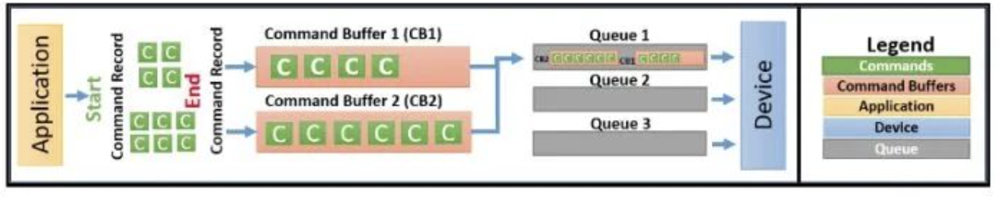

## 3. Synchronization

### 3.1 显示同步操作

**Vulkan把同步的操作交给了应用（external synchronization），绝大多数的Vulkan命令根本不提供同步，需要应用自己负责。Vulkan给应用提供了同步原语，帮助应用进行同步操作。**

Vulkan中主要有四种同步原语（synchronization primitives）：

- **Fences**
- **最大颗粒度的同步原语，目的是给CPU端提供一种方法，可以知道GPU或者其他Vulkan Device什么时候把提交的工作全部做完。**
- **如果你熟悉Android显示机制的话，acquire fence或者retire fence就是类似的作用**
- **Semaphores**
- **颗粒度比Fences更小一点，通常用于不同Queue之间的数据同步操作**
- **Events**
- **颗粒度更小，可以用于Command Buffer之间的同步工作**
- **Barriers**
- **Vulkan流水线（Pipeline）阶段内用于内存访问管理和资源状态移动的同步机制**

下面这张图取自NVIDIA公司Vulkan 多线程讲解的PPT：

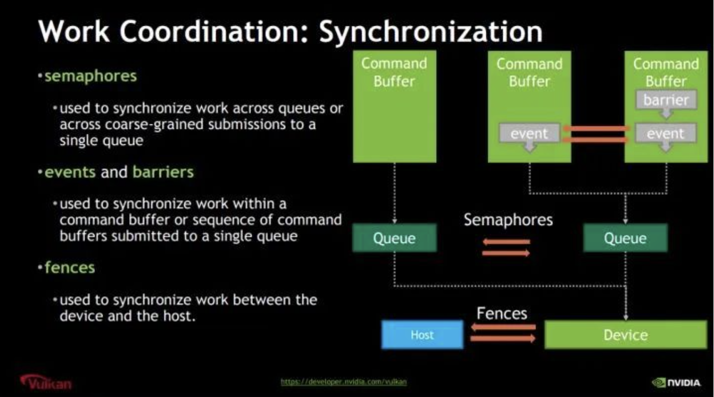

### 3.2 隐藏的执行顺序

Vulkan是显式的API没错，号称是“没有秘密的API”。但是在多线程同步时，还是存在一些潜规则。

以下面这张图为例，同一个Queue中，Command Buffer1 和Command Buffer2 谁先执行？Command Buffer中记录的一堆命令是如何执行的？

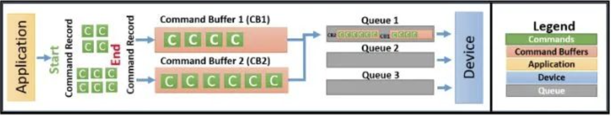

Vulkan的执行顺序其实是有一定的潜规则的，在没有同步原语的情况下：

- **Command Buffer中的Command，先记录的先执行**
- **先提交的Command Buffer先执行**
- **同一个Queue中，一起提交的Command Buffer1 和Command Buffer2 按照下标的顺序执行，Command Buffer1 先执行**

### 3.3 Barriers

所有的同步原语中，Barriers使用起来最为困难。Barriers用于显式的控制buffer或者image的访问范围，避免hazards（RaW,WaR,and WaW），保证数据一致性。

Barriers需要开发者了解渲染管线的各个阶段，能清晰的把握管线中每个步骤对资源的读写顺序。

Vulkan中将Pipeline的各个阶段定义为：

- TOP_OF_PIPE_BIT
- DRAW_INDIRECT_BIT
- VERTEX_INPUT_BIT
- VERTEX_SHADER_BIT
- TESSELLATION_CONTROL_SHADER_BIT
- TESSELLATION_EVALUATION_SHADER_BIT
- GEOMETRY_SHADER_BIT
- FRAGMENT_SHADER_BIT
- EARLY_FRAGMENT_TESTS_BIT
- LATE_FRAGMENT_TESTS_BIT
- COLOR_ATTACHMENT_OUTPUT_BIT
- TRANSFER_BIT
- COMPUTE_SHADER_BIT
- BOTTOM_OF_PIPE_BIT

对应：

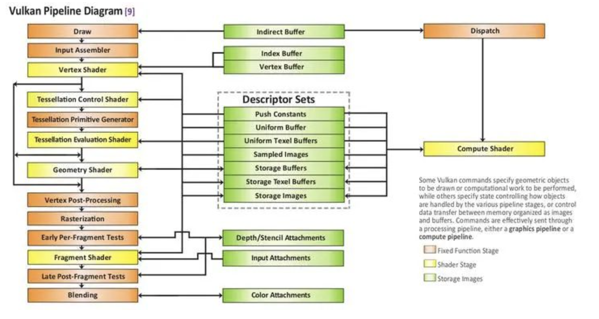

假设我们有个两个渲染管线P1 和 P2，P1会通过Vertex Shader往buffer写入顶点数据，P2需要在Compute Shader中使用这些数据。

如果使用fence去同步，你的流程应该是这样：P1的Command提交后，P2通过fence确保P1的操作已经被全部执行完，再开始工作。

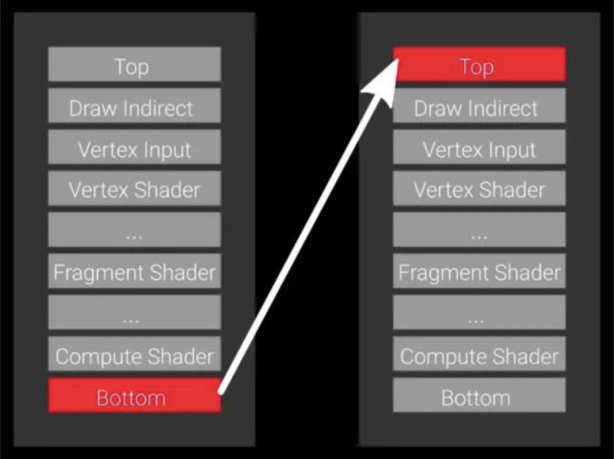

但是这种大颗粒度的同步操作无疑造成了耗时操作：P1的数据在Vertex Shader阶段就已经准备好了，我们为什么要等到它所有操作执行完再开始？P2平白多等待了很长时间，而且在这个期间P2的其他阶段并没有使用到P1的数据，也是可以执行的啊。

Barriers的引入完全解决了这个问题，我们只需要告诉Vulkan，我们在P2的Compute Shader阶段才会等待P1 Vertex Shader里面的数据，其他阶段并不关心，可以同步进行。

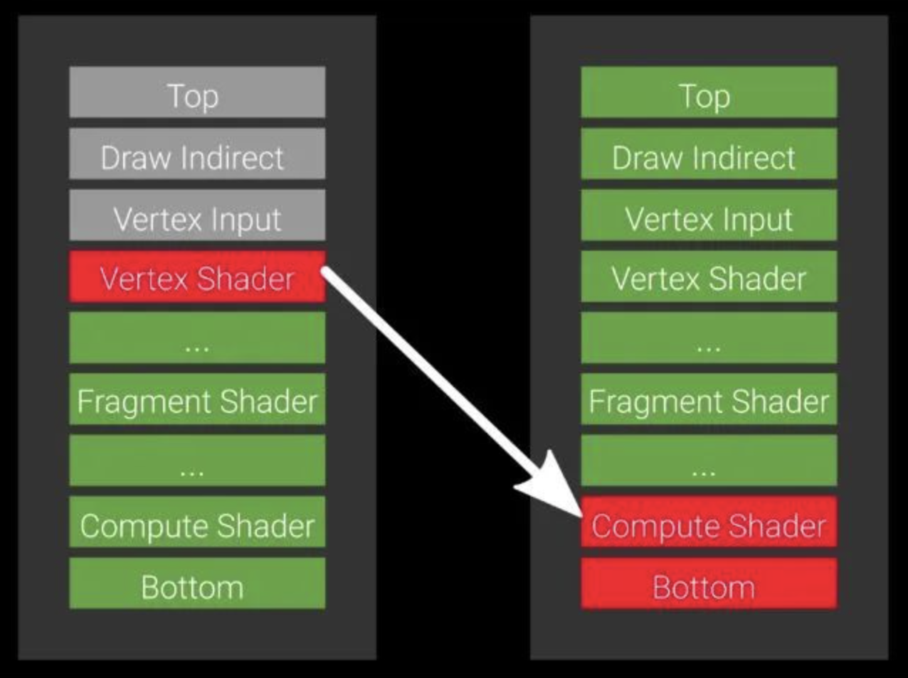

**使用方法：**

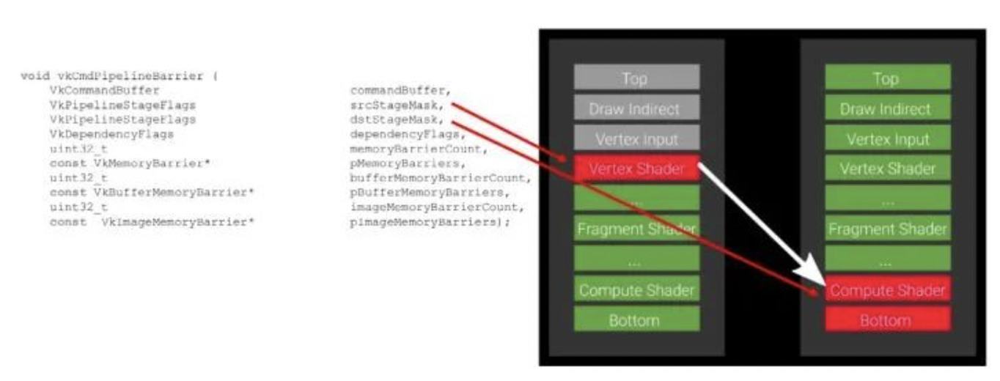

**参考文档：**

1. *Vulkan Overview*
2. *Android and Vulkan - GDD China.pdf*
3. *Vulkan Programming Guide*
4. *Vulkan Cookbook*
5. *Learning Vulkan*
6. *Vulkan Multi-Threading*
7. *Vulkan中的同步机制*
8. *Vulkan® 1.1.148 - A Specification*
9. *VULKAN BARRIERS EXPLAINED*
10. *vulkan中的同步和缓存控制之二，barrier和event*
11. *Xinzhao：vulkan中的同步和缓存控制之一，fence和semaphore*

> *原文链接:* *https://zhuanlan.zhihu.com/p/165341403*

