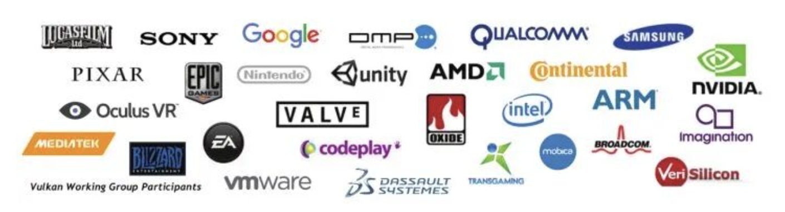
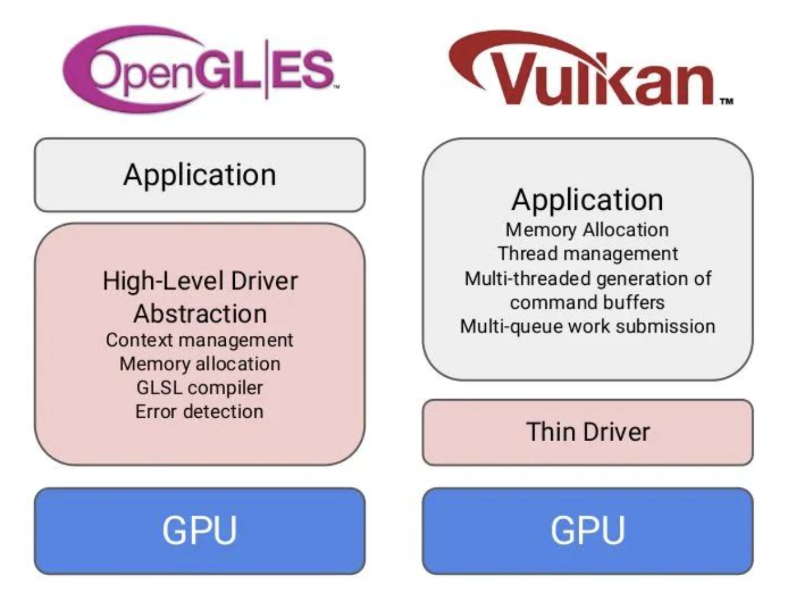

## 1. Vulkan起源和历史

### 1.1 AMD Mantle

2013年，AMD主导开发了Mantle。Mantle是面向3D游戏的新一代图形渲染 API，可以让开发人员直接操作GPU硬件底层，从而提高硬件利用率和游戏性能，效果显著。

Mantle很好的带动了图形行业发展，微软参考AMD Mantle的思路开发了DirectX 12，苹果则提出了Metal。

但是因为AMD行业影响力和领导力不足，Mantle没有发展成为全行业的标准。

2015年，AMD宣布不在维护Mantle，Mantle功成身退。Khronos接过AMD手中的接力棒，在Mantle的基础上推出了Vulkan。

### 1.2 Vulkan的诞生

**科纳斯组织**（Khronos Group）的成员来自图形行业各个领域，专注于制定行业内的开放标准（Open standard）。相对比AMD，Khronos在行业内有更大的影响力和领导力。

来自图形行业各个领域的Khronos成员都同意需要新一代的跨平台GPU API，由此，继承了Mantle”遗志“的Vulkan诞生了。

Vulkan的开发者来自图形领域的各行各业，有GPU厂商，有系统厂商，有游戏引擎厂商… …

所以Vulkan诞生之初就决定了它一定要有跨平台属性，目的就是成为行业内的统一标准。

### 1.3 Vulkan-新一代GPU API的特性

OpenGL已经发展了25年以上，并不断满足行业需求，但是现在已经逐渐满足不了行业的需要。

GPU的可编程性越来越强，越来越多的平台开始支持加速图形，计算，视觉和深度学习。灵活性和可移植性变得很重要。

性能上，OpenGL也不能充分发挥现代CPU多核多线程的性能优势。

为了解决上述问题，行业对新一代GPU API的提出了更高的要求：

- Explicit（明确、透明）
- GPU driver做更少的事情，把更多的控制权交给开发者
- Streamlined（精简）
- 更快的性能，更低的开销，更少的延迟
- Portable（可移植）
- Cloud, desktop, console, mobile and embedded
- Extensible （可扩展）
- 支持新功能的扩展，推动行业技术进步

## 2. Vulkan的优势

### 2.1 显式的GPU控制

在OpenGL驱动中，驱动会帮你做API验证，内存管理，线程管理等大部分工作。

**OpenGL驱动大包大揽什么事情都管**，即使应用使用API出错，也会帮忙解决处理，保证应用正常运行。开发者使用起来非常简单。

但是OpenGL为了这些事情，牺牲了大量的性能。在一些复杂的应用场景，依然会遇到无法解决的问题，很多时候经常是驱动的一厢情愿，应用并不为此买单。

Vulkan则不然。

**Vulkan把API验证、内存管理、多线程管理等工作交由开发者负责。**一旦API使用出错，应用就会出现crash。

没人帮应用兜底，所有事情都交由应用打理。这种方式无疑增加了API使用的复杂度和困难度，但换来的是性能上巨大的提升。单单是在驱动中去掉API验证操作，就把性能提升了9倍。

**2.2 CPU多线程的效率提升**

在OpenGL中，所有的渲染操作都放在一个线程，其他线程就算处于空闲状态，也只能围观。

Vulkan中引入了 **`Command Buffer`** 的概念，每个线程都可以往**`Command Buffer`** 提交渲染命令，给开发者提供了充分发挥CPU多核多线程的优势。在复杂场景下，性能的提升非常客观！

### 2.3 可移植性

Vulkan的开发者来自图形领域的各行各业，有GPU厂商，有系统厂商，有游戏引擎厂商… …

所以Vulkan诞生之初就决定了它一定要有跨平台属性。相较于之前需要针对每个平台做单独开发，Vulkan可以实现跨平台移植。

### 2.4 Vulkan和OpenGL性能对比

Khronos给出了一张各个图形API理论性能对比：

PowerVR做了一个视频做了Vulkan和OpenGL的性能对比：

视频地址：*PowerVR Rogue GPUs running Gnome Horde demo*

## 3. Vulkan 适用范围

目前，行业内一致认为Vulkan是未来的趋势。但是具体到应用开发者，我们是否现在就要将所有的OpenGL应用移植到Vulkan？

要弄清这个问题，我们要知道Vulkan的优势是什么，它可以解决什么问题。

前文已经说了，Vulkan的优势在于显式控制和多线程功能，这些功能使我们能够在更少的CPU时间内将更多命令推送到GPU，并具有更精细的成本控制。

但是，OpenGL却提供了更易于使用的硬件访问方式。

决定是使用OpenGL还是Vulkan，你需要平衡两者的优势和缺点，针对不同情况选择最合适的API。

### 3.1 性能上的考虑

如果你想通过Vulkan获得性能上的收益，你首先要搞清楚你的应用的性能瓶颈在哪里？Vulkan并非是解决性能问题的万能灵药！

### 3.1.1 非渲染流程导致的性能问题

Vulkan提升的是驱动的性能。如果你的应用本身性能存在问题，并非渲染流程导致，替换渲染实现方式并不会对你带来巨大的收益。

### 3.1.2 GPU loading过重

**Vulkan和OpenGL在GPU的使用上没有质的差距。如果你应用的性能瓶颈在于GPU，GPU loading很重，把OpenGL换成Vulkan也未必有多大的提升。**

### 3.1.3 对卡顿非常在意

如果你的应用对微小的卡顿或者帧率抖动比较在意，Vulkan可以显式控制场景渲染期间何时发生耗时的操作。这比OpenGL通过启发式（推断的方式）管理状态和资源更加有优势。

### 3.1.4 希望进行多线程渲染

如果OpenGL的单线程渲染让你的应用陷入了的性能瓶颈，你希望通过多线程充分发挥CPU能力，Vulkan非常适合。

### 3.1.5 离屏渲染

如果有离屏渲染的需求，Vulkan也可以胜任。

### 3.2 复杂度的考虑

### 3.2.1 代码复杂度

使用Vulkan画一个三角形就需要上千行代码。Vulkan复杂繁琐的API对开发者提出了挑战。

对于许多用例，OpenGL仍然是一个不错的选择。它确实降低了复杂性和维护负担，同时在许多情况下仍提供了出色的整体性能。开发人员能够专注于解决实际图形和计算问题，而不用编写大量的Vulkan代码。

### 3.2.2 开发者的工作量

OpenGL驱动会帮开发者做API验证、资源管理等操作，但是Vulkan的驱动把这些交给开发者。这对开发者提出了更高的要求。在开发过程中，你需要考虑内存管理、线程同步，一个不小心就会导致crash或者花屏，没人帮你处理，一切只能靠自己。

### 3.2.3 不同硬件之间的移植工作

Vulkan虽然可以支持多平台，但是因为Vulkan extension（扩展）仍然是平台相关的。如果想充分发挥平台特性，代码的耦合性依然很高。

**参考文档：**

1. *Vulkan Overview*
2. *Android and Vulkan - GDD China.pdf*
3. *Vulkan Programming Guide*
4. *Vulkan Cookbook*
5. *Learning Vulkan*
6. *Transitioning from OpenGL to Vulkan*
7. *Vulkan Multi-Threading*
8. *功成身退：AMD Mantle不再优化了*

> 原文链接: https://zhuanlan.zhihu.com/p/165141740