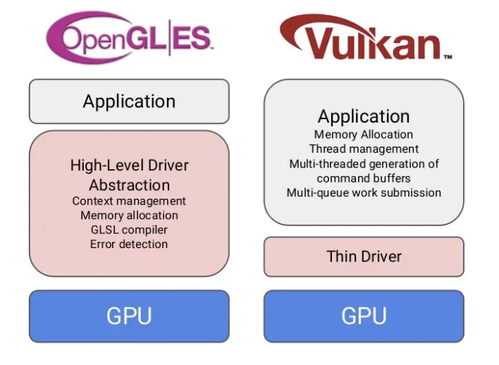
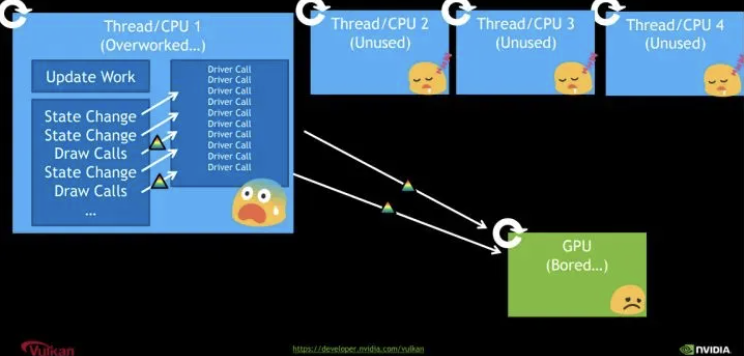
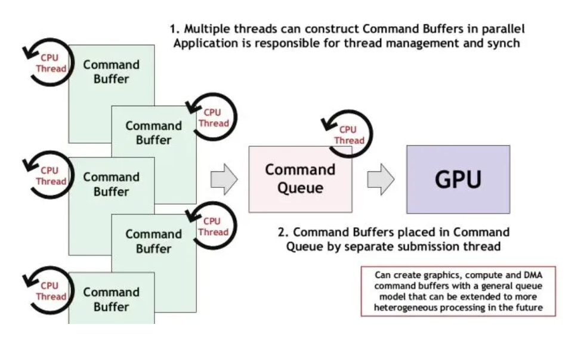
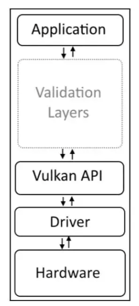
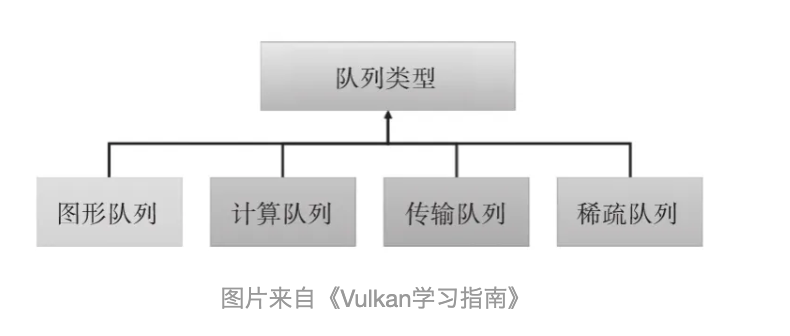
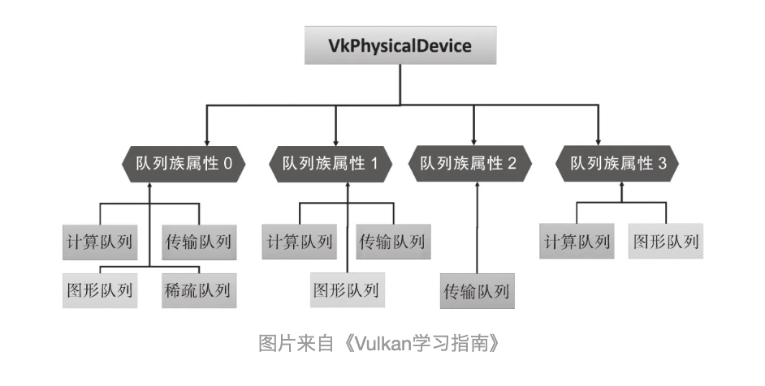
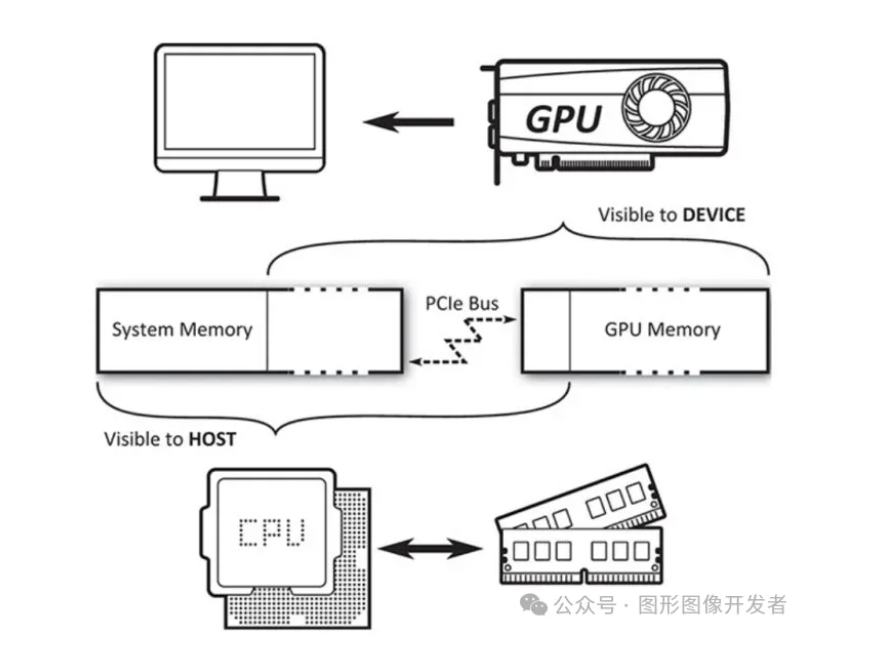

# Vulkan 简介

**Vulkan是一个用于图形和计算设备的编程接口**。

在老的API（例如`OpenGL`）里，驱动程序会跟踪大量对象的状态，自动管理内存和同步，以及在程序运行时检查错误。这对开发人员非常友好，但是在应用程序经过调试并且正确运行时，会消耗宝贵的`CPU`性能。`Vulkan`解决这个问题的方式是，<font color="red">将状态跟踪、同步和内存管理交给了应用程序开发人员</font>，同时将正确性检查交给各个层进行代理，而要想使用这些层必须手动启用。这些层在正常情况下不会在应用程序里执行。


# **什么是 Vulkan**

Vulkan 是由 Khronos Group 开发的一种现代、高性能的图形和计算 API。**它设计用于替代 OpenGL，并提供更直接和细粒度的硬件控制。**

**与 OpenGL 相比，Vulkan 可以更详细的向显卡描述你的应用程序打算做什么，从而可以获得更好的性能和更小的驱动开销。**

Vulkan 的开发者来自图形领域的各行各业，有 GPU 厂商，有系统厂商，有游戏引擎厂商等。

所以 Vulkan 诞生之初就决定了它一定要有跨平台属性，目的就是成为行业内的统一标准。


# **Vulkan 对比 OpenGL**

很多同学肯定经常听到这样的言论：OpenGL（ES）都过时啦，还学它干嘛，现在大家都学 Vulkan 了。

抛开业务场景去谈优势、劣势都是耍流氓，**目前我还看不到 OpenGL（ES）会被 Vulkan 完全替换的可能。**

就拿移动应用开发来说，OpenGL ES 3.0  早在 2012 年发布了， 很过 APP 开发者考虑到 Android 设备的兼容性，依然在使用 GL ES 2.0 版本，另外 iOS 端开发者主要使用苹果的 Metal （类似于 GLES，性能更优）。

**快速开发轻量级、跨平台的图形应用， OpenGL（ES）有着无可替代的优势**，比如在移动开发中，使用 OpenGL ES 做一些图像视频特效、图形图像渲染，开发者可以在更短的时间内完成交付。

**Vulkan 作为一个更为现代化和高效的解决方案，更适合构建对渲染性能和效率要求高的大型软件**。

Vulkan 常用于游戏开发、渲染引擎、虚拟现实、3D 建模等领域，另外，手机厂商也使用 Vulkan 开发和优化各种高性能、图形密集型的应用和功能，从而提升设备性能和用户体验。


### **OpenGL**

#### 优势：

- **跨平台支持**：OpenGL支持多种操作系统，包括 Windows、macOS、Linux 以及移动操作系统，如iOS和 Android （OpenGL ES）。

- **易于学习和使用**：由于OpenGL有着较长的历史，学习资源丰富，文档齐全，初学者较容易上手。

- **广泛应用**：在游戏开发、CAD、虚拟现实、科学可视化等领域广泛应用，拥有庞大的用户基础。

- **兼容性好**：对于需要兼容多种硬件和操作系统的应用，OpenGL是一个不错的选择。

- **成熟的生态系统**：丰富的第三方库和工具，如 GLUT、GLEW 等，使开发更加便捷。

  

#### 劣势：

- **性能限制**：由于OpenGL的抽象层次较高，某些情况下的性能不如低级别的图形API。
- **单线程设计**：OpenGL的设计主要是单线程的，这在多线程应用中可能会导致性能瓶颈。
- **驱动差异**：不同厂商的驱动实现可能存在差异，导致一些未定义行为和兼容性问题。


### Vulkan**

#### 优势：

- **高性能**：Vulkan的设计允许更直接地控制GPU，减少了驱动程序的开销，使其在高性能应用中表现出色。

- **多线程支持**：Vulkan原生支持多线程，能够更有效地利用多核 CPU，提升渲染性能。

- **更低的开销**：通过减少驱动程序的开销，Vulkan提供了更细粒度的控制和更高效的资源管理。

- **统一的跨平台支持**：与OpenGL一样，Vulkan也支持多种操作系统，并且提供了一致的行为和性能。

  

#### 劣势：

- **复杂性高**：Vulkan的设计更为底层和复杂，学习曲线陡峭，对于新手来说上手难度较大。
- **开发成本高**：由于需要更多的手动管理和优化，开发时间和成本可能更高。
- **生态系统尚在完善**：虽然Vulkan生态系统在不断成长，但与OpenGL相比，某些第三方工具和库可能还不够成熟。
- **硬件支持**：虽然大多数现代GPU都支持Vulkan，但一些较老的硬件可能不支持。


# **Vulkan 的优势体现在哪里**

### **驱动层面**

**在 OpenGL 驱动中，驱动会帮你做API验证，内存管理，线程管理等大部分工作**。

OpenGL 驱动大包大揽什么事情都管，即使应用使用API出错，也会帮忙解决处理，保证应用正常运行。开发者使用起来非常简单。

但是 OpenGL为了这些事情，牺牲了大量的性能。

在一些复杂的应用场景，依然会遇到无法解决的问题，很多时候经常是驱动的一厢情愿，应用并不为此买单。

Vulkan 则不然，**Vulkan把API验证、内存管理、多线程管理等工作交由开发者负责。**一旦API使用出错，应用就会出现crash。

没人帮应用兜底，所有事情都交由应用打理。这种方式无疑增加了API使用的复杂度和困难度，但换来的是性能上巨大的提升。

单单是在驱动中去掉API验证操作，就把性能提升了9倍。



### **多线程支持**

在OpenGL中，所有的渲染操作都放在一个线程，其他线程就算处于空闲状态，也只能围观。



Vulkan中引入了 Command Buffer 的概念，每个线程都可以往Command Buffer 提交渲染命令，给开发者提供了充分发挥CPU多核多线程的优势。在复杂场景下，性能的提升非常客观！



# **如何学习 Vulkan**

如果你计划从事图形图像相关的岗位，如特效、游戏、渲染引擎、VR 等，建议学习下 Vulkan 。从招聘网站上可以看到，这些岗位的职位描述（JD）高频出现了 Vulkan ，已经慢慢的成为趋势。

学习 Vulkan 需要具备什么基础？

**了解 C/C++ ，了解 OpenGL（ES）（或者其他图形 API ）**。

为什么需要了解  OpenGL（ES）？

OpenGL 和 Vulkan 中的很多概念都是相似的，比如渲染管线、frameBuffer 帧缓冲区、离屏渲染、片段/顶点/计算着色器、实例化渲染等，之前如果接触过 OpenGL ,  Vulkan 学起来会事半功倍。

**后面将会出一系列文章来介绍 Vulkan 开发**（基于移动端 Android 设备演示），从 Vulkan 的基本概念开始，到绘制一个三角形，再到多通道渲染、加载 3D 模型、PBR、计算着色器等高级特效。


一些学习资料：

- 官方 Sample，支持 Android、WIndows、Linux、MacOS 平台

  https://github.com/KhronosGroup/Vulkan-Samples

- SaschaWillems 大神的教程，支持 Android、iOS、WIndows、Linux、MacOS 平台

  https://github.com/SaschaWillems/Vulkan

- Google 提供的 Vulkan 入门学习的 sample ，从创建 Vulkan device 到纹理贴图，很贴心。

  https://github.com/googlesamples/android-vulkan-tutorials


# **参考文章：**

https://zhuanlan.zhihu.com/p/165141740

https://geek-docs.com/vulkan/vulkan-tutorial/vulkan-and-opengl.html


# Vulkan 实例（Instance）

**Vulkan 实例 是 Vulkan API中的一个基本概念，它是连接 Vulkan 库和应用程序之间的桥梁，用于初始化Vulkan 库。**创建 Vulkan 实例涉及到向驱动程序提供应用程序的一些细节，如应用程序信息和引擎信息等。

**在Vulkan中，实例（VkInstance）是存储所有每个应用状态的对象，应用程序必须在执行任何其他 Vulkan 操作之前创建一个 Vulkan 实例。**

<font color="red">这个**类似于 OpenGL 的上下文概念**</font>，一个实例代表一整 Vulkan 环境（或上下文）。不同的 Vulkan环境能够获取到不同的 Vulkan 功能特性。


## 创建 VkInstance

Vulkan 编程中**，创建一个 Vulkan 组件有一个固定的规则，首先需要设置一个创建组件信息的结构体 VkxxxCreateInfo，然后调用创建组件的 API VkCreatexxx 。**


## VkInstanceCreateInfo

```c++
typedef struct VkInstanceCreateInfo {
    VkStructureType             sType;
    const void*                 pNext;
    VkInstanceCreateFlags       flags;
    const VkApplicationInfo*    pApplicationInfo;
    uint32_t                    enabledLayerCount;
    const char* const*          ppEnabledLayerNames;
    uint32_t                    enabledExtensionCount;
    const char* const*          ppEnabledExtensionNames;
} VkInstanceCreateInfo;
```

- **sType** 是该结构体的类型枚举值， 必须 是 VkStructureType::VK_STRUCTURE_TYPE_INSTANCE_CREATE_INFO 。

- pNext 要么是 nullptr 要么指向其他结构体来扩展该结构体。

- flags 是 VkInstanceCreateFlagBits 所表示的位域值，用于设置 VkInstance 的行为。

- **pApplicationInfo** 要么是 nullptr， 要么指向应用信息结构体，用于应用细节设置。

- **enabledLayerCount** 激活的 layer 数量。

- **ppEnabledLayerNames** 指向数量为 enabledLayerCount 的 layer 字符串数组，用于设置要激活的 layer。

- **enabledExtensionCount** 激活 instance 扩展的数量。

- **ppEnabledExtensionNames** 指向数量为 enabledExtensionCount 的扩展字符串数组，用于设置要激活的 instance 扩展。

  

重点讲下 **VkApplicationInfo、Layer 和 Extension**。

**VkApplicationInfo**

```c++
  VkApplicationInfo appInfo = {
      .sType = VK_STRUCTURE_TYPE_APPLICATION_INFO,
      .pNext = nullptr,
      .pApplicationName = "my_vulkan_app",
      .applicationVersion = VK_MAKE_VERSION(1, 0, 0),
      .pEngineName = "vulkan_tutorial",
      .engineVersion = VK_MAKE_VERSION(1, 0, 0),
      .apiVersion = VK_MAKE_VERSION(1, 0, 0),
  };
```

- sType 是该结构体的类型枚举值， 必须 是 VkStructureType::VK_STRUCTURE_TYPE_APPLICATION_INFO 。

- pNext 要么是 NULL 要么指向其他结构体来扩展该结构体。

- pApplicationName 要么是 NULL 要么指向一个以空字符为结尾的 UTF-8 字符串，用于表示用户自定义应用名称。

- applicationVersion 一个无符号整型，用于用户自定义应用版本。

- pEngineName 要么是 nullptr 要么指向一个以空字符为结尾的 UTF-8 字符串，用于表示用户自定义引擎名称。

- engineVersion 一个无符号整型，用于用户自定义引擎版本。

- **apiVersion 是应用打算使用的 Vulkan 的最高 核心 版本，并且忽略 apiVersion 的 patch 版本**。

  

其中 pApplicationName 、 applicationVersion 、 pEngineName 和 engineVersion 这几个值随便设置，甚至可以不设置，赋为空都可以，这些参数不影响实例的创建。


而 apiVersion 参数是最为重要的核心参数 ，当创建实例时，该参数用于指定此实例环境中 Vulkan 的 核心 版本 。

**如果你 Vulkan 版本设置错了，可能没法使用一些特性。**


Vulkan API 的最新版本是 1.3，目前 Vulkan 有 4 个版本：

- Vulkan 1.0 主要提供光栅化图形和并行计算的功能。对应 VK_API_VERSION_1_0 。
- Vulkan 1.1 主要为 Vulkan 1.0 不完善的地方进行补全。对应 VK_API_VERSION_1_1 。
- Vulkan 1.2 主要提供硬件光追的功能。对应 VK_API_VERSION_1_2 。
- Vulkan 1.3 主要提供动态光栅化图形的功能。对应 VK_API_VERSION_1_3 。

每个 Vulkan 新版本的发布不单单提供基本功能，还会提供一系列扩展功能，并且会将之前版本中的一些扩展功能提升囊括至核心版本中。


## Layer

Vulkan 的 Layer（层）是一种重要的机制，允许开发者在 Vulkan API 的核心功能上插入额外的功能和工具。



**Layer 主要的特点是模块化，可以根据需要加载和卸载，开发者可以选择在应用程序初始化时启用哪些层。**


**常用作正确性验证检查。**比如你添加了验证层 VK_LAYER_KHRONOS_validation ，如果在执行阶段发生了使用错误， Layer 会输出错误信息，帮助开发者定位错误。

目前 Vulkan 支持的 层 如下：

- **VK_LAYER_KHRONOS_validation Vulkan API 验证和错误检查。**
- VK_LAYER_LUNARG_gfxreconstruct 使用 GFXReconstruct 捕获应用的 Vulkan 指令。
- VK_LAYER_LUNARG_api_dump 输出调用的 API 和传入的参数。
- VK_LAYER_KHRONOS_profiles 帮助测试硬件的性能，而不需要物理接触每个设备。该 层 将会覆盖从 GPU 查询到的数据。
- VK_LAYER_LUNARG_monitor 在应用界面的标题处显示帧率。
- VK_LAYER_LUNARG_screenshot 将显示的画面帧输出到一个图片文件中。
- VK_LAYER_KHRONOS_synchronization2 使用系统实现的 VK_KHR_synchronization2 扩展，而不是驱动实现的。
- VK_LAYER_KHRONOS_shader_object 使用系统实现的 VK_EXT_shader_object 扩展，而不是驱动实现的。

可以通过 vkEnumerateInstanceLayerProperties函数获取系统中 Vulkan 支持的 Layer ：

```c++
uint32_t layer_property_count = 0;
vkEnumerateInstanceLayerProperties(&layer_property_count, nullptr);

std::vector<VkLayerProperties> layer_properties(layer_property_count);
vkEnumerateInstanceLayerProperties(&layer_property_count, layer_properties.data());
```

思考：vkEnumerateInstanceLayerProperties 这个函数为什么调用了 2 次？
其中 VkLayerProperties 定义如下：

```c++
// 由 VK_VERSION_1_0 提供
typedef struct VkLayerProperties {
    char        layerName[VK_MAX_EXTENSION_NAME_SIZE];
    uint32_t    specVersion;
    uint32_t    implementationVersion;
    char        description[VK_MAX_DESCRIPTION_SIZE];
} VkLayerProperties;
```


## Extension

**Vulkan Extensions（扩展）是对 Vulkan API 的功能扩展，它们允许硬件制造商、平台开发者和第三方提供额外的功能和特性，这些功能和特性不包含在核心 Vulkan 规范中。**


在 Vulkan 中有两类扩展：

- **Instance 扩展 与使用哪一个 GPU 设备无关，与 Vulkan 环境有关。**VkInstanceCreateInfo 中的 enabledExtensionCount 和 ppEnabledExtensionNames 就是用于配置此类 Instance 扩展 。
- Device 扩展 与使用哪一个 GPU 设备有关。不同厂家的 GPU 设备会支持不同的设备扩展。这将会在之后的章节展开。

VkInstance 支持的实例扩展可以通过 vkEnumerateInstanceExtensionProperties 函数获取：

```c++
// 由 VK_VERSION_1_0 提供
VkResult vkEnumerateInstanceExtensionProperties(
    const char*                                 pLayerName,
    uint32_t*                                   pPropertyCount,
    VkExtensionProperties*                      pProperties
);
```

要想获取全部的扩展，该函数的调用与 vkEnumerateInstanceLayerProperties(...) 类似，调用两遍，第一遍 pProperties 为 nullptr ，第二遍为有效值即可：

```c++
uint32_t extension_property_count = 0;
vkEnumerateInstanceExtensionProperties(nullptr, &extension_property_count, nullptr);

std::vector<VkExtensionProperties> extension_properties(extension_property_count);
vkEnumerateInstanceExtensionProperties(nullptr, &extension_property_count, extension_properties.data());
```

其中 VkExtensionProperties 定义如下：

```c++
// 由 VK_VERSION_1_0 提供
typedef struct VkExtensionProperties {
    char        extensionName[VK_MAX_EXTENSION_NAME_SIZE];//扩展名称
    uint32_t    specVersion;//版本
} VkExtensionProperties;
```


有一些实例扩展我们需要重点关注一下

- **VK_KHR_surface 代表窗口通用平面扩展。**
- VK_{vender}_{platform}_surface 代表各个平台各自的窗口平面（各自平台适配到通用平面）。

**比如**

- **VK_KHR_win32_surface** 为 Windows 平台，供应商为 Khronos 。
- VK_OHOS_surface 为 OpenHarmony 平台，供应商为 华为 。
- **VK_KHR_android_surface** 为 Android 平台，供应商为 Khronos 。
- VK_KHR_[wayland/xcb/xlib]_surface 为 Linux 平台（其中 [wayland/xcb/xlib] 表示三者其一），供应商为 Khronos 。

**创建 Instance 示例：**

```C++
VkInstance instance = nullptr;

std::vector<const char*> instance_extensions;
instance_extensions.push_back("VK_KHR_surface");
instance_extensions.push_back("VK_KHR_android_surface");//Android
//如果是 WIndow 平台使用 VK_KHR_win32_surface

std::vector<const char *> instance_layers;
instance_layers.push_back("VK_LAYER_KHRONOS_validation");//添加验证层

VkApplicationInfo appInfo = {
      .sType = VK_STRUCTURE_TYPE_APPLICATION_INFO,
      .pNext = nullptr,
      .pApplicationName = "my_vulkan_app",
      .applicationVersion = VK_MAKE_VERSION(1, 0, 0),
      .pEngineName = "example",
      .engineVersion = VK_MAKE_VERSION(1, 0, 0),
      .apiVersion = VK_MAKE_VERSION(1, 0, 0),
  };

VkInstanceCreateInfo instanceCreateInfo{
      .sType = VK_STRUCTURE_TYPE_INSTANCE_CREATE_INFO,
      .pNext = nullptr,
      .pApplicationInfo = &appInfo,
      .enabledLayerCount = 
          static_cast<uint32_t>(instance_layers.size()),
      .ppEnabledLayerNames = instance_layers.data(),
      .enabledExtensionCount =
          static_cast<uint32_t>(instance_extensions.size()),
      .ppEnabledExtensionNames = instance_extensions.data(),
  };

VkResult result = vkCreateInstance(&instanceCreateInfo, nullptr, &instance);
if (result != VK_SUCCESS)
{
   //VkInstance 创建失败
}

// 开启 Vulkan 编程 ...
vkDestroyInstance(instance, nullptr);//通过 vkDestroyInstance 函数销毁 instance
```


# Vulkan 物理设备

上一节了解了 Vulkan 实例，一旦有了实例，就可以查找系统里安装的与 Vulkan 兼容的物理设备。

**Vulkan 物理设备（PhysicalDevice）一般是指支持 Vulkan 的物理硬件**，通常是系统的一部分--显卡、加速器、数字信号处理器或者其他的组件。系统里有固定数量的物理设备，每个物理设备都有自己的一组固定的功能。

**一台主机上可能连接着多个支持 Vulkan 的物理设备**，为此 Vulkan 提供列举出系统中支持 Vulkan 的所有物理设备功能，开发者可通过 vkEnumeratePhysicalDevices() 函数枚举支持 Vulkan 的物理设备。

vkEnumeratePhysicalDevices 函数其定义如下：

```c++
VkResult vkEnumeratePhysicalDevices(
    VkInstance                                  instance,
    uint32_t*                                   pPhysicalDeviceCount,
    VkPhysicalDevice*                           pPhysicalDevices);
```

- instance 是之前使用 vkCreateInstance 创建的 VkInstance 句柄。
- pPhysicalDeviceCount 是用于指定或获取的物理设备数量。
- pPhysicalDevices 要么是 nullptr 要么是数量不小于 pPhysicalDeviceCount 的 VkPhysicalDevice 数组。

当 pPhysicalDevices 为 nullptr 时，该函数会将系统中支持 Vulkan 的设备数量写入 pPhysicalDeviceCount 中。

如果 pPhysicalDevices 为一个有效指针，则其指向一个 VkPhysicalDevice 数组，并且该数组长度不能小于 pPhysicalDeviceCount 。

如果 pPhysicalDeviceCount 中指定的数量小于系统中的物理设备数量，则 pPhysicalDevices 中写入的物理设备不是所有，则 vkEnumeratePhysicalDevices() 函数将会写入 pPhysicalDeviceCount 个物理设备到 pPhysicalDevices 数组中，并返回 VkResult::VK_INCOMPLET 。

**如果所有物理设备成功写入，则会返回 VkResult::VK_SUCCESS 。**

因此，枚举所有物理设备需要调用 vkEnumeratePhysicalDevices() 两次：

1.将 pPhysicalDevices 设置为 nullptr ，并通过 pPhysicalDeviceCount 获取支持系统中支持 Vulkan 的物理设备数量。

2.创建 pPhysicalDevices 数量的 VkPhysicalDevice 数组，并传入 pPhysicalDevices 中以获取系统中支持的 VkPhysicalDevice 物理设备。

```c++
VkInstance instance;

uint32_t physicalDeviceCount = 0;
vkEnumeratePhysicalDevices(instance, &physicalDeviceCount, nullptr);

std::vector<VkPhysicalDevice> physicalDevices(physical_device_count);
vkEnumeratePhysicalDevices(instance, &physicalDeviceCount, physicalDevices.data());
```

**枚举的 VkPhysicalDevice 句柄是在调用 vkCreateInstance() 创建 VkInstance 时驱动内部创建的。**

**即VkInstance 被销毁时， VkPhysicalDevice 句柄们也会销毁。**


## 物理设备属性

在通过 vkEnumeratePhysicalDevices() 获取系统中支持的物理设备句柄后，我们需要筛选出我们需要的物理设备，**比如，移动设备使用集成显卡，PC 上使用性能更强悍的独立显卡。**

我们可以通过 vkGetPhysicalDeviceProperties() 函数获取物理设备信息：

```c++
void vkGetPhysicalDeviceProperties(
    VkPhysicalDevice                            physicalDevice,
    VkPhysicalDeviceProperties*                 pProperties);
```

- physicalDevice 对应要获取属性的物理设备的句柄。
- pProperties 对应返回的物理设备属性。

其中 VkPhysicalDeviceProperties 定义如下：

```c++
typedef struct VkPhysicalDeviceProperties {
    uint32_t                            apiVersion;
    uint32_t                            driverVersion;
    uint32_t                            vendorID;
    uint32_t                            deviceID;
    VkPhysicalDeviceType                deviceType;
    char                                deviceName[VK_MAX_PHYSICAL_DEVICE_NAME_SIZE];
    uint8_t                             pipelineCacheUUID[VK_UUID_SIZE];
    VkPhysicalDeviceLimits              limits;
    VkPhysicalDeviceSparseProperties    sparseProperties;
} VkPhysicalDeviceProperties;
```

- apiVersion 该设备驱动支持的 Vulkan 版本。
- driverVersion 该设备驱动版本。
- vendorID 设备供应商的 ID 。
- deviceID 设备的 ID 。
- deviceType 设备类型。
- deviceName 设备名称。
- pipelineCacheUUID 设备的通用唯一识别码（ universally unique identifier ）。
- limits 设备的限制信息。
- sparseProperties 稀疏数据属性。

**其中 apiVersion 是最为重要的参数，该参数表明该设备支持的 Vulkan 最高版本。**

其中 VkPhysicalDeviceType 定义如下：

```c++
typedef enum VkPhysicalDeviceType {
    VK_PHYSICAL_DEVICE_TYPE_OTHER = 0,
    VK_PHYSICAL_DEVICE_TYPE_INTEGRATED_GPU = 1,
    VK_PHYSICAL_DEVICE_TYPE_DISCRETE_GPU = 2,
    VK_PHYSICAL_DEVICE_TYPE_VIRTUAL_GPU = 3,
    VK_PHYSICAL_DEVICE_TYPE_CPU = 4,
} VkPhysicalDeviceType;
```

- VK_PHYSICAL_DEVICE_TYPE_OTHER 该设备类型不与任何其他类型匹配， Vulkan 中未定义的设备类型。
- VK_PHYSICAL_DEVICE_TYPE_INTEGRATED_GPU 集成显卡。
- VK_PHYSICAL_DEVICE_TYPE_DISCRETE_GPU 独立显卡。
- VK_PHYSICAL_DEVICE_TYPE_VIRTUAL_GPU 虚拟环境中的虚拟显卡。
- VK_PHYSICAL_DEVICE_TYPE_CPU 中央处理器（ CPU ）。

一般首选使用 *`VK_PHYSICAL_DEVICE_TYPE_DISCRETE_GPU`* 独立显卡，之后再考虑使用 `VK_PHYSICAL_DEVICE_TYPE_INTEGRATED_GPU` 集成显卡。

不过在移动设备（Android 、iOS 系统）上一般只有集成显卡 **VK_PHYSICAL_DEVICE_TYPE_INTEGRATED_GPU 。**

其中 VkPhysicalDeviceLimits 用于表述该设备的一些限制，比如最大支持的图片像素大小。


## 物理设备内存属性

**单一的物理设备可能有多种不同的内存类型，它们的属性之间可能还存在着更多的差异。**

因此应用程序非常有必要查询和获取内存的特性，然后根据程序逻辑以及资源类型的不同，执行更好的资源分配策略。

vkGetPhysicalDeviceMemoryProperties 函数用于获取物理设备的内存属性。这些属性包括内存类型和内存堆的详细信息，这对于在 Vulkan 中分配和管理内存非常重要。

```c++
void vkGetPhysicalDeviceMemoryProperties(
    VkPhysicalDevice physicalDevice,
    VkPhysicalDeviceMemoryProperties* pMemoryProperties
);
```

**参数**

- physicalDevice: 需要查询内存属性的物理设备的句柄。
- pMemoryProperties: 指向 VkPhysicalDeviceMemoryProperties 结构体的指针，用于接收物理设备的内存属性。

物理设备的内存属性这里就不展开讲了，避免陷入全篇都在讲结构体的陷阱，后面讲设备内存的时候还涉及。


## 示例代码

```c++
// 创建 Vulkan 实例
VkInstance instance;
VkInstanceCreateInfo createInfo = {};
createInfo.sType = VK_STRUCTURE_TYPE_INSTANCE_CREATE_INFO;
createInfo.pApplicationInfo = &appInfo;
vkCreateInstance(&createInfo, nullptr, &instance);

uint32_t physicalDeviceCount = 0;
vkEnumeratePhysicalDevices(instance, &physicalDeviceCount, nullptr);

//枚举物理设备
std::vector<VkPhysicalDevice> physicalDevices(physical_device_count);
vkEnumeratePhysicalDevices(instance, &physicalDeviceCount, physicalDevices.data());

VkPhysicalDevice targetPhysicalDevice = VK_NULL_HANDLE;

// 选择物理设备并查询特性
for (const auto& device : physicalDevices) {
    VkPhysicalDeviceProperties deviceProperties;
    vkGetPhysicalDeviceProperties(device, &deviceProperties);

    // 这里可以根据应用程序的需求选择合适的设备
    if (deviceProperties.deviceType == VK_PHYSICAL_DEVICE_TYPE_INTEGRATED_GPU) {
        // 选择该设备
        targetPhysicalDevice = device;
        break;
    }
}

if(targetPhysicalDevice == VK_NULL_HANDLE)
{
   //没有找到合适的物理设备
}

// 开启 Vulkan 编程 ...

vkDestroyInstance(instance, nullptr);//通过 vkDestroyInstance 函数销毁 instance
```


## 参考

《Vulkan 应用开发指南》

《Vulkan 学习指南》

https://fuxiii.github.io/Essentials.of.Vulkan/PhysicalDevice.html


# Vulkan 设备队列

在Vulkan中，队列设备（Queue）是一个重要的概念。**应用程序通过将指令记录到指令缓存，然后提交到队列，而物理设备会设备读取队列中的任务并通过异步的方式来处理它们。**



每个物理设备包含一个或多个队列族（Queue Family），每个队列族包含一个或多个队列。这些队列用于处理不同类型的任务，如图形渲染、计算任务和传输操作。



Vulkan将设备队列按照队列族的方式组织，组织方式有以下特点：

- 1. 一个队列族可以支持一到多个功能。
- 2.一个队列族中包含一个或多个队列。
- 3.同一个队列族中的所有队列支持相同的功能。
- 4.队列族之间可以有相同的功能，但两两队列之间不能有两个功能集。

我们可以通过vkGetPhysicalDeviceQueueFamilyProperties 函数获取设备队列（族）信息，其定义如下：


## 获取设备队列（族）信息

```c++
// 由 VK_VERSION_1_0 提供
void vkGetPhysicalDeviceQueueFamilyProperties(
VkPhysicalDevice                            physicalDevice,
uint32_t*                                   pQueueFamilyPropertyCount,
VkQueueFamilyProperties*                    pQueueFamilyProperties
);
```

- physicalDevice物理设备。
- pQueueFamilyPropertyCount表示队列族个数。
- pQueueFamilyProperties如果为nunllptr，将会向pQueueFamilyPropertyCount中写入physicalDevice外部开放的设备队列数量。否则将写入pQueueFamilyPropertyCount一个设备队列族信息数据。

为了获取设备队列信息，类似前面的操作，需要调用两个该函数。

```c++
VkPhysicalDevice physicaDevice;//之前获取的物理设备;

uint32_t queueFamilyCount;
vkGetPhysicalDeviceQueueFamilyProperties(physicaDevice, &queueFamilyCount,
                                       nullptr);
assert(queueFamilyCount);
std::vector<VkQueueFamilyProperties> queueFamilyProperties(queueFamilyCount);
vkGetPhysicalDeviceQueueFamilyProperties(physicaDevice, &queueFamilyCount,
                                       queueFamilyProperties.data());
```

该函数将物理设备的一系列队列设备（族）信息写入了VkQueueFamilyProperties类型的读写堆栈，该类型定义如下：


## VkQueueFamilyProperties

```c++
typedef struct VkQueueFamilyProperties {
    VkQueueFlags    queueFlags;
    uint32_t        queueCount;
    uint32_t        timestampValidBits;
    VkExtent3D      minImageTransferGranularity;
} VkQueueFamilyProperties;
```

- queueFlags是一个空白位码，表示队列族支持的操作类型。
- queueCount表示该队列中可用的队列数量。
- timestampValidBits表示时钟查询返回的有效时钟。该值为0表示该队列不支持时钟时钟。如果支持，时钟时钟返回的值将包含该时钟时钟的有效数据。
- minImageTransferGranularity表示该队列族支持的最小图像传输粒度。该粒度用于定义在执行图像传输操作（如复制或分层布局转换）时的最小单位。

其中VkQueueFlags可用的值定义在VkQueueFlagBits中，其定义如下：

```c++
// 由 VK_VERSION_1_0 提供
typedef enum VkQueueFlagBits {
    VK_QUEUE_GRAPHICS_BIT = 0x00000001,//图形
    VK_QUEUE_COMPUTE_BIT = 0x00000002, //计算
    VK_QUEUE_TRANSFER_BIT = 0x00000004, //传输
    VK_QUEUE_SPARSE_BINDING_BIT = 0x00000008, //稀疏绑定
    // 由 VK_VERSION_1_1 提供
    VK_QUEUE_PROTECTED_BIT = 0x00000010,
} VkQueueFlagBits;
```

在移动开发中图形和计算队列比较常用，其中计算着色器需要使用计算队列。

**Vulkan 的设备队列是用于提交命令方便GPU执行的关键机制。理解队列组和设备队列的工作原理，有助于更很好地利用Vulkan的性能特性。**


## 示例代码

下面是一个简单的示例代码，展示了如何查询队列属性、获取包含图形队列的队列索引（用于后续创建逻辑设备）：

```c++
VkPhysicalDevice physicaDevice;//之前获取的物理设备;
// 查询队列族属性
uint32_t queueFamilyCount = 0;
vkGetPhysicalDeviceQueueFamilyProperties(physicalDevice, &queueFamilyCount, nullptr);
std::vector<VkQueueFamilyProperties> queueFamilies(queueFamilyCount);
vkGetPhysicalDeviceQueueFamilyProperties(physicalDevice, &queueFamilyCount, queueFamilies.data());

// 找到支持图形操作的队列族索引
int graphicsQueueFamilyIndex = -1;
for (uint32_t i = 0; i < queueFamilyCount; i++) {
    if (queueFamilies[i].queueFlags & VK_QUEUE_GRAPHICS_BIT) {
        graphicsQueueFamilyIndex = i;
        break;
    }
}

//后续创建逻辑设备
```


# 参考

《Vulkan学习指南》
https://fuxiii.github.io/Essentials.of.Vulkan/DeviceQueue.html


# Vulkan 逻辑设备

**Vulkan 开发系列文章：**

\1. [开篇，Vulkan 概述](http://mp.weixin.qq.com/s?__biz=MzIwNTIwMzAzNg==&mid=2654177037&idx=1&sn=b7adcfa1fa1592df694f59753985183f&chksm=8cf3543ebb84dd282395f1403ed66116039ee7a4a42f0f1dc0bdaf318584302f82f97ed3362a&scene=21#wechat_redirect)

\2. [Vulkan 实例](http://mp.weixin.qq.com/s?__biz=MzIwNTIwMzAzNg==&mid=2654177037&idx=1&sn=b7adcfa1fa1592df694f59753985183f&chksm=8cf3543ebb84dd282395f1403ed66116039ee7a4a42f0f1dc0bdaf318584302f82f97ed3362a&scene=21#wechat_redirect)

\3. [Vulkan 物理设备](http://mp.weixin.qq.com/s?__biz=MzIwNTIwMzAzNg==&mid=2654177041&idx=1&sn=1701e31a8aa6d6520dfbec640ef9ba8b&chksm=8cf35422bb84dd34a8332c60ec5525818fa9767b21889dc15b989618ad50707ad3572c02c403&scene=21#wechat_redirect)

\4. [Vulkan 设备队列](http://mp.weixin.qq.com/s?__biz=MzIwNTIwMzAzNg==&mid=2654177050&idx=1&sn=a9bedbf489a562e8ba6238d708d17ad0&chksm=8cf35429bb84dd3f86ad93fa414295a0ddb39993630ff1b36b731896fb52ff941653c1d61aba&scene=21#wechat_redirect)

在 Vulkan 中，**逻辑设备（Logical Device）是与物理设备（Physical Device）交互的接口。它抽象了对特定 GPU （物理设备）的访问，使得应用程序能够提交命令并管理资源，而无需直接与物理硬件打交道。**

举例来说，物理设备可能包含了三种队列：图形、计算和传输。但是逻辑设备创建的时候，可以只关联一个单独的队列（比如图形），这样我们就可以很方便地向队列提交指令缓存了。


## 创建逻辑设备

创建逻辑设备时，你需要指定你希望使用的队列族和队列、启用的扩展、以及一些其他特性。我们通过 vkCreateDevice() 函数创建逻辑设备。其定义如下：


## vkCreateDevice

```c++
VkResult vkCreateDevice(
VkPhysicalDevice                            physicalDevice,
const VkDeviceCreateInfo*                   pCreateInfo,
const VkAllocationCallbacks*                pAllocator,
VkDevice*                                   pDevice);
```


- physicalDevice 指定在哪一个物理设备上创建逻辑设备。
- pCreateInfo 创建逻辑设备的配置信息。
- pAllocator 内存分配器。为 nullptr 表示使用内部默认分配器，否则为自定义分配器。
- pDevice 创建逻辑设备的结果。

其中 VkDeviceCreateInfo 定义如下：


## VkDeviceCreateInfo

```c++
typedef struct VkDeviceCreateInfo {
VkStructureType                    sType;
const void*                        pNext;
VkDeviceCreateFlags                flags;
uint32_t                           queueCreateInfoCount;
const VkDeviceQueueCreateInfo*     pQueueCreateInfos;
uint32_t                           enabledLayerCount;
const char* const*                 ppEnabledLayerNames;
uint32_t                           enabledExtensionCount;
const char* const*                 ppEnabledExtensionNames;
const VkPhysicalDeviceFeatures*    pEnabledFeatures;
} VkDeviceCreateInfo;
```


- sType 是该结构体的类型枚举值， 必须 是 VkStructureType::VK_STRUCTURE_TYPE_DEVICE_CREATE_INFO 。
- pNext 要么是 NULL 要么指向其他结构体来扩展该结构体。
- flags 目前没用上，为将来做准备。
- queueCreateInfoCount 指定 pQueueCreateInfos 数组元素个数。
- pQueueCreateInfos 指定 VkDeviceQueueCreateInfo 数组。用于配置要创建的设备队列信息。
- enabledLayerCount 指定 ppEnabledLayerNames 数组元素个数。该成员已被 遗弃 并 忽略 。
- ppEnabledLayerNames 指定要开启的验证层。该成员已被 遗弃 并 忽略 。
- enabledExtensionCount 指定 ppEnabledExtensionNames 数组中元素个数。
- ppEnabledExtensionNames 指定要开启的扩展。该数组数量必须大于等于 enabledExtensionCount 。
- pEnabledFeatures 配置要开启的特性。

其中 queueCreateInfoCount 和 pQueueCreateInfos 用于指定在逻辑设备中需要创建的 设备队列 。其中 VkDeviceQueueCreateInfo 定义如下：


## VkDeviceQueueCreateInfo

```c++
// 由 VK_VERSION_1_0 提供
typedef struct VkDeviceQueueCreateInfo {
VkStructureType             sType;
const void*                 pNext;
VkDeviceQueueCreateFlags    flags;
uint32_t                    queueFamilyIndex;
uint32_t                    queueCount;
const float*                pQueuePriorities;
} VkDeviceQueueCreateInfo;
```


- **sType** 是该结构体的类型枚举值， 必须 是 VkStructureType::VK_STRUCTURE_TYPE_DEVICE_QUEUE_CREATE_INFO 。
- **pNext** 要么是 NULL 要么指向其他结构体来扩展该结构体。
- **flags** 配置额外的信息。可设置的值定义在 VkDeviceQueueCreateFlagBits 枚举中。
- **queueFamilyIndex** 指定目标设备队列族的索引。
- **queueCount** 指定要在 queueFamilyIndex 中创建设备队列的数量。
- **pQueuePriorities** 指向元素数量为 queueCount 的 float 数组。用于配置创建的每一个设备队列的优先级。

其中 queueFamilyIndex 必须 是目标物理设备中有效的设备队列族索引，并且 queueCount 必须小于等于 queueFamilyIndex 索引对应的设备队列族中的队列数量。

其中 pQueuePriorities 配置的优先级的有效等级范围为[0, 1] ，值越大，优先级越高。其中 0.0 是最低的优先级， 1.0 是最高的优先级。在某些设备中，优先级越高意味着将会得到更多的执行机会，具体的队列调由设备自身管理， Vulkan 并不规定调度规则。


## 设备扩展

前文创建实例的时候可以设置实例的扩展，在 VkDeviceCreateInfo 我们需要通过 enabledExtensionCount 和 ppEnabledExtensionNames 来指定该逻辑设备要开启的 设备扩展 （ Device Extension ）。

在开启设备扩展之前，我们需要通过 vkEnumerateDeviceExtensionProperties(...) 函数获取目标设备支持的扩展。其定义如下：


## vkEnumerateDeviceExtensionProperties

```c++
// 由 VK_VERSION_1_0 提供
VkResult vkEnumerateDeviceExtensionProperties(
VkPhysicalDevice                            physicalDevice,
const char*                                 pLayerName,
uint32_t*                                   pPropertyCount,
VkExtensionProperties*                      pProperties);
```


- physicalDevice 要查询扩展的目标物理设备。
- pLayerName 要么为 空 要么为 层 的名称。
- pPropertyCount 要么为 空 要么为 pProperties 中元素的数量。
- pProperties 为扩展信息数组。元素个数 必须 大于等于 pPropertyCount 中指定数量。

枚举设备扩展：

```c++
VkPhysicalDevice physicalDevice;//之前获取的物理设备;

uint32_t extension_property_count = 0;
vkEnumerateDeviceExtensionProperties(physicalDevice, &extension_property_count, nullptr);

std::vector<VkExtensionProperties> extension_properties(extension_property_count);
vkEnumerateDeviceExtensionProperties(physicalDevice, &extension_property_count, extension_properties.data());
```

有 几个常用的设备扩展：

- **VK_KHR_swapchain 交换链**。用于与VK_KHR_surface 和平台相关的 VK_{vender}_{platform}_surface 扩展配合使用。用于窗口化显示渲染结果。
- VK_KHR_display 某些平台支持直接全屏显示渲染结果（比如嵌入式平台：车载、移动平台等）。
- VK_KHR_display_swapchain 全屏显示交换链。与 VK_KHR_display 扩展配合使用。


## 获取设备队列

在创建完逻辑设备后，就可以通过 vkGetDeviceQueue() 函数获取设备队列。其定义如下：

```c++
void vkGetDeviceQueue(
VkDevice                                    device,
uint32_t                                    queueFamilyIndex,
uint32_t                                    queueIndex,
VkQueue*                                    pQueue);
```


- **device** 目标逻辑设备。
- **queueFamilyIndex** 是前面获取的目标设备队列的队列族索引。
- **queueIndex** 对应 VkDeviceQueueCreateInfo::queueCount 的对应设备队列索引, 用于区分创建的多个队列。
- **pQueue** 对应 VkDeviceQueueCreateInfo::queueCount 创建的第 queueIndex 的设备队列。


# 创建逻辑设备示例

```c++
//获取目标队列族索引
uint32_t queueFamilyCount = 0;
vkGetPhysicalDeviceQueueFamilyProperties(physicalDevice, &queueFamilyCount, nullptr);
std::vector<VkQueueFamilyProperties> queueFamilies(queueFamilyCount);
vkGetPhysicalDeviceQueueFamilyProperties(physicalDevice, &queueFamilyCount, queueFamilies.data());

// 找到支持图形操作的队列族
int graphicsQueueFamilyIndex = -1;
for (uint32_t i = 0; i < queueFamilyCount; i++) {
    if (queueFamilies[i].queueFlags & VK_QUEUE_GRAPHICS_BIT) {
        graphicsQueueFamilyIndex = i;
        break;
    }
}

//定义队列创建信息
float queuePriority = 1.0f;
VkDeviceQueueCreateInfo queueCreateInfo = {};
queueCreateInfo.sType = VK_STRUCTURE_TYPE_DEVICE_QUEUE_CREATE_INFO;
queueCreateInfo.queueFamilyIndex = graphicsQueueFamilyIndex;
queueCreateInfo.queueCount = 1;
queueCreateInfo.pQueuePriorities = &queuePriority;

//定义逻辑设备创建信息

//设备扩展
std::vector<const char*> device_extensions;
device_extensions.push_back("VK_KHR_swapchain");

VkDeviceCreateInfo deviceCreateInfo = {};
deviceCreateInfo.sType = VK_STRUCTURE_TYPE_DEVICE_CREATE_INFO;
deviceCreateInfo.queueCreateInfoCount = 1;
deviceCreateInfo.pQueueCreateInfos = &queueCreateInfo;
deviceCreateInfo.enabledExtensionCount = static_cast<uint32_t>(device_extensions.size());
deviceCreateInfo.ppEnabledExtensionNames = device_extensions.data();

// 你可以在这里指定设备特性和扩展
VkPhysicalDeviceFeatures deviceFeatures = {};
deviceCreateInfo.pEnabledFeatures = &deviceFeatures;

//调用 vkCreateDevice 函数创建逻辑设备，并获取设备句柄。
VkDevice device;
if (vkCreateDevice(physicalDevice, &deviceCreateInfo, nullptr, &device) != VK_SUCCESS) {
    throw std::runtime_error("failed to create logical device!");
}

// 获取图形队列句柄
VkQueue graphicsQueue;
vkGetDeviceQueue(device, graphicsQueueFamilyIndex, 0, &graphicsQueue);

//Vulkan 编程...

//销毁逻辑设备
vkDestroyDevice(device, nullptr);
```


# Vulkan 内存管理

**Vulkan 开发系列文章：**

\1. [开篇，Vulkan 概述](http://mp.weixin.qq.com/s?__biz=MzIwNTIwMzAzNg==&mid=2654177037&idx=1&sn=b7adcfa1fa1592df694f59753985183f&chksm=8cf3543ebb84dd282395f1403ed66116039ee7a4a42f0f1dc0bdaf318584302f82f97ed3362a&scene=21#wechat_redirect)

\2. [Vulkan 实例](http://mp.weixin.qq.com/s?__biz=MzIwNTIwMzAzNg==&mid=2654177037&idx=1&sn=b7adcfa1fa1592df694f59753985183f&chksm=8cf3543ebb84dd282395f1403ed66116039ee7a4a42f0f1dc0bdaf318584302f82f97ed3362a&scene=21#wechat_redirect)

\3. [Vulkan 物理设备](http://mp.weixin.qq.com/s?__biz=MzIwNTIwMzAzNg==&mid=2654177041&idx=1&sn=1701e31a8aa6d6520dfbec640ef9ba8b&chksm=8cf35422bb84dd34a8332c60ec5525818fa9767b21889dc15b989618ad50707ad3572c02c403&scene=21#wechat_redirect)

\4. [Vulkan 设备队列](http://mp.weixin.qq.com/s?__biz=MzIwNTIwMzAzNg==&mid=2654177050&idx=1&sn=a9bedbf489a562e8ba6238d708d17ad0&chksm=8cf35429bb84dd3f86ad93fa414295a0ddb39993630ff1b36b731896fb52ff941653c1d61aba&scene=21#wechat_redirect)

\5. [Vulkan 逻辑设备](http://mp.weixin.qq.com/s?__biz=MzIwNTIwMzAzNg==&mid=2654177058&idx=1&sn=1e94127b5ad3825d0e6501b89ffc794f&chksm=8cf35411bb84dd075249f830a547178117b2f788cf1fe2847d94c61348f8a6a52abffbb67dad&scene=21#wechat_redirect)

**众所周知，Vulkan 编程的代码量相对于 OpenGL 多了一个数量级**（不用害怕，后面Vulkan封装一下，用起来也会非常简洁），本文避免一上去就讲一大堆代码，奉行概念先行。

概念掌握的差不多了，再去看代码,  这样思路不容易卡住，大致就可以把握住整体代码逻辑，知道这一块代码是干嘛的，那一块是什么目的。


**Vulkan 将内存管理的工作交给了开发者自己负责**，如何分配释放内存，怎样制定内存策略都由开发者自己决定，当然出了问题也是由开发者自己负责。

Vulkan 将内存划分为两大类：**主机内存 Host Memory 和 设备内存 Device Memory**。

在移动设备上，**主机内存就是 CPU 内存，设备内存就是 GPU 内存，显存**。在此基础上，每种内存类型还可以单独按照属性进一步划分。

Vulkan提供了一种透明的机制来显示内部内存的细节以及相关属性。这样的做法在OpenGL中是完全不可能的，后者不允许应用程序显示地控制内存区域和布局。



Vulkan 系统中的内存有四种类型（并不是所有设备都支持这四种类型）：

- Host Local Memory，只对 Host 可见的内存，通常称之为普通内存
- Device Local Memory，只对 Device 可见的内存，通常称之为显存
- **Host Local Device Memory，由 Host 管理的，对 Device 可见的内存**
- Device Local Host Memory，由 Device 管理的，对 Host 可见的内存

对比这两种内存类型的话，主机内存比设备内存更慢，但是宿主机内存的容量通常更大。

设备内存，它对于物理设备是直接可见的。物理设备可以直接读取其中的内存区块。设备内存与物理设备之间的关系非常紧密，因此它的性能比宿主机内存更高。

**图像对象（VkImage） 、缓存对象（VkBuffer），以及一致变量的缓存对象（Uniform Buffer）都是在设备内存端分配的。**

单一的物理设备可能有多种类型的内存；根据它们的堆类型以及属性的不同还可能进一步细分。

函数 vkGetPhysicalDeviceMemoryProperties() 负责查询物理设备上可用的内存堆和内存属性。

## VkPhysicalDeviceMemoryProperties

```c++
typedef struct VkPhysicalDeviceMemoryProperties {
    uint32_t        memoryTypeCount;
    VkMemoryType    memoryTypes[VK_MAX_MEMORY_TYPES];
    uint32_t        memoryHeapCount;
    VkMemoryHeap    memoryHeaps[VK_MAX_MEMORY_HEAPS];
} VkPhysicalDeviceMemoryProperties;
```

- memoryTypeCount 支持的内存类型数量。
- **memoryTypes** 有效元素个数为 memoryTypeCount 的内存类型信息数组。
- memoryHeapCount 支持的内存堆数量。
- **memoryHeaps** 有效元素个数为 memoryHeapCount 的内存堆信息数组。

其中 memoryHeaps 中就是用于获取具体内存堆是哪一种。其中 VkMemoryHeap 定义如下：

## VkMemoryHeap

```c++
typedef struct VkMemoryHeap {
    VkDeviceSize         size;
    VkMemoryHeapFlags    flags;
} VkMemoryHeap;
```

- size 该堆大小。单位为字节。
- flags 该堆类型标志位。

其中 flags 就是用于指示该堆的类型。其有效值定义于 VkMemoryHeapFlagBits 中，如下：

#### VkMemoryHeapFlagBits

```c++
typedef enum VkMemoryHeapFlagBits {
    VK_MEMORY_HEAP_DEVICE_LOCAL_BIT = 0x00000001,
    VK_MEMORY_HEAP_MULTI_INSTANCE_BIT = 0x00000002,
    VK_MEMORY_HEAP_MULTI_INSTANCE_BIT_KHR = VK_MEMORY_HEAP_MULTI_INSTANCE_BIT,
    VK_MEMORY_HEAP_FLAG_BITS_MAX_ENUM = 0x7FFFFFFF
} VkMemoryHeapFlagBits;
```

#### 枚举值解释：

- VK_MEMORY_HEAP_DEVICE_LOCAL_BIT (0x00000001): 表示内存堆是设备本地的。这种内存通常是最快的，因为它与 GPU 紧密集成，适合存储需要频繁访问的数据。
- VK_MEMORY_HEAP_MULTI_INSTANCE_BIT (0x00000002): 用于多 GPU 配置，表示内存堆在多个物理设备实例中是独立的。
- VK_MEMORY_HEAP_MULTI_INSTANCE_BIT_KHR: 这是 VK_MEMORY_HEAP_MULTI_INSTANCE_BIT 的一个别名，为了兼容性而定义。KHR 后缀表示这是一个 Khronos 扩展（Khronos 是 Vulkan 标准的管理机构）。
- VK_MEMORY_HEAP_FLAG_BITS_MAX_ENUM (0x7FFFFFFF): 用于强制枚举类型为 32 位整数。这个值不实际使用，仅作为枚举类型的大小限制。

其中每个堆自身可以包含一到多个类型的内存，堆上的内存类型信息被定义在 memoryTypes 中，其 VkMemoryType 定义如下：

## VkMemoryType

```c++
typedef struct VkMemoryType {
VkMemoryPropertyFlags    propertyFlags;
uint32_t                 heapIndex;
} VkMemoryType;
```

- propertyFlags 内存类型标志位。
- **heapIndex** 对应的 memoryHeaps 堆索引。

其中 propertyFlags 有效值被定义在了 VkMemoryPropertyFlagBits 枚举中，其定义如下：

#### VkMemoryPropertyFlagBits（重点关注）

```c++
typedef enum VkMemoryPropertyFlagBits {
VK_MEMORY_PROPERTY_DEVICE_LOCAL_BIT = 0x00000001,
VK_MEMORY_PROPERTY_HOST_VISIBLE_BIT = 0x00000002,
VK_MEMORY_PROPERTY_HOST_COHERENT_BIT = 0x00000004,
VK_MEMORY_PROPERTY_HOST_CACHED_BIT = 0x00000008,
VK_MEMORY_PROPERTY_LAZILY_ALLOCATED_BIT = 0x00000010,
} VkMemoryPropertyFlagBits;
```

- **VK_MEMORY_PROPERTY_DEVICE_LOCAL_BIT** 表示在此内存类型上分配的内存可被物理设备高效访问。只有对应的堆为 VK_MEMORY_HEAP_DEVICE_LOCAL_BIT 才会有该内存类型。
- **VK_MEMORY_PROPERTY_HOST_VISIBLE_BIT** 表示在此内存类型上分配的内存可被 Host 端通过 vkMapMemory() 函数进行映射，进而进行访问。
- **VK_MEMORY_PROPERTY_HOST_COHERENT_BIT** 表示在此内存类型上分配的内存将会自动进行同步，不需要手动调用 vkFlushMappedMemoryRanges() 和 vkInvalidateMappedMemoryRanges() 来进行内存同步。
- VK_MEMORY_PROPERTY_HOST_CACHED_BIT 表示在此内存类型上分配的内存为 缓存 （高速缓存）内存， Host 端访问 非缓存 内存要比访问 缓存 内存慢。但是 非缓存 内存总是 同步内存 ( VK_MEMORY_PROPERTY_HOST_COHERENT_BIT )。
- VK_MEMORY_PROPERTY_LAZILY_ALLOCATED_BIT 表示在此内存类型上分配的内存只有物理设备可访问。内存类型不能同时为 VK_MEMORY_PROPERTY_LAZILY_ALLOCATED_BIT 和 VK_MEMORY_PROPERTY_HOST_VISIBLE_BIT 。此外其底层内存将会用于 惰性内存 。


# **内存分配**

使用vkAllocateMemory函数分配的设备内存只能在设备端进行访问，它对于宿主机来说是不可见的。

宿主机只能访问那些支持映射的设备内存类型，即，内存属性包含了**VK_MEMORY_PROPERTY_HOST_VISIBLE_BIT**标识量的内存对象。

通过之前 vkGetPhysicalDeviceMemoryProperties() 函数我们可以获取到设备的内存信息，现在我们就可以通过这些信息进行内存分配了。

为此 Vulkan 为我们提供了 vkAllocateMemory() 函数进行内存分配。该函数定义如下：

#### vkAllocateMemory

```c++
VkResult vkAllocateMemory(
    VkDevice                                    device,
    const VkMemoryAllocateInfo*                 pAllocateInfo,
    const VkAllocationCallbacks*                pAllocator,
    VkDeviceMemory*                             pMemory);
```

- device 分配内存的目标设备。
- pAllocateInfo 内存分配信息。
- pAllocator 句柄内存分配器。
- pMemory 分配的内存句柄。

其中 pAllocateInfo 用于指定内存的分配信息， pAllocator 用于指定创建 pMemory 内存句柄时的分配器。

其中主要的内存分配信息被定义在了 pAllocateInfo ，对应的 VkMemoryAllocateInfo 定义如下：

#### VkMemoryAllocateInfo

```c++
typedef struct VkMemoryAllocateInfo {
    VkStructureType    sType;
    const void*        pNext;
    VkDeviceSize       allocationSize;
    uint32_t           memoryTypeIndex;
} VkMemoryAllocateInfo;
```

- sType 是该结构体的类型枚举值， 必须 是 VkStructureType::VK_STRUCTURE_TYPE_MEMORY_ALLOCATE_INFO 。
- pNext 要么是 NULL 要么指向其他结构体来扩展该结构体。
- allocationSize 要分配的内存大小。单位为 字节 。
- **memoryTypeIndex** 分配内存的目标内存类型索引。

其中 memoryTypeIndex 尤为重要，用于指定在 memoryTypes[memoryTypeIndex] 对应的内存类型上进行内存分配，对应分配的堆为 memoryHeaps[memoryTypes[memoryTypeIndex].heapIndex] 。

由于每个 memoryTypes 都有着不同的属性，所以一般会根据功能需求在某个内存类型上进行分配。

```c++
VkDevice device; 
VkPhysicalDevice physicalDevice;
VkDeviceSize size = 1024;
VkDeviceMemory* memory = nullptr;

// 获取物理设备内存属性
vkGetPhysicalDeviceMemoryProperties(physicalDevice, &memoryProperties);

// 查找一个主机可见的内存类型
uint32_t memoryTypeIndex = VK_MAX_MEMORY_TYPES;
for (uint32_t i = 0; i < memoryProperties.memoryTypeCount; i++) {
    if ((memoryProperties.memoryTypes[i].propertyFlags & VK_MEMORY_PROPERTY_HOST_VISIBLE_BIT) &&
        (memoryProperties.memoryTypes[i].propertyFlags & VK_MEMORY_PROPERTY_HOST_COHERENT_BIT)) {
        memoryTypeIndex = i;
        break;
    }
}

if (memoryTypeIndex == VK_MAX_MEMORY_TYPES) {
    fprintf(stderr, "Could not find a suitable memory type!\n");
    exit(EXIT_FAILURE);
}

// 准备内存分配信息
VkMemoryAllocateInfo allocInfo = {};
allocInfo.sType = VK_STRUCTURE_TYPE_MEMORY_ALLOCATE_INFO;
allocInfo.allocationSize = size;
allocInfo.memoryTypeIndex = memoryTypeIndex;

// 分配内存
VK_CHECK_RESULT(vkAllocateMemory(device, &allocInfo, nullptr, memory));

printf("Memory allocated successfully!\n");
```


# **内存映射**

**我们通过API函数vkMapMemory（）来实现宿主机对设备内存的映射访问。这个函数会返回一个虚拟地址的指针，指向映射后的设备内存区域。**

原则上所有的设备内存对于 CPU 来说并不像 new/malloc 分配出来的内存那样能够直接进行读写。

**为了 CPU 能够读写设备内存，硬件供应商都会提供一部分带有 VkMemoryPropertyFlagBits::VK_MEMORY_PROPERTY_HOST_VISIBLE_BIT 属性的内存用于 CPU 访问。**

而在 Vulkan 中分配的内存最终只会对应一个 VkDeviceMemory 句柄，为了能够获得 VkMemoryPropertyFlagBits::VK_MEMORY_PROPERTY_HOST_VISIBLE_BIT 内存类型分配的内存句柄底层的内存地址，可以通过 vkMapMemory() 函数将分配的设备内存底层的虚拟 （说明见下文）地址返回给 CPU （也就是 Host 端）。

#### vkMapMemory

```c++
VkResult vkMapMemory(
    VkDevice                                    device,
    VkDeviceMemory                              memory,
    VkDeviceSize                                offset,
    VkDeviceSize                                size,
    VkMemoryMapFlags                            flags,
    void**                                      ppData);
```

- device 内存对应的逻辑设备。
- memory 要映射的目标内存。
- offset 内存映射从内存首地址开始的偏移量。从 0 开始。单位为 字节 。
- size 要映射的内存大小。单位为 字节 。如果指定为 VK_WHOLE_SIZE ，则表明映射范围为从 offset 开始到 memory 结尾。
- flags 内存映射的额外标志位参数。
- ppData 内存映射结果。为 void* 的指针。该指针减去 offset 的对齐大小最小 必须 为 VkPhysicalDeviceLimits::minMemoryMapAlignment 。

其中 memory 必须 在 VkMemoryPropertyFlagBits::VK_MEMORY_PROPERTY_HOST_VISIBLE_BIT 类型的内存上分配。

**当该函数成功返回后， memory 就被认为在Host 端进行了内存映射 ，并处于映射态。**

**当内存映射并使用结束后，可进行解除映射，进而释放系统的虚拟内存。可通过 vkUnmapMemory() 函数将映射过的内存进行解映射 。**

内存映射代码示例：

```c++
// 映射内存
void* data;
VK_CHECK_RESULT(vkMapMemory(device, *memory, 0, size, 0, &data));
printf("Memory mapped successfully!\n");

// 写入数据到内存
int* intData = (int*)data;
for (size_t i = 0; i < size / sizeof(int); i++) {
    intData[i] = i;
}
printf("Data written to memory successfully!\n");

// 解除内存映射
vkUnmapMemory(device, *memory);
printf("Memory unmapped successfully!\n");
```


# **内存同步**

**所谓内存同步是指：虚拟内存中的数据与对应的 VkDeviceMemory 设备内存底层数据保持一致。**

当分配的设备内存所对应的内存类型 包含 VkMemoryPropertyFlagBits::VK_MEMORY_PROPERTY_HOST_COHERENT_BIT 时，内存同步将 会自动 进行。其同步规则如下：

- **当向映射的虚拟内存中写入时，写入虚拟内存中的数据也会同步到对应的 VkDeviceMemory 底层设备内存中。**
- **如果 GPU 向 VkDeviceMemory 底层设备内存中写入数据时，这部分修改的设备内存也会同步到映射的虚拟内存中。**

如果分配的设备内存所对应的内存类型 不包含 VkMemoryPropertyFlagBits::VK_MEMORY_PROPERTY_HOST_COHERENT_BIT 的话，内存同步将不会自动进行。需要手动进行内存同步。

换句话说就是，映射的虚拟内存和对应的 VkDeviceMemory 设备内存是两个独立的内存，如果分配的设备内存 包含 VkMemoryPropertyFlagBits::VK_MEMORY_PROPERTY_HOST_COHERENT_BIT 则无论对虚拟内存做修改，还是对设备内存做修改，双方数据将会自动保持一致。否则需要手动进行内存同步。

如此就有两个同步方：

- **映射的虚拟内存**
- **VkDeviceMemory 设备内存**

#### 虚拟内存同步到设备内存

当对映射的虚拟内存中的数据修改时，如果设备内存类型 不包含 VkMemoryPropertyFlagBits::VK_MEMORY_PROPERTY_HOST_COHERENT_BIT 的话，则需要**通过调用 vkFlushMappedMemoryRanges() 函数手动将虚拟内存中的数据同步（拷贝）到设备内存**中。

也就是将虚拟内存中的内容 冲刷 到设备内存中。其定义如下：

##### vkFlushMappedMemoryRanges

```c++
VkResult vkFlushMappedMemoryRanges(
    VkDevice                                    device,
    uint32_t                                    memoryRangeCount,
    const VkMappedMemoryRange*                  pMemoryRanges);
```

- device 内存对应的逻辑设备。
- memoryRangeCount 指定 pMemoryRanges 数组长度。
- pMemoryRanges 指向 VkMappedMemoryRange 数组。用于配置虚拟内存到设备内存的同步。

#### 设备内存同步到虚拟内存

当对设备内存数据修改时，如果设备内存类型 不包含 VkMemoryPropertyFlagBits::VK_MEMORY_PROPERTY_HOST_COHERENT_BIT 的话，则需要通过调用 vkInvalidateMappedMemoryRanges() 函数手动将设备内存中的数据同步（拷贝）到虚拟内存中。

##### vkInvalidateMappedMemoryRanges

```c++
VkResult vkInvalidateMappedMemoryRanges(
    VkDevice                                    device,
    uint32_t                                    memoryRangeCount,
    const VkMappedMemoryRange*                  pMemoryRanges);
```

- device 内存对应的逻辑设备。
- memoryRangeCount 指定 pMemoryRanges 数组长度。
- pMemoryRanges 指向 VkMappedMemoryRange 数组。用于配置设备内存到虚拟内存的同步。

其中 VkMappedMemoryRange 定义如下：

#### VkMappedMemoryRange

```c++
typedef struct VkMappedMemoryRange {
    VkStructureType    sType;
    const void*        pNext;
    VkDeviceMemory     memory;
    VkDeviceSize       offset;
    VkDeviceSize       size;
} VkMappedMemoryRange;
```

- sType 是该结构体的类型枚举值， 必须 是 VkStructureType::VK_STRUCTURE_TYPE_MAPPED_MEMORY_RANGE 。
- pNext 要么是 NULL 要么指向其他结构体来扩展该结构体。
- memory 要同步的目标设备内存。
- offset 要同步的目标设备内存的偏移。单位为 字节 。
- size 要同步的目标设备内存的大小。单位为 字节 。如果为 VK_WHOLE_SIZE 则表示同步范围为 [offset, memory 结尾] 。

**其中 VkMappedMemoryRange::memory 在手动同步时必须处在映射态 。**

**也就是 VkMappedMemoryRange::memory 必须已经通过 vkMapMemory() 将设备内存进行映射，并且没有 映射 。当内存同步结束之后，就可以进行 解映射 了。**


# **内存释放**

当内存成功分配之后，一般会对该内存进行一些列写入和读取操作，当该内存不再被需要时，就可以将该内存通过调用 vkFreeMemory() 进行回收了。其定义如下：

#### vkFreeMemory

```c++
void vkFreeMemory(
VkDevice                                    device,
VkDeviceMemory                              memory,
const VkAllocationCallbacks*                pAllocator);
```

- device 要回收 memory 在分配时所对应的逻辑设备。

- memory 要回收的目标内存。

- pAllocator 要回收 memory 在分配时所对应的句柄分配器。

  

**参考**

- https://zhuanlan.zhihu.com/p/166387973
- [https://mp.weixin.qq.com/s/wCqRYpOBWbJSQqncqgXhBA](https://mp.weixin.qq.com/s?__biz=MzIwNTIwMzAzNg==&mid=2654173984&idx=1&sn=59593877466c3f1d267b7e9751c741d5&scene=21#wechat_redirect)
- 《Vulkan学习指南》 — [新加坡] 帕敏德·辛格（Parminder Singh）
