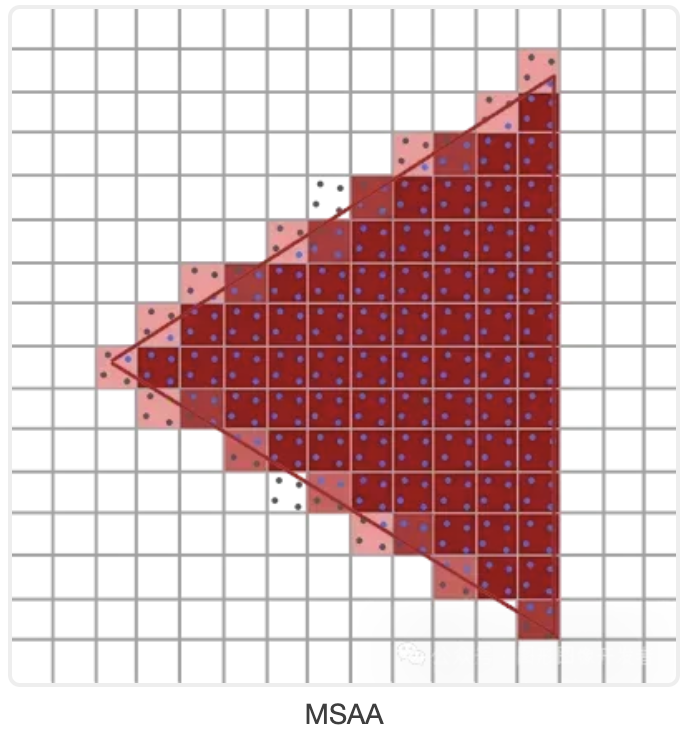
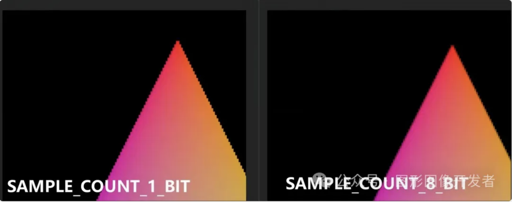
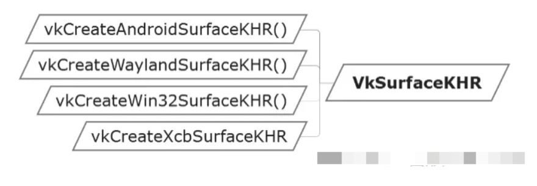
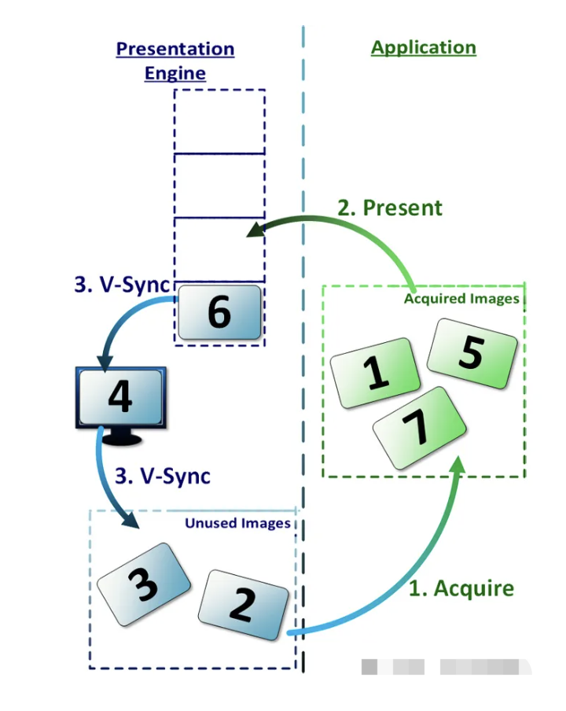
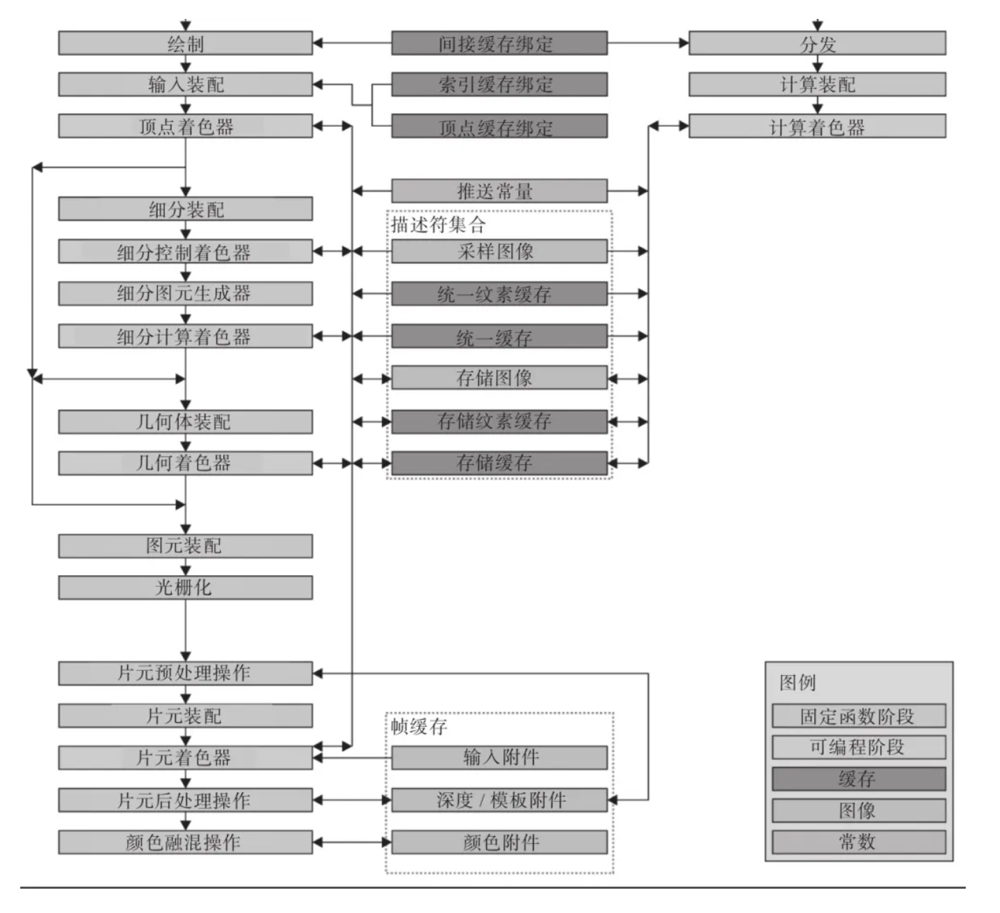
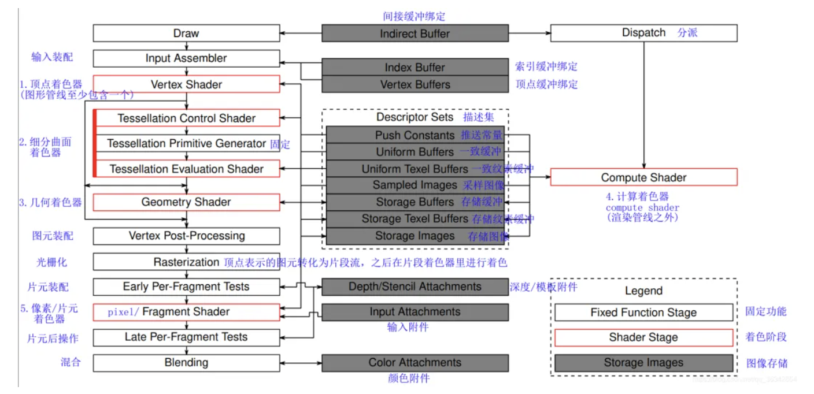
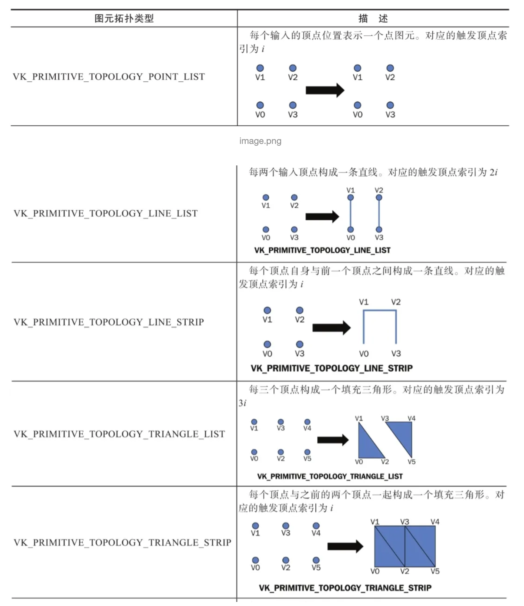
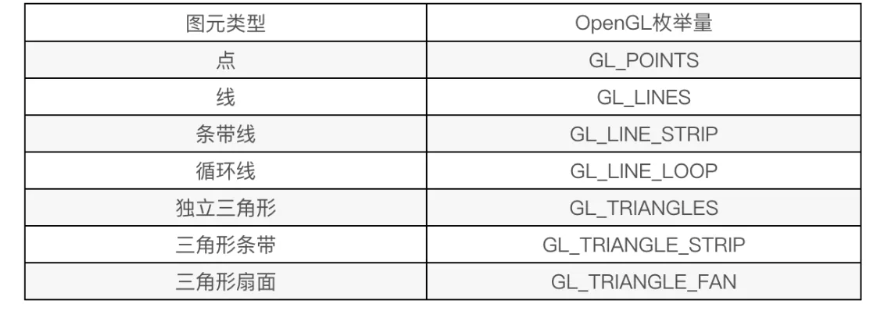
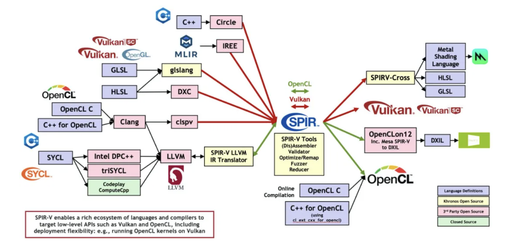
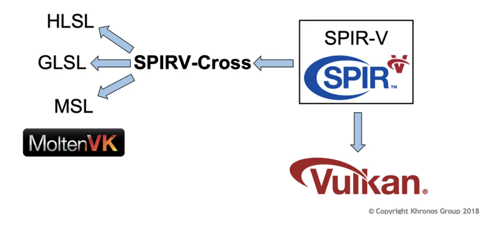

# Vulkan 简介

推荐 Vulkan 系列文章：

[ 1. 开篇，Vulkan 概述](http://mp.weixin.qq.com/s?__biz=MzIwNTIwMzAzNg==&mid=2654177035&idx=1&sn=48ab8877a7ae1620845dc63b2e7cb070&chksm=8cf35438bb84dd2e919d288deaa06f16580e5cb339d2be2ec606fbf772377dd02bc111df5e34&scene=21#wechat_redirect)

2. [Vulkan 实例](http://mp.weixin.qq.com/s?__biz=MzIwNTIwMzAzNg==&mid=2654177037&idx=1&sn=b7adcfa1fa1592df694f59753985183f&chksm=8cf3543ebb84dd282395f1403ed66116039ee7a4a42f0f1dc0bdaf318584302f82f97ed3362a&scene=21#wechat_redirect)

3. [Vulkan 物理设备](http://mp.weixin.qq.com/s?__biz=MzIwNTIwMzAzNg==&mid=2654177041&idx=1&sn=1701e31a8aa6d6520dfbec640ef9ba8b&chksm=8cf35422bb84dd34a8332c60ec5525818fa9767b21889dc15b989618ad50707ad3572c02c403&scene=21#wechat_redirect)

  4. [Vulkan 设备队列](http://mp.weixin.qq.com/s?__biz=MzIwNTIwMzAzNg==&mid=2654177050&idx=1&sn=a9bedbf489a562e8ba6238d708d17ad0&chksm=8cf35429bb84dd3f86ad93fa414295a0ddb39993630ff1b36b731896fb52ff941653c1d61aba&scene=21#wechat_redirect)

5. [Vulkan 逻辑设备](http://mp.weixin.qq.com/s?__biz=MzIwNTIwMzAzNg==&mid=2654177058&idx=1&sn=1e94127b5ad3825d0e6501b89ffc794f&chksm=8cf35411bb84dd075249f830a547178117b2f788cf1fe2847d94c61348f8a6a52abffbb67dad&scene=21#wechat_redirect)

6. [Vulkan 内存管理](http://mp.weixin.qq.com/s?__biz=MzIwNTIwMzAzNg==&mid=2654177104&idx=1&sn=35bba934feaadcf44710f3a1aa3f4a20&chksm=8cf35463bb84dd7581f4136810d132e7ba8ad973d31c33d3dc2012a07ab5b4a47e339fcdfb70&scene=21#wechat_redirect)

7. [Vulkan 缓存](http://mp.weixin.qq.com/s?__biz=MzIwNTIwMzAzNg==&mid=2654177091&idx=1&sn=0070a312e57d8e7a4768dcdf5e29dfcc&chksm=8cf35470bb84dd66e45570101eb0b39092c66170d59ec5825c4a1a661821efaf05ad2c0a16af&scene=21#wechat_redirect)

8. [Vulkan 图像](http://mp.weixin.qq.com/s?__biz=MzIwNTIwMzAzNg==&mid=2654177095&idx=1&sn=0f787a32de1b9bf03a654b5b9ea773a6&chksm=8cf35474bb84dd62e587503ab79d2bd9715b2d572ebe830a1ab0b94d398ad71ca968d8f24da8&scene=21#wechat_redirect)

9. [Vulkan 图像视图](http://mp.weixin.qq.com/s?__biz=MzIwNTIwMzAzNg==&mid=2654177103&idx=1&sn=9889d04325edf4940e0a3786882a3df2&chksm=8cf3547cbb84dd6a058f9d71561c9e745418af953f2e50e2e0c8ab2572638aac40e7047789b8&scene=21#wechat_redirect)

10. [Vulkan 窗口表面（Surface）](http://mp.weixin.qq.com/s?__biz=MzIwNTIwMzAzNg==&mid=2654177108&idx=1&sn=92151c8b687f62e0d5119f69fea35b49&chksm=8cf35467bb84dd71e025853b6170a17b95bffbd5fb0ca1499ee42eaa59231f9558d78f2c64ef&scene=21#wechat_redirect)

11. [Vulkan 交换链](http://mp.weixin.qq.com/s?__biz=MzIwNTIwMzAzNg==&mid=2654177115&idx=1&sn=41d8e9f9e2d20bd71f39ebbcee42015c&chksm=8cf35468bb84dd7ed0f67bcaa8db656f6995574dcf2852cd5f584a81ae540698840040eede69&scene=21#wechat_redirect)

12. [Vulkan 渲染通道](http://mp.weixin.qq.com/s?__biz=MzIwNTIwMzAzNg==&mid=2654177269&idx=1&sn=be0d98bfa045c6e84c07e607a9eaa6a8&chksm=8cf354c6bb84ddd02bdd202df24045d6433950fe048a92130ab3f493b7bcdc957b7c79ed633a&scene=21#wechat_redirect)

13.[Vulkan 帧缓冲区（FrameBuffer）](http://mp.weixin.qq.com/s?__biz=MzIwNTIwMzAzNg==&mid=2654177275&idx=1&sn=142709de9db4064cb02688532c113027&chksm=8cf354c8bb84dddea29a512511ca79e3b8c5df9c8431aebbed62aef67f4cdde7a5cc38edbec1&scene=21#wechat_redirect)

14. [Vulkan 图形管线](http://mp.weixin.qq.com/s?__biz=MzIwNTIwMzAzNg==&mid=2654177299&idx=1&sn=03af8b45ccd56ce1fd8ca01adb0598e3&chksm=8cf35b20bb84d2369917c759198354d45bdc8e2b73c2133de8e98719041e3a20762f43c47aef&scene=21#wechat_redirect)


**Vulkan是一个用于图形和计算设备的编程接口**。

在老的API（例如`OpenGL`）里，驱动程序会跟踪大量对象的状态，自动管理内存和同步，以及在程序运行时检查错误。这对开发人员非常友好，但是在应用程序经过调试并且正确运行时，会消耗宝贵的`CPU`性能。`Vulkan`解决这个问题的方式是，<font color="red">将状态跟踪、同步和内存管理交给了应用程序开发人员</font>，同时将正确性检查交给各个层进行代理，而要想使用这些层必须手动启用。这些层在正常情况下不会在应用程序里执行。

## **什么是 Vulkan**

Vulkan 是由 Khronos Group 开发的一种现代、高性能的图形和计算 API。**它设计用于替代 OpenGL，并提供更直接和细粒度的硬件控制。**

**与 OpenGL 相比，Vulkan 可以更详细的向显卡描述你的应用程序打算做什么，从而可以获得更好的性能和更小的驱动开销。**

Vulkan 的开发者来自图形领域的各行各业，有 GPU 厂商，有系统厂商，有游戏引擎厂商等。

所以 Vulkan 诞生之初就决定了它一定要有跨平台属性，目的就是成为行业内的统一标准。


## **Vulkan 对比 OpenGL**

很多同学肯定经常听到这样的言论：OpenGL（ES）都过时啦，还学它干嘛，现在大家都学 Vulkan 了。

抛开业务场景去谈优势、劣势都是耍流氓，**目前我还看不到 OpenGL（ES）会被 Vulkan 完全替换的可能。**

就拿移动应用开发来说，OpenGL ES 3.0  早在 2012 年发布了， 很过 APP 开发者考虑到 Android 设备的兼容性，依然在使用 GL ES 2.0 版本，另外 iOS 端开发者主要使用苹果的 Metal （类似于 GLES，性能更优）。

**快速开发轻量级、跨平台的图形应用， OpenGL（ES）有着无可替代的优势**，比如在移动开发中，使用 OpenGL ES 做一些图像视频特效、图形图像渲染，开发者可以在更短的时间内完成交付。

**Vulkan 作为一个更为现代化和高效的解决方案，更适合构建对渲染性能和效率要求高的大型软件**。

Vulkan 常用于游戏开发、渲染引擎、虚拟现实、3D 建模等领域，另外，手机厂商也使用 Vulkan 开发和优化各种高性能、图形密集型的应用和功能，从而提升设备性能和用户体验。


### **OpenGL**

#### 优势：

- **跨平台支持**：OpenGL支持多种操作系统，包括 Windows、macOS、Linux 以及移动操作系统，如iOS和 Android （OpenGL ES）。

- **易于学习和使用**：由于OpenGL有着较长的历史，学习资源丰富，文档齐全，初学者较容易上手。

- **广泛应用**：在游戏开发、CAD、虚拟现实、科学可视化等领域广泛应用，拥有庞大的用户基础。

- **兼容性好**：对于需要兼容多种硬件和操作系统的应用，OpenGL是一个不错的选择。

- **成熟的生态系统**：丰富的第三方库和工具，如 GLUT、GLEW 等，使开发更加便捷。

  

#### 劣势：

- **性能限制**：由于OpenGL的抽象层次较高，某些情况下的性能不如低级别的图形API。
- **单线程设计**：OpenGL的设计主要是单线程的，这在多线程应用中可能会导致性能瓶颈。
- **驱动差异**：不同厂商的驱动实现可能存在差异，导致一些未定义行为和兼容性问题。


### Vulkan

#### 优势：

- **高性能**：Vulkan的设计允许更直接地控制GPU，减少了驱动程序的开销，使其在高性能应用中表现出色。

- **多线程支持**：Vulkan原生支持多线程，能够更有效地利用多核 CPU，提升渲染性能。

- **更低的开销**：通过减少驱动程序的开销，Vulkan提供了更细粒度的控制和更高效的资源管理。

- **统一的跨平台支持**：与OpenGL一样，Vulkan也支持多种操作系统，并且提供了一致的行为和性能。

  

#### 劣势：

- **复杂性高**：Vulkan的设计更为底层和复杂，学习曲线陡峭，对于新手来说上手难度较大。

- **开发成本高**：由于需要更多的手动管理和优化，开发时间和成本可能更高。

- **生态系统尚在完善**：虽然Vulkan生态系统在不断成长，但与OpenGL相比，某些第三方工具和库可能还不够成熟。

- **硬件支持**：虽然大多数现代GPU都支持Vulkan，但一些较老的硬件可能不支持。

  

##  Vulkan 的优势体现在哪里

### **驱动层面**

**在 OpenGL 驱动中，驱动会帮你做API验证，内存管理，线程管理等大部分工作**。

OpenGL 驱动大包大揽什么事情都管，即使应用使用API出错，也会帮忙解决处理，保证应用正常运行。开发者使用起来非常简单。

但是 OpenGL为了这些事情，牺牲了大量的性能。

在一些复杂的应用场景，依然会遇到无法解决的问题，很多时候经常是驱动的一厢情愿，应用并不为此买单。

Vulkan 则不然，**Vulkan把API验证、内存管理、多线程管理等工作交由开发者负责。**一旦API使用出错，应用就会出现crash。

没人帮应用兜底，所有事情都交由应用打理。这种方式无疑增加了API使用的复杂度和困难度，但换来的是性能上巨大的提升。

单单是在驱动中去掉API验证操作，就把性能提升了9倍。


### **多线程支持**

在OpenGL中，所有的渲染操作都放在一个线程，其他线程就算处于空闲状态，也只能围观。


Vulkan中引入了 Command Buffer 的概念，每个线程都可以往Command Buffer 提交渲染命令，给开发者提供了充分发挥CPU多核多线程的优势。在复杂场景下，性能的提升非常客观！


## **如何学习 Vulkan**

如果你计划从事图形图像相关的岗位，如特效、游戏、渲染引擎、VR 等，建议学习下 Vulkan 。从招聘网站上可以看到，这些岗位的职位描述（JD）高频出现了 Vulkan ，已经慢慢的成为趋势。

学习 Vulkan 需要具备什么基础？

**了解 C/C++ ，了解 OpenGL（ES）（或者其他图形 API ）**。

为什么需要了解  OpenGL（ES）？

OpenGL 和 Vulkan 中的很多概念都是相似的，比如渲染管线、frameBuffer 帧缓冲区、离屏渲染、片段/顶点/计算着色器、实例化渲染等，之前如果接触过 OpenGL ,  Vulkan 学起来会事半功倍。

**后面将会出一系列文章来介绍 Vulkan 开发**（基于移动端 Android 设备演示），从 Vulkan 的基本概念开始，到绘制一个三角形，再到多通道渲染、加载 3D 模型、PBR、计算着色器等高级特效。


一些学习资料：

- 官方 Sample，支持 Android、WIndows、Linux、MacOS 平台

  https://github.com/KhronosGroup/Vulkan-Samples

- SaschaWillems 大神的教程，支持 Android、iOS、WIndows、Linux、MacOS 平台

  https://github.com/SaschaWillems/Vulkan

- Google 提供的 Vulkan 入门学习的 sample ，从创建 Vulkan device 到纹理贴图，很贴心。

  https://github.com/googlesamples/android-vulkan-tutorials


# Vulkan 实例（Instance）

**Vulkan 实例 是 Vulkan API中的一个基本概念，它是连接 Vulkan 库和应用程序之间的桥梁，用于初始化Vulkan 库。**创建 Vulkan 实例涉及到向驱动程序提供应用程序的一些细节，如应用程序信息和引擎信息等。

**在Vulkan中，实例（VkInstance）是存储所有每个应用状态的对象，应用程序必须在执行任何其他 Vulkan 操作之前创建一个 Vulkan 实例。**

<font color="red">这个**类似于 OpenGL 的上下文概念**</font>，一个实例代表一整 Vulkan 环境（或上下文）。不同的 Vulkan环境能够获取到不同的 Vulkan 功能特性。


## 创建 VkInstance

Vulkan 编程中**，创建一个 Vulkan 组件有一个固定的规则，首先需要设置一个创建组件信息的结构体 VkxxxCreateInfo，然后调用创建组件的 API VkCreatexxx 。**


## VkInstanceCreateInfo

```c++
typedef struct VkInstanceCreateInfo {
    VkStructureType             sType;
    const void*                 pNext;
    VkInstanceCreateFlags       flags;
    const VkApplicationInfo*    pApplicationInfo;
    uint32_t                    enabledLayerCount;
    const char* const*          ppEnabledLayerNames;
    uint32_t                    enabledExtensionCount;
    const char* const*          ppEnabledExtensionNames;
} VkInstanceCreateInfo;
```

- **sType** 是该结构体的类型枚举值， 必须 是 VkStructureType::VK_STRUCTURE_TYPE_INSTANCE_CREATE_INFO 。

- pNext 要么是 nullptr 要么指向其他结构体来扩展该结构体。

- flags 是 VkInstanceCreateFlagBits 所表示的位域值，用于设置 VkInstance 的行为。

- **pApplicationInfo** 要么是 nullptr， 要么指向应用信息结构体，用于应用细节设置。

- **enabledLayerCount** 激活的 layer 数量。

- **ppEnabledLayerNames** 指向数量为 enabledLayerCount 的 layer 字符串数组，用于设置要激活的 layer。

- **enabledExtensionCount** 激活 instance 扩展的数量。

- **ppEnabledExtensionNames** 指向数量为 enabledExtensionCount 的扩展字符串数组，用于设置要激活的 instance 扩展。

  

重点讲下 **VkApplicationInfo、Layer 和 Extension**。

**VkApplicationInfo**

```c++
  VkApplicationInfo appInfo = {
      .sType = VK_STRUCTURE_TYPE_APPLICATION_INFO,
      .pNext = nullptr,
      .pApplicationName = "my_vulkan_app",
      .applicationVersion = VK_MAKE_VERSION(1, 0, 0),
      .pEngineName = "vulkan_tutorial",
      .engineVersion = VK_MAKE_VERSION(1, 0, 0),
      .apiVersion = VK_MAKE_VERSION(1, 0, 0),
  };
```

- sType 是该结构体的类型枚举值， 必须 是 VkStructureType::VK_STRUCTURE_TYPE_APPLICATION_INFO 。

- pNext 要么是 NULL 要么指向其他结构体来扩展该结构体。

- pApplicationName 要么是 NULL 要么指向一个以空字符为结尾的 UTF-8 字符串，用于表示用户自定义应用名称。

- applicationVersion 一个无符号整型，用于用户自定义应用版本。

- pEngineName 要么是 nullptr 要么指向一个以空字符为结尾的 UTF-8 字符串，用于表示用户自定义引擎名称。

- engineVersion 一个无符号整型，用于用户自定义引擎版本。

- **apiVersion 是应用打算使用的 Vulkan 的最高 核心 版本，并且忽略 apiVersion 的 patch 版本**。

  

其中 pApplicationName 、 applicationVersion 、 pEngineName 和 engineVersion 这几个值随便设置，甚至可以不设置，赋为空都可以，这些参数不影响实例的创建。


而 apiVersion 参数是最为重要的核心参数 ，当创建实例时，该参数用于指定此实例环境中 Vulkan 的 核心 版本 。

**如果你 Vulkan 版本设置错了，可能没法使用一些特性。**


Vulkan API 的最新版本是 1.3，目前 Vulkan 有 4 个版本：

- Vulkan 1.0 主要提供光栅化图形和并行计算的功能。对应 VK_API_VERSION_1_0 。
- Vulkan 1.1 主要为 Vulkan 1.0 不完善的地方进行补全。对应 VK_API_VERSION_1_1 。
- Vulkan 1.2 主要提供硬件光追的功能。对应 VK_API_VERSION_1_2 。
- Vulkan 1.3 主要提供动态光栅化图形的功能。对应 VK_API_VERSION_1_3 。

每个 Vulkan 新版本的发布不单单提供基本功能，还会提供一系列扩展功能，并且会将之前版本中的一些扩展功能提升囊括至核心版本中。


## Layer

Vulkan 的 Layer（层）是一种重要的机制，允许开发者在 Vulkan API 的核心功能上插入额外的功能和工具。


**Layer 主要的特点是模块化，可以根据需要加载和卸载，开发者可以选择在应用程序初始化时启用哪些层。**


**常用作正确性验证检查。**比如你添加了验证层 VK_LAYER_KHRONOS_validation ，如果在执行阶段发生了使用错误， Layer 会输出错误信息，帮助开发者定位错误。

目前 Vulkan 支持的 层 如下：

- **VK_LAYER_KHRONOS_validation Vulkan API 验证和错误检查。**
- VK_LAYER_LUNARG_gfxreconstruct 使用 GFXReconstruct 捕获应用的 Vulkan 指令。
- VK_LAYER_LUNARG_api_dump 输出调用的 API 和传入的参数。
- VK_LAYER_KHRONOS_profiles 帮助测试硬件的性能，而不需要物理接触每个设备。该 层 将会覆盖从 GPU 查询到的数据。
- VK_LAYER_LUNARG_monitor 在应用界面的标题处显示帧率。
- VK_LAYER_LUNARG_screenshot 将显示的画面帧输出到一个图片文件中。
- VK_LAYER_KHRONOS_synchronization2 使用系统实现的 VK_KHR_synchronization2 扩展，而不是驱动实现的。
- VK_LAYER_KHRONOS_shader_object 使用系统实现的 VK_EXT_shader_object 扩展，而不是驱动实现的。

可以通过 vkEnumerateInstanceLayerProperties函数获取系统中 Vulkan 支持的 Layer ：

```c++
uint32_t layer_property_count = 0;
vkEnumerateInstanceLayerProperties(&layer_property_count, nullptr);

std::vector<VkLayerProperties> layer_properties(layer_property_count);
vkEnumerateInstanceLayerProperties(&layer_property_count, layer_properties.data());
```

思考：vkEnumerateInstanceLayerProperties 这个函数为什么调用了 2 次？
其中 VkLayerProperties 定义如下：

```c++
// 由 VK_VERSION_1_0 提供
typedef struct VkLayerProperties {
    char        layerName[VK_MAX_EXTENSION_NAME_SIZE];
    uint32_t    specVersion;
    uint32_t    implementationVersion;
    char        description[VK_MAX_DESCRIPTION_SIZE];
} VkLayerProperties;
```


## Extension

**Vulkan Extensions（扩展）是对 Vulkan API 的功能扩展，它们允许硬件制造商、平台开发者和第三方提供额外的功能和特性，这些功能和特性不包含在核心 Vulkan 规范中。**


在 Vulkan 中有两类扩展：

- **Instance 扩展 与使用哪一个 GPU 设备无关，与 Vulkan 环境有关。**VkInstanceCreateInfo 中的 enabledExtensionCount 和 ppEnabledExtensionNames 就是用于配置此类 Instance 扩展 。
- Device 扩展 与使用哪一个 GPU 设备有关。不同厂家的 GPU 设备会支持不同的设备扩展。这将会在之后的章节展开。

VkInstance 支持的实例扩展可以通过 vkEnumerateInstanceExtensionProperties 函数获取：

```c++
// 由 VK_VERSION_1_0 提供
VkResult vkEnumerateInstanceExtensionProperties(
    const char*                                 pLayerName,
    uint32_t*                                   pPropertyCount,
    VkExtensionProperties*                      pProperties
);
```

要想获取全部的扩展，该函数的调用与 vkEnumerateInstanceLayerProperties(...) 类似，调用两遍，第一遍 pProperties 为 nullptr ，第二遍为有效值即可：

```c++
uint32_t extension_property_count = 0;
vkEnumerateInstanceExtensionProperties(nullptr, &extension_property_count, nullptr);

std::vector<VkExtensionProperties> extension_properties(extension_property_count);
vkEnumerateInstanceExtensionProperties(nullptr, &extension_property_count, extension_properties.data());
```

其中 VkExtensionProperties 定义如下：

```c++
// 由 VK_VERSION_1_0 提供
typedef struct VkExtensionProperties {
    char        extensionName[VK_MAX_EXTENSION_NAME_SIZE];//扩展名称
    uint32_t    specVersion;//版本
} VkExtensionProperties;
```


有一些实例扩展我们需要重点关注一下

- **VK_KHR_surface 代表窗口通用平面扩展。**
- VK_{vender}_{platform}_surface 代表各个平台各自的窗口平面（各自平台适配到通用平面）。

**比如**

- **VK_KHR_win32_surface** 为 Windows 平台，供应商为 Khronos 。
- VK_OHOS_surface 为 OpenHarmony 平台，供应商为 华为 。
- **VK_KHR_android_surface** 为 Android 平台，供应商为 Khronos 。
- VK_KHR_[wayland/xcb/xlib]_surface 为 Linux 平台（其中 [wayland/xcb/xlib] 表示三者其一），供应商为 Khronos 。

**创建 Instance 示例：**

```C++
VkInstance instance = nullptr;

std::vector<const char*> instance_extensions;
instance_extensions.push_back("VK_KHR_surface");
instance_extensions.push_back("VK_KHR_android_surface");//Android
//如果是 WIndow 平台使用 VK_KHR_win32_surface

std::vector<const char *> instance_layers;
instance_layers.push_back("VK_LAYER_KHRONOS_validation");//添加验证层

VkApplicationInfo appInfo = {
      .sType = VK_STRUCTURE_TYPE_APPLICATION_INFO,
      .pNext = nullptr,
      .pApplicationName = "my_vulkan_app",
      .applicationVersion = VK_MAKE_VERSION(1, 0, 0),
      .pEngineName = "example",
      .engineVersion = VK_MAKE_VERSION(1, 0, 0),
      .apiVersion = VK_MAKE_VERSION(1, 0, 0),
  };

VkInstanceCreateInfo instanceCreateInfo{
      .sType = VK_STRUCTURE_TYPE_INSTANCE_CREATE_INFO,
      .pNext = nullptr,
      .pApplicationInfo = &appInfo,
      .enabledLayerCount = 
          static_cast<uint32_t>(instance_layers.size()),
      .ppEnabledLayerNames = instance_layers.data(),
      .enabledExtensionCount =
          static_cast<uint32_t>(instance_extensions.size()),
      .ppEnabledExtensionNames = instance_extensions.data(),
  };

VkResult result = vkCreateInstance(&instanceCreateInfo, nullptr, &instance);
if (result != VK_SUCCESS)
{
   //VkInstance 创建失败
}

// 开启 Vulkan 编程 ...
vkDestroyInstance(instance, nullptr);//通过 vkDestroyInstance 函数销毁 instance
```


# Vulkan 物理设备

上一节了解了 Vulkan 实例，一旦有了实例，就可以查找系统里安装的与 Vulkan 兼容的物理设备。

**Vulkan 物理设备（PhysicalDevice）一般是指支持 Vulkan 的物理硬件**，通常是系统的一部分--显卡、加速器、数字信号处理器或者其他的组件。系统里有固定数量的物理设备，每个物理设备都有自己的一组固定的功能。

**一台主机上可能连接着多个支持 Vulkan 的物理设备**，为此 Vulkan 提供列举出系统中支持 Vulkan 的所有物理设备功能，开发者可通过 vkEnumeratePhysicalDevices() 函数枚举支持 Vulkan 的物理设备。

vkEnumeratePhysicalDevices 函数其定义如下：

```c++
VkResult vkEnumeratePhysicalDevices(
    VkInstance                                  instance,
    uint32_t*                                   pPhysicalDeviceCount,
    VkPhysicalDevice*                           pPhysicalDevices);
```

- instance 是之前使用 vkCreateInstance 创建的 VkInstance 句柄。
- pPhysicalDeviceCount 是用于指定或获取的物理设备数量。
- pPhysicalDevices 要么是 nullptr 要么是数量不小于 pPhysicalDeviceCount 的 VkPhysicalDevice 数组。

当 pPhysicalDevices 为 nullptr 时，该函数会将系统中支持 Vulkan 的设备数量写入 pPhysicalDeviceCount 中。

如果 pPhysicalDevices 为一个有效指针，则其指向一个 VkPhysicalDevice 数组，并且该数组长度不能小于 pPhysicalDeviceCount 。

如果 pPhysicalDeviceCount 中指定的数量小于系统中的物理设备数量，则 pPhysicalDevices 中写入的物理设备不是所有，则 vkEnumeratePhysicalDevices() 函数将会写入 pPhysicalDeviceCount 个物理设备到 pPhysicalDevices 数组中，并返回 VkResult::VK_INCOMPLET 。

**如果所有物理设备成功写入，则会返回 VkResult::VK_SUCCESS 。**

因此，枚举所有物理设备需要调用 vkEnumeratePhysicalDevices() 两次：

1.将 pPhysicalDevices 设置为 nullptr ，并通过 pPhysicalDeviceCount 获取支持系统中支持 Vulkan 的物理设备数量。

2.创建 pPhysicalDevices 数量的 VkPhysicalDevice 数组，并传入 pPhysicalDevices 中以获取系统中支持的 VkPhysicalDevice 物理设备。

```c++
VkInstance instance;

uint32_t physicalDeviceCount = 0;
vkEnumeratePhysicalDevices(instance, &physicalDeviceCount, nullptr);

std::vector<VkPhysicalDevice> physicalDevices(physical_device_count);
vkEnumeratePhysicalDevices(instance, &physicalDeviceCount, physicalDevices.data());
```

**枚举的 VkPhysicalDevice 句柄是在调用 vkCreateInstance() 创建 VkInstance 时驱动内部创建的。**

**即VkInstance 被销毁时， VkPhysicalDevice 句柄们也会销毁。**


## 物理设备属性

在通过 vkEnumeratePhysicalDevices() 获取系统中支持的物理设备句柄后，我们需要筛选出我们需要的物理设备，**比如，移动设备使用集成显卡，PC 上使用性能更强悍的独立显卡。**

我们可以通过 vkGetPhysicalDeviceProperties() 函数获取物理设备信息：

```c++
void vkGetPhysicalDeviceProperties(
    VkPhysicalDevice                            physicalDevice,
    VkPhysicalDeviceProperties*                 pProperties);
```

- physicalDevice 对应要获取属性的物理设备的句柄。
- pProperties 对应返回的物理设备属性。

其中 VkPhysicalDeviceProperties 定义如下：

```c++
typedef struct VkPhysicalDeviceProperties {
    uint32_t                            apiVersion;
    uint32_t                            driverVersion;
    uint32_t                            vendorID;
    uint32_t                            deviceID;
    VkPhysicalDeviceType                deviceType;
    char                                deviceName[VK_MAX_PHYSICAL_DEVICE_NAME_SIZE];
    uint8_t                             pipelineCacheUUID[VK_UUID_SIZE];
    VkPhysicalDeviceLimits              limits;
    VkPhysicalDeviceSparseProperties    sparseProperties;
} VkPhysicalDeviceProperties;
```

- apiVersion 该设备驱动支持的 Vulkan 版本。
- driverVersion 该设备驱动版本。
- vendorID 设备供应商的 ID 。
- deviceID 设备的 ID 。
- deviceType 设备类型。
- deviceName 设备名称。
- pipelineCacheUUID 设备的通用唯一识别码（ universally unique identifier ）。
- limits 设备的限制信息。
- sparseProperties 稀疏数据属性。

**其中 apiVersion 是最为重要的参数，该参数表明该设备支持的 Vulkan 最高版本。**

其中 VkPhysicalDeviceType 定义如下：

```c++
typedef enum VkPhysicalDeviceType {
    VK_PHYSICAL_DEVICE_TYPE_OTHER = 0,
    VK_PHYSICAL_DEVICE_TYPE_INTEGRATED_GPU = 1,
    VK_PHYSICAL_DEVICE_TYPE_DISCRETE_GPU = 2,
    VK_PHYSICAL_DEVICE_TYPE_VIRTUAL_GPU = 3,
    VK_PHYSICAL_DEVICE_TYPE_CPU = 4,
} VkPhysicalDeviceType;
```

- VK_PHYSICAL_DEVICE_TYPE_OTHER 该设备类型不与任何其他类型匹配， Vulkan 中未定义的设备类型。
- VK_PHYSICAL_DEVICE_TYPE_INTEGRATED_GPU 集成显卡。
- VK_PHYSICAL_DEVICE_TYPE_DISCRETE_GPU 独立显卡。
- VK_PHYSICAL_DEVICE_TYPE_VIRTUAL_GPU 虚拟环境中的虚拟显卡。
- VK_PHYSICAL_DEVICE_TYPE_CPU 中央处理器（ CPU ）。

一般首选使用 *`VK_PHYSICAL_DEVICE_TYPE_DISCRETE_GPU`* 独立显卡，之后再考虑使用 `VK_PHYSICAL_DEVICE_TYPE_INTEGRATED_GPU` 集成显卡。

不过在移动设备（Android 、iOS 系统）上一般只有集成显卡 **VK_PHYSICAL_DEVICE_TYPE_INTEGRATED_GPU 。**

其中 VkPhysicalDeviceLimits 用于表述该设备的一些限制，比如最大支持的图片像素大小。


## 物理设备内存属性

**单一的物理设备可能有多种不同的内存类型，它们的属性之间可能还存在着更多的差异。**

因此应用程序非常有必要查询和获取内存的特性，然后根据程序逻辑以及资源类型的不同，执行更好的资源分配策略。

vkGetPhysicalDeviceMemoryProperties 函数用于获取物理设备的内存属性。这些属性包括内存类型和内存堆的详细信息，这对于在 Vulkan 中分配和管理内存非常重要。

```c++
void vkGetPhysicalDeviceMemoryProperties(
    VkPhysicalDevice physicalDevice,
    VkPhysicalDeviceMemoryProperties* pMemoryProperties
);
```

**参数**

- physicalDevice: 需要查询内存属性的物理设备的句柄。
- pMemoryProperties: 指向 VkPhysicalDeviceMemoryProperties 结构体的指针，用于接收物理设备的内存属性。

物理设备的内存属性这里就不展开讲了，避免陷入全篇都在讲结构体的陷阱，后面讲设备内存的时候还涉及。


## 示例代码

```c++
// 创建 Vulkan 实例
VkInstance instance;
VkInstanceCreateInfo createInfo = {};
createInfo.sType = VK_STRUCTURE_TYPE_INSTANCE_CREATE_INFO;
createInfo.pApplicationInfo = &appInfo;
vkCreateInstance(&createInfo, nullptr, &instance);

uint32_t physicalDeviceCount = 0;
vkEnumeratePhysicalDevices(instance, &physicalDeviceCount, nullptr);

//枚举物理设备
std::vector<VkPhysicalDevice> physicalDevices(physical_device_count);
vkEnumeratePhysicalDevices(instance, &physicalDeviceCount, physicalDevices.data());

VkPhysicalDevice targetPhysicalDevice = VK_NULL_HANDLE;

// 选择物理设备并查询特性
for (const auto& device : physicalDevices) {
    VkPhysicalDeviceProperties deviceProperties;
    vkGetPhysicalDeviceProperties(device, &deviceProperties);

    // 这里可以根据应用程序的需求选择合适的设备
    if (deviceProperties.deviceType == VK_PHYSICAL_DEVICE_TYPE_INTEGRATED_GPU) {
        // 选择该设备
        targetPhysicalDevice = device;
        break;
    }
}

if(targetPhysicalDevice == VK_NULL_HANDLE)
{
   //没有找到合适的物理设备
}

// 开启 Vulkan 编程 ...

vkDestroyInstance(instance, nullptr);//通过 vkDestroyInstance 函数销毁 instance
```


## 参考

《Vulkan 应用开发指南》

《Vulkan 学习指南》

https://fuxiii.github.io/Essentials.of.Vulkan/PhysicalDevice.html


# Vulkan 设备队列

在Vulkan中，队列设备（Queue）是一个重要的概念。**应用程序通过将指令记录到指令缓存，然后提交到队列，而物理设备会设备读取队列中的任务并通过异步的方式来处理它们。**


每个物理设备包含一个或多个队列族（Queue Family），每个队列族包含一个或多个队列。这些队列用于处理不同类型的任务，如图形渲染、计算任务和传输操作。


Vulkan将设备队列按照队列族的方式组织，组织方式有以下特点：

- 1. 一个队列族可以支持一到多个功能。
- 2.一个队列族中包含一个或多个队列。
- 3.同一个队列族中的所有队列支持相同的功能。
- 4.队列族之间可以有相同的功能，但两两队列之间不能有两个功能集。

我们可以通过vkGetPhysicalDeviceQueueFamilyProperties 函数获取设备队列（族）信息，其定义如下：


## 获取设备队列（族）信息

```c++
// 由 VK_VERSION_1_0 提供
void vkGetPhysicalDeviceQueueFamilyProperties(
VkPhysicalDevice                            physicalDevice,
uint32_t*                                   pQueueFamilyPropertyCount,
VkQueueFamilyProperties*                    pQueueFamilyProperties
);
```

- physicalDevice物理设备。
- pQueueFamilyPropertyCount表示队列族个数。
- pQueueFamilyProperties如果为nunllptr，将会向pQueueFamilyPropertyCount中写入physicalDevice外部开放的设备队列数量。否则将写入pQueueFamilyPropertyCount一个设备队列族信息数据。

为了获取设备队列信息，类似前面的操作，需要调用两个该函数。

```c++
VkPhysicalDevice physicaDevice;//之前获取的物理设备;

uint32_t queueFamilyCount;
vkGetPhysicalDeviceQueueFamilyProperties(physicaDevice, &queueFamilyCount,
                                       nullptr);
assert(queueFamilyCount);
std::vector<VkQueueFamilyProperties> queueFamilyProperties(queueFamilyCount);
vkGetPhysicalDeviceQueueFamilyProperties(physicaDevice, &queueFamilyCount,
                                       queueFamilyProperties.data());
```

该函数将物理设备的一系列队列设备（族）信息写入了VkQueueFamilyProperties类型的读写堆栈，该类型定义如下：


## VkQueueFamilyProperties

```c++
typedef struct VkQueueFamilyProperties {
    VkQueueFlags    queueFlags;
    uint32_t        queueCount;
    uint32_t        timestampValidBits;
    VkExtent3D      minImageTransferGranularity;
} VkQueueFamilyProperties;
```

- queueFlags是一个空白位码，表示队列族支持的操作类型。
- queueCount表示该队列中可用的队列数量。
- timestampValidBits表示时钟查询返回的有效时钟。该值为0表示该队列不支持时钟时钟。如果支持，时钟时钟返回的值将包含该时钟时钟的有效数据。
- minImageTransferGranularity表示该队列族支持的最小图像传输粒度。该粒度用于定义在执行图像传输操作（如复制或分层布局转换）时的最小单位。

其中VkQueueFlags可用的值定义在VkQueueFlagBits中，其定义如下：

```c++
// 由 VK_VERSION_1_0 提供
typedef enum VkQueueFlagBits {
    VK_QUEUE_GRAPHICS_BIT = 0x00000001,//图形
    VK_QUEUE_COMPUTE_BIT = 0x00000002, //计算
    VK_QUEUE_TRANSFER_BIT = 0x00000004, //传输
    VK_QUEUE_SPARSE_BINDING_BIT = 0x00000008, //稀疏绑定
    // 由 VK_VERSION_1_1 提供
    VK_QUEUE_PROTECTED_BIT = 0x00000010,
} VkQueueFlagBits;
```

在移动开发中图形和计算队列比较常用，其中计算着色器需要使用计算队列。

**Vulkan 的设备队列是用于提交命令方便GPU执行的关键机制。理解队列组和设备队列的工作原理，有助于更很好地利用Vulkan的性能特性。**


## 示例代码

下面是一个简单的示例代码，展示了如何查询队列属性、获取包含图形队列的队列索引（用于后续创建逻辑设备）：

```c++
VkPhysicalDevice physicaDevice;//之前获取的物理设备;
// 查询队列族属性
uint32_t queueFamilyCount = 0;
vkGetPhysicalDeviceQueueFamilyProperties(physicalDevice, &queueFamilyCount, nullptr);
std::vector<VkQueueFamilyProperties> queueFamilies(queueFamilyCount);
vkGetPhysicalDeviceQueueFamilyProperties(physicalDevice, &queueFamilyCount, queueFamilies.data());

// 找到支持图形操作的队列族索引
int graphicsQueueFamilyIndex = -1;
for (uint32_t i = 0; i < queueFamilyCount; i++) {
    if (queueFamilies[i].queueFlags & VK_QUEUE_GRAPHICS_BIT) {
        graphicsQueueFamilyIndex = i;
        break;
    }
}

//后续创建逻辑设备
```


# Vulkan 逻辑设备

在 Vulkan 中，**逻辑设备（Logical Device）是与物理设备（Physical Device）交互的接口。它抽象了对特定 GPU （物理设备）的访问，使得应用程序能够提交命令并管理资源，而无需直接与物理硬件打交道。**

举例来说，物理设备可能包含了三种队列：图形、计算和传输。但是逻辑设备创建的时候，可以只关联一个单独的队列（比如图形），这样我们就可以很方便地向队列提交指令缓存了。


## 创建逻辑设备

创建逻辑设备时，你需要指定你希望使用的队列族和队列、启用的扩展、以及一些其他特性。我们通过 vkCreateDevice() 函数创建逻辑设备。其定义如下：


## vkCreateDevice

```c++
VkResult vkCreateDevice(
VkPhysicalDevice                            physicalDevice,
const VkDeviceCreateInfo*                   pCreateInfo,
const VkAllocationCallbacks*                pAllocator,
VkDevice*                                   pDevice);
```


- physicalDevice 指定在哪一个物理设备上创建逻辑设备。
- pCreateInfo 创建逻辑设备的配置信息。
- pAllocator 内存分配器。为 nullptr 表示使用内部默认分配器，否则为自定义分配器。
- pDevice 创建逻辑设备的结果。

其中 VkDeviceCreateInfo 定义如下：


## VkDeviceCreateInfo

```c++
typedef struct VkDeviceCreateInfo {
VkStructureType                    sType;
const void*                        pNext;
VkDeviceCreateFlags                flags;
uint32_t                           queueCreateInfoCount;
const VkDeviceQueueCreateInfo*     pQueueCreateInfos;
uint32_t                           enabledLayerCount;
const char* const*                 ppEnabledLayerNames;
uint32_t                           enabledExtensionCount;
const char* const*                 ppEnabledExtensionNames;
const VkPhysicalDeviceFeatures*    pEnabledFeatures;
} VkDeviceCreateInfo;
```


- sType 是该结构体的类型枚举值， 必须 是 VkStructureType::VK_STRUCTURE_TYPE_DEVICE_CREATE_INFO 。
- pNext 要么是 NULL 要么指向其他结构体来扩展该结构体。
- flags 目前没用上，为将来做准备。
- queueCreateInfoCount 指定 pQueueCreateInfos 数组元素个数。
- pQueueCreateInfos 指定 VkDeviceQueueCreateInfo 数组。用于配置要创建的设备队列信息。
- enabledLayerCount 指定 ppEnabledLayerNames 数组元素个数。该成员已被 遗弃 并 忽略 。
- ppEnabledLayerNames 指定要开启的验证层。该成员已被 遗弃 并 忽略 。
- enabledExtensionCount 指定 ppEnabledExtensionNames 数组中元素个数。
- ppEnabledExtensionNames 指定要开启的扩展。该数组数量必须大于等于 enabledExtensionCount 。
- pEnabledFeatures 配置要开启的特性。

其中 queueCreateInfoCount 和 pQueueCreateInfos 用于指定在逻辑设备中需要创建的 设备队列 。其中 VkDeviceQueueCreateInfo 定义如下：


## VkDeviceQueueCreateInfo

```c++
// 由 VK_VERSION_1_0 提供
typedef struct VkDeviceQueueCreateInfo {
VkStructureType             sType;
const void*                 pNext;
VkDeviceQueueCreateFlags    flags;
uint32_t                    queueFamilyIndex;
uint32_t                    queueCount;
const float*                pQueuePriorities;
} VkDeviceQueueCreateInfo;
```


- **sType** 是该结构体的类型枚举值， 必须 是 VkStructureType::VK_STRUCTURE_TYPE_DEVICE_QUEUE_CREATE_INFO 。
- **pNext** 要么是 NULL 要么指向其他结构体来扩展该结构体。
- **flags** 配置额外的信息。可设置的值定义在 VkDeviceQueueCreateFlagBits 枚举中。
- **queueFamilyIndex** 指定目标设备队列族的索引。
- **queueCount** 指定要在 queueFamilyIndex 中创建设备队列的数量。
- **pQueuePriorities** 指向元素数量为 queueCount 的 float 数组。用于配置创建的每一个设备队列的优先级。

其中 queueFamilyIndex 必须 是目标物理设备中有效的设备队列族索引，并且 queueCount 必须小于等于 queueFamilyIndex 索引对应的设备队列族中的队列数量。

其中 pQueuePriorities 配置的优先级的有效等级范围为[0, 1] ，值越大，优先级越高。其中 0.0 是最低的优先级， 1.0 是最高的优先级。在某些设备中，优先级越高意味着将会得到更多的执行机会，具体的队列调由设备自身管理， Vulkan 并不规定调度规则。


## 设备扩展

前文创建实例的时候可以设置实例的扩展，在 VkDeviceCreateInfo 我们需要通过 enabledExtensionCount 和 ppEnabledExtensionNames 来指定该逻辑设备要开启的 设备扩展 （ Device Extension ）。

在开启设备扩展之前，我们需要通过 vkEnumerateDeviceExtensionProperties(...) 函数获取目标设备支持的扩展。其定义如下：


## vkEnumerateDeviceExtensionProperties

```c++
// 由 VK_VERSION_1_0 提供
VkResult vkEnumerateDeviceExtensionProperties(
VkPhysicalDevice                            physicalDevice,
const char*                                 pLayerName,
uint32_t*                                   pPropertyCount,
VkExtensionProperties*                      pProperties);
```


- physicalDevice 要查询扩展的目标物理设备。
- pLayerName 要么为 空 要么为 层 的名称。
- pPropertyCount 要么为 空 要么为 pProperties 中元素的数量。
- pProperties 为扩展信息数组。元素个数 必须 大于等于 pPropertyCount 中指定数量。

枚举设备扩展：

```c++
VkPhysicalDevice physicalDevice;//之前获取的物理设备;

uint32_t extension_property_count = 0;
vkEnumerateDeviceExtensionProperties(physicalDevice, &extension_property_count, nullptr);

std::vector<VkExtensionProperties> extension_properties(extension_property_count);
vkEnumerateDeviceExtensionProperties(physicalDevice, &extension_property_count, extension_properties.data());
```

有 几个常用的设备扩展：

- **VK_KHR_swapchain 交换链**。用于与VK_KHR_surface 和平台相关的 VK_{vender}_{platform}_surface 扩展配合使用。用于窗口化显示渲染结果。
- VK_KHR_display 某些平台支持直接全屏显示渲染结果（比如嵌入式平台：车载、移动平台等）。
- VK_KHR_display_swapchain 全屏显示交换链。与 VK_KHR_display 扩展配合使用。


## 获取设备队列

在创建完逻辑设备后，就可以通过 vkGetDeviceQueue() 函数获取设备队列。其定义如下：

```c++
void vkGetDeviceQueue(
VkDevice                                    device,
uint32_t                                    queueFamilyIndex,
uint32_t                                    queueIndex,
VkQueue*                                    pQueue);
```


- **device** 目标逻辑设备。
- **queueFamilyIndex** 是前面获取的目标设备队列的队列族索引。
- **queueIndex** 对应 VkDeviceQueueCreateInfo::queueCount 的对应设备队列索引, 用于区分创建的多个队列。
- **pQueue** 对应 VkDeviceQueueCreateInfo::queueCount 创建的第 queueIndex 的设备队列。


# 创建逻辑设备示例

```c++
//获取目标队列族索引
uint32_t queueFamilyCount = 0;
vkGetPhysicalDeviceQueueFamilyProperties(physicalDevice, &queueFamilyCount, nullptr);
std::vector<VkQueueFamilyProperties> queueFamilies(queueFamilyCount);
vkGetPhysicalDeviceQueueFamilyProperties(physicalDevice, &queueFamilyCount, queueFamilies.data());

// 找到支持图形操作的队列族
int graphicsQueueFamilyIndex = -1;
for (uint32_t i = 0; i < queueFamilyCount; i++) {
    if (queueFamilies[i].queueFlags & VK_QUEUE_GRAPHICS_BIT) {
        graphicsQueueFamilyIndex = i;
        break;
    }
}

//定义队列创建信息
float queuePriority = 1.0f;
VkDeviceQueueCreateInfo queueCreateInfo = {};
queueCreateInfo.sType = VK_STRUCTURE_TYPE_DEVICE_QUEUE_CREATE_INFO;
queueCreateInfo.queueFamilyIndex = graphicsQueueFamilyIndex;
queueCreateInfo.queueCount = 1;
queueCreateInfo.pQueuePriorities = &queuePriority;

//定义逻辑设备创建信息

//设备扩展
std::vector<const char*> device_extensions;
device_extensions.push_back("VK_KHR_swapchain");

VkDeviceCreateInfo deviceCreateInfo = {};
deviceCreateInfo.sType = VK_STRUCTURE_TYPE_DEVICE_CREATE_INFO;
deviceCreateInfo.queueCreateInfoCount = 1;
deviceCreateInfo.pQueueCreateInfos = &queueCreateInfo;
deviceCreateInfo.enabledExtensionCount = static_cast<uint32_t>(device_extensions.size());
deviceCreateInfo.ppEnabledExtensionNames = device_extensions.data();

// 你可以在这里指定设备特性和扩展
VkPhysicalDeviceFeatures deviceFeatures = {};
deviceCreateInfo.pEnabledFeatures = &deviceFeatures;

//调用 vkCreateDevice 函数创建逻辑设备，并获取设备句柄。
VkDevice device;
if (vkCreateDevice(physicalDevice, &deviceCreateInfo, nullptr, &device) != VK_SUCCESS) {
    throw std::runtime_error("failed to create logical device!");
}

// 获取图形队列句柄
VkQueue graphicsQueue;
vkGetDeviceQueue(device, graphicsQueueFamilyIndex, 0, &graphicsQueue);

//Vulkan 编程...

//销毁逻辑设备
vkDestroyDevice(device, nullptr);
```


# Vulkan 内存管理

**Vulkan 将内存管理的工作交给了开发者自己负责**，如何分配释放内存，怎样制定内存策略都由开发者自己决定，当然出了问题也是由开发者自己负责。

Vulkan 将内存划分为两大类：**主机内存 Host Memory 和 设备内存 Device Memory**。

在移动设备上，**主机内存就是 CPU 内存，设备内存就是 GPU 内存，显存**。在此基础上，每种内存类型还可以单独按照属性进一步划分。

Vulkan提供了一种透明的机制来显示内部内存的细节以及相关属性。这样的做法在OpenGL中是完全不可能的，后者不允许应用程序显示地控制内存区域和布局。


Vulkan 系统中的内存有四种类型（并不是所有设备都支持这四种类型）：

- Host Local Memory，只对 Host 可见的内存，通常称之为普通内存
- Device Local Memory，只对 Device 可见的内存，通常称之为显存
- **Host Local Device Memory，由 Host 管理的，对 Device 可见的内存**
- Device Local Host Memory，由 Device 管理的，对 Host 可见的内存

对比这两种内存类型的话，主机内存比设备内存更慢，但是宿主机内存的容量通常更大。

设备内存，它对于物理设备是直接可见的。物理设备可以直接读取其中的内存区块。设备内存与物理设备之间的关系非常紧密，因此它的性能比宿主机内存更高。

**图像对象（VkImage） 、缓存对象（VkBuffer），以及一致变量的缓存对象（Uniform Buffer）都是在设备内存端分配的。**

单一的物理设备可能有多种类型的内存；根据它们的堆类型以及属性的不同还可能进一步细分。

函数 vkGetPhysicalDeviceMemoryProperties() 负责查询物理设备上可用的内存堆和内存属性。

## VkPhysicalDeviceMemoryProperties

```c++
typedef struct VkPhysicalDeviceMemoryProperties {
    uint32_t        memoryTypeCount;
    VkMemoryType    memoryTypes[VK_MAX_MEMORY_TYPES];
    uint32_t        memoryHeapCount;
    VkMemoryHeap    memoryHeaps[VK_MAX_MEMORY_HEAPS];
} VkPhysicalDeviceMemoryProperties;
```

- memoryTypeCount 支持的内存类型数量。
- **memoryTypes** 有效元素个数为 memoryTypeCount 的内存类型信息数组。
- memoryHeapCount 支持的内存堆数量。
- **memoryHeaps** 有效元素个数为 memoryHeapCount 的内存堆信息数组。

其中 memoryHeaps 中就是用于获取具体内存堆是哪一种。其中 VkMemoryHeap 定义如下：

## VkMemoryHeap

```c++
typedef struct VkMemoryHeap {
    VkDeviceSize         size;
    VkMemoryHeapFlags    flags;
} VkMemoryHeap;
```

- size 该堆大小。单位为字节。
- flags 该堆类型标志位。

其中 flags 就是用于指示该堆的类型。其有效值定义于 VkMemoryHeapFlagBits 中，如下：

#### VkMemoryHeapFlagBits

```c++
typedef enum VkMemoryHeapFlagBits {
    VK_MEMORY_HEAP_DEVICE_LOCAL_BIT = 0x00000001,
    VK_MEMORY_HEAP_MULTI_INSTANCE_BIT = 0x00000002,
    VK_MEMORY_HEAP_MULTI_INSTANCE_BIT_KHR = VK_MEMORY_HEAP_MULTI_INSTANCE_BIT,
    VK_MEMORY_HEAP_FLAG_BITS_MAX_ENUM = 0x7FFFFFFF
} VkMemoryHeapFlagBits;
```

#### 枚举值解释：

- VK_MEMORY_HEAP_DEVICE_LOCAL_BIT (0x00000001): 表示内存堆是设备本地的。这种内存通常是最快的，因为它与 GPU 紧密集成，适合存储需要频繁访问的数据。
- VK_MEMORY_HEAP_MULTI_INSTANCE_BIT (0x00000002): 用于多 GPU 配置，表示内存堆在多个物理设备实例中是独立的。
- VK_MEMORY_HEAP_MULTI_INSTANCE_BIT_KHR: 这是 VK_MEMORY_HEAP_MULTI_INSTANCE_BIT 的一个别名，为了兼容性而定义。KHR 后缀表示这是一个 Khronos 扩展（Khronos 是 Vulkan 标准的管理机构）。
- VK_MEMORY_HEAP_FLAG_BITS_MAX_ENUM (0x7FFFFFFF): 用于强制枚举类型为 32 位整数。这个值不实际使用，仅作为枚举类型的大小限制。

其中每个堆自身可以包含一到多个类型的内存，堆上的内存类型信息被定义在 memoryTypes 中，其 VkMemoryType 定义如下：

## VkMemoryType

```c++
typedef struct VkMemoryType {
VkMemoryPropertyFlags    propertyFlags;
uint32_t                 heapIndex;
} VkMemoryType;
```

- propertyFlags 内存类型标志位。
- **heapIndex** 对应的 memoryHeaps 堆索引。

其中 propertyFlags 有效值被定义在了 VkMemoryPropertyFlagBits 枚举中，其定义如下：

#### VkMemoryPropertyFlagBits（重点关注）

```c++
typedef enum VkMemoryPropertyFlagBits {
VK_MEMORY_PROPERTY_DEVICE_LOCAL_BIT = 0x00000001,
VK_MEMORY_PROPERTY_HOST_VISIBLE_BIT = 0x00000002,
VK_MEMORY_PROPERTY_HOST_COHERENT_BIT = 0x00000004,
VK_MEMORY_PROPERTY_HOST_CACHED_BIT = 0x00000008,
VK_MEMORY_PROPERTY_LAZILY_ALLOCATED_BIT = 0x00000010,
} VkMemoryPropertyFlagBits;
```

- **VK_MEMORY_PROPERTY_DEVICE_LOCAL_BIT** 表示在此内存类型上分配的内存可被物理设备高效访问。只有对应的堆为 VK_MEMORY_HEAP_DEVICE_LOCAL_BIT 才会有该内存类型。
- **VK_MEMORY_PROPERTY_HOST_VISIBLE_BIT** 表示在此内存类型上分配的内存可被 Host 端通过 vkMapMemory() 函数进行映射，进而进行访问。
- **VK_MEMORY_PROPERTY_HOST_COHERENT_BIT** 表示在此内存类型上分配的内存将会自动进行同步，不需要手动调用 vkFlushMappedMemoryRanges() 和 vkInvalidateMappedMemoryRanges() 来进行内存同步。
- VK_MEMORY_PROPERTY_HOST_CACHED_BIT 表示在此内存类型上分配的内存为 缓存 （高速缓存）内存， Host 端访问 非缓存 内存要比访问 缓存 内存慢。但是 非缓存 内存总是 同步内存 ( VK_MEMORY_PROPERTY_HOST_COHERENT_BIT )。
- VK_MEMORY_PROPERTY_LAZILY_ALLOCATED_BIT 表示在此内存类型上分配的内存只有物理设备可访问。内存类型不能同时为 VK_MEMORY_PROPERTY_LAZILY_ALLOCATED_BIT 和 VK_MEMORY_PROPERTY_HOST_VISIBLE_BIT 。此外其底层内存将会用于 惰性内存 。


# **内存分配**

使用vkAllocateMemory函数分配的设备内存只能在设备端进行访问，它对于宿主机来说是不可见的。

宿主机只能访问那些支持映射的设备内存类型，即，内存属性包含了**VK_MEMORY_PROPERTY_HOST_VISIBLE_BIT**标识量的内存对象。

通过之前 vkGetPhysicalDeviceMemoryProperties() 函数我们可以获取到设备的内存信息，现在我们就可以通过这些信息进行内存分配了。

为此 Vulkan 为我们提供了 vkAllocateMemory() 函数进行内存分配。该函数定义如下：

#### vkAllocateMemory

```c++
VkResult vkAllocateMemory(
    VkDevice                                    device,
    const VkMemoryAllocateInfo*                 pAllocateInfo,
    const VkAllocationCallbacks*                pAllocator,
    VkDeviceMemory*                             pMemory);
```

- device 分配内存的目标设备。
- pAllocateInfo 内存分配信息。
- pAllocator 句柄内存分配器。
- pMemory 分配的内存句柄。

其中 pAllocateInfo 用于指定内存的分配信息， pAllocator 用于指定创建 pMemory 内存句柄时的分配器。

其中主要的内存分配信息被定义在了 pAllocateInfo ，对应的 VkMemoryAllocateInfo 定义如下：

#### VkMemoryAllocateInfo

```c++
typedef struct VkMemoryAllocateInfo {
    VkStructureType    sType;
    const void*        pNext;
    VkDeviceSize       allocationSize;
    uint32_t           memoryTypeIndex;
} VkMemoryAllocateInfo;
```

- sType 是该结构体的类型枚举值， 必须 是 VkStructureType::VK_STRUCTURE_TYPE_MEMORY_ALLOCATE_INFO 。
- pNext 要么是 NULL 要么指向其他结构体来扩展该结构体。
- allocationSize 要分配的内存大小。单位为 字节 。
- **memoryTypeIndex** 分配内存的目标内存类型索引。

其中 memoryTypeIndex 尤为重要，用于指定在 memoryTypes[memoryTypeIndex] 对应的内存类型上进行内存分配，对应分配的堆为 memoryHeaps[memoryTypes[memoryTypeIndex].heapIndex] 。

由于每个 memoryTypes 都有着不同的属性，所以一般会根据功能需求在某个内存类型上进行分配。

```c++
VkDevice device; 
VkPhysicalDevice physicalDevice;
VkDeviceSize size = 1024;
VkDeviceMemory* memory = nullptr;

// 获取物理设备内存属性
vkGetPhysicalDeviceMemoryProperties(physicalDevice, &memoryProperties);

// 查找一个主机可见的内存类型
uint32_t memoryTypeIndex = VK_MAX_MEMORY_TYPES;
for (uint32_t i = 0; i < memoryProperties.memoryTypeCount; i++) {
    if ((memoryProperties.memoryTypes[i].propertyFlags & VK_MEMORY_PROPERTY_HOST_VISIBLE_BIT) &&
        (memoryProperties.memoryTypes[i].propertyFlags & VK_MEMORY_PROPERTY_HOST_COHERENT_BIT)) {
        memoryTypeIndex = i;
        break;
    }
}

if (memoryTypeIndex == VK_MAX_MEMORY_TYPES) {
    fprintf(stderr, "Could not find a suitable memory type!\n");
    exit(EXIT_FAILURE);
}

// 准备内存分配信息
VkMemoryAllocateInfo allocInfo = {};
allocInfo.sType = VK_STRUCTURE_TYPE_MEMORY_ALLOCATE_INFO;
allocInfo.allocationSize = size;
allocInfo.memoryTypeIndex = memoryTypeIndex;

// 分配内存
VK_CHECK_RESULT(vkAllocateMemory(device, &allocInfo, nullptr, memory));

printf("Memory allocated successfully!\n");
```


# **内存映射**

**我们通过API函数vkMapMemory（）来实现宿主机对设备内存的映射访问。这个函数会返回一个虚拟地址的指针，指向映射后的设备内存区域。**

原则上所有的设备内存对于 CPU 来说并不像 new/malloc 分配出来的内存那样能够直接进行读写。

**为了 CPU 能够读写设备内存，硬件供应商都会提供一部分带有 VkMemoryPropertyFlagBits::VK_MEMORY_PROPERTY_HOST_VISIBLE_BIT 属性的内存用于 CPU 访问。**

而在 Vulkan 中分配的内存最终只会对应一个 VkDeviceMemory 句柄，为了能够获得 VkMemoryPropertyFlagBits::VK_MEMORY_PROPERTY_HOST_VISIBLE_BIT 内存类型分配的内存句柄底层的内存地址，可以通过 vkMapMemory() 函数将分配的设备内存底层的虚拟 （说明见下文）地址返回给 CPU （也就是 Host 端）。

#### vkMapMemory

```c++
VkResult vkMapMemory(
    VkDevice                                    device,
    VkDeviceMemory                              memory,
    VkDeviceSize                                offset,
    VkDeviceSize                                size,
    VkMemoryMapFlags                            flags,
    void**                                      ppData);
```

- device 内存对应的逻辑设备。
- memory 要映射的目标内存。
- offset 内存映射从内存首地址开始的偏移量。从 0 开始。单位为 字节 。
- size 要映射的内存大小。单位为 字节 。如果指定为 VK_WHOLE_SIZE ，则表明映射范围为从 offset 开始到 memory 结尾。
- flags 内存映射的额外标志位参数。
- ppData 内存映射结果。为 void* 的指针。该指针减去 offset 的对齐大小最小 必须 为 VkPhysicalDeviceLimits::minMemoryMapAlignment 。

其中 memory 必须 在 VkMemoryPropertyFlagBits::VK_MEMORY_PROPERTY_HOST_VISIBLE_BIT 类型的内存上分配。

**当该函数成功返回后， memory 就被认为在Host 端进行了内存映射 ，并处于映射态。**

**当内存映射并使用结束后，可进行解除映射，进而释放系统的虚拟内存。可通过 vkUnmapMemory() 函数将映射过的内存进行解映射 。**

内存映射代码示例：

```c++
// 映射内存
void* data;
VK_CHECK_RESULT(vkMapMemory(device, *memory, 0, size, 0, &data));
printf("Memory mapped successfully!\n");

// 写入数据到内存
int* intData = (int*)data;
for (size_t i = 0; i < size / sizeof(int); i++) {
    intData[i] = i;
}
printf("Data written to memory successfully!\n");

// 解除内存映射
vkUnmapMemory(device, *memory);
printf("Memory unmapped successfully!\n");
```


# **内存同步**

**所谓内存同步是指：虚拟内存中的数据与对应的 VkDeviceMemory 设备内存底层数据保持一致。**

当分配的设备内存所对应的内存类型 包含 VkMemoryPropertyFlagBits::VK_MEMORY_PROPERTY_HOST_COHERENT_BIT 时，内存同步将 会自动 进行。其同步规则如下：

- **当向映射的虚拟内存中写入时，写入虚拟内存中的数据也会同步到对应的 VkDeviceMemory 底层设备内存中。**
- **如果 GPU 向 VkDeviceMemory 底层设备内存中写入数据时，这部分修改的设备内存也会同步到映射的虚拟内存中。**

如果分配的设备内存所对应的内存类型 不包含 VkMemoryPropertyFlagBits::VK_MEMORY_PROPERTY_HOST_COHERENT_BIT 的话，内存同步将不会自动进行。需要手动进行内存同步。

换句话说就是，映射的虚拟内存和对应的 VkDeviceMemory 设备内存是两个独立的内存，如果分配的设备内存 包含 VkMemoryPropertyFlagBits::VK_MEMORY_PROPERTY_HOST_COHERENT_BIT 则无论对虚拟内存做修改，还是对设备内存做修改，双方数据将会自动保持一致。否则需要手动进行内存同步。

如此就有两个同步方：

- **映射的虚拟内存**
- **VkDeviceMemory 设备内存**

#### 虚拟内存同步到设备内存

当对映射的虚拟内存中的数据修改时，如果设备内存类型 不包含 VkMemoryPropertyFlagBits::VK_MEMORY_PROPERTY_HOST_COHERENT_BIT 的话，则需要**通过调用 vkFlushMappedMemoryRanges() 函数手动将虚拟内存中的数据同步（拷贝）到设备内存**中。

也就是将虚拟内存中的内容 冲刷 到设备内存中。其定义如下：

##### vkFlushMappedMemoryRanges

```c++
VkResult vkFlushMappedMemoryRanges(
    VkDevice                                    device,
    uint32_t                                    memoryRangeCount,
    const VkMappedMemoryRange*                  pMemoryRanges);
```

- device 内存对应的逻辑设备。
- memoryRangeCount 指定 pMemoryRanges 数组长度。
- pMemoryRanges 指向 VkMappedMemoryRange 数组。用于配置虚拟内存到设备内存的同步。

#### 设备内存同步到虚拟内存

当对设备内存数据修改时，如果设备内存类型 不包含 VkMemoryPropertyFlagBits::VK_MEMORY_PROPERTY_HOST_COHERENT_BIT 的话，则需要通过调用 vkInvalidateMappedMemoryRanges() 函数手动将设备内存中的数据同步（拷贝）到虚拟内存中。

##### vkInvalidateMappedMemoryRanges

```c++
VkResult vkInvalidateMappedMemoryRanges(
    VkDevice                                    device,
    uint32_t                                    memoryRangeCount,
    const VkMappedMemoryRange*                  pMemoryRanges);
```

- device 内存对应的逻辑设备。
- memoryRangeCount 指定 pMemoryRanges 数组长度。
- pMemoryRanges 指向 VkMappedMemoryRange 数组。用于配置设备内存到虚拟内存的同步。

其中 VkMappedMemoryRange 定义如下：

#### VkMappedMemoryRange

```c++
typedef struct VkMappedMemoryRange {
    VkStructureType    sType;
    const void*        pNext;
    VkDeviceMemory     memory;
    VkDeviceSize       offset;
    VkDeviceSize       size;
} VkMappedMemoryRange;
```

- sType 是该结构体的类型枚举值， 必须 是 VkStructureType::VK_STRUCTURE_TYPE_MAPPED_MEMORY_RANGE 。
- pNext 要么是 NULL 要么指向其他结构体来扩展该结构体。
- memory 要同步的目标设备内存。
- offset 要同步的目标设备内存的偏移。单位为 字节 。
- size 要同步的目标设备内存的大小。单位为 字节 。如果为 VK_WHOLE_SIZE 则表示同步范围为 [offset, memory 结尾] 。

**其中 VkMappedMemoryRange::memory 在手动同步时必须处在映射态 。**

**也就是 VkMappedMemoryRange::memory 必须已经通过 vkMapMemory() 将设备内存进行映射，并且没有 映射 。当内存同步结束之后，就可以进行 解映射 了。**


# **内存释放**

当内存成功分配之后，一般会对该内存进行一些列写入和读取操作，当该内存不再被需要时，就可以将该内存通过调用 vkFreeMemory() 进行回收了。其定义如下：

#### vkFreeMemory

```c++
void vkFreeMemory(
VkDevice                                    device,
VkDeviceMemory                              memory,
const VkAllocationCallbacks*                pAllocator);
```

- device 要回收 memory 在分配时所对应的逻辑设备。

- memory 要回收的目标内存。

- pAllocator 要回收 memory 在分配时所对应的句柄分配器。

  

**参考**

- https://zhuanlan.zhihu.com/p/166387973
- [https://mp.weixin.qq.com/s/wCqRYpOBWbJSQqncqgXhBA](https://mp.weixin.qq.com/s?__biz=MzIwNTIwMzAzNg==&mid=2654173984&idx=1&sn=59593877466c3f1d267b7e9751c741d5&scene=21#wechat_redirect)
- 《Vulkan学习指南》 — [新加坡] 帕敏德·辛格（Parminder Singh）


# Vulkan 缓存

## 什么是 VkBuffer

Vulkan 中的缓存资源通过 VkBuffer 对象来表示, 它是一种用于存储通用数据的资源，**可以用来存储顶点数据、索引数据、Uniform 数据等**。

**VkBuffer 表示的是一个线性内存块，这意味着它的内存布局是连续的，类似于数组。**这种布局特别适合存储顺序访问的数据，如顶点数据和索引数据，但也支持随机访问。

我们创建 VkBuffer 时，**可以通过设置 VkBufferCreateInfo 不同的 usage 标志来指定 VkBuffer 的用途**，例如 VK_BUFFER_USAGE_VERTEX_BUFFER_BIT（顶点缓冲）、VK_BUFFER_USAGE_INDEX_BUFFER_BIT（索引缓冲）、VK_BUFFER_USAGE_UNIFORM_BUFFER_BIT（Uniform 缓冲）等。

值得注意的是，**在 Vulkan 中创建的所有资源（VkBuffer、VkImage 等）都是虚资源。**

换句话说就是，创建的资源仅仅是一个资源句柄，并没有对应存储资源数据的内存，后续需要通过函数 vkBindBufferMemory 将资源绑定到相应的设备内存 VkDeviceMemory ，所以数据实际上是存储在设备内存。

**一旦设备内存绑定到一个资源对象（VkBuffer、VkImage）上，这个内存绑定就不能再次改变了。**

在设备内存绑定到资源上之前，需要确定使用什么类型的内存，以及资源需要多少内存。

这个时候，可以使用vkGetBufferMemoryRequirements 获取缓冲区内存需求，包括内存大小、对齐要求以及适合的内存类型。


## 创建 VkBuffer

缓存资源通过 vkCreateBuffer() 函数创建，其定义如下：

#### vkCreateBuffer

```c++
VkResult vkCreateBuffer(
VkDevice                                    device,
const VkBufferCreateInfo*                   pCreateInfo,
const VkAllocationCallbacks*                pAllocator,
VkBuffer*                                   pBuffer);
```

其中 pCreateInfo 为缓存创建配置信息，对应的 VkBufferCreateInfo 类型定义如下：

#### VkBufferCreateInfo

```c++
typedef struct VkBufferCreateInfo {
VkStructureType        sType;//必须是VkStructureType::VK_STRUCTURE_TYPE_BUFFER_CREATE_INFO 。
const void*            pNext;//nullptr
VkBufferCreateFlags    flags;//0
VkDeviceSize           size;//缓存大小,单位为字节
VkBufferUsageFlags     usage;//指定该缓存的用途(重要)
VkSharingMode          sharingMode;//配置该缓存的共享模式, 是否会被多个设备队列访问
uint32_t               queueFamilyIndexCount;//指定 pQueueFamilyIndices 数组中元素数量
const uint32_t*        pQueueFamilyIndices;//指定将会访问该缓存的设备队列
} VkBufferCreateInfo;
```

##### VkBufferUsageFlagBits （重点关注）

```c++
typedef enum VkBufferUsageFlagBits {
VK_BUFFER_USAGE_TRANSFER_SRC_BIT = 0x00000001,
VK_BUFFER_USAGE_TRANSFER_DST_BIT = 0x00000002,
VK_BUFFER_USAGE_UNIFORM_TEXEL_BUFFER_BIT = 0x00000004,
VK_BUFFER_USAGE_STORAGE_TEXEL_BUFFER_BIT = 0x00000008,
VK_BUFFER_USAGE_UNIFORM_BUFFER_BIT = 0x00000010,
VK_BUFFER_USAGE_STORAGE_BUFFER_BIT = 0x00000020,
VK_BUFFER_USAGE_INDEX_BUFFER_BIT = 0x00000040,
VK_BUFFER_USAGE_VERTEX_BUFFER_BIT = 0x00000080,
VK_BUFFER_USAGE_INDIRECT_BUFFER_BIT = 0x00000100
} VkBufferUsageFlagBits;
```

- **VK_BUFFER_USAGE_TRANSFER_SRC_BIT** 该缓存用于数据传输的数据源。
- **VK_BUFFER_USAGE_TRANSFER_DST_BIT** 该缓存用于数据传输的目的数据。
- VK_BUFFER_USAGE_UNIFORM_TEXEL_BUFFER_BIT 该缓存用于存储纹素数据。用于设备读取。
- VK_BUFFER_USAGE_STORAGE_TEXEL_BUFFER_BIT 该缓存用于存储纹素数据。用于设备读取和存储。
- **VK_BUFFER_USAGE_UNIFORM_BUFFER_BIT** 该缓存用于存储任意格式数据。用于设备读取。
- VK_BUFFER_USAGE_STORAGE_BUFFER_BIT 该缓存用于存储任意格式数据。用于设备读取和存储。
- **VK_BUFFER_USAGE_INDEX_BUFFER_BIT** 该缓存用于存储整型索引数据。
- **VK_BUFFER_USAGE_VERTEX_BUFFER_BIT** 该缓存用于存储具有相同结构的顶点数据。
- VK_BUFFER_USAGE_INDIRECT_BUFFER_BIT 该缓存用于间接数据。用于存储指令参数，设备可一次性读取这些参数。

##### 资源共享类型 VkSharingMode

```c++
typedef enum VkSharingMode {
VK_SHARING_MODE_EXCLUSIVE = 0,//设备队列独享资源。该资源一次只能被一种设备队列族中的队列访问。
VK_SHARING_MODE_CONCURRENT = 1,//设备队列共享资源。该资源一次能被多种设备队列族中的队列访问。
} VkSharingMode;
```

获取缓冲区内存需求的函数 vkGetBufferMemoryRequirements :

```c++
void vkGetBufferMemoryRequirements(
    VkDevice device,// Vulkan 设备句柄
    VkBuffer buffer,//需要查询内存需求的 VkBuffer 对象
    VkMemoryRequirements* pMemoryRequirements//内存需求信息
);
```

VkMemoryRequirements 该结构体包含了缓冲区的内存需求信息：

```c++
typedef struct VkMemoryRequirements {
VkDeviceSize    size;           // 缓冲区所需的内存大小（以字节为单位）
VkDeviceSize    alignment;      // 缓冲区内存的对齐要求
uint32_t        memoryTypeBits; // 缓冲区可用的内存类型位掩码
} VkMemoryRequirements;
```

## VkBuffer 使用示例代码

```c++
// 顶点数据，4个顶点坐标
std::vector<float> vertices= {
        1.0f,  1.0f, 0.0f,
        1.0f,  1.0f, 0.0f,
        1.0f, -1.0f, 0.0f,
        1.0f, -1.0f, 0.0f,
};

// 创建 VkBuffer 用于存储顶点数据
VkBufferCreateInfo bufferInfo = {};
bufferInfo.sType = VK_STRUCTURE_TYPE_BUFFER_CREATE_INFO;
bufferInfo.pNext = nullptr;
bufferInfo.flags = 0;
bufferInfo.size = sizeof(vertices); // 设置缓冲区大小
bufferInfo.usage = VK_BUFFER_USAGE_VERTEX_BUFFER_BIT; // 设置缓冲区用途
bufferInfo.sharingMode = VK_SHARING_MODE_EXCLUSIVE; // 共享模式
bufferInfo.queueFamilyIndexCount = 1;
bufferInfo.pQueueFamilyIndices = graphicsQueueFamilyIndex;//设备队列索引

VkBuffer vertexBuffer;
if (vkCreateBuffer(device, &bufferInfo, nullptr, &vertexBuffer) != VK_SUCCESS) {
    throw std::runtime_error("failed to create vertex buffer!");
}

// 获取内存需求, 包含 Vulkan 内存对齐信息，以及内存对齐之后，内存的 size\memoryTypeBits
VkMemoryRequirements memRequirements;
vkGetBufferMemoryRequirements(device, vertexBuffer, &memRequirements);

// 分配设备内存
VkMemoryAllocateInfo allocInfo = {};
allocInfo.sType = VK_STRUCTURE_TYPE_MEMORY_ALLOCATE_INFO;
allocInfo.allocationSize = memRequirements.size;
// 获取到对 CPU 可见且自动同步的设备内存类型
allocInfo.memoryTypeIndex = findMemoryType(memRequirements.memoryTypeBits, 
    VK_MEMORY_PROPERTY_HOST_VISIBLE_BIT | VK_MEMORY_PROPERTY_HOST_COHERENT_BIT);

VkDeviceMemory vertexBufferMemory;
if (vkAllocateMemory(device, &allocInfo, nullptr, &vertexBufferMemory) != VK_SUCCESS) {
    throw std::runtime_error("failed to allocate vertex buffer memory!");
}

// 绑定内存
vkBindBufferMemory(device, vertexBuffer, vertexBufferMemory, 0);

// 内存映射，填充数据
void* data;
vkMapMemory(device, vertexBufferMemory, 0, bufferInfo.size, 0, &data);//获取设备内存映射的内存地址
memcpy(data, vertices, (size_t) bufferInfo.size);//将顶点数据拷贝到设备内存映射的内存地址

// 内存解映射
vkUnmapMemory(device, vertexBufferMemory);
```

内存类型选择函数

```c++
uint32_t findMemoryType(uint32_t typeFilter, VkMemoryPropertyFlags properties) {
    VkPhysicalDeviceMemoryProperties memProperties;
    vkGetPhysicalDeviceMemoryProperties(physicalDevice, &memProperties);

    for (uint32_t i = 0; i < memProperties.memoryTypeCount; i++) {
       if ((typeFilter & (1 << i)) && (memProperties.memoryTypes[i].propertyFlags & properties) == properties) {
            return i;
       }
    }

    throw std::runtime_error("failed to find suitable memory type!");
}
```


# Vulkan 图像

VkImage 用于存储图像数据，支持 2D、3D 图像以及多层（array）、多级别（mip levels）的图像。它可以用于纹理、渲染目标等。

**Vulkan 图像比缓冲区更加复杂，因为它们是多维的，有独特的布局和格式信息，可作为过滤、深度或者模板测试等复杂操作的源或者目标。**

和 VkBuffer 一样，一旦设备内存绑定到一个 VkImage 上，这个内存绑定就不能再次改变了。


## VkImage 的创建

**VkImage 的创建与 VkBuffer 类似，首先要确定图像的格式、用途、采样数等属性，然后通过 Vulkan 的内存分配机制来分配相应的内存。**

创建过程通常涉及以下步骤：

1. 选择图像格式和属性：根据应用需求选择合适的图像格式和维度。
2. 创建图像：使用 vkCreateImage 函数创建一个 VkImage 对象。
3. 查询内存要求：使用 vkGetImageMemoryRequirements 查询与图像相关的内存需求。
4. 分配内存：根据查询到的内存要求，使用 vkAllocateMemory 分配内存。
5. 绑定内存：使用 vkBindImageMemory 将分配的内存绑定到 VkImage 对象。

其中 vkCreateImage() 函数定义如下：

```c++
VkResult vkCreateImage(
  VkDevice                                    device,	//逻辑设备
  const VkImageCreateInfo*                    pCreateInfo,	//VkImage 的创建配置信息
  const VkAllocationCallbacks*                pAllocator,	//内存分配器
  VkImage*                                    pImage 	//创建的目标图片句柄
);
```

VkImage 的创建配置信息结构体我们重点看下：

```c++
 typedef struct VkImageCreateInfo {
 VkStructureType          sType;                 // 必须是 VK_STRUCTURE_TYPE_IMAGE_CREATE_INFO，表示该结构体的类型
 const void*              pNext;                 // nullptr 或指向扩展结构体的指针，用于扩展
 VkImageCreateFlags       flags;                 // 创建标志，通常为 0，可以指定特定的创建选项，如稀疏图像等
 VkImageType              imageType;             // 图像类型，指定图像是一维、二维还是三维 (VK_IMAGE_TYPE_1D, VK_IMAGE_TYPE_2D, VK_IMAGE_TYPE_3D)
 VkFormat                 format;                // 图像格式，指定像素数据的格式，如 VK_FORMAT_R8G8B8A8_SRGB
 VkExtent3D               extent;                // 图像的宽度、高度和深度，使用 VkExtent3D 结构体指定
 uint32_t                 mipLevels;             // mipmap 层级数，指定生成的 mipmap 级别数量
 uint32_t                 arrayLayers;           // 图像数组的层数，指定图像数组的层数
VkSampleCountFlagBits    samples;               // 采样计数，指定图像的多重采样数，如 VK_SAMPLE_COUNT_1_BIT 表示单采样
VkImageTiling            tiling;                // 图像的tiling模式，可以是 VK_IMAGE_TILING_OPTIMAL 或 VK_IMAGE_TILING_LINEAR
VkImageUsageFlags        usage;                 // 图像的用途标志，指定图像如何使用，如 VK_IMAGE_USAGE_TRANSFER_DST_BIT 表示图像可作为传输目标
VkSharingMode            sharingMode;           // 共享模式，指定图像在多个队列族间的共享方式，如 VK_SHARING_MODE_EXCLUSIVE 表示独占访问
uint32_t                 queueFamilyIndexCount; // 队列家族索引的数量，如果共享模式为 VK_SHARING_MODE_CONCURRENT，指定队列家族数量
const uint32_t*          pQueueFamilyIndices;   // 指向队列家族索引的指针，指定图像可以在这些队列家族中使用
VkImageLayout            initialLayout;         // 图像的初始布局，指定图像创建后的初始布局，如 VK_IMAGE_LAYOUT_UNDEFINED 表示未定义布局
} VkImageCreateInfo;
```

VkImage 的属性看起来很多，其实我们只需要重点关注这几个：VkImageType、VkSampleCountFlagBits、VkImageTiling、VkImageUsageFlags、VkImageLayout。


## VkImageType

VkImageType 比较好理解，设置 VKImage 是几维的。

```c++
typedef enum VkImageType {
    VK_IMAGE_TYPE_1D = 0,
    VK_IMAGE_TYPE_2D = 1,
    VK_IMAGE_TYPE_3D = 2,
} VkImageType;
```


## VkExtent3D

VkExtent3D 表示图片资源的宽、高和深度（各维度上的）大小。

如何你使用的是一维图像，那么结构体VkExtent3D 的 height 和 depth 固定为 1，2D 和 3D 图像以此类推。

```c++
typedef struct VkExtent3D {
    uint32_t    width;
    uint32_t    height;
    uint32_t    depth;
} VkExtent3D;
```


## VkSampleCountFlagBits

**VkSampleCountFlagBits 用于设置每个像素（纹素）的采样数**，也就是 OpenGL 中常说的多重采样抗锯齿（MSAA），这个时候 VkImage 一般作为 FrameBuffer 的 ColorAttachment ，后面讲 Vulkan 多重采样抗锯齿时还会展开。



```c++
typedef enum VkSampleCountFlagBits {
    VK_SAMPLE_COUNT_1_BIT = 0x00000001,//单采样，每个像素只有一个样本。
    VK_SAMPLE_COUNT_2_BIT = 0x00000002,//多采样，每个像素都有两个样本。
    VK_SAMPLE_COUNT_4_BIT = 0x00000004,
    VK_SAMPLE_COUNT_8_BIT = 0x00000008,
    VK_SAMPLE_COUNT_16_BIT = 0x00000010,
    VK_SAMPLE_COUNT_32_BIT = 0x00000020,
    VK_SAMPLE_COUNT_64_BIT = 0x00000040,
} VkSampleCountFlagBits;
```

如下为 VK_SAMPLE_COUNT_1_BIT 和 VK_SAMPLE_COUNT_8_BIT 的成像对比：



VkImageTiling 是 VkImage 的重要属性，它用于指定图像数据在内存中的存储布局的枚举类型。

**不同的VkImageTiling值决定了图像数据在内存中的排列方式，进而影响访问图像数据的效率和方式。**

```c++
typedef enum VkImageTiling {
  VK_IMAGE_TILING_OPTIMAL = 0,//优化平铺
  VK_IMAGE_TILING_LINEAR = 1,//线性平铺
} VkImageTiling;
```

当使用 VK_IMAGE_TILING_OPTIMAL 时**，用于指示该图片资源将会使用GPU 端内部偏爱的结构（驱动内部结构）进行创建，这一般在GPU上高速并行读写计算时使用。**

**当使用 VK_IMAGE_TILING_LINEAR 时，用于指示该图片资源将会使用CPU 端偏爱的线性结构进行创建，这一般在CPU读写图片资源数据时使用。**


## VkImageUsageFlagBits

##### VkImageUsageFlagBits 用于指定 VkImage 的用途。

```c++
 typedef enum VkImageUsageFlagBits {
     VK_IMAGE_USAGE_TRANSFER_SRC_BIT = 0x00000001, // 用于数据传输的数据源。
     VK_IMAGE_USAGE_TRANSFER_DST_BIT = 0x00000002, // 用于数据传输的目的数据。
     VK_IMAGE_USAGE_SAMPLED_BIT = 0x00000004,      // 用于（纹素）采样（读取）。
     VK_IMAGE_USAGE_STORAGE_BIT = 0x00000008,      // 用于存储图像，这种图像可以被着色器进行读写操作。
     VK_IMAGE_USAGE_COLOR_ATTACHMENT_BIT = 0x00000010, // 用于作为颜色附件，即渲染目标。
     VK_IMAGE_USAGE_DEPTH_STENCIL_ATTACHMENT_BIT = 0x00000020, // 用于作为深度/模板附件。
     VK_IMAGE_USAGE_TRANSIENT_ATTACHMENT_BIT = 0x00000040,     // 用于临时附件，数据不会被持久化存储。
     VK_IMAGE_USAGE_INPUT_ATTACHMENT_BIT = 0x00000080,         // 用作输入附件，可以从片段着色器读取。
} VkImageUsageFlagBits;
```


## VkImageLayout

**属性 VkImageLayout 图像布局定义了图像数据在内存中的组织方式，不同的布局对不同的操作有不同的性能特性，其最终目的还是为了提高设备对于该图片的操作效率。**

正确的使用VkImageLayout可以保证图像在各个方面操作阶段之间的有效转换，优化性能并避免数据冲突。

```c++
 typedef enum VkImageLayout {
     VK_IMAGE_LAYOUT_UNDEFINED = 0,                       // 图像布局未定义。图像内容在这种布局下是未定义的。
     VK_IMAGE_LAYOUT_GENERAL = 1,                         // 图像可以用于几乎任何用途的通用布局。
     VK_IMAGE_LAYOUT_COLOR_ATTACHMENT_OPTIMAL = 2,        // 图像作为颜色附件使用时的最佳布局。
     VK_IMAGE_LAYOUT_DEPTH_STENCIL_ATTACHMENT_OPTIMAL = 3, // 图像作为深度/模板附件使用时的最佳布局。
     VK_IMAGE_LAYOUT_DEPTH_STENCIL_READ_ONLY_OPTIMAL = 4, // 图像作为只读的深度/模板附件使用时的最佳布局。
     VK_IMAGE_LAYOUT_SHADER_READ_ONLY_OPTIMAL = 5,        // 图像作为着色器资源读取时的最佳布局。
     VK_IMAGE_LAYOUT_TRANSFER_SRC_OPTIMAL = 6,            // 图像作为传输操作的数据源时的最佳布局。
     VK_IMAGE_LAYOUT_TRANSFER_DST_OPTIMAL = 7,            // 图像作为传输操作的目的地时的最佳布局。
     VK_IMAGE_LAYOUT_PREINITIALIZED = 8,                  // 图像在初始化数据之前使用的布局。

    VK_IMAGE_LAYOUT_PRESENT_SRC_KHR = 1000001002,// 由 VK_KHR_swapchain 提供，用于交换链的显示操作
} VkImageLayout;
```

# 销毁图片

销毁 VkImage 只需要通过调用 vkDestroyImage() 函数即可，其定义如下：

#### vkDestroyImage

```c++
void vkDestroyImage(
  VkDevice                                    device,//逻辑设备
  VkImage                                     image,//要销毁的图片
  const VkAllocationCallbacks*                pAllocator//
);
```


## VkImage 示例代码

我们创建一个 VkImage 作为用于采样的二维纹理。

```c++
 1// 创建 VkImageCreateInfo 结构体并初始化
 2VkImageCreateInfo imageInfo = {};
 3imageInfo.sType = VK_STRUCTURE_TYPE_IMAGE_CREATE_INFO;  // 结构体类型
 4imageInfo.pNext = nullptr;                              // 指向扩展信息的指针
 5imageInfo.flags = 0;                                    // 图像创建标志
 6imageInfo.imageType = VK_IMAGE_TYPE_2D;                 // 图像类型为 2D
 7imageInfo.format = VK_FORMAT_R8G8B8A8_UNORM;            // 图像格式
 8imageInfo.extent.width = texWidth;                      // 图像宽度
 9imageInfo.extent.height = texHeight;                    // 图像高度
10imageInfo.extent.depth = 1;                             // 图像深度（对于 2D 图像为 1）
11imageInfo.mipLevels = 1;                                // MIP 级别数
12imageInfo.arrayLayers = 1;                              // 图像数组层数
13imageInfo.samples = VK_SAMPLE_COUNT_1_BIT;              // 多重采样数量（1 表示不使用多重采样）
14imageInfo.tiling = VK_IMAGE_TILING_LINEAR;             // 图像数据的存储方式（优化存储）
15imageInfo.usage = VK_IMAGE_USAGE_TRANSFER_DST_BIT | VK_IMAGE_USAGE_SAMPLED_BIT; // 图像用途（作为传输目标和采样器）
16imageInfo.sharingMode = VK_SHARING_MODE_EXCLUSIVE;      // 共享模式（独占模式）
17imageInfo.queueFamilyIndexCount = 0;                    // 使用队列族索引的数量
18imageInfo.pQueueFamilyIndices = &queueFamilyIndex;      // 队列族索引的指针
19imageInfo.initialLayout = VK_IMAGE_LAYOUT_UNDEFINED;    // 图像的初始布局（未定义）
20
21VkImage textureImage; // 定义 VkImage 变量
22// 创建图像
23if (vkCreateImage(device, &imageInfo, nullptr, &textureImage) != VK_SUCCESS) {
24    throw std::runtime_error("failed to create texture image!"); // 如果创建图像失败，抛出异常
25}
26
27// 获取图像的内存需求
28VkMemoryRequirements memRequirements;
29vkGetImageMemoryRequirements(device, textureImage, &memRequirements);
30
31// 创建 VkMemoryAllocateInfo 结构体并初始化
32VkMemoryAllocateInfo allocInfo = {};
33allocInfo.sType = VK_STRUCTURE_TYPE_MEMORY_ALLOCATE_INFO; // 结构体类型
34allocInfo.allocationSize = memRequirements.size;          // 所需内存大小
35allocInfo.memoryTypeIndex = findMemoryType(memRequirements.memoryTypeBits, 
36    VK_MEMORY_PROPERTY_DEVICE_LOCAL_BIT);                 // 内存类型索引
37
38VkDeviceMemory textureImageMemory; // 定义 VkDeviceMemory 变量
39// 分配内存
40if (vkAllocateMemory(device, &allocInfo, nullptr, &textureImageMemory) != VK_SUCCESS) {
41    throw std::runtime_error("failed to allocate texture image memory!"); // 如果分配内存失败，抛出异常
42}
43
44// 将内存绑定到图像
45vkBindImageMemory(device, textureImage, textureImageMemory, 0);
46
47// Vulkan 编程...
48
49// 使用完成后销毁资源
50vkDestroyImage(device, textureImage, nullptr);         // 销毁图像
51vkFreeMemory(device, textureImageMemory, nullptr);     // 释放图像内存
```


# Vulkan 图像视图

这一系列文章，前期都将围绕着这一张图展开来讲。

众所周知，Vulkan 编程的代码量相对于 OpenGL 多了一个数量级（不用害怕，后面Vulkan封装一下，用起来也会非常简洁），本文避免一上去就讲一大堆代码，奉行概念先行。

概念掌握的差不多了，再去看代码,  这样思路不容易卡住，大致就可以把握住整体代码逻辑。最后在看代码的过程中，理解和巩固概念，这样 Vulkan 学起来将事半功倍。

前面有读者提建议说，每一篇文章讲的知识点太少了，**其实这一系列文章主要面向的是初学者，不宜一次性写太多的概念，每次讲 1~2 个重要知识点，理解起来刚刚好，也不会因为太累而放弃“治疗”。**

本期说说 Vulkan 图像视图 VkImageView 。


## 什么是 Vulkan 图像视图

Vulkan 图像视图（VkImageView）**用于描述如何访问 VkImage 对象以及访问图像的哪一部分。**

**图像视图定义了图像的格式和访问方式，它允许渲染管线与图像进行交互，无论是作为纹理、颜色附件还是深度/模板附件。**

在交换链中，我们需要为每个图像创建一个基本的图像视图，以便将它们用作颜色附件。

VkImage 作为纹理采样时，也必须要创建其对应的图像视图来更新描述符集 （DescriptorSet）。

# 创建图像视图

我们通过函数 vkCreateImageView 创建图像视图。

```c++
// vkCreateImageView 函数用于创建图像视图
VkResult vkCreateImageView(
    VkDevice device,                                  // Vulkan 逻辑设备的句柄，表示在哪个设备上创建图像视图
    const VkImageViewCreateInfo* pCreateInfo,         // 指向包含图像视图创建信息的 VkImageViewCreateInfo 结构体的指针
    const VkAllocationCallbacks* pAllocator,          // 指向自定义分配函数的指针，可以为 nullptr 表示使用默认分配器
    VkImageView* pView                                // 指向 VkImageView 变量的指针，用于存储创建的图像视图句柄
);
```

其中 VkImageViewCreateInfo 是一个包含图像视图创建信息的结构体。

```c++
typedef struct VkImageViewCreateInfo {
VkStructureType    sType;                // 结构体的类型，对于此结构体应为VK_STRUCTURE_TYPE_IMAGE_VIEW_CREATE_INFO  
const void*        pNext;                // 指向扩展特定数据的指针，对于核心Vulkan功能，通常为NULL  
VkImageViewCreateFlags flags;           // 创建图像视图时使用的标志位  
VkImage            image;                // 要创建视图的图像的句柄  
VkImageViewType    viewType;             // 图像视图的类型，决定了视图是如何解释图像的  
VkFormat           format;               // 图像数据的格式，定义了图像数据的解释方式  
VkComponentMapping components;           // 用于在创建视图时重新映射图像的颜色分量  
VkImageSubresourceRange subresourceRange; // 定义了图像视图的子资源范围，包括mipmap级别、数组层以及深度层的范围
} VkImageViewCreateInfo;
```

其中 VkImageViewType、VkComponentMapping、VkImageSubresourceRange 类型的属性重点关注下。

## VkImageViewType

VkImageViewType 指定了图像视图的类型。

```c++
// VkImageViewType 是一个枚举类型，指定了图像视图的类型。
typedef enum VkImageViewType {
    VK_IMAGE_VIEW_TYPE_1D = 0,          // 一维图像视图
    VK_IMAGE_VIEW_TYPE_2D = 1,          // 二维图像视图
    VK_IMAGE_VIEW_TYPE_3D = 2,          // 三维图像视图
    VK_IMAGE_VIEW_TYPE_CUBE = 3,        // 立方体贴图视图（六个面）
    VK_IMAGE_VIEW_TYPE_1D_ARRAY = 4,    // 一维图像数组
    VK_IMAGE_VIEW_TYPE_2D_ARRAY = 5,    // 二维图像数组
    VK_IMAGE_VIEW_TYPE_CUBE_ARRAY = 6   // 立方体贴图数组（六个面 * 图层数）
} VkImageViewType;
```

## VkComponentMapping

VkComponentMapping 用于指定如何从源图像中的颜色分量映射到目标图像视图的颜色分量。

通过 VkComponentMapping 类型的属性（components） 可以灵活地控制图像视图中每个颜色分量的来源，这对于图像处理非常有用，例如转换图像格式、调整颜色通道等。

默认情况下，我们将每个分量设置为 VK_COMPONENT_SWIZZLE_IDENTITY，这意味着它们将直接从源图像中取值。

```c++
// VkComponentMapping 结构体定义了图像视图中每个颜色分量的来源。
typedef struct VkComponentMapping {
    VkComponentSwizzle r;  // R 分量的来源
    VkComponentSwizzle g;  // G 分量的来源
    VkComponentSwizzle b;  // B 分量的来源
    VkComponentSwizzle a;  // A 分量的来源
} VkComponentMapping;

// VkComponentSwizzle 是一个枚举类型，定义了分量的来源。
typedef enum VkComponentSwizzle {
    VK_COMPONENT_SWIZZLE_IDENTITY = 0,  // 使用原始分量
    VK_COMPONENT_SWIZZLE_ZERO = 1,      // 使用零值
    VK_COMPONENT_SWIZZLE_ONE = 2,       // 使用一值
    VK_COMPONENT_SWIZZLE_R = 100,       // 使用 R 分量
    VK_COMPONENT_SWIZZLE_G = 101,       // 使用 G 分量
    VK_COMPONENT_SWIZZLE_B = 102,       // 使用 B 分量
    VK_COMPONENT_SWIZZLE_A = 103        // 使用 A 分量
} VkComponentSwizzle;
```

## VkImageSubresourceRange

VkImageSubresourceRange 允许你选择图像的哪些层面和 mip 级别应该被包括在图像视图中。

```c++
// VkImageSubresourceRange 结构体定义了图像视图应覆盖的图像子资源范围。
typedef struct VkImageSubresourceRange {
    VkImageAspectFlags aspectMask;  // 需要包括的图像方面
    uint32_t baseMipLevel;          // mip 级别的起始级别
    uint32_t levelCount;            // mip 级别的数量
    uint32_t baseArrayLayer;        // 数组层的起始索引
    uint32_t layerCount;            // 数组层数量
} VkImageSubresourceRange;
```

aspectMask 这个属性比较难理解，它用于指定需要包括在图像视图中的图像方面。

例如，如果图像有深度和/或模板信息，你可以选择只包括颜色方面 (VK_IMAGE_ASPECT_COLOR_BIT)，或者包括深度方面 (VK_IMAGE_ASPECT_DEPTH_BIT) 和/或模板方面 (VK_IMAGE_ASPECT_STENCIL_BIT)。

# 示例代码

```c++
// 定义 VkImageCreateInfo 结构体并初始化
VkImageCreateInfo imageInfo = {};
imageInfo.sType = VK_STRUCTURE_TYPE_IMAGE_CREATE_INFO;      // 结构体类型
imageInfo.pNext = nullptr;                                  // 指向扩展信息的指针
imageInfo.flags = 0;                                        // 图像创建标志，当前必须为 0
imageInfo.imageType = VK_IMAGE_TYPE_2D;                     // 图像类型为 2D
imageInfo.format = VK_FORMAT_R8G8B8A8_SRGB;                 // 图像格式为 sRGB
imageInfo.extent.width = texWidth;                          // 图像宽度
imageInfo.extent.height = texHeight;                        // 图像高度
imageInfo.extent.depth = 1;                                 // 图像深度（对于 2D 图像为 1）
imageInfo.mipLevels = 1;                                    // MIP 级别数量
imageInfo.arrayLayers = 1;                                  // 图像数组层数
imageInfo.samples = VK_SAMPLE_COUNT_1_BIT;                  // 多重采样数量（1 表示不使用多重采样）
imageInfo.tiling = VK_IMAGE_TILING_OPTIMAL;                 // 图像数据的存储方式（优化存储）
imageInfo.usage = VK_IMAGE_USAGE_TRANSFER_DST_BIT | VK_IMAGE_USAGE_SAMPLED_BIT; // 图像用途（作为传输目标和采样器）
imageInfo.sharingMode = VK_SHARING_MODE_EXCLUSIVE;          // 共享模式（独占模式）
imageInfo.queueFamilyIndexCount = 0;                        // 使用队列族索引的数量
imageInfo.pQueueFamilyIndices = &queueFamilyIndex;          // 队列族索引的指针
imageInfo.initialLayout = VK_IMAGE_LAYOUT_UNDEFINED;        // 图像的初始布局（未定义）

VkImage textureImage; // 定义 VkImage 变量
// 创建图像
if (vkCreateImage(device, &imageInfo, nullptr, &textureImage) != VK_SUCCESS) {
    throw std::runtime_error("failed to create texture image!"); // 如果创建图像失败，抛出异常
}

// 获取图像的内存需求
VkMemoryRequirements memRequirements;
vkGetImageMemoryRequirements(device, textureImage, &memRequirements);

// 创建 VkMemoryAllocateInfo 结构体并初始化
VkMemoryAllocateInfo allocInfo = {};
allocInfo.sType = VK_STRUCTURE_TYPE_MEMORY_ALLOCATE_INFO; // 结构体类型
allocInfo.allocationSize = memRequirements.size;          // 所需内存大小
allocInfo.memoryTypeIndex = findMemoryType(memRequirements.memoryTypeBits, 
    VK_MEMORY_PROPERTY_DEVICE_LOCAL_BIT);                 // 内存类型索引

VkDeviceMemory textureImageMemory; // 定义 VkDeviceMemory 变量
// 分配内存
if (vkAllocateMemory(device, &allocInfo, nullptr, &textureImageMemory) != VK_SUCCESS) {
    throw std::runtime_error("failed to allocate texture image memory!"); // 如果分配内存失败，抛出异常
}

// 将内存绑定到图像
vkBindImageMemory(device, textureImage, textureImageMemory, 0);

// 定义 VkImageViewCreateInfo 结构体并初始化
VkImageViewCreateInfo viewInfo = {};
viewInfo.sType = VK_STRUCTURE_TYPE_IMAGE_VIEW_CREATE_INFO;  // 结构体类型
viewInfo.pNext = nullptr;                                   // 指向扩展信息的指针
viewInfo.flags = 0;                                         // 图像视图创建标志
viewInfo.image = textureImage;                              // 要创建视图的图像句柄
viewInfo.viewType = VK_IMAGE_VIEW_TYPE_2D;                  // 图像视图类型为 2D
viewInfo.format = VK_FORMAT_R8G8B8A8_UNORM;                  // 图像视图的格式
viewInfo.components.r = VK_COMPONENT_SWIZZLE_R;      // R 分量映射
viewInfo.components.g = VK_COMPONENT_SWIZZLE_G;      // G 分量映射
viewInfo.components.b = VK_COMPONENT_SWIZZLE_B;      // B 分量映射
viewInfo.components.a = VK_COMPONENT_SWIZZLE_A;      // A 分量映射
viewInfo.subresourceRange.aspectMask = VK_IMAGE_ASPECT_COLOR_BIT; // 视图的子资源范围（颜色部分）
viewInfo.subresourceRange.baseMipLevel = 0;                 // 基础 MIP 级别
viewInfo.subresourceRange.levelCount = 1;                   // MIP 级别数量
viewInfo.subresourceRange.baseArrayLayer = 0;               // 基础数组层
viewInfo.subresourceRange.layerCount = 1;                   // 数组层数量

VkImageView textureImageView; // 定义 VkImageView 变量
// 创建图像视图
if (vkCreateImageView(device, &viewInfo, nullptr, &textureImageView) != VK_SUCCESS) {
    throw std::runtime_error("failed to create texture image view!"); // 如果创建视图失败，抛出异常
}

// Vulkan 编程...

// 使用完成后销毁资源
vkDestroyImageView(device, textureImageView, nullptr); // 销毁图像视图
vkDestroyImage(device, textureImage, nullptr);         // 销毁图像
vkFreeMemory(device, textureImageMemory, nullptr);     // 释放图像内存
```


# Vulkan 窗口表面（Surface）

## 窗口表面

Vulkan 是一个平台无关的图形 API ，这意味着它不能直接与特定的窗口系统（如 Windows、Linux 或 macOS 的窗口系统）交互。

**为了解决这个问题，Vulkan 引入了窗口系统集成（Window System Integration，WSI）机制**，使得 Vulkan 应用程序可以与不同操作系统的窗口系统（如 Windows 的 Win32、Linux 的 X11 或 Wayland、Android 的 ANativeWindow 等）进行交互。

**这些机制允许 Vulkan 应用程序在窗口系统中创建和管理表面（Surface），并与图形硬件交换图像（Swapchain）**。

**VK_KHR_surface是 WSI 的核心扩展（instance 扩展），是 Vulkan 中用于表示渲染表面的对象，它是一个平台无关的抽象类型，用于封装与窗口系统相关的表面信息，**通过这个对象，Vulkan 可以将渲染结果输出到窗口上。


## 创建窗口表面

**VkSurfaceKHR对象是平台无关的，但是创建 VkSurfaceKHR对象时，不同的操作系统（窗口系统）需要使用不同的 API 。**



如 Android 系统使用 vkCreateAndroidSurfaceKHR， Windows 系统使用 vkCreateWin32SurfaceKHR 。


另外，在创建 Vulkan 实例的时候需要提前设置好相应的扩展：


```c++
std::vector<const char*> instance_extensions;
instance_extensions.push_back("VK_KHR_surface");
instance_extensions.push_back("VK_KHR_android_surface");//Android
//如果是 WIndow 平台使用 VK_KHR_win32_surface
```


本文主要涉及 Vulkan 移动开发在 Android 端的应用（其他平台流程相似），Android 系统创建窗口表面 VkSurfaceKHR流程：


1. 确定支持VK_KHR_android_surface扩展：检查物理设备是否支持该扩展。

2. 定义ANativeWindow：获取Android的ANativeWindow对象，这是Vulkan在Android上创建表面的必要条件。

3. 创建VkSurfaceKHR：使用vkCreateAndroidSurfaceKHR函数创建Vulkan表面。

   

在Android平台上创建Vulkan窗口表面的代码示例：


```c++
#include <vulkan/vulkan.h>
#include <vulkan/vulkan_android.h>
#include <android/native_window.h>
#include <android/native_window_jni.h>

// 需要在 Android 应用程序的某处获取到 ANativeWindow 对象，通常在 Activity 或 SurfaceView 中
extern ANativeWindow* window; // 这个 window 对象应该是从 Java 层传递过来的

// 检查物理设备是否支持 VK_KHR_android_surface 扩展
bool isExtensionSupported(const char* extensionName, const std::vector<VkExtensionProperties>& availableExtensions) {
    for (const auto& extension : availableExtensions) {
        if (strcmp(extension.extensionName, extensionName) == 0) {
            return true;
        }
    }
    return false;
}

// 获取物理设备支持的扩展
uint32_t extensionCount = 0;
vkEnumerateDeviceExtensionProperties(physicalDevice, nullptr, &extensionCount, nullptr);
std::vector<VkExtensionProperties> availableExtensions(extensionCount);
vkEnumerateDeviceExtensionProperties(physicalDevice, nullptr, &extensionCount, availableExtensions.data());

if (!isExtensionSupported(VK_KHR_ANDROID_SURFACE_EXTENSION_NAME, availableExtensions)) {
    throw std::runtime_error("VK_KHR_android_surface extension not supported");
}

// 创建 VkAndroidSurfaceCreateInfoKHR 结构体并初始化
VkAndroidSurfaceCreateInfoKHR createInfo = {};
createInfo.sType = VK_STRUCTURE_TYPE_ANDROID_SURFACE_CREATE_INFO_KHR;
createInfo.pNext = nullptr;
createInfo.flags = 0;
createInfo.window = window; // 指向 ANativeWindow 对象的指针

VkSurfaceKHR surface;
VkResult result = vkCreateAndroidSurfaceKHR(instance, &createInfo, nullptr, &surface);

if (result != VK_SUCCESS) {
    throw std::runtime_error("failed to create Vulkan surface");
}

// 现在 surface 对象可以在 Vulkan 渲染管线中使用
```


其中，在Android应用程序中添加ANativeWindow对象，你需要获取ANativeWindow对象，通常是在 Activity 或 SurfaceView 中通过 JNI 从 Java 层传递过来。例如：


```c++
// 在 Java 代码中
public native void setNativeWindow(Surface surface);

// 在 C++ 代码中
extern "C" JNIEXPORT void JNICALL Java_com_example_app_NativeLib_setNativeWindow(JNIEnv* env, jobject obj, jobject surface) {
    ANativeWindow* window = ANativeWindow_fromSurface(env, surface);
    // 将 window 存储在一个全局变量中，以便稍后使用
}
```


# Vulkan 交换链

## 什么是交换链



​																						FIFO 呈现模式的交换链

Vulkan 交换链（Swapchain）是 Vulkan 应用程序与窗口系统之间的一座桥梁，负责将渲染结果呈现给用户。

换个说法，**交换链是一种图元绘制结果呈现的机制，它可以将绘制结果渲染到平台相关的展示窗口/展示层当中。**

交换链包含一组图像（一般作为渲染目标），这些图像被用于在屏幕上显示渲染的帧。

**交换链中的图像个数与驱动层的实现是密切相关的。如果交换链中有两幅图像，那么称为双缓存，如果有三幅图像，那么称作三缓存。**

在这些图像中，如果有一幅图像在后台已经完成了绘制过程，那么它会被交换到前台的展示窗口。

为了充分利用GPU的性能，此时另一幅图像会交换作为后台的缓存来执行下一帧的绘制过程。

这个过程往复执行，图像的交换过程也就持续进行。使用多幅图像可以保持GPU始终处于渲染某一帧图像的忙碌状态，从而降低总体的等待时间，改善输出帧速率。

## 交换链的作用

1. **图像管理**: **交换链维护了一组用于显示的图像，称为交换链图像（Swapchain Images）。**交换链图像通常至少有两个，这样就可以实现双缓冲或多缓冲，从而避免屏幕闪烁。
2. **同步**: 管理 CPU 和 GPU 之间的同步，确保渲染操作不会在显示更新之前完成，这有助于防止撕裂（tearing）现象，即在同一帧内看到两个不同图像的一部分。
3. **图像呈现**:

- 应用程序首先在一个缓冲区上进行渲染，完成渲染后，该缓冲区会被提交给交换链，然后交换链会将这个缓冲区的内容显示到屏幕上。
- 当一个缓冲区正在显示时，另一个缓冲区可以用于下一轮的渲染，这样就形成了一个循环。

## 创建交换链

创建交换链之前，我们需要利用上一节创建的 VkSurfaceKHR  对象来获取创建交换链所需的尺寸、格式、颜色空间等信息。

```c++
VkSurfaceKHR surface;

//获取表面的特性
VkSurfaceCapabilitiesKHR surfaceCapabilities;
vkGetPhysicalDeviceSurfaceCapabilitiesKHR(physicalDevice, surface,
                                        &surfaceCapabilities);
uint32_t formatCount = 0;
vkGetPhysicalDeviceSurfaceFormatsKHR(physicalDevice, surface,
                                   &formatCount, nullptr);

//获取表面所支持的格式
VkSurfaceFormatKHR* formats = new VkSurfaceFormatKHR[formatCount];
vkGetPhysicalDeviceSurfaceFormatsKHR(physicalDevice, surface,
                                   &formatCount, formats);
```

获取上述信息之后，我们来填充 VkSwapchainCreateInfoKHR 结构体。

创建交换链的函数 vkCreateSwapchainKHR ：

```c++
VkResult vkCreateSwapchainKHR(
    VkDevice                        device,                  // Vulkan 设备句柄
    const VkSwapchainCreateInfoKHR* pCreateInfo,             // 指向 VkSwapchainCreateInfoKHR 结构体的指针，描述交换链的创建参数
    const VkAllocationCallbacks*    pAllocator,              // 自定义的内存分配器回调函数指针，可以为 NULL 表示使用默认分配器
    VkSwapchainKHR*                 pSwapchain               // 指向 VkSwapchainKHR 句柄的指针，函数成功返回时，包含创建的交换链
)

```

VkSwapchainCreateInfoKHR 是一个用于描述交换链创建信息的结构体。它包含了创建交换链所需的所有参数，如表面、图像数量、格式、分辨率等。

以下是 VkSwapchainCreateInfoKHR 结构体的定义：

```c++
typedef struct VkSwapchainCreateInfoKHR {
VkStructureType                  sType;              // 必须是 VK_STRUCTURE_TYPE_SWAPCHAIN_CREATE_INFO_KHR
const void*                      pNext;              // 指向扩展结构的指针，通常为 nullptr
VkSwapchainCreateFlagsKHR        flags;              // 交换链创建标志，当前版本 Vulkan 中未使用，设置为 0
VkSurfaceKHR                     surface;            // 渲染表面（窗口或显示设备）
uint32_t                         minImageCount;      // 交换链中图像的最小数量
VkFormat                         imageFormat;        // 交换链图像的格式（颜色格式）
VkColorSpaceKHR                  imageColorSpace;    // 交换链图像的颜色空间
VkExtent2D                       imageExtent;        // 交换链图像的宽度和高度
uint32_t                         imageArrayLayers;   // 交换链图像的数组层数（通常为 1）
VkImageUsageFlags                imageUsage;         // 交换链图像的用途标志（如颜色附件）
VkSharingMode                    imageSharingMode;   // 图像共享模式（独占模式或并发模式）
uint32_t                         queueFamilyIndexCount; // 队列家族索引数量（imageSharingMode 为 VK_SHARING_MODE_CONCURRENT 时使用）
const uint32_t*                  pQueueFamilyIndices;  // 指向队列家族索引数组的指针（imageSharingMode 为 VK_SHARING_MODE_CONCURRENT 时使用）
VkSurfaceTransformFlagBitsKHR    preTransform;       // 表面变换（如旋转或翻转）
VkCompositeAlphaFlagBitsKHR      compositeAlpha;     // 复合 Alpha 混合模式
VkPresentModeKHR                 presentMode;        // 交换链的呈现模式（如 FIFO、Mailbox 等）
VkBool32                         clipped;            // 指定剪裁窗口外的像素（VK_TRUE 为剪裁）
VkSwapchainKHR                   oldSwapchain;       // 旧的交换链（用于重新创建交换链时），否则为 VK_NULL_HANDLE
} VkSwapchainCreateInfoKHR;
```

VkSwapchainCreateInfoKHR结构体的属性看起来很多，实际上绝大部分情况下都是固定写死的，所以只需要简单了解下即可。

其中 VkColorSpaceKHR 、VkImageUsageFlags、VkSurfaceTransformFlagBitsKHR、VkPresentModeKHR 这个几个稍微关注下。

## VkColorSpaceKHR

VkColorSpaceKHR 定义了交换链图像的颜色空间。

颜色空间表示图像数据如何转换为颜色信息，以在显示设备上正确显示，处理 HDR 图像的时候需要重点关注。

```c++
typedef enum VkColorSpaceKHR {
    VK_COLOR_SPACE_SRGB_NONLINEAR_KHR = 0,                // sRGB 颜色空间，带非线性伽马校正。常用于标准显示器。
    VK_COLOR_SPACE_DISPLAY_P3_NONLINEAR_EXT = 1000104001, // Display-P3 色域，带非线性伽马校正。用于支持 P3 色域显示器。
    VK_COLOR_SPACE_EXTENDED_SRGB_LINEAR_EXT = 1000104002, // 扩展 sRGB 颜色空间，线性校正。
    VK_COLOR_SPACE_DISPLAY_P3_LINEAR_EXT = 1000104003,    // Display-P3 色域，线性校正。
    VK_COLOR_SPACE_DCI_P3_NONLINEAR_EXT = 1000104004,     // DCI-P3 色域，带非线性伽马校正。
    VK_COLOR_SPACE_BT709_LINEAR_EXT = 1000104005,         // BT.709 颜色空间，线性校正。
    VK_COLOR_SPACE_BT709_NONLINEAR_EXT = 1000104006,      // BT.709 颜色空间，非线性校正。
    VK_COLOR_SPACE_BT2020_LINEAR_EXT = 1000104007,        // BT.2020 颜色空间，线性校正。
    VK_COLOR_SPACE_HDR10_ST2084_EXT = 1000104008,         // HDR10，使用 SMPTE ST 2084 EOTF。
    VK_COLOR_SPACE_DOLBYVISION_EXT = 1000104009,          // Dolby Vision。
    VK_COLOR_SPACE_HDR10_HLG_EXT = 1000104010,            // HDR10，使用 Hybrid Log-Gamma。
    VK_COLOR_SPACE_ADOBERGB_LINEAR_EXT = 1000104011,      // Adobe RGB 颜色空间，线性校正。
    VK_COLOR_SPACE_ADOBERGB_NONLINEAR_EXT = 1000104012,   // Adobe RGB 颜色空间，非线性校正。
    VK_COLOR_SPACE_PASS_THROUGH_EXT = 1000104013,         // 颜色空间通过，不做任何校正。
    VK_COLOR_SPACE_EXTENDED_SRGB_NONLINEAR_EXT = 1000104014, // 扩展 sRGB 颜色空间，非线性校正。
    VK_COLOR_SPACE_DISPLAY_NATIVE_AMD = 1000213000,       // 原生显示颜色空间，AMD 扩展。
    // 更多颜色空间可以通过扩展添加
} VkColorSpaceKHR;
```

## VkImageUsageFlags

VkImageUsageFlags 表示图像的用途标志，例如 VK_IMAGE_USAGE_COLOR_ATTACHMENT_BIT 表示图像将用作颜色附件。

**可以组合多个用途标志，以表明图像的多种使用方式。**

```c++
typedef enum VkImageUsageFlagBits {
    VK_IMAGE_USAGE_TRANSFER_SRC_BIT = 0x00000001,                     // 图像可以作为传输操作的源。
    VK_IMAGE_USAGE_TRANSFER_DST_BIT = 0x00000002,                     // 图像可以作为传输操作的目标。
    VK_IMAGE_USAGE_SAMPLED_BIT = 0x00000004,                          // 图像可以被采样器访问。
    VK_IMAGE_USAGE_STORAGE_BIT = 0x00000008,                          // 图像可以作为存储图像使用。
    VK_IMAGE_USAGE_COLOR_ATTACHMENT_BIT = 0x00000010,                 // 图像可以作为颜色附件使用。
    VK_IMAGE_USAGE_DEPTH_STENCIL_ATTACHMENT_BIT = 0x00000020,         // 图像可以作为深度/模板附件使用。
    VK_IMAGE_USAGE_TRANSIENT_ATTACHMENT_BIT = 0x00000040,             // 图像内容是暂时的，并不会在帧之间保留。
    VK_IMAGE_USAGE_INPUT_ATTACHMENT_BIT = 0x00000080,                 // 图像可以作为输入附件使用。
    VK_IMAGE_USAGE_SHADING_RATE_IMAGE_BIT_NV = 0x00000100,            // 图像可以作为着色率图像使用（NVIDIA 扩展）。
    VK_IMAGE_USAGE_FRAGMENT_DENSITY_MAP_BIT_EXT = 0x00000200,         // 图像可以作为片段密度图使用（EXT 扩展）。
    VK_IMAGE_USAGE_FRAGMENT_SHADING_RATE_ATTACHMENT_BIT_KHR =         // 图像可以作为片段着色率附件使用（KHR 扩展）。
        VK_IMAGE_USAGE_SHADING_RATE_IMAGE_BIT_NV,
    VK_IMAGE_USAGE_FLAG_BITS_MAX_ENUM = 0x7FFFFFFF                    // 枚举类型的最大值。
} VkImageUsageFlagBits;
```

## VkSurfaceTransformFlagBitsKHR

VkSurfaceTransformFlagBitsKHR 枚举类型定义了交换链图像在显示之前可以应用的变换操作。


```c++
typedef enum VkSurfaceTransformFlagBitsKHR {
    VK_SURFACE_TRANSFORM_IDENTITY_BIT_KHR = 0x00000001,                    // 不进行任何变换。
    VK_SURFACE_TRANSFORM_ROTATE_90_BIT_KHR = 0x00000002,                   // 顺时针旋转 90 度。
    VK_SURFACE_TRANSFORM_ROTATE_180_BIT_KHR = 0x00000004,                  // 顺时针旋转 180 度。
    VK_SURFACE_TRANSFORM_ROTATE_270_BIT_KHR = 0x00000008,                  // 顺时针旋转 270 度。
    VK_SURFACE_TRANSFORM_HORIZONTAL_MIRROR_BIT_KHR = 0x00000010,           // 水平翻转。
    VK_SURFACE_TRANSFORM_HORIZONTAL_MIRROR_ROTATE_90_BIT_KHR = 0x00000020, // 水平翻转后顺时针旋转 90 度。
    VK_SURFACE_TRANSFORM_HORIZONTAL_MIRROR_ROTATE_180_BIT_KHR = 0x00000040,// 水平翻转后顺时针旋转 180 度。
    VK_SURFACE_TRANSFORM_HORIZONTAL_MIRROR_ROTATE_270_BIT_KHR = 0x00000080,// 水平翻转后顺时针旋转 270 度。
    VK_SURFACE_TRANSFORM_INHERIT_BIT_KHR = 0x00000100                      // 继承当前变换。
} VkSurfaceTransformFlagBitsKHR;
```

## VkPresentModeKHR

VkPresentModeKHR 枚举类型定义了**交换链的呈现模式。呈现模式决定了图像交换和显示的策略。**

```c++
typedef enum VkPresentModeKHR {
    VK_PRESENT_MODE_IMMEDIATE_KHR = 0,           // 图像立即提交到显示设备，可能导致撕裂。
    VK_PRESENT_MODE_MAILBOX_KHR = 1,             // 使用邮箱模式，提交图像时如果显示队列满了，会覆盖旧的图像。
    VK_PRESENT_MODE_FIFO_KHR = 2,                // 先进先出模式，提交的图像进入队列，显示设备按顺序显示。
    VK_PRESENT_MODE_FIFO_RELAXED_KHR = 3,        // 类似于 FIFO 模式，但如果显示设备空闲，立即显示图像，减少延迟。
    VK_PRESENT_MODE_SHARED_DEMAND_REFRESH_KHR = 1000111000, // 共享刷新模式，在显示设备需要时刷新。
    VK_PRESENT_MODE_SHARED_CONTINUOUS_REFRESH_KHR = 1000111001 // 持续刷新模式，持续刷新图像。
} VkPresentModeKHR;
```

## 创建交换链、获取交换链图像示例

```c++
VkSurfaceKHR surface;//上一节获取的表面

// 获取表面的特性
VkSurfaceCapabilitiesKHR surfaceCapabilities;
vkGetPhysicalDeviceSurfaceCapabilitiesKHR(physicalDevice, surface, &surfaceCapabilities);

uint32_t formatCount = 0;
vkGetPhysicalDeviceSurfaceFormatsKHR(physicalDevice, surface, &formatCount, nullptr);

// 获取表面所支持的格式
VkSurfaceFormatKHR* formats = new VkSurfaceFormatKHR[formatCount];
vkGetPhysicalDeviceSurfaceFormatsKHR(physicalDevice, surface, &formatCount, formats);

// 查找 VK_FORMAT_R8G8B8A8_UNORM 格式
uint32_t targetFormatIdx;
for (targetFormatIdx = 0; targetFormatIdx < formatCount; targetFormatIdx++) {
    if (formats[targetFormatIdx].format == VK_FORMAT_R8G8B8A8_UNORM) break;
}
assert(targetFormatIdx < formatCount); // 确保找到目标格式

VkSwapchainCreateInfoKHR swapchainCreateInfo = {};
swapchainCreateInfo.sType = VK_STRUCTURE_TYPE_SWAPCHAIN_CREATE_INFO_KHR; // 设置结构体类型
swapchainCreateInfo.surface = surface; // 设置表面句柄
swapchainCreateInfo.minImageCount = surfaceCapabilities.minImageCount; // 最小图像数量（修正：minImageCoun 改为 minImageCount）
swapchainCreateInfo.imageFormat = formats[targetFormatIdx].format; // 图像格式
swapchainCreateInfo.imageColorSpace = formats[targetFormatIdx].colorSpace; // 颜色空间
swapchainCreateInfo.imageExtent = surfaceCapabilities.currentExtent; // 图像范围
swapchainCreateInfo.imageArrayLayers = 1; // 图像数组层数
swapchainCreateInfo.imageUsage = VK_IMAGE_USAGE_COLOR_ATTACHMENT_BIT; // 图像用途
swapchainCreateInfo.imageSharingMode = VK_SHARING_MODE_EXCLUSIVE; // 图像共享模式
swapchainCreateInfo.preTransform = VK_SURFACE_TRANSFORM_IDENTITY_BIT_KHR; // 表面变换
swapchainCreateInfo.compositeAlpha = VK_COMPOSITE_ALPHA_OPAQUE_BIT_KHR; // 复合 alpha 模式
swapchainCreateInfo.presentMode = VK_PRESENT_MODE_FIFO_KHR; // 显示模式
swapchainCreateInfo.clipped = VK_FALSE; // 是否剪辑
swapchainCreateInfo.oldSwapchain = VK_NULL_HANDLE; // 旧交换链句柄

VkSwapchainKHR swapchain;
VkResult result = vkCreateSwapchainKHR(device, &swapchainCreateInfo, nullptr, &swapchain); // 创建交换链
if (result != VK_SUCCESS) {
    // 错误处理
}

// 获取交换链中的图像
uint32_t imageCount;
vkGetSwapchainImagesKHR(device, swapchain, &imageCount, nullptr);
std::vector<VkImage> swapChainImages(imageCount);
vkGetSwapchainImagesKHR(device, swapchain, &imageCount, swapChainImages.data());

// 为每个交换链图像创建图像视图，这些图像视图将会作为帧缓冲区的 attachments
std::vector<VkImageView> swapChainImageViews(swapChainImages.size());
for (size_t i = 0; i < swapChainImages.size(); i++) {
    VkImageViewCreateInfo createInfo = {};
    createInfo.sType = VK_STRUCTURE_TYPE_IMAGE_VIEW_CREATE_INFO; // 设置结构体类型
    createInfo.image = swapChainImages[i]; // 图像句柄
    createInfo.viewType = VK_IMAGE_VIEW_TYPE_2D; // 视图类型
    createInfo.format = formats[targetFormatIdx].format; // 图像格式
    createInfo.components.r = VK_COMPONENT_SWIZZLE_IDENTITY; // 组件重映射
    createInfo.components.g = VK_COMPONENT_SWIZZLE_IDENTITY;
    createInfo.components.b = VK_COMPONENT_SWIZZLE_IDENTITY;
    createInfo.components.a = VK_COMPONENT_SWIZZLE_IDENTITY;
    createInfo.subresourceRange.aspectMask = VK_IMAGE_ASPECT_COLOR_BIT; // 子资源范围
    createInfo.subresourceRange.baseMipLevel = 0;
    createInfo.subresourceRange.levelCount = 1;
    createInfo.subresourceRange.baseArrayLayer = 0;
    createInfo.subresourceRange.layerCount = 1;

    if (vkCreateImageView(device, &createInfo, nullptr, &swapChainImageViews[i]) != VK_SUCCESS) {
        throw std::runtime_error("failed to create image views!"); // 错误处理
    }
}

// 销毁交换链、释放资源
for (size_t i = 0; i < swapChainImages.size(); i++) {
    vkDestroyImageView(device, swapChainImageViews[i], nullptr); // 销毁图像视图
}
vkDestroySwapchainKHR(device, swapchain, nullptr); // 销毁交换链
delete[] formats; // 释放格式数组内存
```

## 参考

《Vulkan学习指南》 — [新加坡] 帕敏德·辛格（Parminder Singh）
https://www.intel.com/content/www/us/en/developer/articles/training/api-without-secrets-introduction-to-vulkan-part-2.html


# Vulkan 渲染通道

## 什么是渲染通道

Vulkan 渲染通道（RenderPass）**定义了整个渲染管线的一次执行过程**，包括了渲染过程中使用的所有资源和操作的描述（**比如指定渲染管线的渲染目标，告诉管线要渲染到哪里**）。


**RenderPass 本质上是一个渲染流程的完整描述（管理渲染流程）**，包含了如何渲染这些数据的元数据和指令，但不包含实际的数据（图像），通过与 Framebuffer 结合来获取实际的图像数据 。


在 Vulkan 编程中，**RenderPass 是必不可少的，它必须包含一个或多个子通道（SubPass）。**


每个子通道表示一个渲染阶段，且都是使用 RenderPass 中定义的资源描述这个阶段渲染的步骤。


RenderPass 是通过附件（Attachment）的形式描述图像资源，包括颜色附件（Color Attachment）、深度/模板附件（Depth/Stencil Attachment）、用于多重采样的解析附件（Resolve Attachment）和输入附件（Input Attachment）等。这些附件我们后续都会一一展开讲述。


RenderPass 与 Framebuffer 的关系密切，Framebuffer 代表了 RenderPass 使用的具体内存集合，定义了 RenderPass 中的每个 ImageView 与附件的对应关系 。关于 Framebuffer 我们下一节会具体展开。


**RenderPass 使得开发者能够更精细地控制渲染过程，优化性能，同时适应现代GPU架构的特点。**

## RenderPass 创建

#### 1. 定义附件描述

附件描述定义了在渲染过程中使用的图像资源，包括它们的格式、样本数、加载和存储操作等。
我们定义一个深度附件和一个模板附件：

```c++
// 定义颜色附件描述
VkAttachmentDescription colorAttachment = {};
colorAttachment.format = swapChainImageFormat; // 交换链图像格式
colorAttachment.samples = VK_SAMPLE_COUNT_1_BIT; // 采样数
colorAttachment.loadOp = VK_ATTACHMENT_LOAD_OP_CLEAR; // 在渲染前清除附件
colorAttachment.storeOp = VK_ATTACHMENT_STORE_OP_STORE; // 在渲染后存储附件内容
colorAttachment.stencilLoadOp = VK_ATTACHMENT_LOAD_OP_DONT_CARE; // 不关心模板加载操作
colorAttachment.stencilStoreOp = VK_ATTACHMENT_STORE_OP_DONT_CARE; // 不关心模板存储操作
colorAttachment.initialLayout = VK_IMAGE_LAYOUT_UNDEFINED; // 初始布局
colorAttachment.finalLayout = VK_IMAGE_LAYOUT_PRESENT_SRC_KHR; // 最终布局

// 定义深度模板附件描述
VkAttachmentDescription depthAttachment = {};
depthAttachment.format = findDepthFormat(physicalDevice); // 深度模板格式
depthAttachment.samples = VK_SAMPLE_COUNT_1_BIT; // 采样数
depthAttachment.loadOp = VK_ATTACHMENT_LOAD_OP_CLEAR; // 在渲染前清除附件
depthAttachment.storeOp = VK_ATTACHMENT_STORE_OP_DONT_CARE; // 渲染后不需要存储附件内容
depthAttachment.stencilLoadOp = VK_ATTACHMENT_LOAD_OP_DONT_CARE; // 不关心模板加载操作
depthAttachment.stencilStoreOp = VK_ATTACHMENT_STORE_OP_DONT_CARE; // 不关心模板存储操作
depthAttachment.initialLayout = VK_IMAGE_LAYOUT_UNDEFINED; // 初始布局
depthAttachment.finalLayout = VK_IMAGE_LAYOUT_DEPTH_STENCIL_ATTACHMENT_OPTIMAL; // 最终布局
```

#### 2. 定义子通道

**Vulkan 用于定义子通道的结构体 VkSubpassDescription 需要重点关注下：**

```c++
typedef struct VkSubpassDescription {
VkSubpassDescriptionFlags    flags;                  // 子通道描述的附加标志，目前必须为0
VkPipelineBindPoint          pipelineBindPoint;      // 管线绑定点，必须是 VK_PIPELINE_BIND_POINT_GRAPHICS
uint32_t                     inputAttachmentCount;   // 输入附件的数量
const VkAttachmentReference* pInputAttachments;      // 输入附件的数组
uint32_t                     colorAttachmentCount;   // 颜色附件的数量
const VkAttachmentReference* pColorAttachments;      // 颜色附件的数组
const VkAttachmentReference* pResolveAttachments;    // 解析附件的数组（可选）
const VkAttachmentReference* pDepthStencilAttachment; // 深度模板附件（可选）
uint32_t                     preserveAttachmentCount; // 保留附件的数量
const uint32_t*              pPreserveAttachments;   // 保留附件的数组
} VkSubpassDescription;
```

子通道描述了渲染管道的一个阶段及其输入和输出附件。

```c++
// 定义颜色附件引用
VkAttachmentReference colorAttachmentRef = {};
colorAttachmentRef.attachment = 0; // 绑定到第一个附件描述
colorAttachmentRef.layout = VK_IMAGE_LAYOUT_COLOR_ATTACHMENT_OPTIMAL; // 最佳颜色附件布局

// 定义深度模板附件引用
VkAttachmentReference depthAttachmentRef = {};
depthAttachmentRef.attachment = 1; // 绑定到第二个附件描述
depthAttachmentRef.layout = VK_IMAGE_LAYOUT_DEPTH_STENCIL_ATTACHMENT_OPTIMAL; // 最佳深度模板附件布局

// 定义子通道描述
VkSubpassDescription subpass = {};
subpass.pipelineBindPoint = VK_PIPELINE_BIND_POINT_GRAPHICS; // 图形管线绑定点
subpass.colorAttachmentCount = 1; // 颜色附件数量
subpass.pColorAttachments = &colorAttachmentRef; // 颜色附件引用
subpass.pDepthStencilAttachment = &depthAttachmentRef; // 深度模板附件引用
```

#### 3. 定义子通道依赖

子通道依赖 VkSubpassDependency 在多通道渲染时比较重要（现在大致了解下，后面还会讲到），**它的作用是管理不同子通道之间的依赖关系，确保数据在管道阶段之间的正确同步。**

VkSubpassDependency 结构体：

```c++
typedef struct VkSubpassDependency {
uint32_t srcSubpass;    // 源子通道索引或VK_SUBPASS_EXTERNAL。
// 如果设置为VK_SUBPASS_EXTERNAL，表示依赖于渲染通道外部的操作，
// 比如在渲染通道开始前或结束后的操作。

uint32_t dstSubpass;    // 目标子通道索引或VK_SUBPASS_EXTERNAL。
// 如果设置为VK_SUBPASS_EXTERNAL，表示依赖于渲染通道外部的操作。

VkPipelineStageFlags srcStageMask;  // 源阶段掩码。
// 指定在这些阶段结束时，依赖将生效。
// 常见阶段包括：
// VK_PIPELINE_STAGE_COLOR_ATTACHMENT_OUTPUT_BIT - 颜色附件输出阶段
// VK_PIPELINE_STAGE_EARLY_FRAGMENT_TESTS_BIT - 早期片段测试阶段
// VK_PIPELINE_STAGE_LATE_FRAGMENT_TESTS_BIT - 晚期片段测试阶段等。

VkPipelineStageFlags dstStageMask;  // 目标阶段掩码。
// 指定在这些阶段开始前，依赖将生效。
// 常见阶段包括：
// VK_PIPELINE_STAGE_COLOR_ATTACHMENT_OUTPUT_BIT - 颜色附件输出阶段
// VK_PIPELINE_STAGE_EARLY_FRAGMENT_TESTS_BIT - 早期片段测试阶段
// VK_PIPELINE_STAGE_LATE_FRAGMENT_TESTS_BIT - 晚期片段测试阶段等。

VkAccessFlags srcAccessMask;        // 源访问掩码。
// 指定在这些访问类型完成后，依赖将生效。
// 常见访问类型包括：
// VK_ACCESS_COLOR_ATTACHMENT_WRITE_BIT - 颜色附件写入
// VK_ACCESS_DEPTH_STENCIL_ATTACHMENT_WRITE_BIT - 深度模板附件写入等。

VkAccessFlags dstAccessMask;        // 目标访问掩码。
// 指定在这些访问类型开始前，依赖将生效。
// 常见访问类型包括：
// VK_ACCESS_COLOR_ATTACHMENT_WRITE_BIT - 颜色附件写入
// VK_ACCESS_DEPTH_STENCIL_ATTACHMENT_WRITE_BIT - 深度模板附件写入
// VK_ACCESS_DEPTH_STENCIL_ATTACHMENT_READ_BIT - 深度模板附件读取等。

VkDependencyFlags dependencyFlags;  // 依赖标志。
// 可以是0或包含以下标志之一：
// VK_DEPENDENCY_BY_REGION_BIT - 表示依赖仅在图像的同一区域内生效。
// VK_DEPENDENCY_VIEW_LOCAL_BIT - 表示依赖在单个描述符的视图上生效。
// VK_DEPENDENCY_DEVICE_GROUP_BIT - 表示依赖在设备组内生效。
} VkSubpassDependency;
// 定义子通道依赖
// 子通道依赖数组，用于布局转换
std::array<VkSubpassDependency, 2> dependencies;

// 第一个依赖关系
dependencies[0].srcSubpass = VK_SUBPASS_EXTERNAL; // 外部到第一个子通道的依赖
dependencies[0].dstSubpass = 0; // 目标子通道索引为0，即第一个子通道
dependencies[0].srcStageMask = VK_PIPELINE_STAGE_EARLY_FRAGMENT_TESTS_BIT | VK_PIPELINE_STAGE_LATE_FRAGMENT_TESTS_BIT; // 源阶段掩码：早期和晚期片段测试阶段
dependencies[0].dstStageMask = VK_PIPELINE_STAGE_EARLY_FRAGMENT_TESTS_BIT | VK_PIPELINE_STAGE_LATE_FRAGMENT_TESTS_BIT; // 目标阶段掩码：早期和晚期片段测试阶段
dependencies[0].srcAccessMask = VK_ACCESS_DEPTH_STENCIL_ATTACHMENT_WRITE_BIT; // 源访问掩码：深度模板附件写入
dependencies[0].dstAccessMask = VK_ACCESS_DEPTH_STENCIL_ATTACHMENT_WRITE_BIT | VK_ACCESS_DEPTH_STENCIL_ATTACHMENT_READ_BIT; // 目标访问掩码：深度模板附件写入和读取
dependencies[0].dependencyFlags = 0; // 无额外依赖标志

// 第二个依赖关系
dependencies[1].srcSubpass = VK_SUBPASS_EXTERNAL; // 外部到第一个子通道的依赖
dependencies[1].dstSubpass = 0; // 目标子通道索引为0，即第一个子通道
dependencies[1].srcStageMask = VK_PIPELINE_STAGE_COLOR_ATTACHMENT_OUTPUT_BIT; // 源阶段掩码：颜色附件输出阶段
dependencies[1].dstStageMask = VK_PIPELINE_STAGE_COLOR_ATTACHMENT_OUTPUT_BIT; // 目标阶段掩码：颜色附件输出阶段
dependencies[1].srcAccessMask = 0; // 源访问掩码：无特定访问类型
dependencies[1].dstAccessMask = VK_ACCESS_COLOR_ATTACHMENT_WRITE_BIT | VK_ACCESS_COLOR_ATTACHMENT_READ_BIT; // 目标访问掩码：颜色附件写入和读取
dependencies[1].dependencyFlags = 0; // 无额外依赖标志
```

#### 4. 创建 RenderPass 对象

```c++
// 创建 RenderPass
VkAttachmentDescription attachments[] = { colorAttachment, depthAttachment }; // 定义附件数组

VkRenderPassCreateInfo renderPassInfo = {};
renderPassInfo.sType = VK_STRUCTURE_TYPE_RENDER_PASS_CREATE_INFO;
renderPassInfo.attachmentCount = 2; // 附件数量
renderPassInfo.pAttachments = attachments; // 附件描述
renderPassInfo.subpassCount = 1; // 子通道数量
renderPassInfo.pSubpasses = &subpass; // 子通道描述
renderPassInfo.dependencyCount = 2; // 子通道依赖数量
renderPassInfo.pDependencies = &dependencies; // 子通道依赖描述

VkRenderPass renderPass;
if (vkCreateRenderPass(device, &renderPassInfo, nullptr, &renderPass) != VK_SUCCESS) {
    throw std::runtime_error("failed to create render pass!");
}
```

#### 5.销毁 RenderPass 对象

```c++
vkDestroyRenderPass(device, renderPass, nullptr);
```


# Vulkan 帧缓冲区（FrameBuffer）

**Vulkan 帧缓冲区（Framebuffer）是一个容器对象（资源管理类型的对象），包含了一组图像视图（Image Views），用于在渲染通道（Render Pass）中作为附件（Attachments）进行渲染。**

每个帧缓冲区的附件与[渲染通道](http://mp.weixin.qq.com/s?__biz=MzIwNTIwMzAzNg==&mid=2654177269&idx=1&sn=be0d98bfa045c6e84c07e607a9eaa6a8&chksm=8cf354c6bb84ddd02bdd202df24045d6433950fe048a92130ab3f493b7bcdc957b7c79ed633a&scene=21#wechat_redirect)的附件描述（Attachment Description）相对应，它们共同定义了渲染的目标，重点强调一下，**附件必须与渲染通道的附件描述匹配**。

**帧缓冲区在 Vulkan 中的概念类似于 OpenGL 的帧缓冲对象（FBO）**，每个帧缓冲区包含一组图像视图，这些图像视图表示实际的图像资源，可以是颜色附件、深度附件或模板附件，帧缓冲区用于将渲染输出写入这些图像中（存储渲染通道（Render Pass）输出的图像）。

在 Vulkan 中，每个帧缓冲区至少需要一个颜色附件，而这个颜色附件可以是与 SwapChain 关联的 ImageView。


## 创建 Vulkan 帧缓冲区

帧缓冲区的创建过程通常涉及以下步骤：

1. **确定帧缓冲区需要兼容的 RenderPass**（前文中已经讲过），因为 RenderPass 定义了渲染操作的结构和执行顺序，以及所需的附件的数量、类型和格式。
2. **为每个 SwapChain 图像创建对应的 ImageView** （前文中已经讲过），因为最终渲染的图像需要显示在屏幕上，SwapChain 的 ImageView 就是用来呈现到屏幕上的。
3. 使用 VkFramebufferCreateInfo 结构体来创建 Framebuffer，指定渲染通道、附件个数、附件信息、宽度、高度和层数等参数。

用于创建帧缓冲区（Framebuffer）的结构体 VkFramebufferCreateInfo ：

```c++
typedef struct VkFramebufferCreateInfo {
    VkStructureType          sType;         // 必须是 VK_STRUCTURE_TYPE_FRAMEBUFFER_CREATE_INFO
    const void*              pNext;         // 指向扩展结构的指针，通常为 nullptr
    VkFramebufferCreateFlags flags;         // 帧缓冲区创建标志，目前保留，必须为 0
    VkRenderPass             renderPass;    // 与帧缓冲区相关联的渲染通道（Render Pass）
    uint32_t                 attachmentCount; // 帧缓冲区的附件数量
    const VkImageView*       pAttachments;  // 指向 VkImageView 的指针数组，每个指针指向一个附件
    uint32_t                 width;         // 帧缓冲区的宽度
    uint32_t                 height;        // 帧缓冲区的高度
    uint32_t                 layers;        // 帧缓冲区的层数（通常为 1）
} VkFramebufferCreateInfo;
```

创建包含颜色、深度模版附件的帧缓冲区：

```c++
// 创建交换链图像视图（作为颜色附件）
std::vector<VkImageView> swapChainImageViews(swapChainImages.size());
for (size_t i = 0; i < swapChainImages.size(); i++) {
    VkImageViewCreateInfo createInfo = {};
    createInfo.sType = VK_STRUCTURE_TYPE_IMAGE_VIEW_CREATE_INFO;
    createInfo.image = swapChainImages[i]; // 交换链图像
    createInfo.viewType = VK_IMAGE_VIEW_TYPE_2D; // 2D 图像视图
    createInfo.format = swapChainImageFormat; // 图像格式
    createInfo.components.r = VK_COMPONENT_SWIZZLE_IDENTITY; // 红色分量
    createInfo.components.g = VK_COMPONENT_SWIZZLE_IDENTITY; // 绿色分量
    createInfo.components.b = VK_COMPONENT_SWIZZLE_IDENTITY; // 蓝色分量
    createInfo.components.a = VK_COMPONENT_SWIZZLE_IDENTITY; // 透明度分量
    createInfo.subresourceRange.aspectMask = VK_IMAGE_ASPECT_COLOR_BIT; // 颜色附件
    createInfo.subresourceRange.baseMipLevel = 0; // 基础 mip 级别
    createInfo.subresourceRange.levelCount = 1; // mip 级别数量
    createInfo.subresourceRange.baseArrayLayer = 0; // 基础数组层
    createInfo.subresourceRange.layerCount = 1; // 数组层数量

    if (vkCreateImageView(device, &createInfo, nullptr, &swapChainImageViews[i]) != VK_SUCCESS) {
        throw std::runtime_error("failed to create image views!");
    }
}

//创建深度模版图像视图
VkImage depthStencilImage;//假设已经创建好
VkImageView depthStencilImageView;
VkImageViewCreateInfo viewInfo = {};
viewInfo.sType = VK_STRUCTURE_TYPE_IMAGE_VIEW_CREATE_INFO;
viewInfo.image = depthStencilImage;
viewInfo.viewType = VK_IMAGE_VIEW_TYPE_2D;
viewInfo.format = depthFormat;
viewInfo.subresourceRange.aspectMask = VK_IMAGE_ASPECT_DEPTH_BIT | VK_IMAGE_ASPECT_STENCIL_BIT;
viewInfo.subresourceRange.baseMipLevel = 0;
viewInfo.subresourceRange.levelCount = 1;
viewInfo.subresourceRange.baseArrayLayer = 0;
viewInfo.subresourceRange.layerCount = 1;

if (vkCreateImageView(device, &viewInfo, nullptr, &depthStencilImageView) != VK_SUCCESS) {
    throw std::runtime_error("failed to create depth image view!");
}


// 创建帧缓冲区
std::vector<VkFramebuffer> swapChainFramebuffers(swapChainImageViews.size());
for (size_t i = 0; i < swapChainImageViews.size(); i++) {
    std::array<VkImageView, 2> attachments = {
        swapChainImageViews[i],   // 颜色附件
        depthStencilImageView     // 深度模板附件
    };

    VkFramebufferCreateInfo framebufferInfo = {};
    framebufferInfo.sType = VK_STRUCTURE_TYPE_FRAMEBUFFER_CREATE_INFO;
    framebufferInfo.renderPass = renderPass; // 前文创建好的渲染通道
    framebufferInfo.attachmentCount = static_cast<uint32_t>(attachments.size()); // 附件数量
    framebufferInfo.pAttachments = attachments.data(); // 附件数组数据
    framebufferInfo.width = swapChainExtent.width; // 帧缓冲区宽度
    framebufferInfo.height = swapChainExtent.height; // 帧缓冲区高度
    framebufferInfo.layers = 1; // 层数量

    if (vkCreateFramebuffer(device, &framebufferInfo, nullptr, &swapChainFramebuffers[i]) != VK_SUCCESS) {
        throw std::runtime_error("failed to create framebuffer!");
    }
}

// Vulkan 编程。。。

// 销毁帧缓冲区
for (size_t i = 0; i < swapChainFramebuffers.size(); i++) {
    vkDestroyFramebuffer(device, swapChainFramebuffers[i], nullptr);
}

// 销毁交换链图像视图
for (size_t i = 0; i < swapChainImageViews.size(); i++) {
    vkDestroyImageView(device, swapChainImageViews[i], nullptr);
}

// 销毁深度模板图像视图
vkDestroyImageView(device, depthStencilImageView, nullptr);
```


# Vulkan 图形管线，你了解多少？

## Vulkan 渲染管线



渲染管线可以看作是一条生产流水线，**定义了从输入顶点到最终输出图像的所有步骤。**

它包括一系列固定和可编程阶段，这些阶段按照特定顺序执行，以完成渲染任务。


Vulkan 渲染管线的许多阶段是可选的，你可以禁用它们，或者Vulkan实现可能根本不支持这些功能。

**管线中唯一必须启用的阶段是顶点着色器（vertex shader）**, 其余的阶段和功能可以根据需要选择启用或禁用，比如几何着色器、片段着色器和光栅化阶段等。

Vulkan提供了高度的灵活性，让开发者能够根据具体需求配置渲染管线。


## Vulkan 渲染管线的主要阶段



## 顶点输入阶段

顶点输入阶段主要是**从应用程序传递的顶点缓冲区中读取顶点数据，并将其传递给后续阶段。**顶点数据通常包括顶点位置、法线、颜色、纹理坐标等。


顶点输入阶段需要配置顶点绑定描述符（描述顶点缓冲区的布局）和顶点属性描述符（描述顶点数据的格式和偏移量）。**开发者在此阶段定义如何从顶点缓冲区中获取数据。**

顶点绑定描述符对应结构体 VkVertexInputBindingDescription ，顶点属性描述符对应结构体 VkVertexInputAttributeDescription , 这些结构体我们通过下面的代码体现它们各个属性的含义。

```c++
// 定义顶点输入绑定描述符，指定顶点数据的布局
VkVertexInputBindingDescription vertex_input_bindings{
    .binding = 0,                         // 绑定索引，指定顶点数据绑定的槽位（索引）
    .stride = 8 * sizeof(float),          // 每个顶点的数据跨度，即每个顶点数据的字节大小（8个float：3个float顶点坐标，2个float纹理坐标，3float个法向量）
    .inputRate = VK_VERTEX_INPUT_RATE_VERTEX, // 指定输入率为每个顶点（每个顶点都有一组数据）
};

// 定义顶点输入属性描述符数组，指定每个顶点属性的格式和偏移量
VkVertexInputAttributeDescription vertex_input_attributes[3]{
    {
        .location = 0,                         // 输入属性的位置，匹配顶点着色器中的输入变量
        .binding = 0,                          // 顶点绑定索引，指定此属性从哪个绑定中获取数据
        .format = VK_FORMAT_R32G32B32_SFLOAT,  // 属性的数据格式，这里是3个float（X, Y, Z坐标）
        .offset = 0,                           // 数据在顶点中的偏移量，这里从第0个字节开始
    },
    {
        .location = 1,                         // 第二个输入属性的位置，通常用于纹理坐标
        .binding = 0,                          // 绑定索引，仍然是从同一个绑定中获取数据
        .format = VK_FORMAT_R32G32_SFLOAT,     // 属性的数据格式，这里是2个float（纹理坐标U, V）
        .offset = sizeof(float) * 3,           // 数据在顶点中的偏移量，这里从第3个float开始（跳过XYZ坐标）
    },
    {
        .location = 2,                         // 第三个输入属性的位置
        .binding = 0,                          // 绑定索引
        .format = VK_FORMAT_R32G32B32_SFLOAT,  // 属性的数据格式，这里是3个float（X, Y, Z坐标）
        .offset = sizeof(float) * 5,           // 数据在顶点中的偏移量，这里从第5个float开始
    },
};

// 创建并初始化VkPipelineVertexInputStateCreateInfo结构体
VkPipelineVertexInputStateCreateInfo vertexInputInfo{
    .sType = VK_STRUCTURE_TYPE_PIPELINE_VERTEX_INPUT_STATE_CREATE_INFO, // 指定结构体类型
    .pNext = nullptr,                           // 指定扩展指针（通常为nullptr）
    .vertexBindingDescriptionCount = 1,         // 顶点绑定描述符的数量
    .pVertexBindingDescriptions = &vertex_input_bindings, // 指向顶点绑定描述符的指针
    .vertexAttributeDescriptionCount = 3,       // 顶点属性描述符的数量
    .pVertexAttributeDescriptions = vertex_input_attributes, // 指向顶点属性描述符数组的指针
};
```

上述代码我们结合着对应的顶点着色器来看，大致就可以明白这些配置的用途。

顶点着色器脚本中的 location 顶与点输入属性描述符的 location 属性一一对应。

```c++
#version 400
layout (location = 0) in vec4 pos;//顶点坐标
layout (location = 1) in vec2 attr;//纹理坐标
layout (location = 2) in vec3 normal;//顶点法向量

layout (location = 0) out vec2 texcoord;

void main() {
   texcoord = attr;
   gl_Position = pos;
}
```


## 输入装配阶段

输入装配阶段将顶点数据组装成几何图元（如点、线、三角形）。这是顶点着色器之前的最后一个阶段，它定义了如何将顶点数据组合成图形基元。

**通过指定图元拓扑方式（如点列表、线条列表、三角形列表）来控制如何将顶点组装成图元。**

VkPipelineInputAssemblyStateCreateInfo 是用于指定输入装配阶段（Input Assembly）配置的结构体，用于将顶点数据组装成图元（如点、线、三角形等），这些图元将会被后续的管线阶段处理。

```c++
typedef struct VkPipelineInputAssemblyStateCreateInfo {
VkStructureType                     sType;                  // 结构体类型，必须是 VK_STRUCTURE_TYPE_PIPELINE_INPUT_ASSEMBLY_STATE_CREATE_INFO
const void*                         pNext;                  // 指向扩展的指针，通常为 nullptr
VkPipelineInputAssemblyStateCreateFlags flags;             // 保留字段，当前必须为 0
VkPrimitiveTopology                 topology;               // 指定图元拓扑类型（如三角形、线、点等）
VkBool32                            primitiveRestartEnable; // 是否启用图元重启功能
} VkPipelineInputAssemblyStateCreateInfo;
```

其中 **VkPrimitiveTopology** topology 定义了图元拓扑类型，比较常用，用于控制组装的图元类型（如点、线、三角形）。



```c++
typedef enum VkPrimitiveTopology {
    VK_PRIMITIVE_TOPOLOGY_POINT_LIST = 0,                  // 点列表，每个顶点单独作为一个点渲染。
    VK_PRIMITIVE_TOPOLOGY_LINE_LIST = 1,                   // 线段列表，每两个顶点组成一条独立的线段。
    VK_PRIMITIVE_TOPOLOGY_LINE_STRIP = 2,                  // 线段条带，前两个顶点组成一条线段，后续的每个顶点与前一个顶点组成新的线段。
    VK_PRIMITIVE_TOPOLOGY_TRIANGLE_LIST = 3,               // 三角形列表，每三个顶点组成一个独立的三角形。
    VK_PRIMITIVE_TOPOLOGY_TRIANGLE_STRIP = 4,              // 三角形条带，前两个顶点与后续每个顶点组成一个三角形。
    VK_PRIMITIVE_TOPOLOGY_TRIANGLE_FAN = 5,                // 三角形扇，每个三角形都共享第一个顶点。
    VK_PRIMITIVE_TOPOLOGY_LINE_LIST_WITH_ADJACENCY = 6,    // 带有邻接信息的线段列表，每两个顶点组成一条线段，并提供附加的邻接顶点数据。
    VK_PRIMITIVE_TOPOLOGY_LINE_STRIP_WITH_ADJACENCY = 7,   // 带有邻接信息的线段条带，与 `LINE_STRIP` 类似，但包括邻接信息。
    VK_PRIMITIVE_TOPOLOGY_TRIANGLE_LIST_WITH_ADJACENCY = 8,// 带有邻接信息的三角形列表，每个三角形都有附加的邻接顶点数据。
    VK_PRIMITIVE_TOPOLOGY_TRIANGLE_STRIP_WITH_ADJACENCY = 9,// 带有邻接信息的三角形条带，与 `TRIANGLE_STRIP` 类似，但包括邻接信息。
    VK_PRIMITIVE_TOPOLOGY_PATCH_LIST = 10,                 // 补丁列表，通常用于细分曲面（tessellation），每个补丁由一组顶点组成。
    VK_PRIMITIVE_TOPOLOGY_MAX_ENUM = 0x7FFFFFFF            // 枚举值的最大可能值，用于内存对齐或保证枚举类型大小的技术性标记。
} VkPrimitiveTopology;
```

**如果你学过 OpenGL 的绘制方式，就会发现他们如出一辙。**



结构体配置代码示例：

```c++
VkPipelineInputAssemblyStateCreateInfo inputAssemblyInfo{};
inputAssemblyInfo.sType = VK_STRUCTURE_TYPE_PIPELINE_INPUT_ASSEMBLY_STATE_CREATE_INFO;
inputAssemblyInfo.pNext = nullptr;
inputAssemblyInfo.flags = 0;
inputAssemblyInfo.topology = VK_PRIMITIVE_TOPOLOGY_TRIANGLE_LIST; // 设置为三角形列表拓扑
inputAssemblyInfo.primitiveRestartEnable = VK_FALSE; // 不启用图元重启
```

## 顶点着色器阶段

**顶点着色器阶段处理每个顶点，通常用于应用几何变换（如模型视图变换、投影变换），并计算顶点的输出属性，如颜色、纹理坐标和法线等**。

开发者编写顶点着色器程序（通常使用GLSL或SPIR-V）来定义每个顶点的处理逻辑。**该阶段是必须启用的，是管线中唯一一个必不可少的阶段**。

关于 SPIR-V 着色器程序后面我们会单独开一节来讲，这里暂时不展开。

Vulkan 是通过结构体 VkPipelineShaderStageCreateInfo 配置顶点着色器：

```c++
typedef struct VkPipelineShaderStageCreateInfo {
    VkStructureType                     sType;               // 结构体类型，必须是 VK_STRUCTURE_TYPE_PIPELINE_SHADER_STAGE_CREATE_INFO
    const void*                         pNext;               // 指向扩展结构的指针，一般设置为 nullptr
    VkPipelineShaderStageCreateFlags    flags;               // 用于将来扩展的标志，当前必须为 0
    VkShaderStageFlagBits               stage;               // 着色器阶段，例如 VK_SHADER_STAGE_VERTEX_BIT 或 VK_SHADER_STAGE_FRAGMENT_BIT
    VkShaderModule                      module;              // 指向包含着色器代码的 VkShaderModule 对象
    const char*                         pName;               // 着色器入口函数的名称，通常为 "main"
    const VkSpecializationInfo*         pSpecializationInfo; // 指向 VkSpecializationInfo 的指针，用于指定特化常量，可以是 nullptr
} VkPipelineShaderStageCreateInfo;
```

示例代码：

```c++
VkPipelineShaderStageCreateInfo shaderStage = {};
shaderStage.sType = VK_STRUCTURE_TYPE_PIPELINE_SHADER_STAGE_CREATE_INFO;
shaderStage.pNext = nullptr;
shaderStage.flags = 0;
shaderStage.stage = VK_SHADER_STAGE_VERTEX_BIT;//指定该着色器阶段为顶点着色器阶段
shaderStage.module = vertexShader;
shaderStage.pName = "main";
shaderStage.pSpecializationInfo = nullptr;
```

## 细分控制、评估着色器阶段（可选）

曲面细分是近代 GPU 提供的一项高级特性，可以再采用较少原始顶点数据的情况下绘制出如同采用海量数据描述的光滑曲面。

曲面细分工作由细分控制着色器&细分求值着色器协同完成。

## 几何着色器阶段（可选）

几何着色器（Geometry Shader）是图形渲染管线中的一个可选阶段，它在顶点着色器和光栅化阶段之间运行。

**几何着色器的主要作用是处理图元（如点、线或三角形），可以生成、修改或删除图元。**

通过几何着色器，输入为一个图元，输出可以为一个或多个图元，图元类型可以不同。

例如输入三角形，输出三角形的三条边和法线共四根线。开发者能够对几何形状执行复杂的几何变换和操作，从而创建丰富的视觉效果。

## 图元装配阶段

**将来自顶点着色器、细分求值着色器或几何着色器的顶点按照指定的绘制模式（如点、线、三角形）进行分组，以形成基本图元**（如点、线段、三角形等），这些图元将被传递到光栅化阶段。

在图元组装完成后，对其进行裁剪。若图元完全位于视景体或裁剪平面内部，则将完整的图元传递至下一个阶段；

若完全位于视景体或自定义裁剪平面外部，则丢弃该图元；若图元部分位于内部，部分位于外部，则需对该图元进行裁剪，以确保仅保留视景体内部的部分。

## 光栅化阶段

**光栅化是将图元（如三角形）转换为片段的过程，这些片段最终会被着色并显示在屏幕上。**


Vulkan 光栅化阶段包括设置**光栅化模式**（如填充模式、线框模式、点模式）、**面剔除模式（如剔除背面或正面）以及深度偏移**等。光栅化是将三维几何体转换为二维像素的关键步骤。

VkPipelineRasterizationStateCreateInfo 是 Vulkan 渲染管线中用于配置光栅化阶段的结构体。

```c++
typedef struct VkPipelineRasterizationStateCreateInfo {
    VkStructureType                            sType;                  // 结构体类型标识
    const void*                                pNext;                  // 指向扩展结构的指针
    VkPipelineRasterizationStateCreateFlags    flags;                  // 预留标志，通常设置为 0
    VkBool32                                   depthClampEnable;       // 是否启用深度钳制
    VkBool32                                   rasterizerDiscardEnable;// 是否丢弃光栅化阶段输出
    VkPolygonMode                              polygonMode;            // 指定如何绘制多边形（点、线或填充）
    VkCullModeFlags                            cullMode;               // 指定要剔除的面（前面、背面或两者）
    VkFrontFace                                frontFace;              // 指定正面三角形的顶点顺序
    VkBool32                                   depthBiasEnable;        // 是否启用深度偏移
    float                                      depthBiasConstantFactor;// 深度偏移的常数因子
    float                                      depthBiasClamp;         // 深度偏移的最大值
    float                                      depthBiasSlopeFactor;   // 深度偏移的斜率因子
    float                                      lineWidth;              // 线宽
} VkPipelineRasterizationStateCreateInfo;
```

别被那么多属性吓到了，真正常用的不多，上示例代码：

```c++
VkPipelineRasterizationStateCreateInfo rasterInfo{
    .sType = VK_STRUCTURE_TYPE_PIPELINE_RASTERIZATION_STATE_CREATE_INFO, // 指定结构体类型，必须为 VK_STRUCTURE_TYPE_PIPELINE_RASTERIZATION_STATE_CREATE_INFO
    .pNext = nullptr,                        // 指向扩展结构的指针，通常为 nullptr
    .depthClampEnable = VK_FALSE,            // 禁用深度钳制，深度值不会被限制在 [minDepth, maxDepth] 范围内
    .rasterizerDiscardEnable = VK_FALSE,     // 禁用光栅化丢弃，光栅化阶段正常进行
    .polygonMode = VK_POLYGON_MODE_FILL,     // 使用填充模式绘制多边形（默认设置）
    .cullMode = VK_CULL_MODE_NONE,           // 不进行面剔除，渲染正面和背面
    .frontFace = VK_FRONT_FACE_CLOCKWISE,    // 指定顺时针方向为正面
    .depthBiasEnable = VK_FALSE,             // 禁用深度偏移，深度值不会被调整
    .lineWidth = 1.0f,                       // 线宽设置为1.0，单位为像素，注意这里应使用浮点数（1.0f）
};
```

## 片段着色器阶段

**片段着色器阶段对每个片段进行处理，决定最终的像素颜色。**这一阶段通常用于纹理映射、光照计算和颜色处理。

使用的结构体和顶点着色器一样，只是类型为片段着色器。

```c++
VkPipelineShaderStageCreateInfo shaderStage = {};
shaderStage.sType = VK_STRUCTURE_TYPE_PIPELINE_SHADER_STAGE_CREATE_INFO;
shaderStage.pNext = nullptr;
shaderStage.flags = 0;
shaderStage.stage = VK_SHADER_STAGE_FRAGMENT_BIT;//指定该着色器阶段为片段着色器阶段
shaderStage.module = fragmentShader;
shaderStage.pName = "main";
shaderStage.pSpecializationInfo = nullptr;
```

## 片段测试阶段

在片段着色器执行后对片段进行**深度和模板测试**。
**深度测试中，它可以根据片段的深度值决定是否更新帧缓冲区中的深度和颜色值。而模板测试是将绘制区域限定在任意形状的指定范围内。**

结构体 VkPipelineDepthStencilStateCreateInfo 用于设置深度和模板测试。

```c++
// 创建深度和模板测试状态信息结构体
VkPipelineDepthStencilStateCreateInfo depthStencil = {};
depthStencil.sType = VK_STRUCTURE_TYPE_PIPELINE_DEPTH_STENCIL_STATE_CREATE_INFO;
depthStencil.depthTestEnable = VK_TRUE; // 启用深度测试
depthStencil.depthWriteEnable = VK_TRUE; // 启用深度写入
depthStencil.depthCompareOp = VK_COMPARE_OP_LESS; // 深度比较操作
depthStencil.depthBoundsTestEnable = VK_FALSE; // 禁用深度边界测试
depthStencil.stencilTestEnable = VK_FALSE; // 禁用模板测试
```

## 混合阶段

**混合阶段将片段着色器输出的颜色与帧缓冲区中的现有颜色进行混合**。该阶段处理透明度和混合效果。

开发者可以设置混合操作、混合因子和颜色掩码，以实现诸如半透明、叠加等效果。混合阶段直接影响最终输出的图像。

管线混合阶段设置：

```c++
// 创建颜色混合附件状态信息结构体
VkPipelineColorBlendAttachmentState colorBlendAttachment = {};
colorBlendAttachment.blendEnable = VK_TRUE; // 启用颜色混合
colorBlendAttachment.srcColorBlendFactor = VK_BLEND_FACTOR_SRC_ALPHA; // 源颜色混合因子为源 alpha
colorBlendAttachment.dstColorBlendFactor = VK_BLEND_FACTOR_ONE_MINUS_SRC_ALPHA; // 目标颜色混合因子为 1 - 源 alpha
colorBlendAttachment.colorBlendOp = VK_BLEND_OP_ADD; // 颜色混合方程为加法
colorBlendAttachment.srcAlphaBlendFactor = VK_BLEND_FACTOR_SRC_ALPHA; // 源 alpha 混合因子为源 alpha
colorBlendAttachment.dstAlphaBlendFactor = VK_BLEND_FACTOR_ONE_MINUS_SRC_ALPHA; // 目标 alpha 混合因子为 1 - 源 alpha
colorBlendAttachment.alphaBlendOp = VK_BLEND_OP_ADD; // alpha 混合方程为加法
colorBlendAttachment.colorWriteMask = VK_COLOR_COMPONENT_R_BIT | VK_COLOR_COMPONENT_G_BIT |
                                      VK_COLOR_COMPONENT_B_BIT | VK_COLOR_COMPONENT_A_BIT; // 颜色写掩码

// 创建颜色混合状态信息结构体
VkPipelineColorBlendStateCreateInfo colorBlending = {};
colorBlending.sType = VK_STRUCTURE_TYPE_PIPELINE_COLOR_BLEND_STATE_CREATE_INFO;
colorBlending.logicOpEnable = VK_FALSE; // 禁用逻辑操作
colorBlending.logicOp = VK_LOGIC_OP_COPY; // 设置逻辑操作为复制，通常禁用时设置为默认值
colorBlending.attachmentCount = 1; // 颜色混合附件数量
colorBlending.pAttachments = &colorBlendAttachment; // 指向颜色混合附件的指针
```

## 创建渲染管线

下面通过一段代码来感受下 Vulkan 渲染管线的创建流程。

```c++
// 创建顶点输入状态信息结构体
VkPipelineVertexInputStateCreateInfo vertexInputInfo = {};
vertexInputInfo.sType = VK_STRUCTURE_TYPE_PIPELINE_VERTEX_INPUT_STATE_CREATE_INFO;
// 顶点绑定和属性描述略

// 创建输入装配状态信息结构体
VkPipelineInputAssemblyStateCreateInfo inputAssembly = {};
inputAssembly.sType = VK_STRUCTURE_TYPE_PIPELINE_INPUT_ASSEMBLY_STATE_CREATE_INFO;
inputAssembly.topology = VK_PRIMITIVE_TOPOLOGY_TRIANGLE_LIST; // 基元拓扑类型为三角形列表
inputAssembly.primitiveRestartEnable = VK_FALSE; // 禁用基元重启

// 设置视口和剪裁矩形
VkViewport viewport = {};
viewport.x = 0.0f; // 视口左上角的X坐标
viewport.y = 0.0f; // 视口左上角的Y坐标
viewport.width = (float)swapChainExtent.width; // 视口的宽度
viewport.height = (float)swapChainExtent.height; // 视口的高度
viewport.minDepth = 0.0f; // 视口的最小深度
viewport.maxDepth = 1.0f; // 视口的最大深度

VkRect2D scissor = {};
scissor.offset = {0, 0}; // 剪裁矩形的左上角偏移
scissor.extent = swapChainExtent; // 剪裁矩形的宽度和高度

// 创建视口状态信息结构体
VkPipelineViewportStateCreateInfo viewportState = {};
viewportState.sType = VK_STRUCTURE_TYPE_PIPELINE_VIEWPORT_STATE_CREATE_INFO;
viewportState.viewportCount = 1; // 视口数量
viewportState.pViewports = &viewport; // 指向视口的指针
viewportState.scissorCount = 1; // 剪裁矩形数量
viewportState.pScissors = &scissor; // 指向剪裁矩形的指针

// 创建光栅化状态信息结构体
VkPipelineRasterizationStateCreateInfo rasterizer = {};
rasterizer.sType = VK_STRUCTURE_TYPE_PIPELINE_RASTERIZATION_STATE_CREATE_INFO;
rasterizer.depthClampEnable = VK_FALSE; // 禁用深度钳位
rasterizer.rasterizerDiscardEnable = VK_FALSE; // 禁用光栅化丢弃
rasterizer.polygonMode = VK_POLYGON_MODE_FILL; // 多边形填充模式
rasterizer.lineWidth = 1.0f; // 线宽
rasterizer.cullMode = VK_CULL_MODE_BACK_BIT; // 背面剔除
rasterizer.frontFace = VK_FRONT_FACE_CLOCKWISE; // 顺时针顶点顺序为正面
rasterizer.depthBiasEnable = VK_FALSE; // 禁用深度偏移

// 创建多重采样状态信息结构体
VkPipelineMultisampleStateCreateInfo multisampling = {};
multisampling.sType = VK_STRUCTURE_TYPE_PIPELINE_MULTISAMPLE_STATE_CREATE_INFO;
multisampling.sampleShadingEnable = VK_FALSE; // 禁用样本着色
multisampling.rasterizationSamples = VK_SAMPLE_COUNT_1_BIT; // 采样数

// 创建深度和模板测试状态信息结构体
VkPipelineDepthStencilStateCreateInfo depthStencil = {};
depthStencil.sType = VK_STRUCTURE_TYPE_PIPELINE_DEPTH_STENCIL_STATE_CREATE_INFO;
depthStencil.depthTestEnable = VK_TRUE; // 启用深度测试
depthStencil.depthWriteEnable = VK_TRUE; // 启用深度写入
depthStencil.depthCompareOp = VK_COMPARE_OP_LESS; // 深度比较操作
depthStencil.depthBoundsTestEnable = VK_FALSE; // 禁用深度边界测试
depthStencil.stencilTestEnable = VK_FALSE; // 禁用模板测试

// 创建颜色混合附件状态信息结构体
VkPipelineColorBlendAttachmentState colorBlendAttachment = {};
colorBlendAttachment.colorWriteMask = VK_COLOR_COMPONENT_R_BIT | VK_COLOR_COMPONENT_G_BIT |
                                      VK_COLOR_COMPONENT_B_BIT | VK_COLOR_COMPONENT_A_BIT; // 颜色写掩码
colorBlendAttachment.blendEnable = VK_FALSE; // 禁用颜色混合

// 创建颜色混合状态信息结构体
VkPipelineColorBlendStateCreateInfo colorBlending = {};
colorBlending.sType = VK_STRUCTURE_TYPE_PIPELINE_COLOR_BLEND_STATE_CREATE_INFO;
colorBlending.logicOpEnable = VK_FALSE; // 禁用逻辑操作
colorBlending.attachmentCount = 1; // 颜色混合附件数量
colorBlending.pAttachments = &colorBlendAttachment; // 指向颜色混合附件的指针

// 创建管线布局信息结构体
VkPipelineLayoutCreateInfo pipelineLayoutInfo = {};
pipelineLayoutInfo.sType = VK_STRUCTURE_TYPE_PIPELINE_LAYOUT_CREATE_INFO;
// 设置描述符集布局和推送常量布局略

// 创建管线布局
VkPipelineLayout pipelineLayout;
if (vkCreatePipelineLayout(device, &pipelineLayoutInfo, nullptr, &pipelineLayout) != VK_SUCCESS) {
    throw std::runtime_error("failed to create pipeline layout!"); // 创建失败则抛出异常
}

// 创建图形管线信息结构体
VkGraphicsPipelineCreateInfo pipelineInfo = {};
pipelineInfo.sType = VK_STRUCTURE_TYPE_GRAPHICS_PIPELINE_CREATE_INFO;
pipelineInfo.stageCount = 2; // 着色器阶段数量
pipelineInfo.pStages = shaderStages; // 指向着色器阶段信息的指针
pipelineInfo.pVertexInputState = &vertexInputInfo; // 顶点输入状态
pipelineInfo.pInputAssemblyState = &inputAssembly; // 输入装配状态
pipelineInfo.pViewportState = &viewportState; // 视口状态
pipelineInfo.pRasterizationState = &rasterizer; // 光栅化状态
pipelineInfo.pMultisampleState = &multisampling; // 多重采样状态
pipelineInfo.pDepthStencilState = &depthStencil; // 深度和模板测试状态
pipelineInfo.pColorBlendState = &colorBlending; // 颜色混合状态
pipelineInfo.layout = pipelineLayout; // 管线布局
pipelineInfo.renderPass = renderPass; // 渲染过程
pipelineInfo.subpass = 0; // 子通道索引

// 创建图形管线
VkPipeline graphicsPipeline;
if (vkCreateGraphicsPipelines(device, VK_NULL_HANDLE, 1, &pipelineInfo, nullptr, &graphicsPipeline) != VK_SUCCESS) {
    throw std::runtime_error("failed to create graphics pipeline!"); // 创建失败则抛出异常
}
```

## 参考

- 《Vulkan学习指南》 — [新加坡] 帕敏德·辛格（Parminder Singh）
- https://blog.csdn.net/qq_36342854/article/details/104413040
- https://blog.csdn.net/niu2212035673/article/details/78932701


# Vulkan 的着色器有什么特点？

接上一节[ Vulkan 渲染管线](http://mp.weixin.qq.com/s?__biz=MzIwNTIwMzAzNg==&mid=2654177299&idx=1&sn=03af8b45ccd56ce1fd8ca01adb0598e3&chksm=8cf35b20bb84d2369917c759198354d45bdc8e2b73c2133de8e98719041e3a20762f43c47aef&scene=21#wechat_redirect)介绍，现在单独把 Vulkan 着色器抽出来作为一节来讲。



## Vulkan 着色器

**Vulkan 使用的着色器必须编译为 SPIR-V 格式，这是一种二进制中间语言**，它可以由多种高级着色器语言（如 GLSL、HLSL ）编译而成。



SPIR-V 的全称是 Standard Portable Intermediate Representation，而“V”表示它是为了 Vulkan 设计的版本。

**SPIR-V是一种平台无关的中间语言，可以用于各种语言和各种驱动平台。**

**这意味着同一份 SPIR-V 代码可以在不同的硬件和操作系统上运行**，为着色器的跨平台部署提供了便利。

如果 GPU 供应商可以提供编译工具将它转换到 SPIR-V 格式的话，应用程序可以使用任何一种高层次语言（如 GLSL、HLSL）。

跟 OpenGL 类似，我们**无论是使用 GLSL还是 HLSL （脚本语言）编写我们的 shader , 都需要事先编译为 SPIR-V（二进制格式）**，并通过 Vulkan API 加载到 GPU上执行。

# 编译和加载 Vulkan 着色器

我们以 GLSL 脚本编译为例，推荐使用 glslangValidator 或 ShaderC 编译工具将 GLSL 代码编译为 SPIR-V 字节码。

下面是一个可编译成 SPIR-V 字节码的 GLSL 脚本 (用于纹理采样)，除了版本声明外，我们来对比下于我们常用的 OpenGL 着色器脚本有什么区别。

顶点着色器脚本：

```glsl
#version 450  // 指定GLSL的版本号为450，对应于OpenGL 4.5或Vulkan 1.0

// 输入属性
layout(location = 0) in vec3 inPos;     // 顶点位置，location = 0 表示从顶点输入中读取第一个属性
layout(location = 1) in vec2 inUV;      // 纹理坐标，location = 1 表示从顶点输入中读取第二个属性
layout(location = 2) in vec3 inNormal;  // 顶点法线，location = 2 表示从顶点输入中读取第三个属性

// Uniform 缓冲对象 (UBO)，用于传递投影、模型、视图矩阵
layout(binding = 0) uniform UBO 
{
    mat4 projectionMatrix;  // 投影矩阵
    mat4 modelMatrix;       // 模型矩阵
    mat4 viewMatrix;        // 视图矩阵
} ubo;  // `ubo` 是这个 uniform 块的实例名，着色器中通过它访问矩阵

// 输出变量，传递到片段着色器
layout(location = 0) out vec2 outUV;  // 纹理坐标输出，location = 0 表示传递给片段着色器的第一个输出变量

// 顶点着色器的主函数
void main() 
{
    outUV = inUV;  // 将输入的纹理坐标传递给输出变量 `outUV`

    // 计算最终顶点位置并赋值给gl_Position
    gl_Position = ubo.projectionMatrix * ubo.viewMatrix * ubo.modelMatrix * vec4(inPos.xyz, 1.0);  
    // 将输入的顶点位置转换为世界坐标系中的位置，再转换为观察空间坐标系，最后转换为裁剪空间坐标系，并传递给gl_Position
}
```

片段着色器脚本：

```glsl
#version 450  // 指定GLSL的版本号为450，对应于OpenGL 4.5或Vulkan 1.0

// Uniform 变量，用于传递2D纹理采样器
layout (binding = 1) uniform sampler2D samplerColor;
// sampler2D：用于在片段着色器中采样2D纹理的统一变量
// binding = 1：指定了该采样器在着色器中的绑定点为1

// 输入变量，从顶点着色器传递过来的纹理坐标
layout (location = 0) in vec2 inUV;  
// location = 0：指定输入变量的位置为0

// 输出变量，片段的最终颜色
layout (location = 0) out vec4 outFragColor;  
// location = 0：指定输出变量的位置为0，表示片段着色器输出的颜色

// 片段着色器的主函数
void main() 
{
    // 通过采样2D纹理 `samplerColor`，使用插值后的纹理坐标 `inUV`，获取纹理颜色，并将其赋值给 `outFragColor`
    outFragColor = texture(samplerColor, inUV, 0.0);
    // `texture()` 函数：在指定的 `samplerColor` 纹理上采样，使用纹理坐标 `inUV`，第三个参数 0.0 是一个 LOD（细节层次）的偏移量，这里不使用 LOD 偏移
}
```

## glslangValidator

glslangValidator 是由 Khronos Group 提供的，一个用于验证和编译 GLSL（OpenGL Shading Language）着色器代码的工具， 它是 Khronos Group 的 GLSLang 项目的一部分。

地址：https://github.com/KhronosGroup/glslang

假设你有一个名为 shader.vert 的顶点着色器文件，内容如下：

```glsl
#version 450  // 指定GLSL的版本号为450，对应于OpenGL 4.5或Vulkan 1.0

// 输入属性
layout(location = 0) in vec3 inPosition;  // 顶点位置，location = 0 表示从顶点输入中第一个属性读取
layout(location = 1) in vec3 inColor;     // 顶点颜色，location = 1 表示从顶点输入中第二个属性读取

// 输出变量，传递到片段着色器
layout(location = 0) out vec3 fragColor;  // 片段颜色输出，location = 0 表示传递给片段着色器的第一个输出变量

// 顶点着色器主函数
void main() {
    // 将输入的顶点位置转换为标准化设备坐标系中的位置并赋值给gl_Position
    gl_Position = vec4(inPosition, 1.0);  // gl_Position 是GLSL中的内建变量，表示顶点位置

    // 将输入的颜色传递给片段着色器
    fragColor = inColor;  // 将输入的颜色直接赋值给fragColor，这个值将传递到片段着色器
}
```

上述脚本中 **#version 450 为指定 GLSL 的版本号为 450 ，对应于 OpenGL 4.5 或 Vulkan 1.0 。**

使用 glslangValidator 将其编译为 SPIR-V：

```
glslangValidator -V shader.vert -o shader.vert.spv
```

- -V 参数表示目标为 Vulkan。
- -o 参数用于指定输出文件名，shader.vert.spv 就是生成的 SPIR-V 字节码文件。


# ShaderC

ShaderC 是一个基于 glslang 的库，专门为自动化和编程场景设计，适用于在应用程序内动态编译着色器。

地址：https://github.com/google/shaderc

基于 ShaderC 编译 GLSL 脚本的代码：

```c++
#include <shaderc.h>
std::vector<char> glslShader;  // 用于存储加载的GLSL着色器代码字符串

// 使用shaderc编译器将GLSL代码编译成SPIR-V字节码
shaderc_compiler_t compiler = shaderc_compiler_initialize();  // 初始化shaderc编译器

shaderc_compilation_result_t spvShader = shaderc_compile_into_spv(
    compiler,                          // 编译器实例
    glslShader.data(),                 // GLSL着色器代码数据指针
    glslShader.size(),                 // GLSL着色器代码长度
    getShadercShaderType(type),        // 根据type（如顶点、片段）获取shaderc着色器类型
    "shaderc_error",                   // 用于调试的着色器文件名（可以随意）
    "main",                            // 着色器入口点函数名
    nullptr                            // 可选的编译选项
);

// 获取编译状态，检查是否成功
int status = shaderc_result_get_compilation_status(spvShader);
if (status != shaderc_compilation_status_success) {  // 如果编译不成功
    LOGCATE("compilation status error = %d", status); // 输出错误状态
    return static_cast<VkResult>(-1);                // 返回错误代码
}

// 获取 SPIR-V 二进制
size_t  codeSize = shaderc_result_get_length(spvShader);
const uint32_t*  pCode = (const uint32_t*)shaderc_result_get_bytes(spvShader);

// 释放shaderc编译器和编译结果的资源
shaderc_result_release(spvShader);    // 释放SPIR-V编译结果资源
shaderc_compiler_release(compiler);   // 释放shaderc编译器资源
```

## 加载 Vulkan 着色器

VkShaderModule 是 Vulkan 中表示着色器模块的结构体。

```c++
typedef struct VkShaderModuleCreateInfo {
    VkStructureType            sType;    // 必须为 VK_STRUCTURE_TYPE_SHADER_MODULE_CREATE_INFO
    const void*                pNext;    // 用于扩展的指针，通常为 nullptr
    VkShaderModuleCreateFlags  flags;    // 创建标志，当前版本必须为 0
    size_t                     codeSize; // SPIR-V 字节码的大小（以字节为单位）
    const uint32_t*            pCode;    // 指向 SPIR-V 字节码数据的指针
} VkShaderModuleCreateInfo;
```

将着色器脚本编译成 SPIR-V 二进制代码之后，通过创建 Vulkan 着色器模块来加载二进制代码。

```c++
char *shaderCode = new char[size];//加载我们编译好的 SPIR-V 字节码数据

// 创建Vulkan着色器模块（shader module）
VkShaderModule shaderModule;
VkShaderModuleCreateInfo moduleCreateInfo;
moduleCreateInfo.sType = VK_STRUCTURE_TYPE_SHADER_MODULE_CREATE_INFO;
moduleCreateInfo.pNext = NULL;
moduleCreateInfo.codeSize = size;
moduleCreateInfo.pCode = (uint32_t*)shaderCode;
moduleCreateInfo.flags = 0;

// 调用Vulkan函数创建着色器模块，结果存储在 shaderModule
VkResult result = vkCreateShaderModule(vkDevice, &moduleCreateInfo, 
                                       nullptr, &shaderModule);
if(result!= VK_SUCCESS) {
    throw std::runtime_error("failed to create shader module!");
}

VkPipelineShaderStageCreateInfo shaderStage = {};
shaderStage.sType = VK_STRUCTURE_TYPE_PIPELINE_SHADER_STAGE_CREATE_INFO;
shaderStage.pNext = nullptr;
shaderStage.flags = 0;
shaderStage.stage = VK_SHADER_STAGE_VERTEX_BIT;//指定该着色器阶段为顶点着色器阶段
shaderStage.module = shaderModule;
shaderStage.pName = "main";
shaderStage.pSpecializationInfo = nullptr;

// 基于上述结构体创建管线

//管线创建完毕注意销毁 shaderModule
delete[] shaderCode;
vkDestroyShaderModule(vkDevice, shaderModule, nullptr);
```


