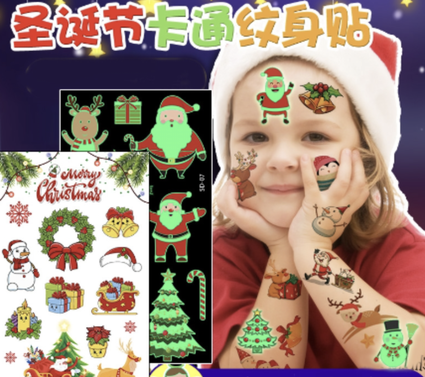
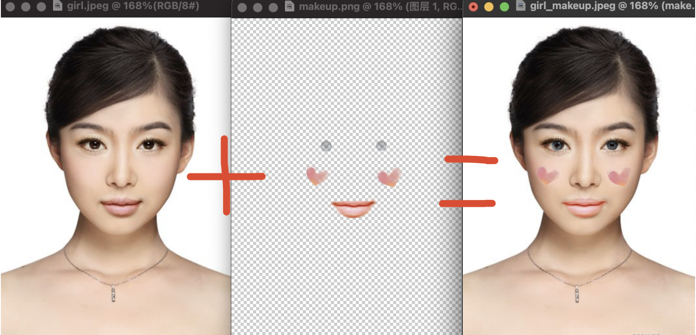
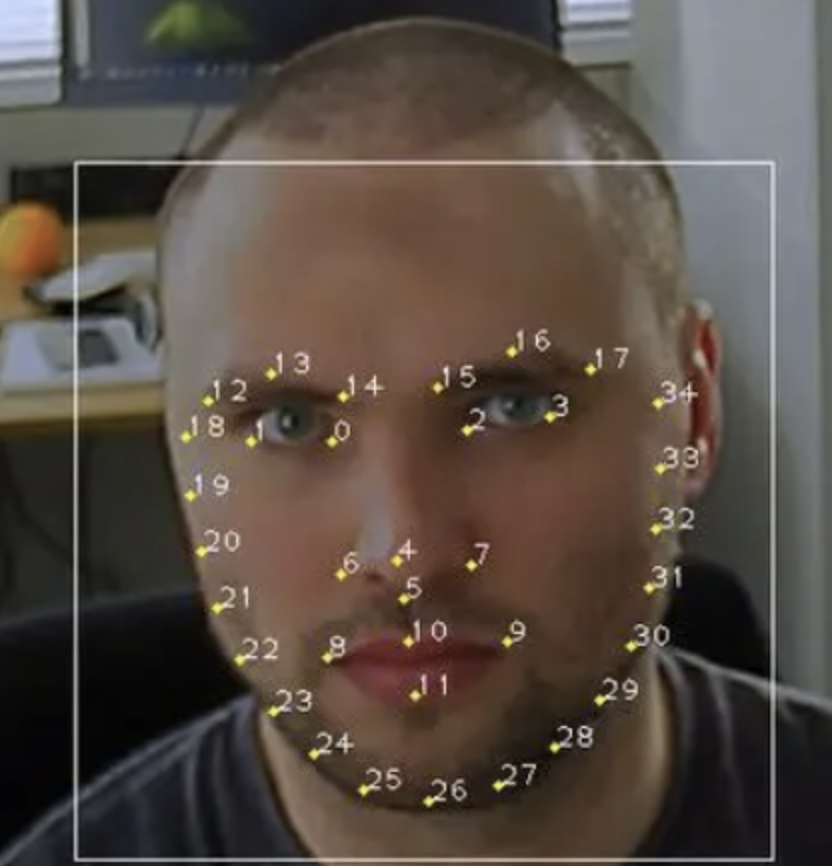
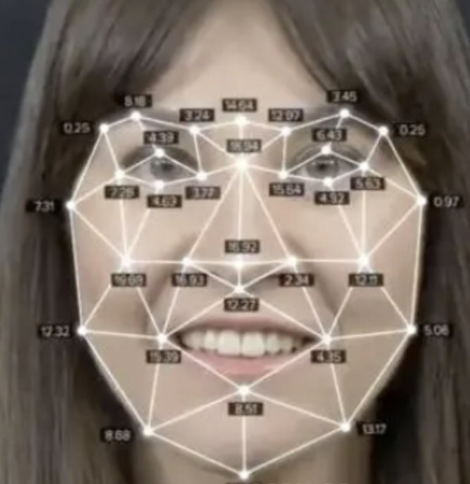
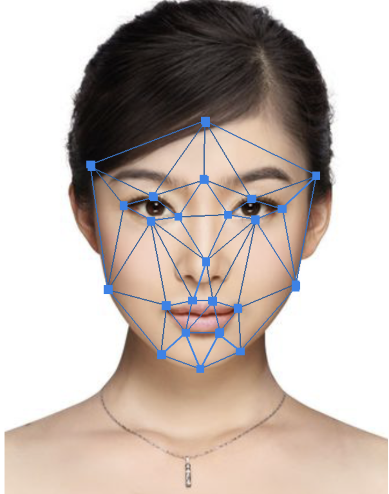
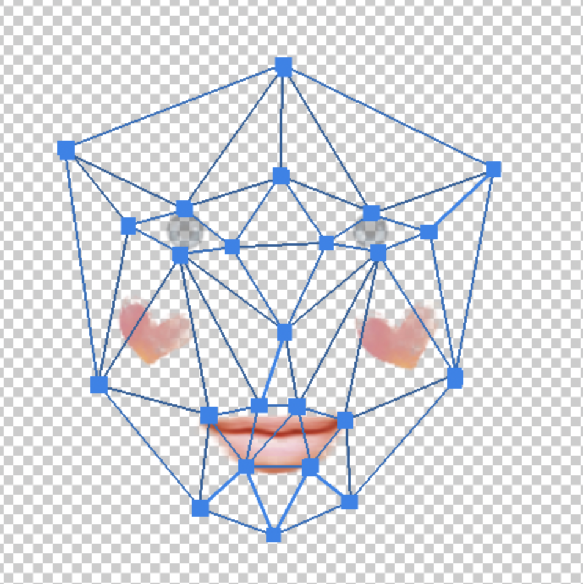
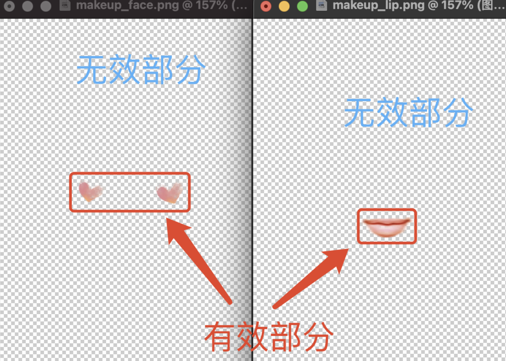

## 一、贴纸美妆

    人像美妆效果的实现方式有很多种，其中贴纸美妆是最常见也是应用最广泛的一种实现方式。它有实现简单、素材可移植和可复用性高等优点，是目前众多美颜美妆相关的App中应用最多的美妆实现方式。

- 它有点像我们玩的贴在脸上或手臂上的的纹身贴纸，原理类似：

- 在贴纸美妆中，也是通过贴纸和原始人像图片的叠加，得到叠加美妆贴纸后的效果

## 二、贴纸美妆的OpenGL实现

#### 1.划分人脸网格

    一般来说，在进行美妆效果之前，都需要进行人脸检测，得到人脸部位的若干人脸点。（这一步一般在渲染之前就已经完成，由人脸SDK完成）。目前主流人脸检测都是基于深度学习算法，各大厂自研或使用第三方算法，如商汤等。

- 人脸检测点位例子：

#### 2.划分人脸网格

    OpenGL是基于三角形进行绘制图像的，在绘制贴纸的时候，可以将人脸的区域划分成若干个三角形，然后将贴纸绘制在这些三角形当中。     将这些离散的零散的点位，按照一定规则划分成不重叠的三角形，这叫“三角剖分算法”。三角剖分算法有很多。可以参考：[三角剖分算法](https://blog.csdn.net/weixin_45963815/article/details/118894886?ops_request_misc=%7B%22request%5Fid%22%3A%22167497653416782427415213%22%2C%22scm%22%3A%2220140713.130102334..%22%7D&request_id=167497653416782427415213&biz_id=0&utm_medium=distribute.pc_search_result.none-task-blog-2~all~sobaiduend~default-2-118894886-null-null.142^v71^pc_new_rank,201^v4^add_ask&utm_term=三角剖分算法&spm=1018.2226.3001.4187)

- 三角剖分后的人脸三角形：

#### 3.定义标准人脸网格，使用人脸网格进行贴纸绘制

    使用贴纸美妆时，需要先定义一个标准模特的人脸网格（一般使用标准模特图进行人脸检测即可）。设计师在Photoshop或其他工具制作贴纸时，需要在标准人脸网格下进行设计。在实际绘制时，将实际人脸点与标准人脸点一一匹配对应进行绘制，就能将贴纸按照网格绘制到人脸上。     在绘制的时候，可以选择不同的叠加方式进行绘制。

- 原图：

* 贴纸：

* 绘制结果：

## 三、绘制方案优化

#### 3.1 方案一：美妆贴纸裁剪

###### 上述方案的性能弊端

    经过上述方案，已经可以实现基础贴纸美妆效果。但是这种方案只能一次性输出全脸的妆容贴纸，当有不同部位的妆容需要分别应用时，每个妆容部位都需要一个完整的大妆容贴纸（例如需要分别应用口红、腮红、眼瞳、眼影4种效果，就需要4个全脸贴纸），这将造成极大的内存消耗和性能浪费。因为一张贴纸图片，可能90%以上是无效的部分：

###### 裁剪优化

    按照上图的有效部分和无效部分，如果可以只裁剪出来红框的有效部分，那么有以下几个优点：

- 1.贴纸素材包大小可以大大降低。1000×1000的图片大小为4Mb，100×100的图片大小仅为40kb
- 2.程序运行时，内存占用降低
- 3.渲染绘制速度变快，不需要再每一帧绘制大图

    裁剪优化需要在标准人脸点位中，也对照裁剪出各个部位的三角网格，每个部位都用小网格进行绘制：

* 这里需要注意的关键点，需要把裁剪后的贴图坐标，和之前标准人脸图的坐标对应上。这里需要做一层裁剪的坐标运算。

#### 3.2 方案二：合并绘制优化

    在4.1优化后的基础上，可以再进行更进一步的优化。     4.1方案优化后，如果有N个部位的贴图，那么就需要进行N次绘制。事实上这N次绘制可以合并成一次绘制，大大节省性能浪费，可以提升渲染速度和实时渲染的帧率。

###### 绘制网格合并

    可以将不同部位的网格拼接起来，在单次渲染中按照顺序依次绘制。

- 效果图：

## 四、贴纸美妆中需要注意的一些坑

#### 1.贴纸顺序问题

- 在有多个美妆效果的情况下，可能出现美妆贴纸部位会重叠的情况。例如：眼影和眼线，很多时候会同时出现。先绘制的效果会被后面绘制的效果覆盖。
- 此时需要与设计师沟通，在PS里预先演算重叠的效果，通过透明度调整、叠加方式的调整、图层顺序的调整，选择最符合预期的重叠方案实现

#### 2.贴纸在不同光照环境下可能出现漂浮的问题

- 实际场景是暗光或者逆光的环境下，贴纸可能出现漂浮等不佳的效果。原因是贴纸无法动态改变其明亮度、对比度、饱和度等，使得上面的参数与人脸照片的这些参数相匹配，无法做到所有光照环境100%契合
- 解决思路
  - 通过算法检测当前帧人脸区域的明亮、对比、饱和等信息，对贴纸也做对应的调色处理（这种方案成本比较大）
  - 也可以简单计算当前帧的亮度信息，过大或过暗时降低贴纸透明度（简单的处理方式）

#### 3.两个人脸紧贴时，贴纸可能会覆盖另一个人的人脸

- 解决思路
  - 进行遮挡识别，屏蔽遮挡部分（如果把手盖在脸上，遮挡掉脸部的妆容也是同理）
  - 用人脸mask进行过滤，在人脸范围内才显示贴纸
  - 识别当前人脸的方向，可以计算模拟假3D贴纸，贴纸仅会出现在人脸内部区域

#### 最终效果图：

### Demo代码工程：https://github.com/sysu-huangwei/Makeup

### 文档：https://blog.csdn.net/q345911572/article/details/127644640