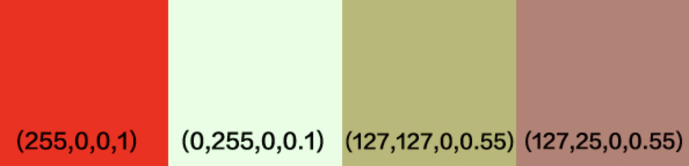

Premultiplied Alpha 这个概念做游戏开发的人都不会不知道。Xcode 的工程选项里有一项 Compress PNG Files，会对 PNG 进行 Premultiplied Alpha，Texture Packer 中也有Premultiplied Alpha 的选项。那么问题来了，Premultiplied Alpha 是什么呢？我被这个问题困惑了很久，之前搜到过 [**Nvidia的这篇文章**](https://developer.nvidia.com/content/alpha-blending-pre-or-not-pre)，其实说的很清楚，只是当时有很多相关概念没搞清楚，所以没看懂。直到前几天读《Real Time Rendering》时终于搞懂了。


### Alpha Blending

要搞清楚这个问题，先得理解Alpha通道的工作原理，如果你已经了解可以直接跳过。

最常见的像素表示格式是RGBA8888即 (r, g, b, a)，每个通道8位，0-255。例如红色60%透明度就是 (255, 0, 0, 153)，为了表示方便alpha通道一般记成正规化后的0-1的浮点数，也就是 (255, 0, 0, 0.6)。而 Premultiplied Alpha 则是把RGB通道乘以透明度也就是 (r * a, g * a, b * a, a)，50%透明红色就变成了(153, 0, 0, 0.6)。

透明通道在渲染的时候通过 **Alpha Blending** 产生作用，如果一个透明度为 as 的颜色 Cs 渲染到颜色 Cd上，混合后的颜色通过以下公式计算，

Co=αsCs+(1−αs)Cd

以60%透明的红色渲染到白色背景为例：

Co=(255,0,0)⋅0.6+(255,255,255)⋅(1−0.6)=(255,102,102)

也就是说，从视觉上，(255, 0, 0, 0.6)渲染到白色背景上 和 (255, 102, 102) 是同一个颜色。如果颜色以 Premultiplied Alpha 形式存储，也就是Cs已经乘以透明度了，所以混合公式变成了：

Co=Cs′+(1−αs)Cd


### 为什么要 Premultiplied Alpha 呢？

Premultiplied Alpha 后的像素格式变得不直观，因为在画图的时候都是先从调色板中选出一个RGB颜色，再单独设置透明度，如果RGB乘以透明度就搞不清楚原色是什么了。从前面的 Alpha Blending 公式可以看出，Premultiplied Alpha 之后，混合的时候可以少一次乘法，这可以提高一些效率，但这并不是最主要的原因。最主要的原因是：

**没有 Premultiplied Alpha 的纹理无法进行 Texture Filtering（除非使用最近邻插值）**。

以最常见的 filtering 方式线性插值为例，一个宽2px高1px的图片，左边的像素是红色，右边是绿色10%透明度，如果把这个图片缩放到1x1的大小，那么缩放后1像素的颜色就是左右两个像素线性插值的结果，也就是把两个像素各个通道加起来除以2。如果使用没有 Premultiplied Alpha 的颜色进行插值，那么结果就是：

((255,0,0,1)+(0,255,0,0.1))⋅0.5=(127,127,0,0.55)

如果绿色 Premultiplied Alpha，也就是 (0, 255 * 0.1, 0, 0.1)，和红色混合后：

((255,0,0,1)+(0,25,0,0.1))⋅0.5=(127,25,0,0.55)



从上面的图里第三个颜色是没有 Premultiplied Alpha 的混合结果，对比第四个 Premultiplied Alpha 后颜色的结果，显然第四个颜色更符合直觉，第三个颜色太绿了，因为绿色通道没有乘以透明度，所以在线性插值的时候占了过大的权重。

**所以 Premultiplied Alpha 最重要的意义是使得带透明度图片纹理可以正常的进行线性插值。**这样旋转、缩放或者非整数的纹理坐标才能正常显示，否则就会像上面的例子一样，在透明像素边缘附近产生奇怪的颜色。


补充：png的透明有两种计算方法一种叫做直通alpha（straight alpha），一种叫做预乘alpha（premultiplied alpha），和三维没啥关系，看做图的有没有做预乘这一步。简单来说预乘alpha做的png要用glBlendFunc(GL_ONE, GL_ONE_MINUS_SRC_ALPHA);来混合才不会有黑边，而直通alpha要用glBlendFunc(GL_SRC_ALPHA, GL_ONE_MINUS_SRC_ALPHA);来进行混合。


### 纹理处理

我们使用的PNG图片纹理，一般是不会 Premultiplied Alpha 的。游戏引擎在载入PNG纹理后回手动处理，然后再glTexImage2D传给GPU，比如 Cocos2D-x 中的 CCImage::premultipliedAlpha：

```C++
void Image::premultipliedAlpha() {
    unsigned int* fourBytes = (unsigned int*)_data;
    for (int i = 0; i &lt; _width * _height; i++) {
        unsigned char* p = _data + i * 4;
        fourBytes[i] = CC_RGB_PREMULTIPLY_ALPHA(p[0], p[1], p[2], p[3]);
    }  
    _hasPremultipliedAlpha = true;
}
```


而GPU专用的纹理格式，比如 PVR、ETC 一般在生成纹理都是默认 Premultiplied Alpha 的，这些格式一般是GPU硬解码，引擎用CPU处理会很慢。

**总之 glTexImage2D 传给 GPU 的纹理数据最好都是 Multiplied Alpha 的，要么在生成纹理时由纹理工具 Pre-multiplied，要么载入纹理后由游戏引擎或UI框架 Post-multiplied**。

**原文地址：**[**http://boundary.cc/2015/07/why-premultiplied-alpha/**](http://boundary.cc/2015/07/why-premultiplied-alpha/)