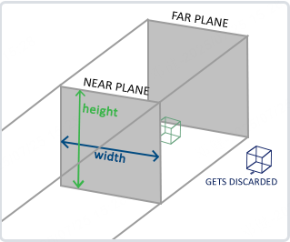
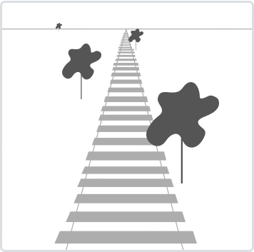
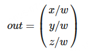
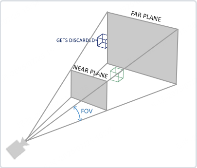
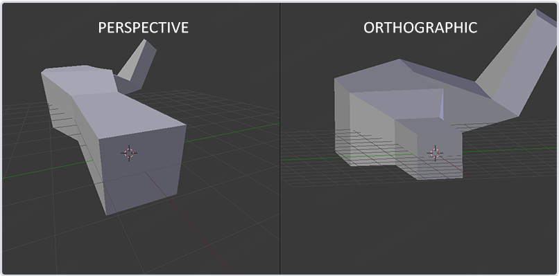
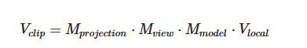

### 复习OpenGL三大矩阵

#### OpenGL矩阵

OpenGL中矩阵数据是以列主序方式存储的，是指在存储多维数组时，列的连续存储在内存中的顺序。这意味着当你在内存中按列读取数据时，读取的先后顺序是按照列的顺序。 考虑一个 4x4 矩阵： | a11 a12 a13 a14 | | a21 a22 a23 a24 | | a31 a32 a33 a34 | | a41 a42 a43 a44 | 在列主序下，这个矩阵的存储顺序是：a11, a21, a31, a41, a12, a22, a32, a42, a13, a23, a33, a43, a14, a24, a34, a44。


在矩阵运算中，当我们用一个矩阵左乘另一个矩阵时，我们是在进行坐标变换。在 OpenGL 的变换中，你通常先将一个变换矩阵（例如平移、旋转或缩放）**左乘**到一个位置向量上。这种方式可以在变换上按顺序应用多个变换矩阵，从而实现复杂的场景变换。


#### 模型矩阵（->世界空间）

OpenGL 的模型矩阵（Model Matrix）是用于描述物体在三维空间中位置、方向和缩放的变换矩阵。它是一种通过线性变换（平移、旋转和缩放）来控制场景中物体的姿态以及相对于世界坐标系的位置的工具。

首先OpenGL有个世界坐标系，我们渲染的物体就是在世界坐标系中，我们的模型需要放到世界坐标系中，那么当我们还没放的时候，模型就和世界坐标系没有联系，它就还处于自己的坐标系中，我们叫做模型坐标系、局部空间、局部坐标系。

 当我们把模型放到世界坐标系中，模型就在世界坐标系里有了坐标，也就是原来在LOCAL SPACE中的那些坐标值，变成了世界坐标系中的坐标值，帮助我们完成这个变换的就是模型矩阵，对应图中的MODEL MATRIX，于是这样我们就把模型放到了世界坐标系WORLD SPACE中。

- 在 OpenGL 中，模型矩阵通常用于将模型空间中的顶点坐标转换为世界空间坐标。模型矩阵的组成通常包括三个部分：
  
  - **平移（Translation）**：物体在世界空间中的位置。
  - **旋转（Rotation）**：物体在世界空间中的方向。
  - **缩放（Scaling）**：物体的大小。

- 模型矩阵是通过相应的旋转、平移和缩放矩阵相乘而得到的。矩阵有一个性质，M·（A·B） = （M·A）·B，考虑一个点，先进行了一次平移变换，又进行了一次旋转变换，结合上面矩阵的性质，可知变换后的点P’为：P` = R·（T·P） = （R·T）·P 。

- 旋转矩阵和平移矩阵的乘积R•T也是一个4×4的矩阵，这个矩阵代表了一次平移变换和一次旋转变换效果的叠加；如果这个点还要进行变换，只要将新的变换矩阵按照顺序左乘这个矩阵，得到的新矩阵能够表示之前所有变换效果的叠加，将最初的点坐标左乘这个矩阵就能得到一系列变换后最终的点坐标，这个矩阵称为“模型矩阵”。一个模型矩阵乘以另一个模型矩阵得到的还是一个模型矩阵，表示先进行右侧模型矩阵代表的变换，再进行左侧模型矩阵代表的变换这一过程的效果之和，因此模型矩阵的乘法又可以认为是闭合的。

- 具体推导过程如下（假设我们有一个物体应用了平移、旋转和缩放）：
  
  - 平移矩阵 T =
    
    | 1   | 0   | 0   | tx  |
    | --- | --- | --- | --- |
    | 0   | 1   | 0   | ty  |
    | 0   | 0   | 1   | tz  |
    | 0   | 0   | 0   | 1   |
  
  - 旋转矩阵（绕x轴） R =
    
    | 1   | 0      | 0       | 0   |
    | --- | ------ | ------- | --- |
    | 0   | cos(θ) | -sin(θ) | 0   |
    | 0   | sin(θ) | cos(θ)  | 0   |
    | 0   | 0      | 0       | 1   |
  
  - 旋转矩阵（绕y轴） R =
    
    | cos(θ)  | 0   | sin(θ) | 0   |
    | ------- | --- | ------ | --- |
    | 0       | 1   | 0      | 0   |
    | -sin(θ) | 0   | cos(θ) | 0   |
    | 0       | 0   | 0      | 1   |
  
  - 旋转矩阵（绕z轴） R =
    
    | cos(θ) | −sin(θ) | 0   | 0   |
    | ------ | ------- | --- | --- |
    | sin(θ) | cos(θ)  | 0   | 0   |
    | 0      | 0       | 1   | 0   |
    | 0      | 0       | 0   | 1   |
  
  - 缩放矩阵 S =
    
    | sx  | 0   | 0   | 0   |
    | --- | --- | --- | --- |
    | 0   | sy  | 0   | 0   |
    | 0   | 0   | sz  | 0   |
    | 0   | 0   | 0   | 1   |

组合这些变换矩阵，通常顺序为先缩放，后旋转，最后平移，由于OpenGL是左乘，得到模型矩阵 M：

```
   M = T * R * S
```

注意矩阵乘法的顺序对于最终变换的结果是至关重要的。


#### 视图矩阵（->观察空间）

观察者的位置和方向会变化，看上去就好像整个世界的位置和方向发生变化了一样。将世界里的所有模型看作一个大模型，在所有模型矩阵的左侧再乘以一个表示整个世界变换的模型矩阵，就可以了。这个表示整个世界变换的矩阵又称为“视图矩阵”，因为他们经常一起工作，所以将视图矩阵乘以模型矩阵得到的矩阵称为“模型视图矩阵”。**模型视图矩阵的作用是：乘以一个点坐标，获得一个新的点坐标，获得的点坐标表示：点在世界里变换，观察者也变换后，点相对于观察者的位置。** 视图矩阵实际上就是整个世界（观察者）的模型矩阵。


#### 投影矩阵（->裁剪空间）

在一个顶点着色器运行的最后，OpenGL期望所有的坐标都能落在一个特定的范围内，且任何在这个范围之外的点都应该被裁剪掉(Clipped)。被裁剪掉的坐标就会被忽略，所以剩下的坐标就将变为屏幕上可见的片段。这也就是裁剪空间(Clip Space)名字的由来。

因为将所有可见的坐标都指定在-1.0到1.0的范围内不是很直观，所以我们会指定自己的坐标集(Coordinate Set)并将它变换回标准化设备坐标系。

为了将顶点坐标从观察变换到裁剪空间，我们需要定义一个投影矩阵(Projection Matrix)，它指定了一个范围的坐标，比如在每个维度上的-1000到1000。投影矩阵接着会将在这个指定的范围内的坐标变换为标准化设备坐标的范围(-1.0, 1.0)。所有在范围外的坐标不会被映射到在-1.0到1.0的范围之间，所以会被裁剪掉。在上面这个投影矩阵所指定的范围内，坐标(1250, 500, 750)将是不可见的，这是由于它的x坐标超出了范围，它被转化为一个大于1.0的标准化设备坐标，所以被裁剪掉了。

<mark>如果只是图元(Primitive)，例如三角形，的一部分超出了裁剪体积(Clipping Volume)，则OpenGL会重新构建这个三角形为一个或多个三角形让其能够适合这个裁剪范围。</mark>


由投影矩阵创建的**观察箱**(Viewing Box)被称为视锥体(Frustum)，每个出现在视锥体范围内的坐标都会最终出现在用户的屏幕上。将特定范围内的坐标转化到标准化设备坐标系的过程（而且它很容易被映射到2D观察空间坐标）被称之为投影(Projection)，因为使用投影矩阵能将3D坐标投影(Project)到很容易映射到2D的标准化设备坐标系中。

一旦所有顶点被变换到裁剪空间，最终的操作——透视除法(Perspective Division)将会执行，在这个过程中我们将位置向量的x，y，z分量分别除以向量的齐次w分量；透视除法是将4D裁剪空间坐标变换为3D标准化设备坐标的过程。这一步会在每一个顶点着色器运行的最后被自动执行。


在这一阶段之后，最终的坐标将会被映射到屏幕空间中（使用glViewport中的设定），并被变换成片段。

将观察坐标变换为裁剪坐标的投影矩阵可以为两种不同的形式，每种形式都定义了不同的视锥体。我们可以选择创建一个正射投影矩阵(Orthographic Projection Matrix)或一个透视投影矩阵(Perspective Projection Matrix)。

##### 正交投影

正射投影矩阵定义了一个类似立方体的视锥箱，它定义了一个裁剪空间，在这空间之外的顶点都会被裁剪掉。创建一个正射投影矩阵需要指定可见视锥的宽、高和长度。在使用正射投影矩阵变换至裁剪空间之后处于这个视锥的所有坐标将不会被裁剪掉。它的视锥来像一个容器：



上面的视锥体定义了可见的坐标，它由宽、高、近(Near)平面和远(Far)平面所指定。任何出现在近平面之前或远平面之后的坐标都会被裁剪掉。正射平视锥直接将视锥内部的所有坐标映射为标准化设备坐标，因为每个向量的w分量都没有进行改变；如果w分量等于1.0，透视除法则不会改变这个坐标。

要创建一个正射投影矩阵，我们可以使用GLM的内置函数`glm::ortho`：

```c++
glm::ortho(0.0f, 800.0f, 0.0f, 600.0f, 0.1f, 100.0f);
```

前两个参数指定了视锥体的左右坐标，第三和第四参数指定了平视锥的底部和顶部。通过这四个参数我们定义了近平面和远平面的大小，然后第五和第六个参数则定义了近平面和远平面的距离。这个投影矩阵会将处于这些x，y，z值范围内的坐标变换为标准化设备坐标。

正射投影矩阵直接将坐标映射到2D平面中，即你的屏幕，但实际上一个直接的投影矩阵会产生不真实的结果，因为这个投影没有将透视(Perspective)产生的近大远小的效果考虑进去。所以我们需要透视投影矩阵来解决这个问题。


##### 透视投影

如果你曾经体验过**实际生活**给你带来的景象，你就会注意到离你越远的东西看起来更小。这个效果称之为透视(Perspective)。透视的效果在我们看一条无限长的高速公路或铁路时尤其明显，如图：



由于透视，这两条线在很远的地方看起来会相交。这正是透视投影想要模仿的效果，它是使用透视投影矩阵来完成的。这个投影矩阵将给定的视锥体范围映射到裁剪空间，除此之外还修改了每个顶点坐标的w值，从而使得离观察者越远的顶点坐标w分量越大。被变换到裁剪空间的坐标都会在-w到w的范围之间（任何大于这个范围的坐标都会被裁剪掉）。OpenGL要求所有可见的坐标都落在-1.0到1.0范围内，作为顶点着色器最后的输出，因此，一旦坐标在裁剪空间内之后，透视除法就会被应用到裁剪空间坐标上：



顶点坐标的每个分量都会除以它的w分量，距离观察者越远顶点坐标就会越小。这是w分量重要的另一个原因，它能够帮助我们进行透视投影。最后的结果坐标就是处于标准化设备空间中的。如果你对正射投影矩阵和透视投影矩阵是如何计算的很感兴趣可以参考Songho写的[文章](http://www.songho.ca/opengl/gl_projectionmatrix.html)。

在GLM中可以这样创建一个透视投影矩阵：

```c++
glm::mat4 proj = glm::perspective(glm::radians(45.0f), (float)width/(float)height, 0.1f, 100.0f);
```

同样，`glm::perspective`所做的其实就是创建了一个定义了可视空间的大**视锥体**，任何在这个视锥体以外的东西最后都不会出现在裁剪空间体积内，并且将会受到裁剪。一个透视视锥体以被看作一个不均匀形状的箱子，在这个箱子内部的每个坐标都会被映射到裁剪空间上的一个点。下面是一张透视视锥体图片：



它的第一个参数定义了fov的值，它表示的是视野(Field of View)，并且设置了观察空间的大小。如果想要一个真实的观察效果，它的值通常设置为45.0f。第二个参数设置了宽高比，由视口的宽除以高所得。第三和第四个参数设置了视锥体的**近**和**远**平面。我们通常设置近距离为0.1f，而远距离设为100.0f。所有在近平面和远平面内且处于视锥体内的顶点都会被渲染。

<mark>当你把透视矩阵的 *near* 值设置太大时（如10.0f），OpenGL会将靠近摄像机的坐标（在0.0f和10.0f之间）都裁剪掉，这会导致一个你在游戏中很熟悉的视觉效果：在太过靠近一个物体的时候你的视线会直接穿过去。</mark>

当使用正射投影时，每一个顶点坐标都会直接映射到裁剪空间中而不经过任何精细的透视除法（它仍然会进行透视除法，只是w分量没有被改变（它保持为1），因此没有起作用）。因为正射投影没有使用透视，远处的物体不会显得更小，所以产生奇怪的视觉效果。由于这个原因，正射投影主要用于二维渲染以及一些建筑或工程的程序(CAD)，在这些场景中我们更希望顶点不会被透视所干扰。某些如 *Blender* 等进行三维建模的软件有时在建模时也会使用正射投影，因为它在各个维度下都更准确地描绘了每个物体。下面你能够看到在Blender里面使用两种投影方式的对比：



你可以看到，使用透视投影的话，远处的顶点看起来比较小，而在正射投影中每个顶点距离观察者的距离都是一样的。


上面多次提到了视锥体（Frustum）这个概念。在游戏中，为了极致的性能，也避免过多不必要的DrawCall，会使用视锥体剔除（Frustum Culling）这个技术，即在CPU层面就通过数学计算把视锥体外的物体不提交DrawCall，这些已经被剔除的物体不会走到后面GPU的裁剪阶段。

| 优化策略               | 效果                  | 示例场景       |
| ------------------ | ------------------- | ---------- |
| 多线程剔除              | 并行处理多个物体            | 开放世界游戏     |
| 异步计算               | 在渲染前一帧提前计算          | VR高帧率应用    |
| LOD + 剔除结合         | 远处物体用简模并优先测试        | 地形渲染       |
| GPU Driven Culling | 用Compute Shader批量处理 | 《战神4》等3A大作 |

与其他剔除技术的对比

| 技术    | 作用阶段  | 判断依据       |
| ----- | ----- | ---------- |
| 背面剔除  | 光栅化前  | 三角形法线方向    |
| 遮挡剔除  | 光栅化后  | 深度缓冲区遮挡关系  |
| 视锥体剔除 | 提交渲染前 | 物体与摄像机空间位置 |

- 收益：可减少50%~90%的渲染调用（取决于场景复杂度）。

- 开销：测试本身消耗约0.1~2ms/帧（需权衡测试精度与耗时）。
  
  

#### MVP矩阵

一个顶点坐标将会根据以下过程被变换到裁剪坐标：



注意OpenGL使用的是左乘（我们需要从右往左阅读矩阵的乘法）。最后的顶点应该被赋值到顶点着色器中的gl_Position，OpenGL将会自动进行透视除法和裁剪。其中这里模型、视图、投影矩阵左乘后得到的矩阵叫MVP矩阵。


<mark>顶点着色器的输出要求所有的顶点都在裁剪空间内，这正是我们刚才使用变换矩阵所做的。OpenGL然后对**裁剪坐标**执行**透视除法**从而将它们变换到**标准化设备坐标**。OpenGL会使用glViewPort内部的参数来将标准化设备坐标映射到**屏幕坐标**，每个坐标都关联了一个屏幕上的点（在我们的例子中是一个800x600的屏幕）。这个过程称为视口变换。</mark>


### 图片/视频编辑中的MVP矩阵

在图片尤其是视频编辑中，一般会把MVP矩阵初始化为单位矩阵（确切的说是把视图投影矩阵定义为单位矩阵，模型矩阵用于做旋转、缩放、镜像等操作）。并把用于展示图片/视频的正方形的顶点坐标和UV坐标定义为：

```kotlin
val VERTICES_AND_UV_DATA = floatArrayOf(
    // X    Y    Z    U    V
    -1.0f, -1.0f, 0.0f, 0.0f, 0.0f,  // 左下角
     1.0f, -1.0f, 0.0f, 1.0f, 0.0f,  // 右下角
    -1.0f,  1.0f, 0.0f, 0.0f, 1.0f,  // 左上角
     1.0f,  1.0f, 0.0f, 1.0f, 1.0f   // 右上角
)
```

由于OpenGL 的渲染管线最终会将顶点坐标变换到 [-1, 1]³ 的归一化立方体空间（NDC），超出此范围的片段会被裁剪。

XYZ 坐标范围：X∈[-1,1], Y∈[-1,1], Z=0  。这正好覆盖了 NDC 空间的整个 XY 平面。

由于MVP矩阵是单位矩阵，顶点坐标经过 MVP 变换后保持不变，最终进入 NDC 的坐标仍然是原始值 (-1,-1,0) 到 (1,1,0)。

OpenGL 会将 NDC 坐标线性映射到视口（默认覆盖整个窗口）：

屏幕X = (NDC_X + 1) * (viewport_width / 2) + viewport_x

屏幕Y = (NDC_Y + 1) * (viewport_height / 2) + viewport_y

- 对于 NDC_X = -1 → 屏幕左边界  
  NDC_X = 1 → 屏幕右边界

- 对于 NDC_Y = -1 → 屏幕下边界  
  NDC_Y = 1 → 屏幕上边界

因此该四边形会严格匹配屏幕边缘。看起来就是图片和视频刚好完全撑满了整个屏幕/渲染View。


也有些会使用正交矩阵来做图片的投影矩阵，比如Google原来的Gallery2框架。那是因为它还需要用来渲染图片列表。但一般图片编辑只需要显示大图，可以用单位矩阵来计算。


但图片和视频是有一定比例的，和屏幕比例不一定一样。比如Android ImageView会有个fitCenter属性，让图片宽/高撑满屏幕，另外一个则按比例进行缩小。

可以参考如下方法来调整最终的模型矩阵或MVP矩阵：  

```kotlin

```

这里带来一个新问题：如果图片/视频90度旋转了，如何重新视频fitCenter？

如果只是旋转，不考虑旋转（90/270）后是否需要fitCenter，可以直接：

```kotlin
Matrix.scaleM(mvpMatrix, 0, 1f, ratio, 1f)   // 预补偿
Matrix.rotateM(mvpMatrix, 0, transform.rotation.toFloat(), 0f, 0f, 1f)
Matrix.scaleM(mvpMatrix, 0, 1f, 1f / ratio, 1f) // 恢复
```

但假如需要%180后2个角度（0，90，不考虑其他角度）的情况下都要fitCenter。则：

```kotlin
val orthogonalRotation = (transform.rotation % 180.0 != 0.0)    // 是否垂直旋转
Matrix.rotateM(mvpMatrix, 0, transform.rotation.toFloat(), 0f, 0f, 1f)

val texWidth = if (orthogonalRotation) tex.height else tex.width
val texHeight = if (orthogonalRotation) tex.width else tex.height
val scaleType = OpenGLUtil.calcScaleWithRenderMode(texWidth, texHeight, outWidth,
                    outHeight, renderMode)
val scaleW = scaleType.width * transform.scaleX
val scaleH = scaleType.height * transform.scaleY
Matrix.scaleM(mvpMatrix, 0, if (orthogonalRotation) scaleH.toFloat() else scaleW.toFloat(),
                    if (orthogonalRotation) scaleW.toFloat() else scaleH.toFloat(), 1f)
```


