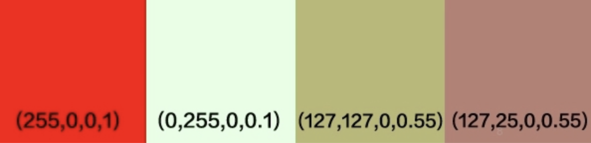
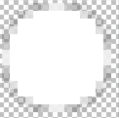

### 1. Alpha预乘（Premultiplied Alpha）

最常见的像素表示格式是RGBA8888即 (r, g, b, a)，每个通道8位，0-255。例如红色60%透明度就是 (255, 0, 0, 153)，为了表示方便alpha通道一般记成正规化后的0-1的浮点数，也就是 (255, 0, 0, 0.6)。而 Premultiplied Alpha 则是把RGB通道乘以透明度也就是 (r * a, g * a, b * a, a)，50%透明红色就变成了(153, 0, 0, 0.6)。

 

下面介绍的几种抗锯齿方式，除了MSAA以外，其他都是采用纹理透明混合的方式。如果一个透明度为 as 的颜色 Cs 渲染到颜色 Cd上，已如下GL函数混合：

GLES20.glBlendFunc(GLES20.GL_SRC_ALPHA, GLES20.GL_ONE_MINUS_SRC_ALPHA);

混合后的颜色通过以下公式计算：

Co = αs * Cs + (1 − αs) * Cd

以60%透明的红色渲染到白色背景为例：

Co = (255,0,0)·0.6 + (255,255,255)·(1−0.6) = (255,102,102)

也就是说，从视觉上，(255, 0, 0, 0.6)渲染到白色背景上 和 (255, 102, 102) 是同一个颜色。如果颜色以 Premultiplied Alpha 形式存储，也就是Cs已经乘以透明度了，所以混合公式变成了：

Co = Cs′ + (1 − αs) * Cd

透明混合方式实现抗锯齿，最关键的是在图片的边缘像素进行最近邻插值（Texture Filtering），一般采用线性插值。一个宽2px高1px的图片，左边的像素是红色，右边是绿色10%透明度，如果把这个图片缩放到1x1的大小，那么缩放后1像素的颜色就是左右两个像素线性插值的结果，也就是把两个像素各个通道加起来除以2。如果使用没有 Premultiplied Alpha 的颜色进行插值，那么结果就是：

((255,0,0,1) + (0,255,0,0.1))·0.5 = (127,127,0,0.55)

如果绿色 Premultiplied Alpha，也就是 (0, 255 * 0.1, 0, 0.1)，和红色混合后：

((255,0,0,1) + (0,25,0,0.1))·0.5 = (127,25,0,0.55)

 

上图里第三个颜色是没有 Premultiplied Alpha 的混合结果，对比第四个 Premultiplied Alpha 后颜色的结果，显然第四个颜色更符合直觉，第三个颜色太绿了，因为绿色通道没有乘以透明度，所以在线性插值的时候占了过大的权重。

**所以** **Premultiplied Alpha** **最重要的意义是使得带透明度图片纹理可以正常的进行线性插值。**这样旋转、缩放或者非整数的纹理坐标才能正常显示，否则就会像上面的例子一样，在透明像素边缘附近产生奇怪的颜色。

嵌入式平台Bitmap默认开启了Alpha预乘，使用这些Bitmap生成纹理混合后，需要在Shader中做Post-multiplied还原回去。

 

### 2. 点精灵抗锯齿

采用抗锯齿前画点采用fragShader算法如下：

if  (length(gl_PointCoord - vec2(0.5)) > 0.5) {

​	discard;

}

这样画点采用直接丢弃像素的方式，画出的点比较锐化，如果需要放大后的抗锯齿效果，还是需要采用纹理贴图的方式，只是直接采用gl_PointCoord作为纹理坐标，在app启动时，预生成如下纹理：

 

 

### 3. 标签纹理抗锯齿

标签抗锯齿和点精灵抗锯齿原理一样，只是使用了传入的UV作为纹理坐标。

 

### 4. 全局MSAA（多重采样）抗锯齿

MSAA的基本原理是用一个更大的分辨率来渲染场景，然后把相邻像素值做一个过滤（比如取平均值）得到最终图像。

线的抗锯齿无法直接使用透明混合的方式，除非用这条直线去生成一个多边形面的线，再生成对应纹理坐标，这样的实现方式比较复杂。最后针对直线开启了MSAA抗锯齿。

Android的GLSurfaceView默认不会开启这个，需要实现GLSurfaceView.EGLConfigChooser

在GLSurfaceView的构造方法，设置开启。