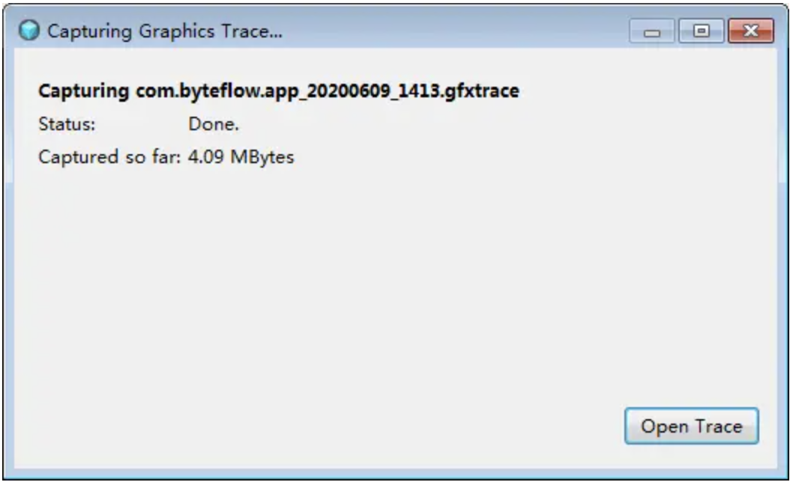

# GAPID 是什么？

GAPID (Graphics API Debugger)是 Google 的一款开源且跨平台的图形开发调试工具，用于记录和检查应用程序对图形驱动程序的调用，支持 OpenGL ES 和 Vulkan 调试。

工具下载地址：[github.com/google/gapi…](https://link.juejin.cn?target=https%3A%2F%2Fgithub.com%2Fgoogle%2Fgapid%2Freleases)

GAPID 的主要功能：

- 查看 OpenGL ES 或 Vulkan 绘图接口的调用情况（调用顺序、流程）；
- 查看传入着色器程序的参数；
- 查看纹理，导出模型、贴图等资源；
- 查看、修改以及导出 shader 脚本。


上图来自 GAPID 官网，我们可以看到一个 3D 场景的整个渲染过程，以及每次渲染用到的纹理图。很多朋友看到这里，心里可能会有疑问：假如我看上了别人的一个 OpenGL 实现的效果，那我能不能用 GAPID 抓取到它的 shader 脚本源码来学习？答案是肯定的。

**编译完 shader 脚本生成的二进制代码，可以通过 GAPID 抓取到并反编译成原来的 shader 源码。总而言之就是，你的 shader 脚本实际上是在 GPU 上裸奔，尤其是对手机厂商来说。**

据俺所知，shader 脚本在 GPU 层面上目前并没有有效的加密或混淆方法，比较通用的做法是将 shader 中的变量无意义化，比如用 var1、var2 等表示，或者将一个 shader 拆分成多个小 shader ，以达到降低可读性的目的。


# GAPID 怎么用？

下载、安装好 GAPID 程序后，将 Android 手机通过 USB 与电脑连接（同时需要关闭 AndroidStudio ），手机处于开发者选项中的 Debug 调试模式。注意， GAPID 支持 Android 5.0 及以上版本手机，待调试的 App 要求是 Debug 版本或者手机被 Root 掉了。


打开 GAPID 程序，点击 `Capture a new trace` 准备调试我们的程序。


选择要调试的程序，选中接口类型为 `OpenGL ES`类型，然后启动抓取 Graphics Trace 信息。



抓取完成后，打开 trace 文件，然后 GAPID 程序的界面如下图所示。


左侧区域为抓取到的每一帧的绘制过程，区域 1 中展示的是其中一帧绘制过程，由于我们用的是旧文中绘制水波纹的例子作为调试程序，可以对比出区域 1 中展示的绘制流程与下面绘制水波纹的代码基本一致。

```c++
void ShockWaveSample::Draw(int screenW, int screenH)
{
	glUseProgram (m_ProgramObj);
	glBindVertexArray(m_VaoId);

	GLUtils::setMat4(m_ProgramObj, "u_MVPMatrix", m_MVPMatrix);

	glActiveTexture(GL_TEXTURE0);
	glBindTexture(GL_TEXTURE_2D, m_TextureId);
	GLUtils::setFloat(m_ProgramObj, "s_TextureMap", 0);

	//float time = static_cast<float>(fmod(GetSysCurrentTime(), 2000) / 2000);
  float time = static_cast<float>(fmod(m_FrameIndex, 150) / 120);
	GLUtils::setFloat(m_ProgramObj, "u_Time", time);

	GLUtils::setVec2(m_ProgramObj, "u_TouchXY", m_touchXY);
  GLUtils::setVec2(m_ProgramObj, "u_TexSize", vec2(m_RenderImage.width, m_RenderImage.height));
	GLUtils::setFloat(m_ProgramObj, "u_Boundary", 0.1f);

	glDrawElements(GL_TRIANGLES, 6, GL_UNSIGNED_SHORT, (const void *)0);
}
```

区域 2 中展示的是绘制当前帧时，传递给着色器程序中各个变量的值，可以清楚看到各个变量和矩阵对应的值。

区域 3 中展示的是着色器程序的状态信息，我们根据着色器程序的 id ，找到对应的 LinkExtra ，然后便可以拿到当前着色器程序所对应的 shader 脚本源码，与代码中的程序一致。

本文主要介绍了 GAPID 的一些常用功能，还有更多高端功能等你探索。

实现代码路径： [Android_OpenGLES_3_0](https://link.juejin.cn?target=https%3A%2F%2Fgithub.com%2Fgithubhaohao%2FNDK_OpenGLES_3_0)


作者：字节流动
链接：https://juejin.cn/post/6844904186870513672
来源：稀土掘金
著作权归作者所有。商业转载请联系作者获得授权，非商业转载请注明出处。