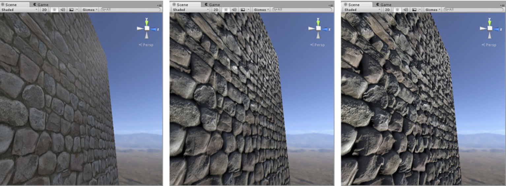
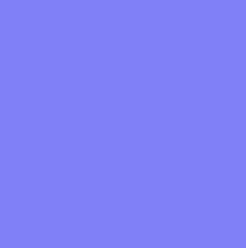

 1.分配了反照率贴图但未分配法线贴图和高度贴图的岩石墙壁材质。 2.分配了法线贴图。表面上的光照经过修改，但岩石不会相互遮挡。 3.分配了法线贴图和高度贴图的最终效果。岩石看起来从表面突出，较近的岩石似乎遮挡了它们后面的岩石。 

高度贴图（也称为视差贴图）是与法线贴图类似的概念，但是这种技术更复杂，因此性能成本也更高。高度贴图往往与法线贴图结合使用，通常情况下，当纹理贴图负责渲染表面的大型凸起时，高度贴图用于为表面提供额外的定义。

虽然法线贴图可修改纹理表面上的光照，但视差高度贴图更进一步并实际上可移动可见表面纹理的区域，从而实现一种表面级遮挡效果。这意味着，对于明显的凸起，它们的近侧（面向摄像机）将膨胀和扩大，而它们的远侧（背离摄像机）将减小并且看起来被遮挡。

这种效果尽管可以产生非常令人信服的 3D 几何体表示，但仍然受限于对象网格的平面多边形的表面。也就是说，虽然表面凸起看起来会突出和相互遮挡，但模型的“轮廓”绝不会被修改，因为最终效果将绘制到模型的表面上，不会修改实际的几何体。 

### 为什么呈现紫蓝色？

了解这一点对于使用法线贴图并不重要！跳过这一段是可以的。但是，如果真的想知道，请参考以下信息：RGB 颜色值用于存储矢量的 X、Y、Z 方向，其中的 Z 为“向上”（与 Unity 通常使用 Y 作为“向上”的惯例相反）。此外，纹理中的值视为经过减半处理，即添加了 0.5 的系数。这样就能存储所有方向的矢量。因此，为了将 RGB 颜色转换为矢量方向，必须乘以 2，然后减去 1。例如，RGB 值 (0.5, 0.5, 1) 或十六进制的 #8080FF 将得到矢量 (0,0,1)，这便是用于法线贴图的“向上”，并表示模型表面没有变化。这就是您在此页面前面的法线贴图“示例”的平面区域中看到的颜色。

 

一个法线贴图仅使用 #8080FF，此值转换为法向矢量 0,0,1，即“笔直向上”。这不会对多边形的表面法线进行任何修改，因此不会对光照产生任何变化。任何与此颜色不同的像素都会产生指向不同方向的矢量，因此会修改用于计算该点处光发射的角度。