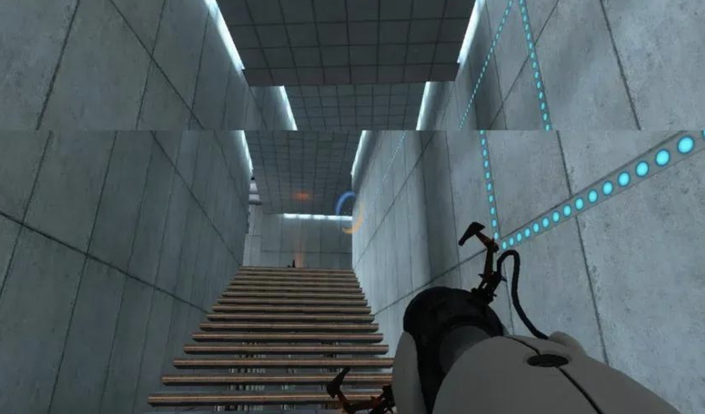
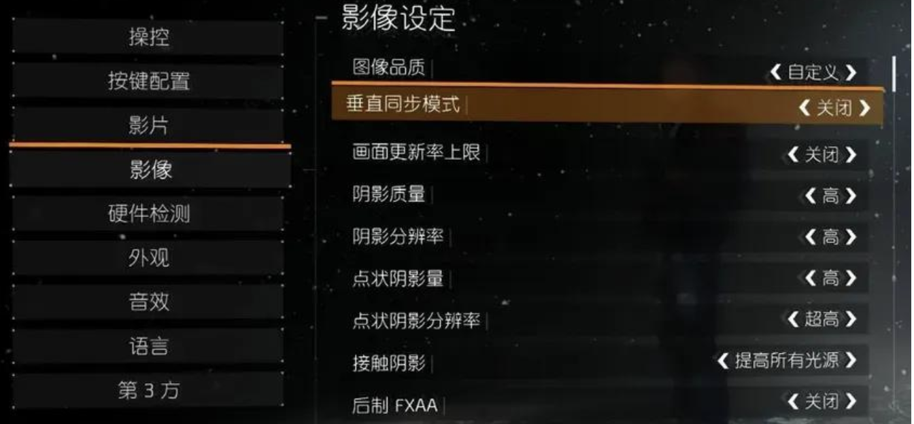
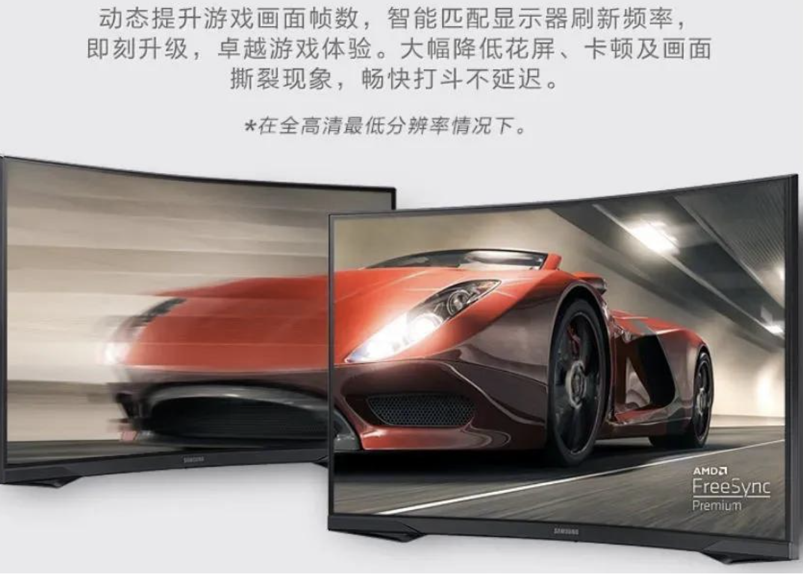
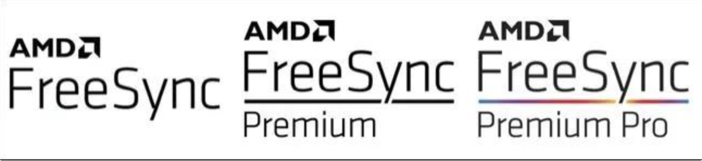
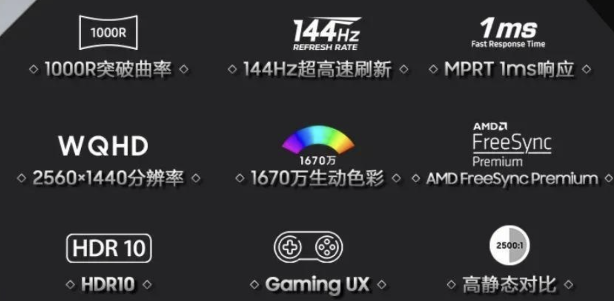
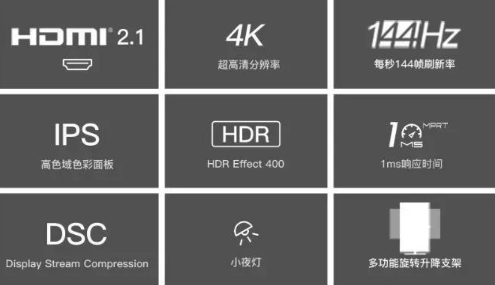

相信很多萌新玩游戏时，会遇见以下画面：

**这个现象叫画面撕裂，**而你能在所有游戏设置中找到这个选项：**垂直同步（V-Sync）**

这就是用来解决画面撕裂的技术。可这个技术很多时候并未给玩家带来福音，反倒使玩家陷入水深火热之中，以至大多老玩家教你游戏设置的第一句告诫都是：**关闭垂直同步！**

那么这到底是为什么呢？我们先得从画面撕裂说起：

**画面撕裂的原因：**

显卡是电脑负责输出图像的硬件，关于它的科普详见该文：

买显卡原来和买可乐一样简单？一文理清显卡品牌！

现在有一台酒水饮料机——显卡

调出的饮料放在下方的杯子里——帧缓冲区

负责送酒水饮料的酒保——显示器

呈现的酒水饮料——画面

这时来了一位阿姨，甩了一笔钱要喝杯卡布奇诺

酒水饮料机全力以赴，60秒调出了1杯卡布奇诺，酒保固定60秒来一趟，把做好的卡布奇诺呈现给阿姨（逐行扫描），阿姨喝了很满意

今天阿姨又点了一杯卡布奇诺，酒水饮料机感觉毫无压力，30秒时间就做好了卡布奇诺，剩下30秒开始做其他客人的饮料，接着也倒进了杯子里，当酒保把杯子递给阿姨，阿姨喝到嘴里......怎么是伏特加味的卡布奇诺？？

阿姨怒斥了酒保。没办法，酒保告诉饮料机，你做那么快干嘛？你就60秒做一杯卡布奇诺，老实点别瞎整！

这就是游戏里的**垂直同步：强行要求显卡跟随显示器的刷新率——同一时间，输出一样的帧数**

关于帧率和显示设备刷新率的科普，详见该文：

**垂直同步弊端：**

饮料机开始安分守己，60秒就做一杯饮料不含糊。但今天酒吧人满为患，饮料机负载过大：这个客人要杯开水、那个客人要杯蜜桃四季春......

饮料机本来20秒就能调一杯水，但必须要等60秒酒保到了再端走；或者饮料机压力太大，60秒还没做好一杯蜜桃四季春......

不管怎样，虽然不串味、口感不割裂了，但顾客们等的时间太长，反而更生气了！

这就是**垂直同步的弊端：**不同游戏场景，显卡压力时轻时重，每秒输出的画面并不能稳定达到显示器固定的刷新率。所以**强行让显卡输出帧数和显示器刷新率保持同步，会产生很严重的延迟卡顿感**

尤其开了垂直同步玩第一人称射击类游戏。除了延迟滞后感，人操作的、看到的，和大脑不协调产生的违和感，甚至会让人感觉头晕恶心。正因如此，垂直同步可以说是“人人喊打”

**显示器的自适应可变刷新率技术**：

面对以上困境，聪明的小伙伴可能就想到了：那让酒保跟随饮料机节奏来，饮料机输出饮料速度快，酒保就送快点；反之慢点不就行了嘛？

这正是**显示器的自适应可变刷新率技术，简称VRR（Variable Refresh Rate）**，选购显示器时经常看见相关介绍：

这个技术的核心原理：**让显示器的刷新率不是固定60或144hz不变，而是可以跟随显卡，显卡一秒能输出多少帧，显示器一秒就刷新多少帧。**这样既能缓解画面撕裂问题、也能避免垂直同步带来的延迟滞后问题

**G-Sync与FreeSync：**

VRR自适应可变刷新率技术，需显示器配合显卡实现。**具体在NVIDIA这边，叫做G-Sync，AMD这叫做FreeSync**

**一、G-Sync有三个级别：**

1.G-Sync 兼容（Compatible）：直接支持VRR技术，但不保证效果

2.G-Sync：在显示器内加装了芯片，相当NVIDIA进行了认证并保证VRR效果，会贵上千元

3.G-Sync Ultimate：在2的基础上，增加了对HDR、更高亮度等特性的支持

**二、应对nvidia，AMD也有三个级别：**

1.FreeSync：对标G-Sync 兼容，直接支持VRR技术

2.Freesync Premium：1的基础上增加**低帧补偿**

3.Freesync Premium Pro：2的基础上增加**HDR**

那么对于萌新，是选购支持G-Sync还是FreeSync的显示器呢？要选择什么级别的呢？

我统统建议：**大众萌新玩家只要保证有最基础G-Sync与FreeSync的就行！更多的预算应该放在分辨率、刷新率这些更主要的参数上！**

**比如某款2K144HZ显示器，这是它的主要参数：**

它的价格是1999，而2K价格再加几百，可以上4K的显示器了：

很多东西当萌新明白了，自然会清楚自己是否需要它。我也将持续学习，努力为大家减少信息差！