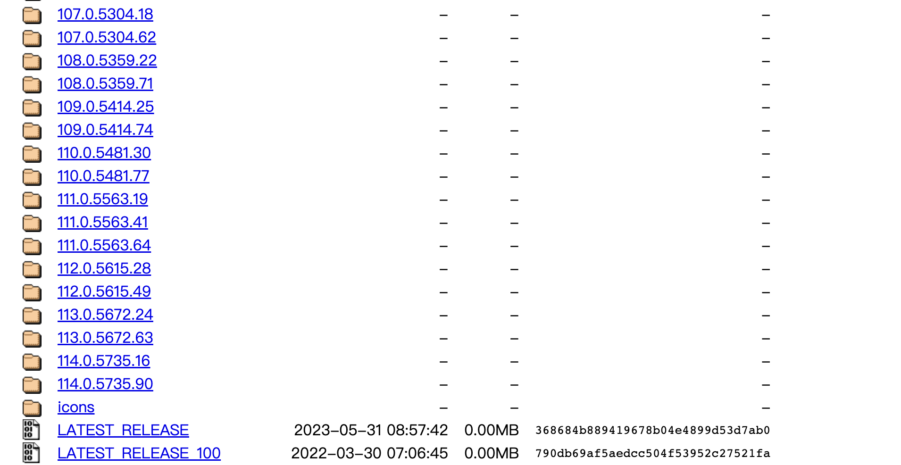
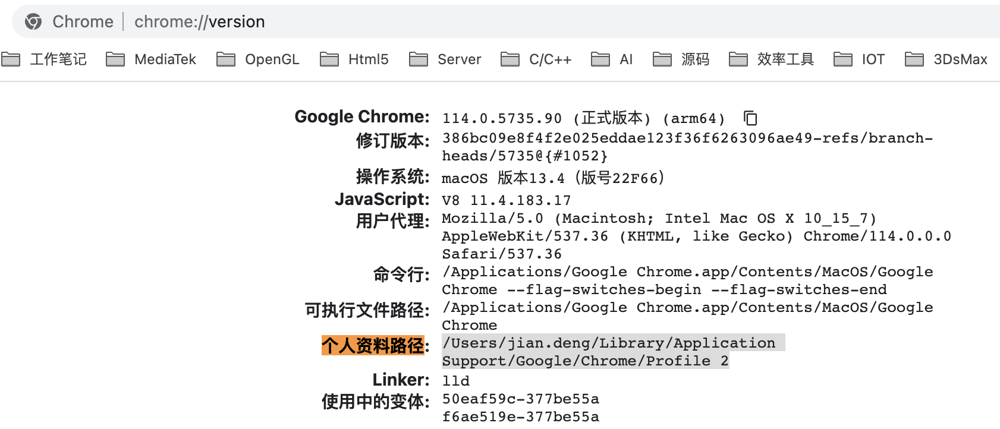

## Mac安装chromedriver

参考https://blog.csdn.net/qq_26409411/article/details/129379232

#### 1、查看当前[Google浏览器](https://so.csdn.net/so/search?q=Google浏览器&spm=1001.2101.3001.7020)版本

打开Google浏览器，网址栏输入：chrome://settings/help

#### 2、下载对应版本的[chromedriver](https://so.csdn.net/so/search?q=chromedriver&spm=1001.2101.3001.7020)

（1）下载地址：http://chromedriver.storage.googleapis.com/index.html



注意最新版本也只有114.x，最新的chrome版本当前时间已经到了129.x，需要先降级chrome版本。

（2）选择mac系统的chromedriver下载

#### 3、把chromedriver放在/usr/local/bin目录下

（1）解压下载的文件，把可执行文件放到/usr/local/bin目录

快捷键前往/usr/local/bin目录：打开Finder，然后command+shift+G

把可执行文件chromedriver拖进去

#### 4、测试验证

（1）提示：无法打开“chromedriver”，因为无法验证开发者

1、进入chromedriver存放目录

cd /usr/local/bin/

2、添加信任

xattr -d com.apple.quarantine chromedriver

 （2）python代码测试

```python
# encoding:utf-8
 
from selenium import webdriver
 
# 启动chrome浏览器
browser = webdriver.Chrome()
browser.get("https://www.baidu.com/")
```


## 选择合适的Chrome版本

由于测试时候会需要用到历史版本，但发现不是很好找，于是记录一下。

window/MAC/Linux：
[http://chromedriver.storage.googleapis.com/index.html](https://link.segmentfault.com/?enc=HUA8%2FODGYZz8BK6sba2EKA%3D%3D.t1wVBJOe4%2Bt1HiSNCkWvjPVqixxMa97wfJJqboqXYOGW2VhizghYFgEi9uf1yhEKs1XeGdWA3rA3OCLx4dxorQ%3D%3D)

Window：
[https://lanzoui.com/b138066](https://link.segmentfault.com/?enc=CRB79WVfDXU%2F1wkxuEWXeA%3D%3D.SK%2F32nYVQu86ClvBLcEsBWPl2GEirUwzP4S3N3nm4Ak%3D)

MAC：
[https://google-chrome.cn.uptodown.com/mac/versions](https://link.segmentfault.com/?enc=wrNixWa%2BC4oHCIngw5uBfA%3D%3D.UTxoUi4bV0RiEFd%2FAWiuJm5IAVXvm8gGGXsAHg9ouNFfMtI7RFECg%2FJYnwYloVktFu5fs0LGBCVwEUQbHI8VMg%3D%3D)

firefox的历史版本：
[http://ftp.mozilla.org/pub/firefox/releases/](https://link.segmentfault.com/?enc=xqp7D4FiJt7YnWI6L%2B%2F3GQ%3D%3D.%2FwCxa1HlI7YnCGPtxzFSsGO5gVcgPd6tnm6idiJJp0sj18QTWx3XCEV5JxxPwYLG)

我选择了114.0.5735.106版本 https://google-chrome.cn.uptodown.com/mac/download/103415521

配的chromedriver /114.0.5735.90/: https://chromedriver.storage.googleapis.com/index.html?path=114.0.5735.90/


另外分享几个Google Chrome谷歌浏览器历史版本下载网站

#### 网站1

谷歌浏览器历史版本相关地址：https://www.chromedownloads.net/chrome64win/

#### 网站2

谷歌浏览器历史版本相关地址：https://downzen.com/en/windows/google-chrome/versions/

#### 网站3

谷歌浏览器历史版本相关地址：https://vikyd.github.io/download-chromium-history-version/#/


## Python + Selenium（三）网页元素定位（二）id 定位

了解了**开发者工具**和 **HTML 结构** 后，接下来，就来看看在 Python + Selenium 中如何查找元素了。

查找元素，是 WebDriver 中的核心部分之一。WebDriver提供了八种定位方法，方法如下：

| 定位方式              | 方法                                    | 说明                                |
| :-------------------- | :-------------------------------------- | :---------------------------------- |
| **id**                | find_element_by_**id**()                | 使用 **id 属性**定位                |
| **name**              | find_element_by_**name**()              | 使用 **name 属性**定位              |
| **class_name**        | find_element_by_**class_name**()        | 使用 **class 属性**定位             |
| **tag_name**          | find_element_by_**tag_name**()          | 使用**标签名**定位                  |
| **link_text**         | find_element_by_**link_text**()         | 使用**链接文本**定位，只针对 a 标签 |
| **partial_link_text** | find_element_by_**partial_link_tex**t() | 使用**部分链接文本**定位            |
| **css_selector**      | find_element_by_**css_selector**()      | 使用 **css 选择器**语法定位         |
| **xpath**             | find_element_by_**xpath**()             | 使用 **xpath 语法**定位             |

`id、name、class name、tag name` 使用的是元素的本身的一些特殊**属性**和**标签名**；而`link_text、partial_link_text`使用的是**文本**定位，并且仅针对于链接地址。这六种定位方式，都是相对简便的定位方式。

但是由于页面操作的多样性，很多时候想操作的元素并非都能找到这么合适的定位方式。所以，需要能够在更加复杂的环境下的定位方式，在 WebDriver 中提供了两种更加高级（复杂）的定位方式`css selector、xpath`。

通过 `css selector、xpath` 可以使用更加复杂的定位方式，包括使用**页面元素层级**定位和使用其他**任意的属性值**等方式来定位。通过这两种方式，可以定位到页面上的任意位置。


但实际应用发现报错：[AttributeError: 'WebDriver' object has no attribute 'find_element_by_name'](https://stackoverflow.com/questions/72773206/selenium-python-attributeerror-webdriver-object-has-no-attribute-find-el)  因为：

Selenium just removed that method in version `4.3.0`. See the CHANGES: https://github.com/SeleniumHQ/selenium/blob/a4995e2c096239b42c373f26498a6c9bb4f2b3e7/py/CHANGES

```none
Selenium 4.3.0
* Deprecated find_element_by_* and find_elements_by_* are now removed (#10712)
* Deprecated Opera support has been removed (#10630)
* Fully upgraded from python 2x to 3.7 syntax and features (#10647)
* Added a devtools version fallback mechanism to look for an older version when mismatch occurs (#10749)
* Better support for co-operative multi inheritance by utilising super() throughout
* Improved type hints throughout
```

You need to import [Selenium WebDriver](https://en.wikipedia.org/wiki/Selenium_(software)#Selenium_WebDriver) using this code:

```py
from selenium.webdriver.common.by import By
```

Next use this API:

| Old API                        | New API                         |
| :----------------------------- | :------------------------------ |
| find_element_by_id(‘id’)       | find_element(By.ID, ‘id’)       |
| find_element_by_name(‘name’)   | find_element(By.NAME, ‘name’)   |
| find_element_by_xpath(‘xpath’) | find_element(By.XPATH, ‘xpath’) |

比如：

```python
from selenium.webdriver.common.by import By

# 方式1：通过文本内容精准定位元素
driver.find_element(By.XPATH, '//div[text()="文本内容"]')   

# 方式2：通过文本内容模糊定位元素
driver.find_element(By.XPATH, '//div[contains(text(), "文本内容")]')

```


## selenium 保留登录状态

参考https://segmentfault.com/a/1190000022766398 selenium每次启动打开相同的Chrome浏览器实例，实现免Cookie登录网站

普通方法使用selenium，每次会新建一个全新的浏览器实例，而无法保存曾经登录过的Cookie等信息。现今业务需要selenium每次打开同一个浏览器。经查阅资料，记下该笔记，以便日后查询。

本文在selenium启动Chrome时，同时加载本地的用户配置文件，这样能保证每次启动的Chrome拥有相同数据信息。这里以Linux为例，同样试用于Windows和Mac OS。

运行环境: Ubuntu 20.04 LTS, Python 3.8.2, Chrome 83.0.4103.61

编写selenium的Chrome配置代码

首先需要查询Chrome配置文件在本机的存放路径，在Chrome地址栏输入

chrome://version/

如下图,找到个人资料路径




图中所示，我的个人资料路径为/Users/jian.deng/Library/Application Support/Google/Chrome/Profile 2 （Windows和Mac路径不同，也在这里查询即可）

编写以下Python代码：

```python
from selenium import webdriver
from selenium.webdriver.chrome.options import Options

option = webdriver.ChromeOptions()
option.add_argument('--user-data-dir=/home/cyberbolt/.config/google-chrome/Default') #加载前面获取的 个人资料路径
driver = webdriver.Chrome(chrome_options=option, executable_path="/opt/google/chrome/chromedriver") #启动Chrome驱动，这里为Linux系统，Windows 和 Mac OS 根据实际路径填写
```

之后可以自行测试了，每次将打开相同的浏览器，省去不少麻烦。


实际应用报错：got an unexpected keyword argument 'chrome_options'


