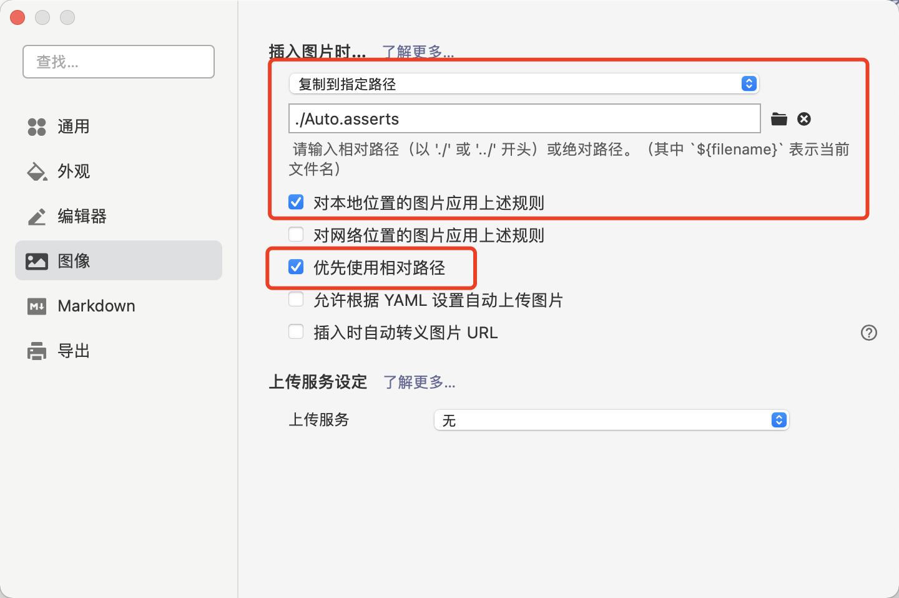

### 吐槽有道云笔记

实在不想再忍受垃圾有道云笔记了。以后大部分非私人笔记迁移到这里。有道云笔记吐槽点：

* 搜索不准确，用笔记里有的关键字搜索不到笔记；
* Mac版本浏览卡顿，尤其是当笔记有图片的时候；
* MarkDown的编辑和预览不对齐（内容多了后编辑的内容可能不在预览页面上）；
* MarkDown要会员才能插入图片；
* 手机版在预览时有时会突然回到顶部。之前把演讲稿放在云笔记用手机看，演讲时出问题；
* 笔记字体大小只有那几个选择。如果网页上负责的内容字体大小不一样，改起来很麻烦；

Mac现在已经默认无法使用旧版有道云笔记（3.6.5版本及以下），Mac会提示警告。只有手动设置忽略才能继续使用。看官网的重新架构的beta版本。本来希望体验能好一些，没想到更烂了，甚至连基础功能都出问题了。才用两天就发现一堆无法忍受的bug 。

* 双击搜索框，本来只是想快速搜索，但有道云会自动缩放；
* 在笔记中搜索内容，输入第一个字母输入框就会失去焦点，再输入就会编辑笔记的内容，很容易误编辑掉笔记的内容；
* ***内容多的笔记后面一大部分不能预览，列表滑不下去***。真不知道他们发版前有没有做过测试；

看网上也有很多反馈的问题，说反馈给网易也从未有过回应。我以前好像也反馈过一次。忍了这么久之后，终于还是决定放弃。转为使用Github+[Typora](https://typora.io/)。目前能满足我的大部分需求。唯一不方便的是目前手机上可能不太方便。但手机使用场景目前对我来说也不是很多。

### 转为Github+Typora

参考http://www.cxyzjd.com/article/qq_38056704/84765586

目前这一套能满足我的主要需求：

* 同步，虽然不会自动同步，但作为程序猿还好，谁会写完代码不提交的；

* MarkDown插入图片，需要配置下。会有个冗余目录在笔记的文件树上。但想想有道云要花钱才能有这个还是值得的；

  

* 关键是预览体验极好；

