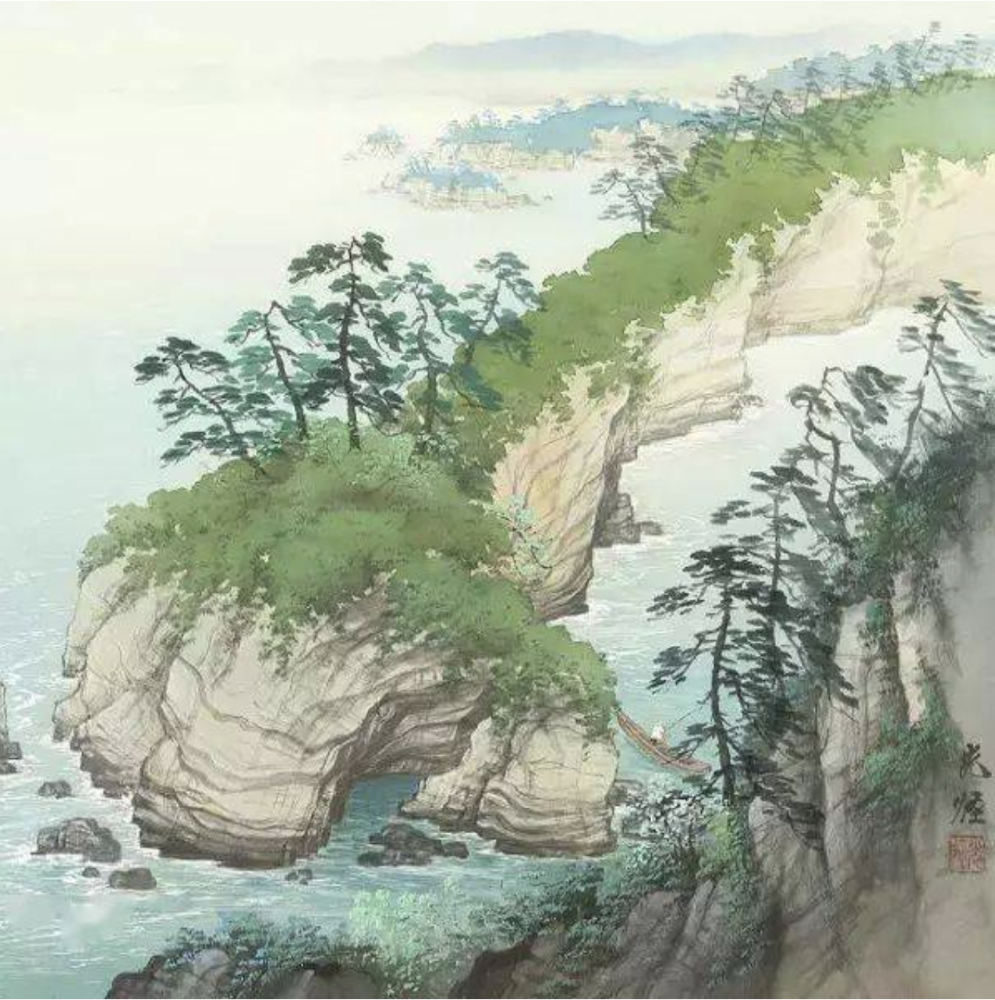
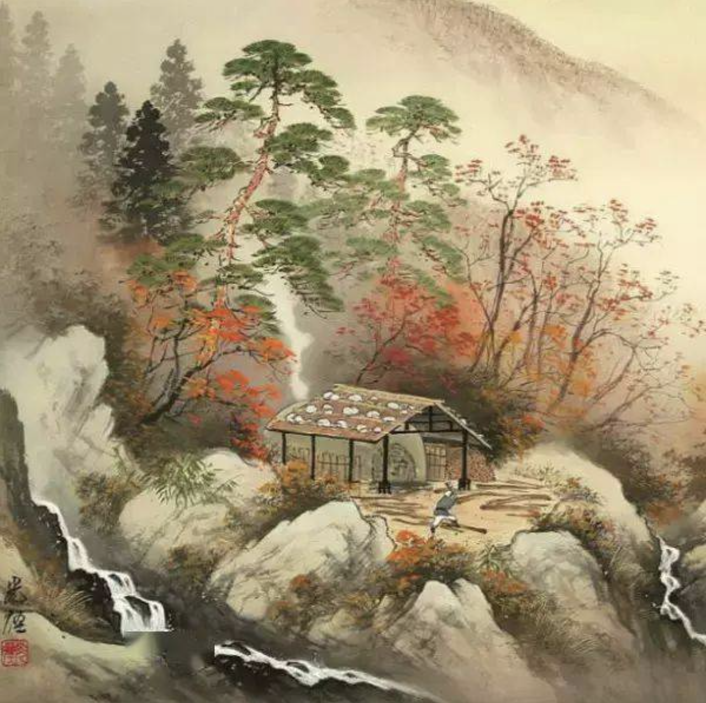
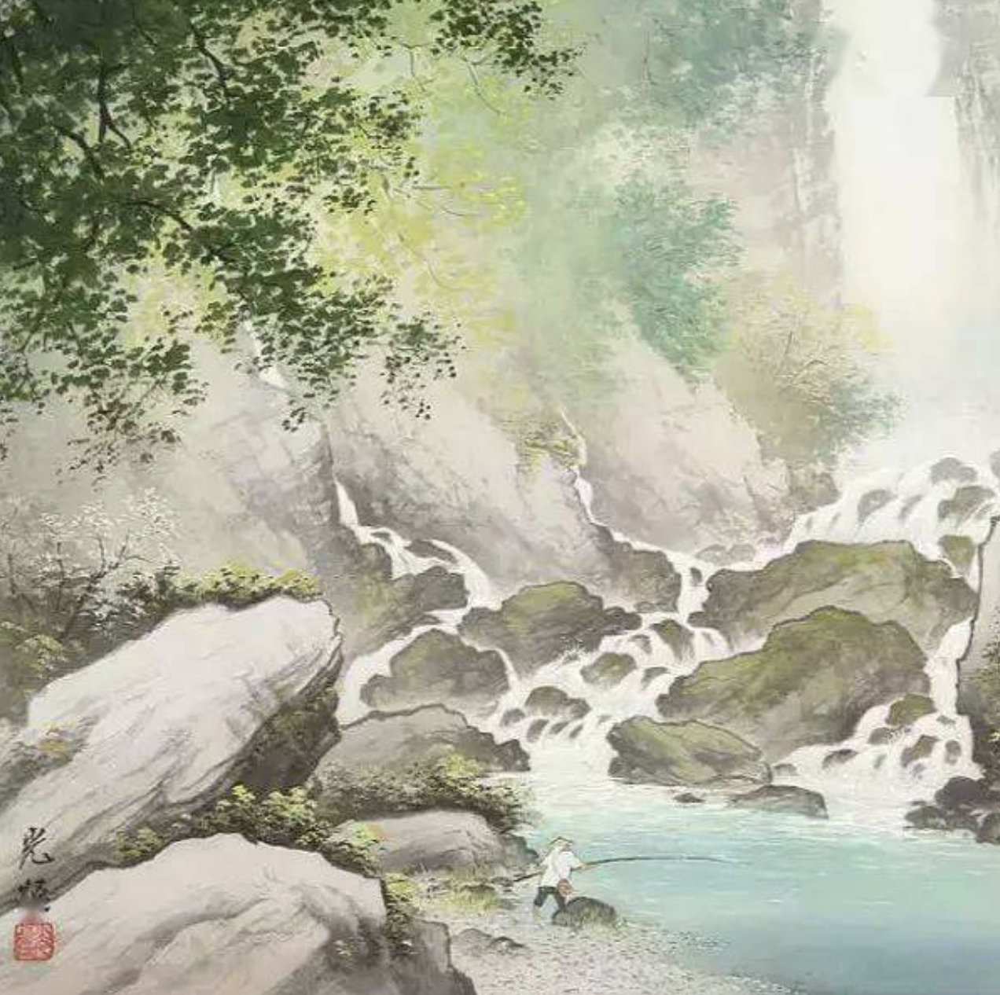

语文作为一门母语学科，不仅是一种交流工具，更是了解人类文明发展尤其是民族精神的窗口，唐诗宋词等代表了一代文学的最高成就。它们不仅承载了文化传统，凝聚了民族精神，增强了民族认同感、凝聚力和创造力，而且意境深邃，情感丰富，语言精炼含蓄，形象生动，富有节奏感和音乐美，有利于培养审美能力，提高文学素养和文化品位。

因此，中国古典诗词一直是中小学语文教育的重要组成部分，这次中小学考试改革和新教材统一，透露出一个非常明显的信号，国家将大力推进古诗文教育和学习。今后，无论是学业水平考试，还是中高考，古诗文都将是考试的重中之重。从2019年秋季新学期开始，全国中小学的语文就统一使用部编版的教科书，新教材之中，大量增加了古诗文， **一年级至六年级的古诗词共128篇，增加了87%，初中语文古诗词数量增加了51%，而高考要求学生背诵的古诗词则由60篇增加到了70篇。**

这意味着在语文试卷之中，古诗词的分数可以 **占到30%，**也就是说古诗词和作文的分数基本相当。如果我们还不注意古诗词的积累和文言文的阅读，我们就可能会在这个版块大量丢分。而这部分知识并不是考试前突击学习、死记硬背就能达到的，需要我们要下功夫积累、理解古诗词。

新学期开学了，为了帮助孩子们从一开始就做好准备，提高阅读量和阅读能力，在新学期能取得更好的成绩，今天老师特意为大家整理了 **2019年最新版1-12年级必须背诵的208首****古诗词，**建议家长收藏好，可以选择性打印小学阶段或者中学阶段的古诗文。

这里的208篇，涵盖了中小学阶段所有需要背诵的古诗文，根据《义务教育语文课程标准》（2011年版）、《普通高中语文课程标准》（2017年版）整理如下：

1～6年级（75篇）、7～9年级（61篇）、10～12年级（72篇）。

中小学生都会背的古诗文，你敢挑战吗？

**1～6年级（75篇）**

1. 江南（江南可采莲）汉乐府 江南可采莲，莲叶何田田。 鱼戏莲叶间。 鱼戏莲叶东，鱼戏莲叶西， 鱼戏莲叶南，鱼戏莲叶北。
2. 长歌行（青青园中葵）汉乐府 青青园中葵，朝露待日晞。 阳春布德泽，万物生光辉。 常恐秋节至，焜黄华叶衰。
3. 敕勒歌（敕勒川）北朝民歌 敕勒川，阴山下。天似穹庐，笼盖四野。天苍苍，野茫茫，风吹草低见牛羊。
4. 咏鹅（鹅鹅鹅）骆宾王 鹅，鹅，鹅，曲项向天歌。 白毛浮绿水，红掌拨清波。
5. 风（解落三秋叶）李峤 解落三秋叶，能开二月花。 过江千尺浪，入竹万竿斜。
6. 咏柳（碧玉妆成一树高）贺知章 碧玉妆成一树高，万条垂下绿丝绦。 不知细叶谁裁出，二月春风似剪刀。
7. 回乡偶书（少小离家老大回）贺知章 少小离家老大回，乡音无改鬓毛衰。 儿童相见不相识，笑问客从何处来。
8. 凉州词（黄河远上白云间）王之涣 黄河远上白云间，一片孤城万仞山。 羌笛何须怨杨柳，春风不度玉门关。
9. 登鹳雀楼（白日依山尽）王之涣 白日依山尽，黄河入海流。 欲穷千里目，更上一层楼。
10. 春晓（春眠不觉晓）孟浩然 春眠不觉晓，处处闻啼鸟。 夜来风雨声，花落知多少。
11. 凉州词（葡萄美酒夜光杯）王翰 葡萄美酒夜光杯，欲饮琵琶马上催 。 醉卧沙场君莫笑，古来征战几人回？
12. 出塞（秦时明月汉时关）王昌龄 秦时明月汉时关，万里长征人未还。 但使龙城飞将在，不教胡马度阴山。
13. 芙蓉楼送辛渐（寒雨连江夜入吴）王昌龄 寒雨连江夜入吴，平明送客楚山孤。 洛阳亲友如相问，一片冰心在玉壶。
14. 鹿柴（空山不见人）王维 空山不见人，但闻人语响。 返景入深林，复照青苔上。
15. 送元二使安西（渭城朝雨浥轻尘）王维 渭城朝雨浥轻尘，客舍青青柳色新。 劝君更尽一杯酒，西出阳关无故人。
16. 九月九日忆山东兄弟（独在异乡为异客）王维 独在异乡为异客，每逢佳节倍思亲。 遥知兄弟登高处，遍插茱萸少一人。
17. 《静夜思》 唐·李白 床前明月光，疑是地上霜。 举头望明月，低头思故乡。
18. 古朗月行（小时不识月）李白 小时不识月，呼作白玉盘。 又疑瑶台镜，飞在青云端。 仙人垂两足，桂树何团团。 白兔捣药成，问言与谁餐。
19. 望庐山瀑布（日照香炉生紫烟）李白 日照香炉生紫烟，遥看瀑布挂前川。 飞流直下三千尺，疑是银河落九天。
20. 赠汪伦（李白乘舟将欲行）李白 李白乘舟将欲行，忽闻岸上踏歌声。 桃花潭水深千尺，不及汪伦送我情
21. 黄鹤楼送孟浩然之广陵（故人西辞黄鹤楼）李白 故人西辞黄鹤楼，烟花三月下扬州。 孤帆远影碧空尽，唯见长江天际流。
22. 早发白帝城（朝辞白帝彩云间）李白 朝辞白帝彩云间，千里江陵一日还。 两岸猿声啼不住，轻舟已过万重山。
23. 望天门山（天门中断楚江开）李白 天门中断楚江开，碧水东流至此回。 两岸青山相对出，孤帆一片日边来。
24. 别董大（千里黄云白日曛）高适 千里黄云白日曛，北风吹雁雪纷纷。 莫愁前路无知己，天下谁人不识君？
25. 绝句（两个黄鹂鸣翠柳）杜甫 两个黄鹂鸣翠柳，一行白鹭上青天。 窗含西岭千秋雪，门泊东吴万里船。
26. 春夜喜雨（好雨知时节）杜甫 好雨知时节，当春乃发生。 随风潜入夜，润物细无声。 野径云俱黑，江船火独明。 晓看红湿处，花重锦官城。
27. 绝句（迟日江山丽）杜甫 迟日江山丽，春风花草香。 泥融飞燕子，沙暖睡鸳鸯。
28. 江畔独步寻花（黄师塔前江水东）杜甫 黄师塔前江水东，春光懒困倚微风。 桃花一簇开无主，可爱深红爱浅红？
29. 枫桥夜泊（月落乌啼霜满天）张继 月落乌啼霜满天，江枫渔火对愁眠。 姑苏城外寒山寺，夜半钟声到客船。
30. 滁州西涧（独怜幽草涧边生）韦应物 独怜幽草涧边生，上有黄鹂深树鸣。 春潮带雨晚来急，野渡无人舟自横。
31. 游子吟（慈母手中线）孟郊 慈母手中线，游子身上衣。 临行密密缝，意恐迟迟归。 谁言寸草心，报得三春晖。
32. 早春呈水部张十八员外（天街小雨润如酥）韩愈 天街小雨润如酥，草色遥看近却无。 最是一年春好处，绝胜烟柳满皇都。
33. 渔歌子（西塞山前白鹭飞）张志和 西塞山前白鹭飞，桃花流水鳜鱼肥。 青箬笠，绿蓑衣，斜风细雨不须归。
34. 塞下曲（月黑雁飞高）卢纶 月黑雁飞高，单于夜遁逃。 欲将轻骑逐，大雪满弓刀。
35. 望洞庭（湖光秋月两相和）刘禹锡 湖光秋月两相和，潭面无风镜未磨。 遥望洞庭山水色，白银盘里一青螺。
36. 浪淘沙（九曲黄河万里沙）刘禹锡 九曲黄河万里沙，浪淘风簸自天涯。 如今直上银河去，同到牵牛织女家。
37. 赋得古原草送别（离离原上草）白居易 离离原上草，一岁一枯荣。 野火烧不尽，春风吹又生。 远芳侵古道，晴翠接荒城。 又送王孙去，萋萋满别情。
38. 池上（小娃撑小艇）白居易 小娃撑小艇，偷采白莲回。 不解藏踪迹，浮萍一道开。
39. 忆江南（江南好）白居易 江南好，风景旧曾谙。日出江花红胜火，春来江水绿如蓝，能不忆江南？
40. 小儿垂钓（蓬头稚子学垂纶）胡令能 蓬头稚子学垂纶，侧坐莓苔草映身。 路人借问遥招手，怕得鱼惊不应人。
41. 悯农（锄禾日当午）李绅 锄禾日当午，汗滴禾下土。 谁知盘中餐，粒粒皆辛苦。
42. 悯农（春种一粒粟）李绅 春种一粒粟，秋收万颗子。 四海无闲田，农夫犹饿死。
43. 江雪（千山鸟飞绝）柳宗元 千山鸟飞绝，万径人踪灭。 孤舟蓑笠翁，独钓寒江雪。
44. 寻隐者不遇（松下问童子）贾岛 松下问童子，言师采药去。 只在此山中，云深不知处。
45. 山行（远上寒山石径斜）杜牧 远上寒山石径斜，白云深处有人家。 停车坐爱枫林晚，霜叶红于二月花。
46. 清明（清明时节雨纷纷）杜牧 清明时节雨纷纷，路上行人欲断魂。 借问酒家何处有，牧童遥指杏花村。
47. 江南春（千里莺啼绿映红）杜牧 千里莺啼绿映红，水村山郭酒旗风。 南朝四百八十寺，多少楼台烟雨中。
48. 蜂（不论平地与山尖）罗隐 不论平地与山尖，无限风光尽被占。 采得百花成蜜后，为谁辛苦为谁甜。
49. 江上渔者（江上往来人）范仲淹 江上往来人，但爱鲈鱼美。 君看一叶舟，出没风波里。
50. 元日（爆竹声中一岁除）王安石 爆竹声中一岁除，春风送暖入屠苏。 千门万户曈曈日，总把新桃换旧符。
51. 泊船瓜洲（京口瓜洲一水间）王安石 京口瓜洲一水间，钟山只隔数重山。 春风又绿江南岸，明月何时照我还。
52. 书湖阴先生壁（茅檐长扫净无苔）王安石 茅檐长扫净无苔，花木成畦手自栽。 一水护田将绿绕，两山排闼送青来。
53. 六月二十七日望湖楼醉书（黑云翻墨未遮山）苏轼 黑云翻墨未遮山，白雨跳珠乱入船。 卷地风来忽吹散，望湖楼下水如天。
54. 饮湖上初晴后雨（水光潋滟晴方好）苏轼 水光潋滟晴方好，山色空蒙雨亦奇。 欲把西湖比西子，淡妆浓抹总相宜。
55. 惠崇春江晓景（竹外桃花三两枝）苏轼 竹外桃花三两枝，春江水暖鸭先知。 蒌蒿满地芦芽短，正是河豚欲上时
56. 题西林壁（横看成岭侧成峰）苏轼 横看成岭侧成峰，远近高低各不同。 不识庐山真面目，只缘身在此山中。
57. 夏日绝句（生当作人杰）李清照 生当作人杰，死亦为鬼雄。 至今思项羽，不肯过江东。
58. 三衢道中（梅子黄时日日晴） 曾几 梅子黄时日日晴，小溪泛尽却山行。 绿阴不减来时路，添得黄鹂四五声。
59. 示儿（死去元知万事空） 陆游 死去元知万事空，但悲不见九州同。 王师北定中原日，家祭无忘告乃翁。
60. 秋夜将晓出篱门迎凉有感（三万里河东入海）陆游 三万里河东入海，五千仞岳上摩天。 遗民泪尽胡尘里，南望王师又一年。
61. 四时田园杂兴（昼出耘田夜绩麻） 范成大 昼出耘田夜绩麻，村庄儿女各当家。 童孙未解供耕织，也傍桑阴学种瓜。
62. 四时田园杂兴（梅子金黄杏子肥） 范成大 梅子金黄杏子肥，麦花雪白菜花稀。 日长篱落无人过，唯有蜻蜓蛱蝶飞。
63. 小池（泉眼无声惜细流）杨万里 泉眼无声惜细流，树阴照水爱晴柔。 小荷才露尖尖角，早有蜻蜓立上头。
64. 晓出净慈寺送林子方（毕竟西湖六月中）杨万里 毕竟西湖六月中，风光不与四时同。 接天莲叶无穷碧，映曰荷花别样红。
65. 春日（胜日寻芳泗水滨）朱熹 胜日寻芳泗水滨，无边光景一时新。 等闲识得东风面，万紫千红总是春。
66. 观书有感（半亩方塘一鉴开）朱熹 半亩方塘一鉴开，天光云影共徘徊。 问渠那得清如许？为有源头活水来。
67. 题临安邸（山外青山楼外楼）林升 山外青山楼外楼，西湖歌舞几时休？ 暖风熏得游人醉，直把杭州作汴州。
68. 游园不值（应怜屐齿印苍苔）叶绍翁 应怜屐齿印苍苔，小扣柴扉久不开。 春色满园关不住，一枝红杏出墙来。
69. 乡村四月（绿遍山原白满川）翁卷 绿遍山原白满川，子规声里雨如烟。 乡村四月闲人少，才了蚕桑又插田。
70. 墨梅（我家洗砚池头树）王冕 我家洗砚池头树，朵朵花开淡墨痕。 不要人夸好颜色，只留清气满乾坤。
71. 石灰吟（千锤万凿出深山）于谦 千锤万凿出深山，烈火焚烧若等闲。 粉身碎骨全不怕，要留清白在人间。
72. 竹石（咬定青山不放松）郑燮 咬定青山不放松，立根原在破岩中。 千磨万击还坚劲，任尔东西南北风。
73. 所见（牧童骑黄牛）袁枚 牧童骑黄牛，歌声振林樾。 意欲捕鸣蝉，忽然闭口立。
74. 村居（草长莺飞二月天）高鼎 草长莺飞二月天，拂堤杨柳醉春烟。 儿童散学归来早，忙趁东风放纸鸢。
75. 己亥杂诗（九州生气恃风雷）龚自珍 九州生气恃风雷，万马齐喑究可哀。 我劝天公重抖擞，不拘一格降人才。

**7～9年级（61篇）**

1. 关雎（关关雎鸠）《诗经》 关关雎鸠，在河之洲。窈窕淑女，君子好逑。 参差荇菜，左右流之。窈窕淑女，寤寐求之。
2. 蒹葭（蒹葭苍苍）《诗经》 蒹葭苍苍，白露为霜。所谓伊人，在水一方。
3. 十五从军征（十五从军征）汉乐府 十五从军征，八十始得归。 道逢乡里人:“家中有阿谁？” “遥看是君家，松柏冢累累。” 兔从狗窦入，雉从架上飞。 中庭生旅谷，井上生旅葵。 舂谷持作饭，采葵持作羹。 羹饭一时熟，不知贻阿谁？ 出门东向看，泪落沾我衣。
4. 观沧海（东临碣石）曹操 东临碣石，以观沧海。 水何澹澹，山岛竦峙。 树木丛生，百草丰茂。 秋风萧瑟，洪波涌起。 日月之行，若出其中； 星汉灿烂，若出其里。 幸甚至哉，歌以咏志。
5. 饮酒（结庐在人境） 陶渊明 结庐在人境，而无车马喧。 问君何能尔？心远地自偏。 采菊东篱下，悠然见南山。 山气日夕佳，飞鸟相与还。
6. 木兰辞（唧唧复唧唧）北朝民歌 问女何所思，问女何所忆。 女亦无所思，女亦无所忆。 雄兔脚扑朔，雌兔眼迷离。 双兔傍地走，安能辨我是雄雌。
7. 送杜少府之任蜀州（城阙辅三秦）王勃 城阙辅三秦，风烟望五津。 与君离别意，同是宦游人。 海内存知己，天涯若比邻。 无为在歧路，儿女共沾巾。
8. 登幽州台歌（前不见古人）陈子昂 前不见古人，后不见来者。 念天地之悠悠，独怆然而涕下。
9. 次北固山下（客路青山外）王湾 客路青山外，行舟绿水前。 潮平两岸阔，风正一帆悬。 海日生残夜，江春入旧年。 乡书何处达，归雁洛阳边。
10. 使至塞上（单车欲问边）王维 单车欲问边，属国过居延， 征蓬出汉塞，归雁入胡天， 大漠孤烟直。长河落日圆， 萧关逢侯骑，都护在燕然。
11. 闻王昌龄左迁龙标遥有此寄（杨花落尽子规啼）李白 杨花落尽子规啼，闻道龙标过五溪。 我寄愁心与明月，随风直到夜郎西。
12. 行路难（金樽清酒斗十千）李白 行路难！行路难！多歧路，今安在？ 长风破浪会有时，直挂云帆济沧海。
13. 黄鹤楼（昔人已乘黄鹤去）崔颢 昔人已乘黄鹤去，此地空余黄鹤楼。 黄鹤一去不复返，白云千载空悠悠。 晴川历历汉阳树，芳草萋萋鹦鹉洲。 日暮乡关何处是？烟波江上使人愁。
14. 望岳（岱宗夫如何）杜甫
15. 春 望（国破山河在）杜甫 岱宗夫如何？齐鲁青未了。 造化钟神秀，阴阳割昏晓。 荡胸生曾云，决眦入归鸟。 会当凌绝顶，一览众山小。
16. 茅屋为秋风所破歌（八月秋高风怒号）杜甫 安得广厦千万间，大庇天下寒士俱欢颜，风雨不动安如山！呜呼！何时眼前突兀见此屋，吾庐独破受冻死亦足。
17. 白雪歌送武判官归京（北风卷地白草折）岑参 北风卷地白草折，胡天八月即飞雪。 忽如一夜春风来，千树万树梨花开。 散入珠帘湿罗幕，狐裘不暖锦衾薄。 将军角弓不得控，都护铁衣冷难着。
18. 酬乐天扬州初逢席上见赠（巴山楚水凄凉地）刘禹锡 巴山楚水凄凉地，二十三年弃置身。 怀旧空吟闻笛赋，到乡翻似烂柯人。 沉舟侧畔千帆过，病树前头万木春。 今日听君歌一曲，暂凭杯酒长精神。
19. 卖炭翁（卖炭翁）白居易 卖炭翁，伐薪烧炭南山中。 满面尘灰烟火色，两鬓苍苍十指黑。 卖炭得钱何所营？身上衣裳口中食。
20. 钱塘湖春行（孤山寺北贾亭西）白居易 孤山寺北贾亭西，水面初平云脚低。 几处早莺争暖树，谁家斜燕啄春泥。 乱花渐欲迷人眼，浅草才能没马蹄。 最爱湖东行不足，绿杨阴里白沙堤。
21. 雁门太守行（黑云压城城欲摧）李贺 黑云压城城欲摧，甲光向日金鳞开。 角声满天秋色里，塞上燕脂凝夜紫。 半卷红旗临易水，霜重鼓寒声不起。 报君黄金台上意，提携玉龙为君死！
22. 赤壁（折戟沉沙铁未销）杜牧 折戟沉沙铁未销，自将磨洗认前朝。 东风不与周郎便，铜雀春深锁二乔。
23. 泊秦淮（烟笼寒水月笼沙）杜牧 烟笼寒水月笼沙，夜泊秦准近酒家。 商女不知亡国恨，隔江犹唱后庭花。
24. 夜雨寄北（君问归期未有期）李商隐 君问归期未有期，巴山夜雨涨秋池。 何当共剪西窗烛，却话巴山夜雨时。
25. 无题（相见时难别亦难）李商隐 相见时难别亦难，东风无力百花残。 春蚕到死丝方尽，蜡炬成灰泪始干。 晓镜但愁云鬓改，夜吟应觉月光寒。 蓬山此去无多路，青鸟殷勤为探看。
26. 相见欢（无言独上西楼）李煜 无言独上西楼，月如钩。寂寞梧桐深院锁清秋。 剪不断，理还乱，是离愁。别是一般滋味在心头。
27. 渔家傲（塞下秋来风景异）范仲淹 塞下秋来风景异，衡阳雁去无留意。四面边声连角起。千嶂里，长烟落日孤城闭。 浊酒一杯家万里，燕然未勒归无计。羌管悠悠霜满地。人不寐，将军白发征夫泪。
28. 浣溪沙（一曲新词酒一杯）晏殊 一曲新词酒一杯，去年天气旧亭台。夕阳西下几时回。 无可奈何花落去，似曾相识燕归来。小园香径独徘徊。
29. 登飞来峰（飞来峰上千寻塔）王安石 飞来山上千寻塔，闻说鸡鸣见日升。 不畏浮云遮望跟，只缘身在最高层。
30. 江城子（老夫聊发少年狂）苏轼 老夫聊发少年狂，左牵黄，右擎苍，锦帽貂裘，千骑卷平冈。为报倾城随太守，亲射虎，看孙郎。 酒酣胸胆尚开张，鬓微霜，又何妨？持节云中，何日遗冯唐。会雕弓如满月，西北望，射天狼。
31. 水调歌头（明月几时有）苏轼 人有悲欢离合，月有阴晴圆缺，此事古难全。但愿人长久，千里共婵娟。
32. 渔家傲（天接云涛连晓雾）李清照 天接云涛连晓雾，星河欲转千朝舞。仿佛梦魂归帝所。闻天语，殷勤问我归何处。 我报路长嗟日暮，学诗漫有惊人句。九万里风鹏正举。风休住，蓬舟吹取三山去！
33. 游山西村（莫笑农家腊酒浑）陆游 莫笑农家腊酒浑，丰年留客足鸡豚。 山重水复疑无路，柳暗花明又一村。 萧鼓追随春社近，衣冠简朴古风存。 从今若许闲乘月，拄杖无时夜叩门。
34. 南乡子（何处望神州）辛弃疾 何处望神州？满眼风光北固楼。千古兴亡多少事？悠悠。 不尽长江滚滚流。天下英雄谁敌手？曹刘。生子当如孙仲谋。
35. 破阵子（醉里挑灯看剑）辛弃疾 醉里挑灯看剑，梦回吹角连营。八百里分麾下炙，五十弦翻塞外声。沙场秋点兵。 马作的卢飞快，弓如霹雳弦惊。了却君王天下事，赢得生前身后名。可怜白发生！
36. 过零丁洋（辛苦遭逢起一经）文天祥 辛苦遭逢起一经，干戈寥落四周星。 山河破碎风飘絮，身世浮沉雨打萍。 惶恐滩头说惶恐，零丁洋里叹零丁。 人生自古谁无死，留取丹心照汗青。
37. 天净沙·秋思（枯藤老树昏鸦）马致远 枯藤老树昏鸦，小桥流水人家，古道西风瘦马。夕阳西下，断肠人在天涯。
38. 山坡羊·潼关怀古（峰峦如聚）张养浩 峰峦如聚，波涛如怒，山河表里潼关路。望西都，意踌躇。 伤心秦汉经行处，宫阙万间都做了土。兴，百姓苦；亡，百姓苦。
39. 己亥杂诗（浩荡离愁白日斜）龚自珍 浩荡离愁白日斜，吟鞭东指即天涯。 落红不是无情物，化作春泥更护花。
40. 满江红（小住京华）秋瑾 小住京华，早又是，中秋佳节。为篱下，黄花开遍，秋容如拭。四面歌残终破楚，八年风味徒思浙。
41. 苦将侬，强派作娥眉，殊未屑！身不得，男儿列。心却比，男儿烈！算平生肝胆，因人常热。俗子胸襟谁识我？
42. 《论语》12章（学而时习之；吾日三省吾身；吾十有五而志于学；温故而知新；学而不思则罔；贤哉回也；知之者不如好之者；不义而富且贵；三人行；子在川上曰；三军可夺帅也；博学而笃志）
43. 曹刿论战《左传》

先秦·左丘明

既克，公问其故。对曰：“夫战，勇气也。一鼓作气，再而衰，三而竭。彼竭我盈。故克之。夫大国，难测也，惧有伏焉。吾视其辙乱，望其旗靡，故逐之。”

44.《孟子》三则(节选)

鱼，我所欲也；熊掌；亦我所欲也；二者不可得兼，舍鱼而取熊掌者也。生，亦我所欲也；义，亦我所欲也。二者不可得兼，舍生而取义者也。——《孟子·告子上》

故天将降大任于是人也，必先苦其心志，劳其筋骨，饿其体肤，空伐其身，行弗乱其所为，动心忍性，曾益其所不能。——《孟子·告子下》

富贵不能淫，贫贱不能移，威武不能屈，此之谓大丈夫。——《孟子·滕文公下》

45.《庄子》一则（节选）

北冥有鱼，其名为鲲。鲲之大，不知其几千里也。化而为鸟，其名为鹏，鹏之背，不知其几千里也；怒而飞，其翼若垂天之云。——《逍遥游》

46.《礼记》一则

虽有嘉肴，弗食，不知其旨也。虽有至道，弗学，不知其善也。是故学然后知不足，教然后知困。知不足，然后能自反也；知困，然后能自强也。故曰：教学相长也。

47.《列子》一则(节选)

伯牙善鼓琴，钟子期善听。伯牙鼓琴，志在高山。钟子期曰:“善哉？峨峨兮若泰山！”志在流水，钟子期曰：“善哉，洋洋兮若江河。”

48.《邹忌讽齐王纳谏》（节选）

两汉·刘向

臣诚知不如徐公美。臣之妻私臣，臣之妾畏臣，臣之客欲有求于臣，皆以美于徐公。今齐地方千里，百二十城，宫妇左右莫不私王，朝廷之巨莫不畏王，四境之内不有求于王：由此观之，王之蔽甚矣。

49.《出师表》（节选）

两汉·诸葛亮

先帝创业未半而中道崩殂，今天下三分，益州疲弊，此诚危急存亡之秋也。然侍卫之臣不懈于内，忠志之士忘身于外者，盖先帝之殊遇，欲报之于下也。诚宜开张圣听，以光先帝遗德，恢弘志土之气，不宜妄自菲薄，引喻失义，以塞忠谏之路也。

 

50.《桃花源记》（节选）

东晋·淘渊明

土地平旷，屋舍俨然，有良田美池桑竹之属。阡陌交通，鸡犬相闻。其中往来种作，男女衣着，悉如外人。黄发垂髫，并怡然自乐。

51.《答谢中书书》

南朝·陶弘景

山川之美，古来共谈。高峰入云，神流见底。两岸石壁，五色交辉。青林翠竹,四时俱备。晓雾将歇,微猿鸟乱鸣；夕日欲颓，沉麟竞跃。实是欲界之仙都。自康乐以来，未复有能与其奇者。

52.《三峡》（节选）

南北朝·郦道元

自三峡七百里中，两岸连山，略无阙处。重岩叠嶂，隐天蔽日。自非亭午夜分，不见曦月。

每至晴出霜旦，林寒涧肃，常有高猿长啸，属引凄异，空谷传响，哀转久绝。故渔者歌曰:“巴东三峡巫峡长，猿鸣三声泪沾裳。”

53.《杂说》（四）（节选）

唐·唐愈

世有伯乐，然后有千里马。千里马常有，而伯乐不常有。故虽有名马，祗辱于奴隶人之手，骈死于槽枥之间，不以干里称也。

策之不以其道，食之不能尽其材，鸣之而不能通其意，执策而临之，曰：“天下无马!”呜呼！其真无马邪？其真不知马也！

 

54.《陋室铭》

唐·刘禹锡

山不在高，有仙则名。水不在深，有龙则灵。斯是陋室，惟吾德馨。苔痕上阶绿，草色入帘青。谈笑有鸿儒，往来无白丁。可以调素琴，阅金经。无丝竹之乱耳，无案牍之劳形。南阳诸葛庐，西蜀子云亭。孔子云：何陋之有？

55.《小石潭记》（节选）

唐·柳宗元

从小丘西行百二十步，隔篁竹，闻水声，如鸣珮环，心乐之。伐竹取道，下见小潭，水尤清冽。

全石以为底，近岸，卷石底以出，为坻，为屿，为嵁，为岩。青树翠蔓，蒙络摇缀，参差披拂。

56.《岳阳楼记》（节选）

宋·范仲淹

嗟夫！予尝求古仁人之心，或异二者之为，何哉？不以物喜，不以己悲；居庙堂之高则忧其民；处江湖之远则忧其君。是进亦忧，退亦忧。然则何时而乐耶？其必曰：“先天下之忧而忧，后天下之乐而乐”乎。噫！微斯人，吾谁与归？

57.《醉翁亭记》（节选）

宋·欧阳修

环滁皆山也。其西南诸峰，林壑尤美，望之蔚然而深秀者，琅琊也。山行六七里，渐闻水声潺潺而泻出于两峰之间者，酿泉也。

峰回路转，有亭翼然临于泉上者，醉翁亭也。醉翁之意不在酒，在乎山水之间也。山水之乐，得之心而寓之酒也。

58.《爱莲说》（节选）

宋·周敦顾

予独爱莲之出淤泥而不染，濯清涟而不妖，中通外直，不蔓不枝，香远益清，亭亭净植，可远观而不可亵玩焉。

59.《记承天寺夜游》

宋·苏轼

元丰六年十月十二日夜，解衣欲睡，月色入户，欣然起行。念无与为乐者，遂至承天寺寻张怀民。怀民亦未寝，相与步于中庭。

庭下如积水空明，水中藻、荇交横，盖竹柏影也。何夜无月？何处无竹柏？但少闲人如吾两人者耳。

 

60.《送东阳马生序》（节选）

明·宋濂

同舍生皆被绮绣，戴朱缨宝饰之帽，腰白玉之环，左佩刀，右备容臭，烨然若神人；余则缊袍敝衣处其间，略无慕艳意。以中有足乐者，不知口体之奉不若人也。盖余之勤且艰若此。

61.《湖心亭看雪》

明·张岱

崇祯五年十二月，余住西湖。大雪三日，湖中人鸟声俱绝。是日更定矣，余拏一小舟，拥毳衣炉火，独往湖心亭看雪。

雾凇沆砀，天与云与山与水，上下一白。湖上影子，惟长堤一痕、湖心亭一点，与余舟一芥、舟中人两三粒而已。

62.《河中石兽》（节选）

清·纪昀

“凡河中失石，当求之于上流。盖石性坚重，沙性松浮，水不能冲石，其反激之力，必于石下迎水处啮沙为坎穴，渐激渐深，至石之半，石必倒掷坎穴中。如是再啮，石又再转，转转不已，遂反溯流逆上矣。

求之下流，固颠；求之地中，不更颠乎？”如其言，果得于数里外。然则天下之事，但知其一，不知其二者多矣，可据理臆断欤？

**10～12年级（72篇）文言文（32篇）**

**（一）必修（10篇）**

1. 《论语》十二章（“人而不仁”“朝闻道”“君子喻于义”“见贤思齐焉”“质胜文则野”“士不可以不弘毅”“譬如为山”“知者不惑”“有一言而可以终身行之着乎”“小子何莫学夫《诗》”“君子食无求饱”“克己复礼为仁”）
2. 劝学（学不可以已……用心躁也）《苟子》
3. 屈原列传（属平疾王听之不聪也……虽与日月争光可也）可马迁
4. 谏太宗十思疏 魏征
5. 师说 韩愈
6. 阿房宫赋 杜牧
7. 六国论 苏洵
8. 答司马谏议书 王安石
9. 赤壁赋 苏轼
10. 项脊轩志 归有光

（二）选择性必修（9篇）

1. 子路、曾皙、冉有、公西华待坐 《论语》
2. 报任安书（古者富贵而名摩灭……难为俗人言也）司马迁
3. 过秦论（上) 贾谊
4. 礼运（大道之行也……是谓大同）《礼记》
5. 陈情表 李密
6. 归去来兮辞（并序） 陶潜
7. 种树郭橐驼传 柳宗元
8. 石钟山记 苏轼
9. 登泰山记 姚鼐

（三）选修（12篇）

1. 《老子》八章（第八章“上善若水”；第十二章“五色令人目盲”；第十五章“古之善为士者”；第二十二章“曲则全”；第二十四章“跂者不立”；第二十七章“善行无辙迹”；第三十三幸“知人者智”；第八十一章“信言不美”）
2. 季氏将伐颛臾 《论语》
3. 大学（古之欲明明德于天下者…….壹是皆以修身为本）《礼记》
4. 中庸（喜是衰乐之未发………万物育焉；博学之………人十能之，己千之）
5. 《礼记》
6. 《孟子》一则（敢问夫子恶乎长……则不能也）
7. 逍遥游（惠子谓庄子曰……则夫子犹有蓬之心也夫）《庄子》
8. 谏逐客书 李斯
9. 兰亭集序 王羲之
10. 滕王阁序 王勃
11. 黄冈竹楼记 王禹偁
12. 上枢密韩太尉书 苏辙

古代文论选段

1. 毛诗序（诗者，志之所之也……不知手之舞之足之蹈之也）
2. 典论·论文（盖文章，经国之大业……而声名自传于后）曹丕
3. 诗品序（若乃春风春鸟……故曰：“《诗》可以群，可以怨。”）钟嵘
4. 与元九书（感人心者……华声，实义）自居易
5. 题画（江馆清秋……独画云乎裁）郑燮
6. 人间词话（词以境界为最上……自有名句；境非独谓景物也……否则谓之无境界；古今之成大事业、大学问者……恐为晏欧诸公所不许也）王国维

诗词曲（35首）

1. 静女《诗经》
2. 无衣《诗经》
3. 离骚（帝高阳之苗裔兮……来吾道夫先路）屈原
4. 涉江采芙蓉《古诗十九首》
5. 短歌行 曹操
6. 归园田居（其一） 陶潜
7. 拟行路难（其四） 鲍照
8. 春江花月夜 张若虚
9. 山居秋暝 王维
10. 燕歌行 高适
11. 蜀相 杜甫
12. 客至 杜甫
13. 登高 杜甫
14. 登岳阳楼 杜甫
15. 琵琶行（并序） 自居易
16. 李凭箜篌引 李贺
17. 菩萨蛮(小山重叠金明灭）温庭筠
18. 锦瑟 李商隐
19. 虞美人（春花秋月何时了）李煜
20. 望海潮（东南形胜）柳永
21. 桂枝香·金陵怀古 王安石
22. 江城子·乙卯正月二十日夜记梦 苏轼
23. 念奴娇·赤壁怀古 苏轼
24. 登快阁 黄庭坚
25. 鹊桥仙（纤云弄巧）秦观
26. 苏幕遮（燎沉香） 周邦彦
27. 声声慢（寻寻觅觅）李清照
28. 临安春雨初霁 陆游
29. 念奴娇·过洞庭 张孝祥
30. 永遇乐·京口北固享怀古 辛弃疾
31. 菩萨蛮·书江西造口壁 辛弃疾
32. 贺新郎（国脉微如缕）刘克庄
33. 扬州慢（淮左名都）姜夔
34. 长亭送别（【正宫】【端正好】）王实甫
35. 朝天子·咏喇叭 王磐