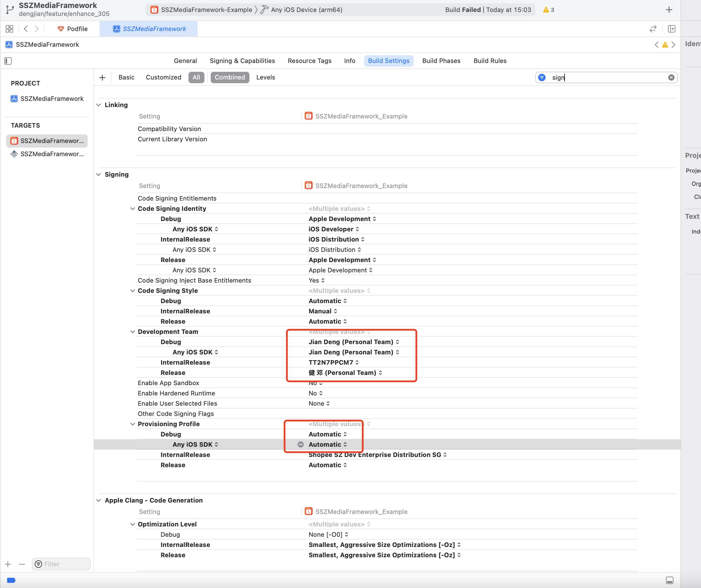

## 1. 沙盒

快捷键Cmd + Shift + 2，弹出如下对话框。选择对应的包，然后选择Download Container，将包下载到本地，用Show Package Content，打开看沙盒目录下的所有文件。

也可以使用i4助手的图像界面直接预览，更方便，如图：

## 2. 日志

Xcode->Windows->Device and Simulator，然后点击View Device Logs

这里的日志貌似如果是插着XCode调试的崩溃不会在这里。其他崩溃也不能实时拿到（可能延时1~2个小时），拔掉重插可能会刷新。

## 3.签名

有时点击勾选Automatically manage signing时team无法选择成自己的。可以在Build Setting中搜索sign，修改以下两处。

