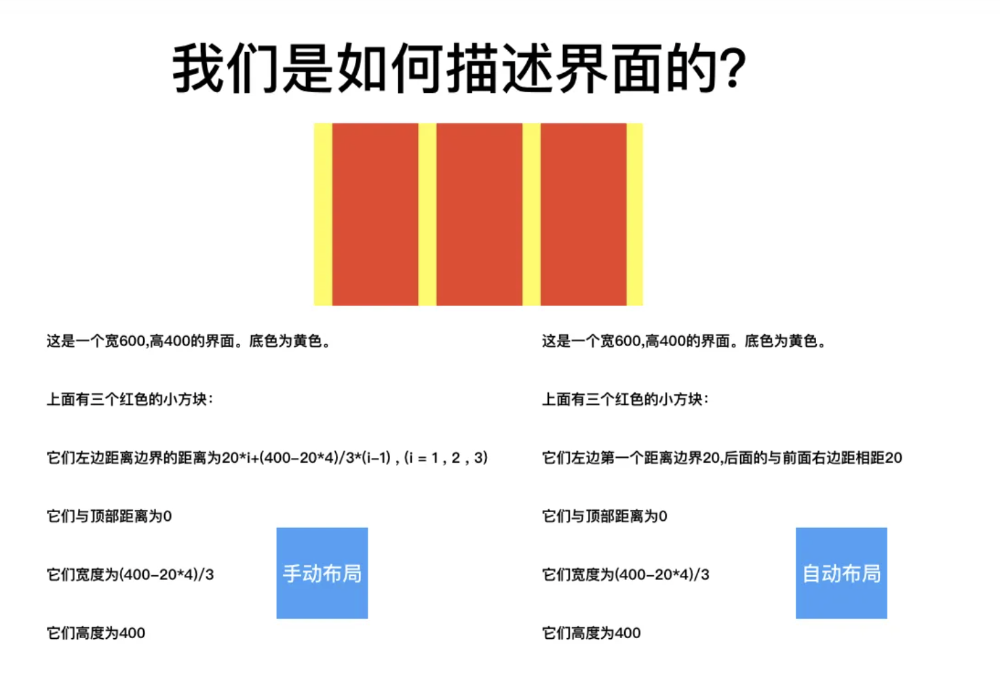
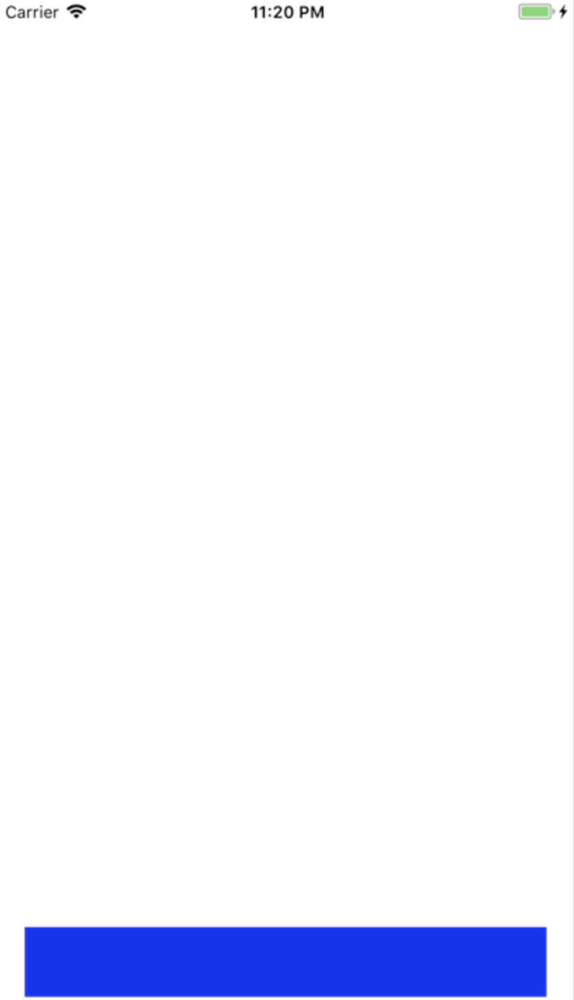
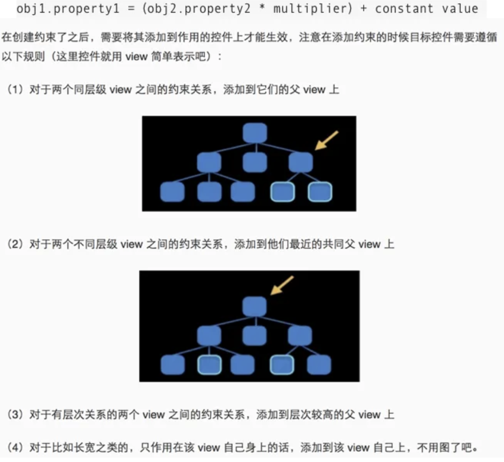
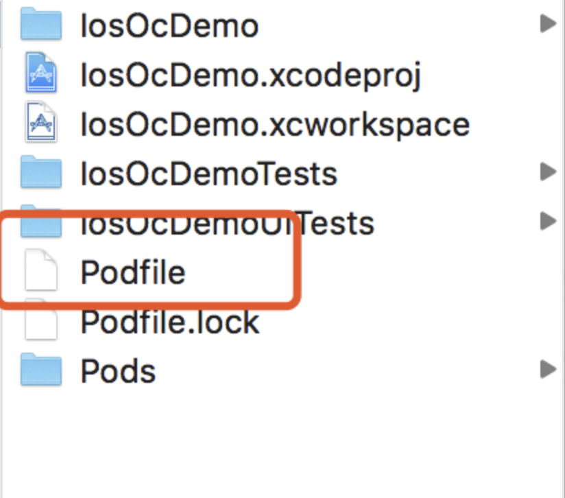
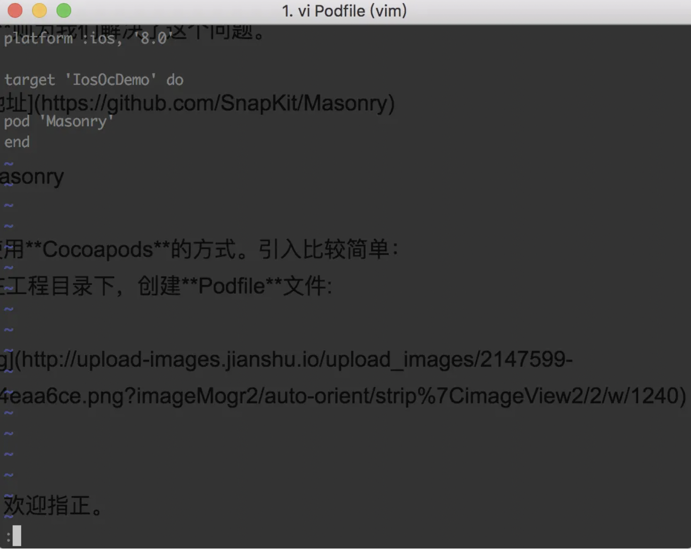
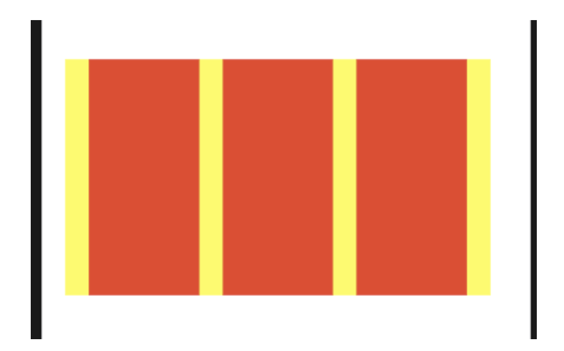

## **前言**

UI布局是整个前端体系里不可或缺的一环。代码的布局是设计语言与用户视觉感受沟通的桥梁，不论它看起来多么简单或是琐碎，但不得不承认，绝大部分软件开发的问题，都是界面问题。那么，如何高效的完成UI开发，也是软件行业一直在克服的问题。

所以，软件界面开发的核心点即是：如何减少UI设计稿的建模难度和减少建模转化到代码的实现难度

最初iOS提供了平面直角坐标系的方式，来解决布局问题，即所谓的手动布局。平面直角坐标系确实是一套完备在理论，这在数学上已经验证过了，只要我们的屏幕还是平面，它就肯定是有效的。但有效不一定高效，我们在日常的生活中，很少会用平面直角坐标系来向人描述位置关系。更多的是依靠相对位置。

所幸，iOS为我们提供自动布局的方法，来解决这一困境。



## **自动布局的基本理念**

其实说到本质，它和手动布局是一样的。对一个控件放在哪里，我们依然只关心它的`(x, y, width, height)`。但手动布局的方式是，一次性计算出这四个值，然后设置进去，完成布局。但当父控件或屏幕发生变化时，子控件的计算就要重新来过，非常麻烦。

因此，在自动布局中，我们不再关心`(x, y, width, height)`的具体值，我们只关心`(x, y, width, height)`四个量对应的约束。

## **约束**

那么何为约束呢？

```objective-c
obj1.property1 =（obj2.property2 * multiplier）+ constant value
```

**子控件的某一个量一定与另一个控件的某一个量呈线性关系**，这就是约束。

那么，给`(x, y, width, height)`四个量，分别给一个约束，就可以确定一个控件的最终位置。

```objc
    //创建左边约束
    NSLayoutConstraint *leftLc = [NSLayoutConstraint constraintWithItem:blueView attribute:NSLayoutAttributeLeft relatedBy:NSLayoutRelationEqual toItem:self.view attribute:NSLayoutAttributeLeft multiplier:1.0 constant:20];
    [self.view addConstraint:leftLc];
```

这一段代码即是：**控件（blueView）的 x = rootView的x \* 1.0 + 20**这里一定要注意，这样的一条约束，涉及了子控件和父控件，所以这条约束一定要添加到父控件中。

## **添加约束的规则：**

- 如果两个控件是父子控件，则添加到父控件中。
- 如果两个控件不是父子控件，则添加到层级最近的共同父控件中。

## **示例**

```objective-c
    //关闭Autoresizing
    blueView.translatesAutoresizingMaskIntoConstraints = NO;
    
    //创建左边约束
    NSLayoutConstraint *leftLc = [NSLayoutConstraint constraintWithItem:blueView attribute:NSLayoutAttributeLeft relatedBy:NSLayoutRelationEqual toItem:self.view attribute:NSLayoutAttributeLeft multiplier:1.0 constant:20];
    [self.view addConstraint:leftLc];
    
    //创建右边约束
    NSLayoutConstraint *rightLc = [NSLayoutConstraint constraintWithItem:blueView attribute:NSLayoutAttributeRight relatedBy:NSLayoutRelationEqual toItem:self.view attribute:NSLayoutAttributeRight multiplier:1.0 constant:-20];
    [self.view addConstraint:rightLc];
    
    //创建底部约束
    NSLayoutConstraint *bottomLc = [NSLayoutConstraint constraintWithItem:blueView attribute:NSLayoutAttributeBottom relatedBy:NSLayoutRelationEqual toItem:self.view attribute:NSLayoutAttributeBottom multiplier:1.0 constant:-20];
    [self.view addConstraint:bottomLc];
    
    //创建高度约束
    NSLayoutConstraint *heightLc = [NSLayoutConstraint constraintWithItem:blueView attribute:NSLayoutAttributeHeight relatedBy:NSLayoutRelationEqual toItem:nil attribute:NSLayoutAttributeNotAnAttribute multiplier:0.0 constant:50];
    [blueView addConstraint: heightLc];
```

 

我们注意到，自动布局其实工作分两步：

1. 创建视图的约束
2. 将约束添加到合适的位置约束关系从上面的描述中，已经非常清晰了。那么如何寻找约束添加的合适位置呢？

 

到这里，我们只是解决了**如何减少UI设计稿的建模难度的问题**，显然，**减少建模转化到代码的实现难度**这个效果没能达成。关于如何解决**减少建模转化到代码的实现难度**的问题，

## **开源库**

上面的代码，我们可以看到，虽然自动布局已经比手动布局优雅不少了，但它依然行数较多。每条约束大约都需要三行代码，面对复杂的页面，这样开发出来，会很难阅读。

**Masonry**则为我们解决了这个问题。

[Masonry地址](https://link.zhihu.com/?target=https%3A//github.com/SnapKit/Masonry)


## **引入Masonry**

我们选择使用**Cocoapods**的方式。引入比较简单：

1. 我们先在工程目录下，创建**Podfile**文件:

 

2.编辑**Podfile**



其中，'IosOcDemo'就是我们工程的名字，根据需要，我们自行替换。

3.添加依赖

完成后，执行指令`pod install`。CocoaPods就会为我们自动下载并添加依赖。

## **实践**

 

这样的一个代码，用手动布局，我们大致的代码应该是这样：

```js
-(void)initBottomView
{
    self.bottomBarView = [[UIView alloc]initWithFrame:CGRectZero];
    self.bottomButtons = [[NSMutableArray alloc]init];
    _bottomBarView.backgroundColor = [UIColor yellowColor];
    [self addSubview:_bottomBarView];
    for(int i = 0 ; i < 3 ; i++)
    {
        UIButton *button = [[UIButton alloc]initWithFrame:CGRectZero];
        button.backgroundColor = [UIColor redColor];
        [_bottomButtons addObject:button];
       [self addSubview:button];
    }
}


-(void)layoutBottomView
{
    _bottomBarView.frame = CGRectMake(20, _viewHeight - 200, _viewWidth - 40, 200);
    for (int i = 0 ; i < 3; i++) {
        UIButton *button = _bottomButtons[i];
        CGFloat x = i * (_viewWidth - 40 - 20 * 4) / 3 + 20*(i+1) + 20;
        CGFloat y = _viewHeight - 200;
        CGFloat width = (_viewWidth - 40 - 20 * 4) / 3;
        CGFloat height = 200;
        button.frame = CGRectMake(x, y, width, height);
        
    }
}
```

我们来看一下，在**Masonry**的帮助下，我们可以把刚刚的代码写成什么样的:

```js
   -(void)initBottomView
{
        _bottomBarView = [[UIView alloc]initWithFrame:CGRectZero];
        _bottomBarView.backgroundColor = [UIColor yellowColor];
        _bottomBarView.translatesAutoresizingMaskIntoConstraints = NO;
        [self addSubview:_bottomBarView];
        [_bottomBarView mas_makeConstraints:^(MASConstraintMaker *make) {
            make.left.equalTo(self).with.offset(20);
            make.right.equalTo(self).with.offset(-20);
            make.height.mas_equalTo(200);
            make.bottom.equalTo(self);
        }];
    
    _bottomButtons = [[NSMutableArray alloc]init];
    for(int i = 0 ; i < 3 ; i++)
    {
        UIButton *button = [[UIButton alloc]initWithFrame: CGRectZero];
        button.backgroundColor = [UIColor redColor];
        button.translatesAutoresizingMaskIntoConstraints = NO;
        [_bottomButtons addObject:button];
        [_bottomBarView addSubview:button];
        [button mas_makeConstraints:^(MASConstraintMaker *make) {
            if (i == 0) {
                make.left.mas_equalTo(20);
            }else{
                UIButton *previousButton = _bottomButtons[i-1];
                make.left.equalTo(previousButton.mas_right).with.offset(20);
            }
            make.top.mas_equalTo(_bottomBarView.mas_top);
            make.width.equalTo(_bottomBarView.mas_width).with.multipliedBy(1.0f/3).offset(-20*4/3);
            make.height.equalTo(_bottomBarView.mas_height);
        }];
        
    }
}
```

我们可以看到在**Masonry**的封装下，代码变得非常简练易读，需要行数略有增加，但是计算过程减少了，我们能更加关注于多个UIView间的位置关系，这与当前的UI设计语言是契合的。所以**Masonry**能否让我们更直观地表达UI。

## **源码解读**

**Masonry**的封装很有魅力，那么，我们可以简单地来看一下，它是如何封装的。我们再仔细看一下**Masonry**的API会发现，我们是直接在UIView上进行调用的。也就是说，**Masonry**对UIView进行了扩展。

在**View+MASUtilities.h**中：

```js
#if TARGET_OS_IPHONE || TARGET_OS_TV

    #import <UIKit/UIKit.h>
    #define MAS_VIEW UIView
    #define MAS_VIEW_CONTROLLER UIViewController
    #define MASEdgeInsets UIEdgeInsets

```

然后在**View+MASAdditions.h**中，我们看到了**Masonry**的扩展：

```js
#import "MASUtilities.h"
#import "MASConstraintMaker.h"
#import "MASViewAttribute.h"

/**
 *  Provides constraint maker block
 *  and convience methods for creating MASViewAttribute which are view + NSLayoutAttribute pairs
 */
@interface MAS_VIEW (MASAdditions)

/**
 *  following properties return a new MASViewAttribute with current view and appropriate NSLayoutAttribute
 */
@property (nonatomic, strong, readonly) MASViewAttribute *mas_left;
@property (nonatomic, strong, readonly) MASViewAttribute *mas_top;
@property (nonatomic, strong, readonly) MASViewAttribute *mas_right;
@property (nonatomic, strong, readonly) MASViewAttribute *mas_bottom;
@property (nonatomic, strong, readonly) MASViewAttribute *mas_leading;
@property (nonatomic, strong, readonly) MASViewAttribute *mas_trailing;
@property (nonatomic, strong, readonly) MASViewAttribute *mas_width;
@property (nonatomic, strong, readonly) MASViewAttribute *mas_height;
@property (nonatomic, strong, readonly) MASViewAttribute *mas_centerX;
@property (nonatomic, strong, readonly) MASViewAttribute *mas_centerY;
@property (nonatomic, strong, readonly) MASViewAttribute *mas_baseline;
@property (nonatomic, strong, readonly) MASViewAttribute *(^mas_attribute)(NSLayoutAttribute attr);

...

/**
 *  Creates a MASConstraintMaker with the callee view.
 *  Any constraints defined are added to the view or the appropriate superview once the block has finished executing
 *
 *  @param block scope within which you can build up the constraints which you wish to apply to the view.
 *
 *  @return Array of created MASConstraints
 */
- (NSArray *)mas_makeConstraints:(void(NS_NOESCAPE ^)(MASConstraintMaker *make))block;
```

一些，适配的代码，我省略了，先看核心代码。在刚刚的例子中，我们正是调用的`mas_makeConstraints`方法。

```js
- (NSArray *)mas_makeConstraints:(void(^)(MASConstraintMaker *))block {
    self.translatesAutoresizingMaskIntoConstraints = NO;
    MASConstraintMaker *constraintMaker = [[MASConstraintMaker alloc] initWithView:self];
    block(constraintMaker);
    return [constraintMaker install];
}
```

`mas_makeConstraints`方法比较简单，只是封装了`MASConstraintMaker`初始化，设置约束和安装。这里的block就是我们刚刚在外层设置的约束的函数指针。也就是这一串：

```js
^(MASConstraintMaker *make) {
        make.left.equalTo(self.view).with.offset(10);
        make.right.equalTo(self.view).with.offset(-10);
        make.height.mas_equalTo(50);
        make.bottom.equalTo(self.view).with.offset(-10);
    }
```

由于约束条件的设置比较复杂，我们先来看看初始化和安装。

## **初始化**

```js
- (id)initWithView:(MAS_VIEW *)view {
    self = [super init];
    if (!self) return nil;
    
    self.view = view;
    self.constraints = NSMutableArray.new;
    
    return self;
}
```

初始化的代码比较简单，将传入的**view**放入`MASConstraintMaker`成员，然后创建`MASConstraintMaker`的约束容器（NSMutableArray）。

## **安装**

```js
- (NSArray *)install {
    if (self.removeExisting) {
        NSArray *installedConstraints = [MASViewConstraint installedConstraintsForView:self.view];
        for (MASConstraint *constraint in installedConstraints) {
            [constraint uninstall];
        }
    }
    NSArray *constraints = self.constraints.copy;
    for (MASConstraint *constraint in constraints) {
        constraint.updateExisting = self.updateExisting;
        [constraint install];
    }
    [self.constraints removeAllObjects];
    return constraints;
}
```

安装的代码分为三块：

1. 判断是否需要移除已有的约束。如果需要，会遍历已有约束，然后逐个`uninstall`
2. `copy`已有的约束，遍历，并逐一`install`
3. `remove`掉所有约束，并将已添加的`constraints`返回。

`install`的方法，还是继续封装到了`Constraint`中，我们继续跟进阅读：

我们会发现`Constraint`只是一个接口，**Masonry**中对于`Constraint`接口有两个实现，分别是：`MASViewConstraint`和`MASCompositeConstraint`。这两个类，分别是单个约束和约束集合。在上面的例子中，我们只是对单个`UIView`进行约束，所以我们先看`MASViewConstraint`的代码。以下代码`MASViewConstraint`进行了一定程度的简化，省略了一些扩展属性，只展示我们的例子中，会执行的代码：

```js
- (void)install {
    if (self.hasBeenInstalled) {
        return;
    }
    ...
    
    MAS_VIEW *firstLayoutItem = self.firstViewAttribute.item;
    NSLayoutAttribute firstLayoutAttribute = self.firstViewAttribute.layoutAttribute;
    MAS_VIEW *secondLayoutItem = self.secondViewAttribute.item;
    NSLayoutAttribute secondLayoutAttribute = self.secondViewAttribute.layoutAttribute;

    // alignment attributes must have a secondViewAttribute
    // therefore we assume that is refering to superview
    // eg make.left.equalTo(@10)
    if (!self.firstViewAttribute.isSizeAttribute && !self.secondViewAttribute) {
        secondLayoutItem = self.firstViewAttribute.view.superview;
        secondLayoutAttribute = firstLayoutAttribute;
    }
    
    MASLayoutConstraint *layoutConstraint
        = [MASLayoutConstraint constraintWithItem:firstLayoutItem
                                        attribute:firstLayoutAttribute
                                        relatedBy:self.layoutRelation
                                           toItem:secondLayoutItem
                                        attribute:secondLayoutAttribute
                                       multiplier:self.layoutMultiplier
                                         constant:self.layoutConstant];
    
    layoutConstraint.priority = self.layoutPriority;
    layoutConstraint.mas_key = self.mas_key;
    
   if (self.secondViewAttribute.view) {
        MAS_VIEW *closestCommonSuperview = [self.firstViewAttribute.view mas_closestCommonSuperview:self.secondViewAttribute.view];
        NSAssert(closestCommonSuperview,
                 @"couldn't find a common superview for %@ and %@",
                 self.firstViewAttribute.view, self.secondViewAttribute.view);
        self.installedView = closestCommonSuperview;
    } else if (self.firstViewAttribute.isSizeAttribute) {
        self.installedView = self.firstViewAttribute.view;
    } else {
        self.installedView = self.firstViewAttribute.view.superview;
    }


    MASLayoutConstraint *existingConstraint = nil;
    ...
    else {
        [self.installedView addConstraint:layoutConstraint];
        self.layoutConstraint = layoutConstraint;
        [firstLayoutItem.mas_installedConstraints addObject:self];
    }
}
```

自动布局是一种相对布局，所以，绝大部分情况下，需要两个`UIView`（约束方与参照方）。在上面的方法中：

- `firstLayoutItem`是约束方，`secondLayoutItem`是参照方
- `firstLayoutAttribute`是约束方的属性，`secondLayoutAttribute`是参照方的属性。
- `MASLayoutConstraint`就是`NSLayoutConstraint`的子类，只是添加了mas_key属性。到这里，我们就与系统提供的API对应上了。

```js
    NSLayoutConstraint *leftLc = [NSLayoutConstraint constraintWithItem:blueView attribute:NSLayoutAttributeLeft relatedBy:NSLayoutRelationEqual toItem:self.view attribute:NSLayoutAttributeLeft multiplier:1.0 constant:20];
    [self.view addConstraint:leftLc];
```

再看看我们之前用系统API完成的例子，是不是格外熟悉？

那么接下来，我们就是要阅读

```js
            make.left.equalTo(self).with.offset(20);
            make.right.equalTo(self).with.offset(-20);
            make.height.mas_equalTo(200);
            make.bottom.equalTo(self);
```

是如何变成`firstLayoutItem`, `secondLayoutItem`, `firstLayoutAttribute`, `secondLayoutAttribute`和`layoutRelation`的。

## **约束条件的设置**

回到前面的：

```js
- (NSArray *)mas_makeConstraints:(void(^)(MASConstraintMaker *))block {
    self.translatesAutoresizingMaskIntoConstraints = NO;
    MASConstraintMaker *constraintMaker = [[MASConstraintMaker alloc] initWithView:self];
    block(constraintMaker);
    return [constraintMaker install];
}
```

我们接下来，就要看block的实现：

`block`其实是一个函数指针。此处真正调用的方法是：

```js
            make.left.equalTo(self).with.offset(20);
            make.right.equalTo(self).with.offset(-20);
            make.height.mas_equalTo(200);
            make.bottom.equalTo(self);
```

我们挑选其中一个，来看看源码实现：

## **left**

```js
- (MASConstraint *)addConstraintWithLayoutAttribute:(NSLayoutAttribute)layoutAttribute {
    return [self constraint:nil addConstraintWithLayoutAttribute:layoutAttribute];
}

- (MASConstraint *)left {
    return [self addConstraintWithLayoutAttribute:NSLayoutAttributeLeft];
}

- (MASConstraint *)constraint:(MASConstraint *)constraint addConstraintWithLayoutAttribute:(NSLayoutAttribute)layoutAttribute {
    MASViewAttribute *viewAttribute = [[MASViewAttribute alloc] initWithView:self.view layoutAttribute:layoutAttribute];
    MASViewConstraint *newConstraint = [[MASViewConstraint alloc] initWithFirstViewAttribute:viewAttribute];
    if ([constraint isKindOfClass:MASViewConstraint.class]) {
        //replace with composite constraint
        NSArray *children = @[constraint, newConstraint];
        MASCompositeConstraint *compositeConstraint = [[MASCompositeConstraint alloc] initWithChildren:children];
        compositeConstraint.delegate = self;
        [self constraint:constraint shouldBeReplacedWithConstraint:compositeConstraint];
        return compositeConstraint;
    }
    if (!constraint) {
        newConstraint.delegate = self;
        [self.constraints addObject:newConstraint];
    }
    return newConstraint;
}
```

在对单个`view`添加约束时，`constraint`为nil。我们直接生成了一个新约束`newConstraint`。它的`firstViewAttribute`就是我们传入的`NSLayoutAttributeLeft`

## **equalTo**

```js

- (MASConstraint * (^)(id))equalTo {
    return ^id(id attribute) {
        return self.equalToWithRelation(attribute, NSLayoutRelationEqual);
    };
}

- (MASConstraint * (^)(id, NSLayoutRelation))equalToWithRelation {
    return ^id(id attribute, NSLayoutRelation relation) {
        if ([attribute isKindOfClass:NSArray.class]) {
            NSAssert(!self.hasLayoutRelation, @"Redefinition of constraint relation");
            NSMutableArray *children = NSMutableArray.new;
            for (id attr in attribute) {
                MASViewConstraint *viewConstraint = [self copy];
                viewConstraint.layoutRelation = relation;
                viewConstraint.secondViewAttribute = attr;
                [children addObject:viewConstraint];
            }
            MASCompositeConstraint *compositeConstraint = [[MASCompositeConstraint alloc] initWithChildren:children];
            compositeConstraint.delegate = self.delegate;
            [self.delegate constraint:self shouldBeReplacedWithConstraint:compositeConstraint];
            return compositeConstraint;
        } else {
            NSAssert(!self.hasLayoutRelation || self.layoutRelation == relation && [attribute isKindOfClass:NSValue.class], @"Redefinition of constraint relation");
            self.layoutRelation = relation;
            self.secondViewAttribute = attribute;
            return self;
        }
    };
}

```

此处，我们依然先看attribute不是`NSArray`的情况。这里在单个属性的约束中，就比较简单了，将`relation`和`attribue`传入`MASConstraint`对应的成员。

在上面介绍`install`方法时，我们就曾提到过：

```js
  MASLayoutConstraint *layoutConstraint
        = [MASLayoutConstraint constraintWithItem:firstLayoutItem
                                        attribute:firstLayoutAttribute
                                        relatedBy:self.layoutRelation
                                           toItem:secondLayoutItem
                                        attribute:secondLayoutAttribute
                                       multiplier:self.layoutMultiplier
                                         constant:self.layoutConstant];
```

`firstLayoutItem`和`secondLayoutItem`在`install`方法中已收集完成，此时，经过`left`和`equalTo`我们又收集到了:`firstViewAttribute`、`secondViewAttribute`和`layoutRelation`胜利即在眼前。

```js
- (MASConstraint * (^)(CGFloat))offset {
    return ^id(CGFloat offset){
        self.offset = offset;
        return self;
    };
}

- (void)setOffset:(CGFloat)offset {
    self.layoutConstant = offset;
}

```

通过OC的set语法，`Masonry`将**offset**传入layoutConstant。

至此，`layoutConstraint`就完成了全部的元素收集，可以使用添加约束的方式，只需要解决最后一个问题，约束添加到哪里呢？我们似乎在调用时，并不需要关心这件事情，那说明框架帮我们完成了这个工作。

## **closestCommonSuperview**

我们在MASViewConstraint中，可以找到这样一段：

```js
    if (self.secondViewAttribute.view) {
        MAS_VIEW *closestCommonSuperview = [self.firstViewAttribute.view mas_closestCommonSuperview:self.secondViewAttribute.view];
        NSAssert(closestCommonSuperview,
                 @"couldn't find a common superview for %@ and %@",
                 self.firstViewAttribute.view, self.secondViewAttribute.view);
        self.installedView = closestCommonSuperview;
    } else if (self.firstViewAttribute.isSizeAttribute) {
        self.installedView = self.firstViewAttribute.view;
    } else {
        self.installedView = self.firstViewAttribute.view.superview;
    }
```

注意到，`closetCommonSuperview`就是Masonry为我们找到的最近公共父控件。

```js
- (instancetype)mas_closestCommonSuperview:(MAS_VIEW *)view {
    MAS_VIEW *closestCommonSuperview = nil;

    MAS_VIEW *secondViewSuperview = view;
    while (!closestCommonSuperview && secondViewSuperview) {
        MAS_VIEW *firstViewSuperview = self;
        while (!closestCommonSuperview && firstViewSuperview) {
            if (secondViewSuperview == firstViewSuperview) {
                closestCommonSuperview = secondViewSuperview;
            }
            firstViewSuperview = firstViewSuperview.superview;
        }
        secondViewSuperview = secondViewSuperview.superview;
    }
    return closestCommonSuperview;
}
```

实现也比较简单。

至此，我们完成了所有准备，就可以开始愉快的自动布局啦。

以上就是**Masonry**对iOS自动布局封装的解读。

如有问题，欢迎指正。

> **问答**
> [iOS：如何使用自动布局约束？](https://link.zhihu.com/?target=https%3A//cloud.tencent.com/developer/ask/76449%3FfromSource%3Dwaitui)
> **相关阅读**
> [走进 Masonry](https://link.zhihu.com/?target=https%3A//cloud.tencent.com/developer/article/1013426%3FfromSource%3Dwaitui)
> [iOS自动布局框架之Masonry](https://link.zhihu.com/?target=https%3A//cloud.tencent.com/developer/article/1029651%3FfromSource%3Dwaitui)
> [iOS学习——布局利器Masonry框架源码深度剖析](https://link.zhihu.com/?target=https%3A//cloud.tencent.com/developer/article/1072489%3FfromSource%3Dwaitui)
> [【每日课程推荐】机器学习实战！快速入门在线广告业务及CTR相应知识](https://link.zhihu.com/?target=https%3A//cloud.tencent.com/developer/edu/course-1128%3FfromSource%3Dwaitui)