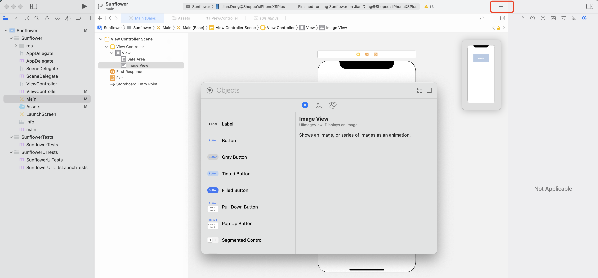
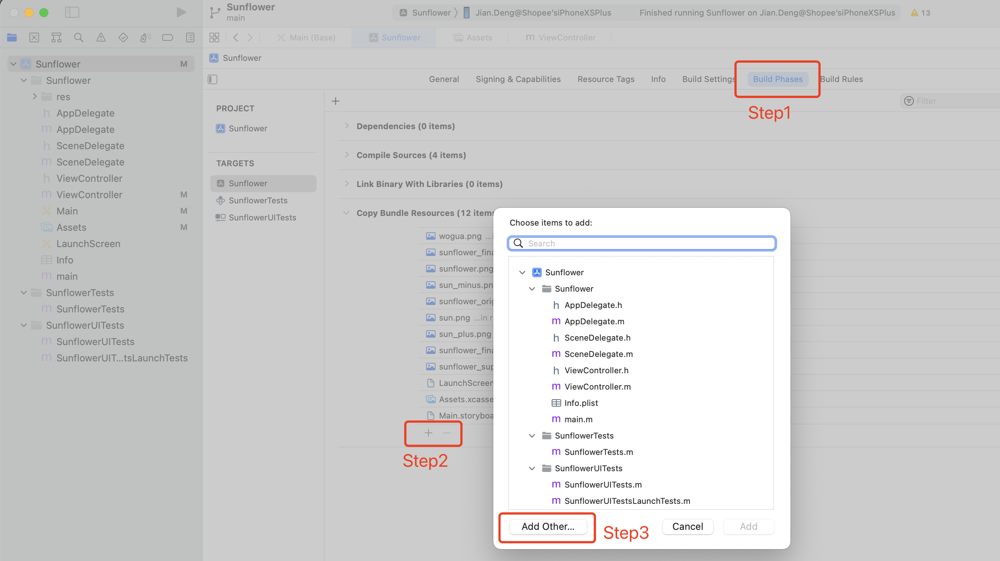

MacOS 12, Xcode 13, iOS 11，使用storyboard布局，OC编写

### 1. sb上添加新控件

XCode13点这个加号添加新控件，如图：

### 2. 图片等资源加入XCode

不能直接把图片等资源直接拖入到XCode，需要添加到资源文件路径，需要采用add file to 方式添加文件。但是这样有时也会因为Xcode的原因添加不到资源文件中。在项目设置中Build Phases > Copy Bundle Resources 中可以查看已经添加进去的资源文件，如果里面没有，那就需要在这里手动添加了。

可以在XCode新建一个目录”new group“，把文件拷贝到这里后。从如下图所示路径来添加。
